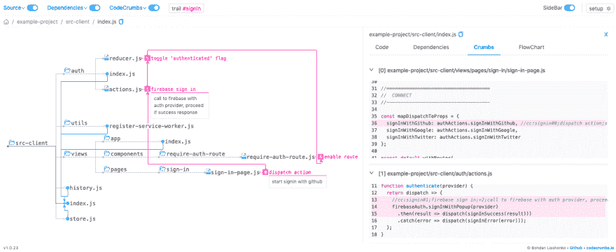
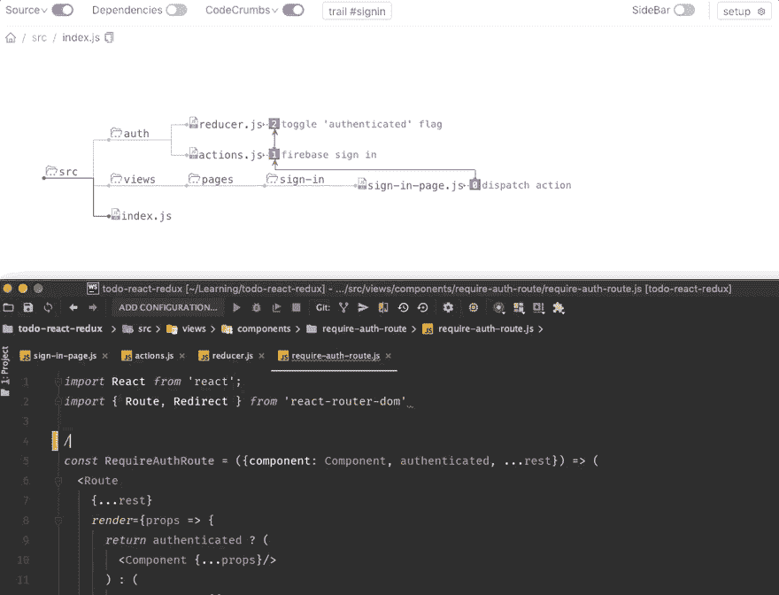
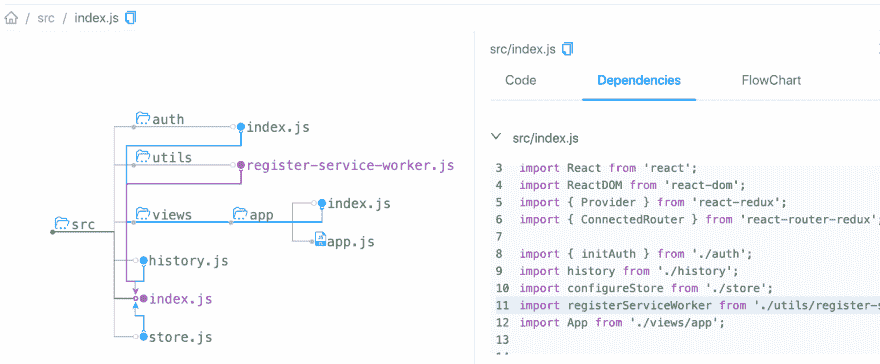
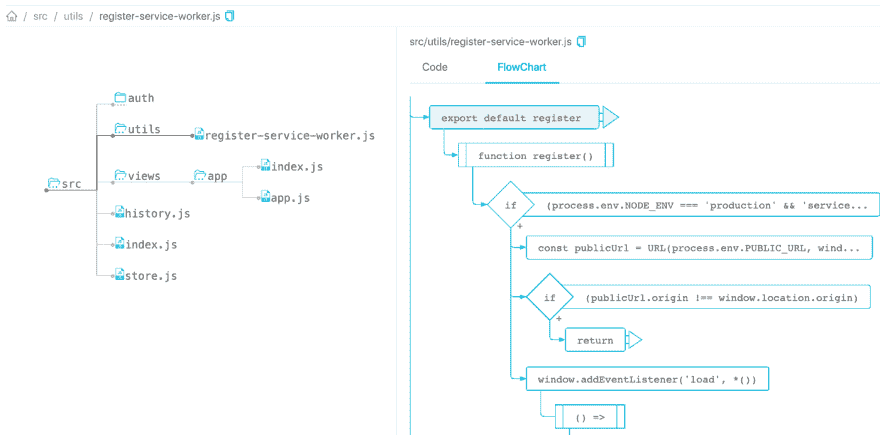
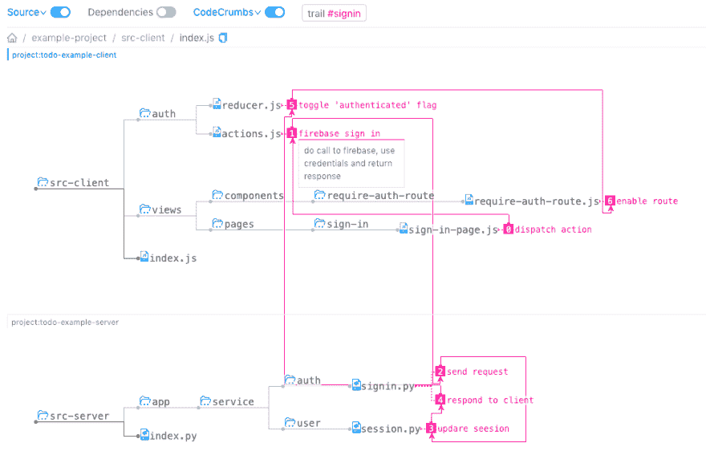
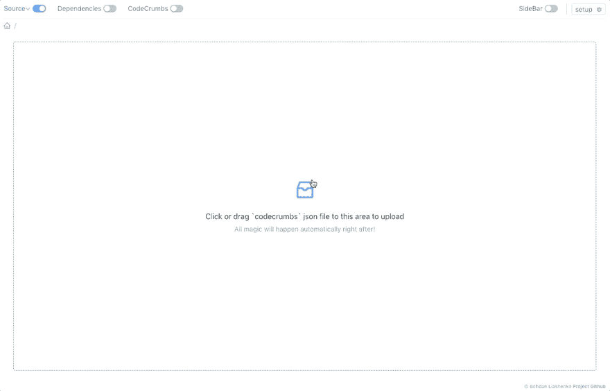

# code crumbs——学习和记录源代码的新方法

> 原文：<https://dev.to/bogdanlyashenko/codecrumbs---a-new-way-of-learning-and-documenting-source-code-53j>

> **TL；你好。我的名字叫 Bohdan，我正在研究阅读代码的问题。我刚刚完成了“codecrumbs”的第一个版本——通过在源代码中放置面包屑来学习代码库的可视化工具。点击这里查看 [github 回购](https://github.com/Bogdan-Lyashenko/codecrumbs)。
> **

## 推理

最近，我进行了一项关于开始学习大型代码库时我们所面临的主要挑战的调查(如果你还没有提交你的答案，你仍然可以
在这里[提交](https://goo.gl/forms/n0SjqMQ27DLDfP6I2))。关于“房间里的大象”的问题特别有趣，只要看一看:
 
趋势已经很明显了(这一点在之前就很明显)——与仅仅理解特定函数或文件的代码相比，“连接点”和“获得全局”要困难得多(所以，这意味着代码编辑在这里没有多大帮助)。在未知的代码库中，我们很容易迷失，并开始在文件之间跳跃，而不清楚我们在做什么。这只是太多无用的噪音，太多的细节模糊了我们的视觉和对代码的理解。

所以我们需要一些方法来**减少大代码库的噪声**和**突出代码库中的重要点**。可视化工具是解决这一问题的好方法，如果:

*   它提供了正确的视角(而不仅仅是让它看起来很花哨)
*   事实上，减少了无用的细节(并没有增加更多的视觉)
*   它很容易与现有的代码库一起使用，不需要重写代码

## 码屑救援

所以我构建了 [codecrumbs](https://github.com/Bogdan-Lyashenko/codecrumbs) (名字结合了“代码”和“面包屑”)。这是一个可视化工具，它给了你基于文本的代码编辑器所没有的东西——整个代码库的一个更大的视图。

它是如何工作的？您对代码库运行 codecrumbs 命令，它分析源代码并构建其可视化表示。写下一个 codecrumb-comment，代码库的状态将会被浏览器中的可视客户端即时反映出来。

### 特性

面包屑的踪迹——一系列的面包屑可以用来描述一些数据流(例如，用户登录，或者表单提交等等)。).
[T3】](https://res.cloudinary.com/practicaldev/image/fetch/s--PlhexHDo--/c_limit%2Cf_auto%2Cfl_progressive%2Cq_66%2Cw_880/https://cdn-images-1.medium.com/max/800/1%2AOTbzqtV0UxTq_OLkoMfHMw.gif)

依赖树——为入口点生成依赖树。您可以选择连接并查看“导入的是什么”和“它的实现”

流程图-构建所选文件代码的 SVG 流程图([js2 流程图](https://github.com/Bogdan-Lyashenko/js-code-to-svg-flowchart)在幕后使用)

多代码库集成——帮助研究几个代码库(子模块)之间的联系。
[T3】](https://res.cloudinary.com/practicaldev/image/fetch/s--5P6Ib6Co--/c_limit%2Cf_auto%2Cfl_progressive%2Cq_auto%2Cw_880/https://raw.githubusercontent.com/Bogdan-Lyashenko/codecrumbs/master/docs/multi-l-c.png)

分享代码碎屑状态-你可以很容易地与他人分享你的发现。只需下载 codecrumbs store 的 json 文件，发送给朋友，他/她稍后可以上传到 codecrumbs 来查看相同的图片(即使本地没有项目)。
[T3】](https://res.cloudinary.com/practicaldev/image/fetch/s--6LwGzIsa--/c_limit%2Cf_auto%2Cfl_progressive%2Cq_66%2Cw_880/https://raw.githubusercontent.com/Bogdan-Lyashenko/codecrumbs/master/docs/upload-feature-2.gif)

多语言支持-当前版本支持以下编程语言:

*   Java Script 语言
*   以打字打的文件
*   计算机编程语言
*   服务器端编程语言（Professional Hypertext Preprocessor 的缩写）
*   Java 语言(一种计算机语言，尤用于创建网站)
*   C++和其他使用//作为注释的语言:)

### 未来的计划

这个工具(codecrumbs)允许我们更快地学习、记录和解释代码库。此外，通过下载和上传功能，收集和分享您的“调查结果”变得非常容易。

最终目标是在 [https://codecrumbs.io](https://codecrumbs.io) 上托管许多案例研究。项目库“用 codecrumbs 解释”，这是一个用真实世界的例子进行协作学习的地方。

更多功能即将推出，敬请关注。请放个“星星”和朋友们分享，感激不尽:)Github-repo 这里[https://github.com/Bogdan-Lyashenko/codecrumbs](https://github.com/Bogdan-Lyashenko/codecrumbs)。谢谢！