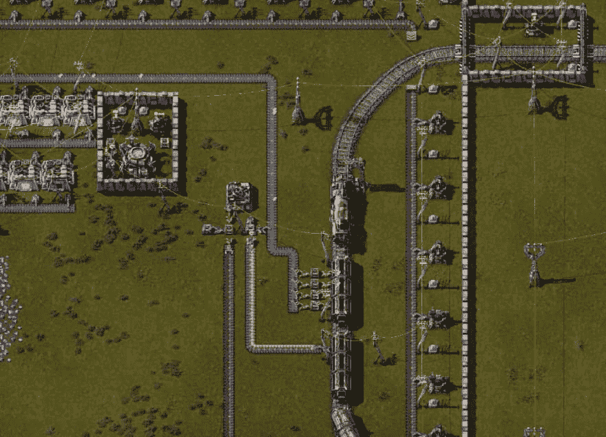
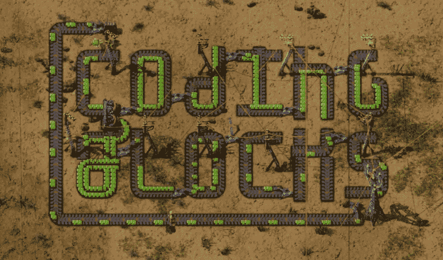

# 来自 Factorio 的编码课程？

> 原文：<https://dev.to/_codingblocks/coding-lessonsfrom-factorio-415n>

在这个游戏中，你是一个小小的工程师，被困在一个巨大而充满敌意的外星世界。你的目标是建造一个火箭，把你自己发射出去，但这需要一些认真的工作！

<figure>

[https://www.youtube.com/embed/ndZBvwJkq3I](https://www.youtube.com/embed/ndZBvwJkq3I)

<figcaption>Check out the video version of this post for some visuals.</figcaption>

</figure>

你从一些基本的工具和材料开始，你可以用这些来建造更好的工具和积累更多的材料，同时试图抵御被亲切地称为[咬者](https://wiki.factorio.com/Enemies)的敌对外星人。

这听起来和其他采矿、手工游戏没什么不同，但最大的不同在于规模。

<figure> 

<figcaption>外星人对你的污染方式不友好！</figcaption>

</figure>

就像现实生活一样——从零开始手工制造火箭是不可能的。不仅手动制作所需的每个螺母和螺栓时间有限，而且有些东西你根本无法用双手制作，比如电池酸液或石油产品。你唯一的希望是在你引导和跳跃到一个高度可扩展的、健壮的分布式~~因子~~ y 系统的过程中，自动化那些平凡的任务。

嘿，那听起来很像编程！

* * *

## **Factorio 如何像编程？**

就像编程一个高度可扩展的分布式系统——这很难，你会犯错误，你会花大量的时间去重构。

还记得敌对的外星人吗？开始的时候他们并不差，但是随着游戏的进行，他们变得越来越有侵略性。这给你的处境增加了一些紧张和紧迫感，这意味着你有时被迫做出与你更大的战略目标相冲突的短期战术决策。这些决定帮助你度过短期问题，代价是未来痛苦的增加。这种现象被程序员称为“技术债务”，从很多方面来说，Factorio 实际上是一个关于管理技术债务的游戏。

听起来很有趣，对吧？…但事实上，的确如此！让我们从那些行尸走肉开始！

* * *

**#1 设计、开发和部署/深度防御的安全性**

如果你在玩攻击性咬食者游戏，那么你需要在你需要它之前就开始考虑安全问题。如果外星人能够绕过或压倒你的防御，那就很难恢复，因为你需要在巩固工厂、修复损坏和保持资源流动之间平衡时间。

如果您在过程的早期就开始考虑安全性，事情会变得容易得多，因为恢复起来可能会很困难，甚至是不可能的。

### **#2 为规模设计**

与第 1 课非常相似，在扩展时，预先做一点考虑可以为您节省大量时间。

一旦你实现了基本材料的自动化，就很容易在方便的地方安装传送带、熔炉和装配工。这在开始时效果很好，因为它占用了最少的资源，但是您需要做的路由随着每次添加而变得更糟。像下面这样的设计要好得多，因为你可以根据需要增加额外的组件来扩大工厂规模，而不必做任何管道工作。

这里的教训是，在您需要可伸缩性之前设计它是很重要的。如果你等待的时间太长，过于关注战术决策而不是战略决策，你会很快发现自己经常陷入困境。

这让我想到了另一个设计时间的教训:

### **#3 模块化和抽象化**

随着工厂的发展，您最终将开始耗尽最初的资源池。如果你没有正确地解释这种不可避免性，那么当你添加新的资源池时，很难给你的工厂提供补给。新玩家通常会围绕他们的初始资源建造工厂。它以这种方式有机地发展，因为它在早期是一种廉价而方便的策略，但它会导致巨大的痛苦和蹩脚的黑客在游戏中后期出现，因为你需要花大量时间建立“聪明”的路由，以将资源转移到你的中心。如果这些攻击成为瓶颈，那么不改变工厂的大部分就很难解决。

更好的方法是将输入、逻辑和输出分开，这样就可以独立地扩展和路由它们。这使您不必因为将来的扩展而进行更改。

这让我想起了[开闭原则](https://en.wikipedia.org/wiki/Open%E2%80%93closed_principle)，设计应该对扩展开放，但对修改关闭

<figure> 

<figcaption>列车是高带宽，但是高延迟</figcaption>

</figure>

说到做出改变，接下来的三课是关于做出改变的技巧

### **#4 剖析重要**

在遭遇中断之前很难发现供应链问题，而且一次中断可能会引发其他中断。因此，使用“P”屏幕定期检查你的生产率和消耗率是很重要的。如果你使用资源的速度超过了你创造资源的速度，那么你最终会因此而遭受停机。

通常，您希望通过扩展来满足生产需求，但是由于资源、空间和时间有限，因此以正确的优先级关注事情非常重要。

### **#5 安全重构**

[安全重构](http://wiki.c2.com/?SafeRefactoring)指的是在不破坏系统的情况下，让事情变得更好的微小且离散的改变。为了把事情做得“正确”,我们可能会很想把工厂拆成一大片，但如果你走得太远，就很难让事情回到稳定状态。如果在你重做电网的时候，咬人者开始变热，这可能会特别糟糕。同样的事情也适用于编程，做一些孤立的小改变，然后慢慢地朝着一个更大的目标前进，风险会小得多。尤其是当你有截止日期要赶的时候！

### **#6 管理技术债务**

对我来说，说您预先设计了可伸缩性是很容易的。事实证明，这真的很难。在游戏开始时，你会受到严重的资源限制。如果你试图在一开始就为最终游戏设计你的工厂，那么你将需要大量的资源来铺设合适的基础设施。问题是，除非你在研究树上爬得更高，否则很难收集到你需要的大量资源。

诀窍是在你当前的需求和未来的计划之间平衡你的工厂。这是一个艰难的平衡，就像你在编码时管理技术债务一样。如果你预先花了很多时间试图设计完美的系统，那么在你开始提供价值之前，你就有耗尽资源的风险。此外，提前对大型系统进行全面规划几乎是不可能的，因此很难在过程的早期做出正确的决策。这就是为什么努力保持良好的平衡很重要。

承担技术债务是尽早开始交付价值的一个很好的方法，诀窍是当你偿还这些债务时要明智。

* * *

所以，哇，这些都是相当沉重的教训！你不会从玩 Factorio 中学到任何语法或花式，(也许如果你开始看制作模式的话！)但我确实认为，通过玩这个游戏，我们可以获得一些有价值的更高层次的经验。

伙计们，这就是你花时间在工作上玩 Factorio 的理由。如果你的老板为难你，就告诉他们你正在努力提高这六项技能，一切都会变得很好。让我知道你在评论中的想法，如果你喜欢这样的内容，一定要看看编码块播客！

