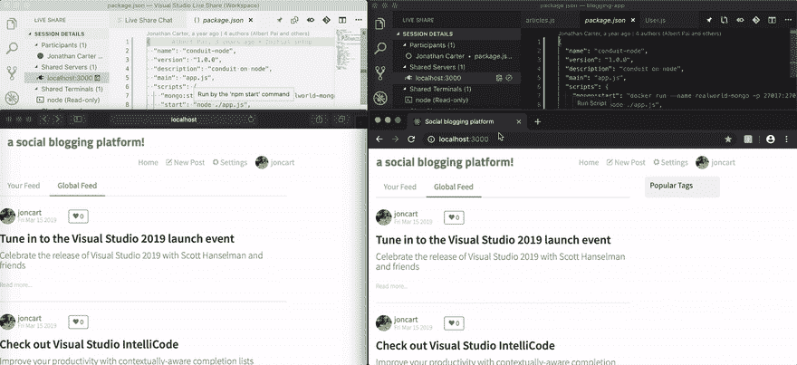
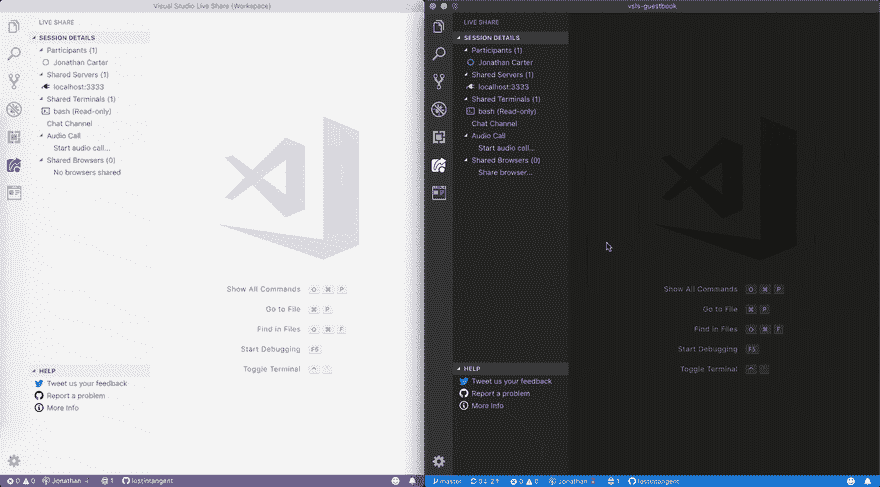

# 协作开发需要一个共享的 Web 浏览器

> 原文：<https://dev.to/lostintangent/collaborative-browsing-within-visual-studio-code-4h92>

在[之前的一篇文章](https://dev.to/lostintangent/localhost-isnt-local-anymore-2ib6)中，我展示了我们如何为 web 开发优化 [Visual Studio Live Share](https://aka.ms/vsls) ，允许你在会话中与每个人共享本地主机服务器。这使得来宾能够查看正在运行的应用程序并与之交互，同时实时编辑和调试它，从而实现真正高效的协作体验。然而，它确实有一个潜在的限制:当每个人都在相同的代码库和服务器上工作时，任何浏览器交互(例如滚动、表单输入、按钮点击)仍然是独立执行的，因为前端代码是在每台机器上本地下载和执行的。这就是客户端应用分发的本质。

<figure>

<figcaption>A Live Share guest (left) browsing a shared server, and immediately seeing server-side state updates made by the host (right). However, each participant is still controlling their own local state</figcaption>

</figure>

这种行为在许多情况下可能是理想的(例如，你们两人希望在不打扰你们的情况下探索应用程序)，并且与屏幕共享相比，这是实时共享实现的[独立性]((https://dev.to/lostintangent/collaboration-doesn-t-come-in-one-size-fits-all-33ai))的一个关键优势。然而，也有这样的情况，一起浏览一个 web 应用**是有用的(例如，你想演示一个 bug repro 或者炫耀一个特性的完成)。为此，你*可以*使用屏幕共享，但这也有它自己的缺点:所有的应用程序交互都在主机上执行，然后以位图的形式共享。因此，它有更高的带宽要求，并可能导致较差的延迟和图像质量，这取决于您相距多远，以及您的网络拓扑/条件。**

 **所以我们想知道:如果你可以在本地浏览器上浏览和互动，并且可以选择与你合作的每个人同步你的行动，会怎么样？这样，互动立即发生(你的内部循环是紧密的)，但它们是与团队共享的。有点像**分布式的、最终一致的网络应用**。这种体验似乎很有用，它实际上代表了我们[最长久的特性请求](https://github.com/MicrosoftDocs/live-share/issues/10)之一。因此，我们决定通过与现有 Visual Studio 代码扩展的[集成](https://npmjs.com/vsls),来试验它的外观。

> mpj💛[@ mpjme](https://dev.to/mpjme)[@ LostInTangent](https://twitter.com/LostInTangent)[@ Surfly](https://twitter.com/Surfly)...屏幕共享是一个占用性能、低延迟的火箭筒，老实说，在 vs 代码中有一个标签来显示导航器正在看什么文档会很棒。仅仅是在你打开的文件旁边的界面中看到标签的标题更新就很不错了。2018 年 9 月 03 日下午 13:47

## 不要只是分享，浏览！

如果您下载了[浏览器预览扩展](https://marketplace.visualstudio.com/itemdetails?itemName=auchenberg.vscode-browser-preview)，并在主持实时共享会话时打开了一个新的预览，该窗口也将在每个来宾的机器上自动打开(假设他们安装了浏览器预览扩展)。从那里，如果您(或任何客人)导航到另一个 URL，刷新页面，后退/前进，滚动，点击按钮，在表单字段中输入，模拟设备等。这些操作将与所有人同步。一旦你完成了这个窗口，你可以简单地关闭它，它也会在每个人的机器上关闭。

<figure>

<figcaption>A Live Share guest (left) is able to collaboratively browse a website with the host (right)</figcaption>

</figure>

感觉就像屏幕共享，只是更快，每个人都保留自己的光标。这是因为每个人实际上都在运行他们自己的本地 web 应用程序，并且只交流同步他们个人交互所必需的元数据(例如，鼠标点击这个 x/y 坐标)。这使得网络要求非常低，并确保每个参与者的操作结果立即可见，就像编辑共享文档一样。

我们*认为*这种能力可以帮助解决一些关键场景，比如能够在配对时浏览文档，或者协作搜索代码样本。您还可以使用它来遍历(和调试！)你们一起开发的 web 应用程序，这样会议中的每个人都可以保持在完全相同的页面上。简直...也就是说，这是一个**非常**早期的实验，因此，我们很想知道它是否有用，如果有用，还缺少什么👍**