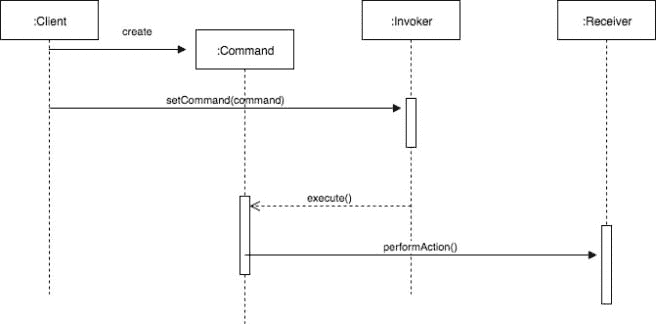

# 命令设计模式[行为]

> 原文：<https://dev.to/itscoderslife/command-design-pattern-behavioral-7oe>

命令模式将方法调用封装在一个对象中。它将请求、接收者和执行请求所需的所有细节打包到一个命令对象中。

命令对象通常只有一个方法，即 execute。然后，我们可以使用命令对象，或者将它传递给系统中的其他组件。

调用方触发 command 对象上的 execute 方法来调用接收方的操作。

如果您希望将需要特定功能的组件从方法调用细节和实际执行操作的对象中分离出来，那么 command 模式非常有用。

命令模式可用于实现对撤销操作的支持。该模式的另一个常见应用是创建宏。

宏是在不同的接收器对象上执行多个命令的命令。现在让我们使用序列图来看看命令模式是如何工作的。

 首先，客户端创建命令对象。command 对象封装了接收器和执行给定请求所需的一组操作。接下来，客户端通过调用调用者的 setCommand 方法在调用者上设置命令。当调用程序需要执行给定的请求时，它只需调用命令对象的 execute 方法。之后，调用者可以丢弃该命令，也可以保留它以备将来使用。调用命令对象的 execute 方法会导致调用接收方上的操作。

> 命令设计模式将请求封装到一个对象中。调用者可以调用这个命令对象来执行一个请求，而不需要知道执行该操作所需的细节，也不需要知道将执行该操作的接收者。

1.  用类似`execute()`的方法签名定义一个接口。
2.  创建派生类，封装“receiver”对象的子集、要调用的方法和要传递的参数。
3.  为每个延迟执行请求实例化一个命令对象。
4.  将命令对象从客户端传递给调用者。
5.  调用者决定何时执行动作-`execute()`。

概要:该命令封装了方法调用，包括执行该操作所需的所有细节。调用者可以在不知道接收者或在幕后执行的动作的情况下触发动作。使用这种模式，我们将发出请求的对象与实际接收和执行请求的对象分离开来。命令模式很容易实现。

缺点:向使用 command 对象的组件公开 receiver 对象的细节或执行操作所需的任何信息。您还应该保护您的命令对象不被并发访问，因为它们可能被多个组件和不同的线程使用。