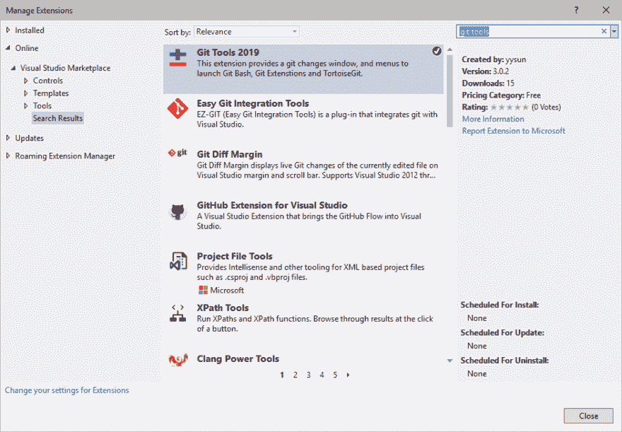
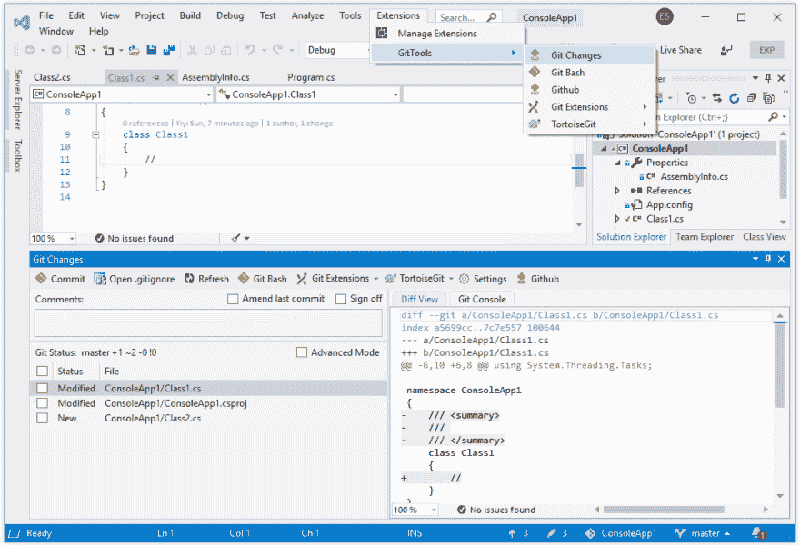
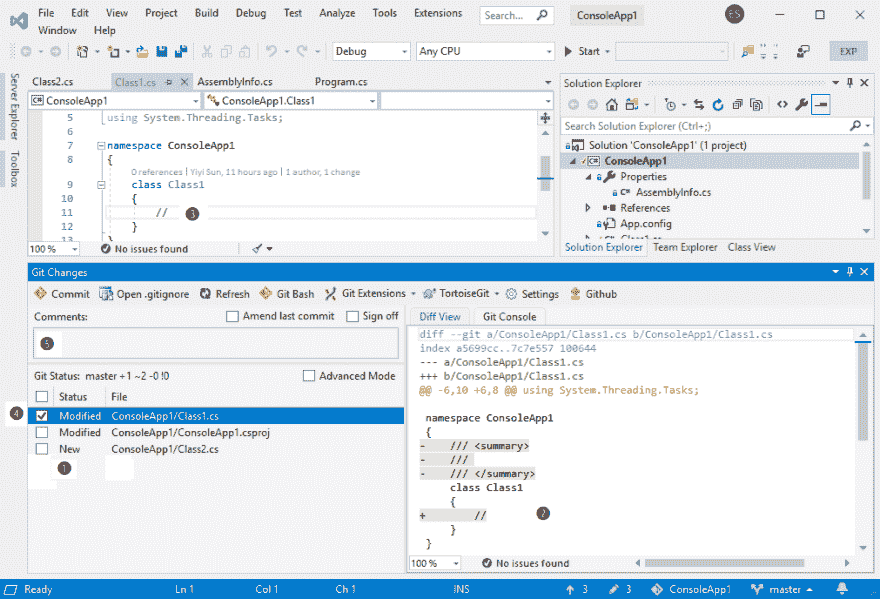
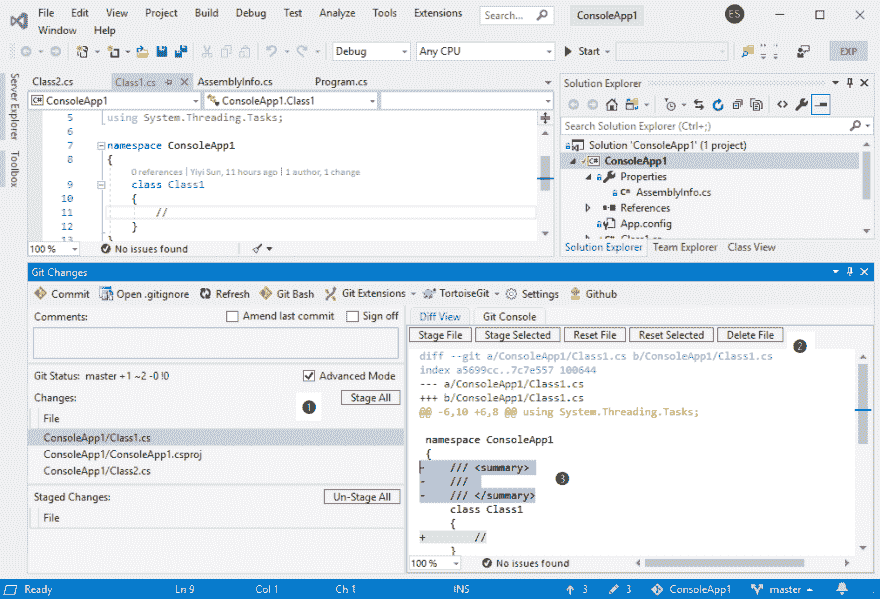
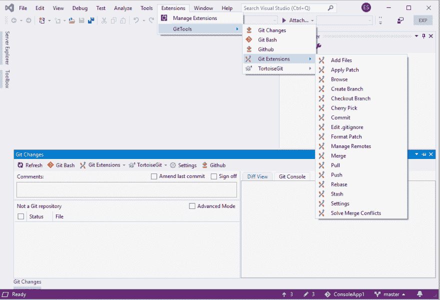
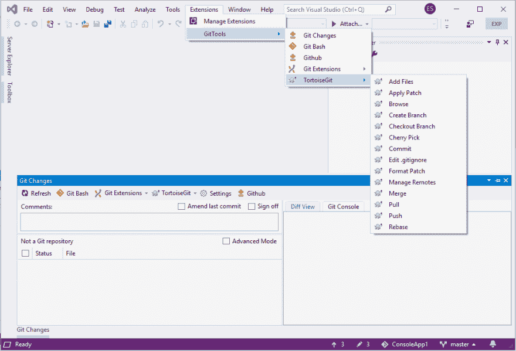

# 在 Visual Studio 2019 中提交 Git

> 原文：<https://dev.to/yysun/commit-to-git-in-visual-studio-2019-1lcj>

[Visual Studio 2019]((https://docs.microsoft.com/en-us/visualstudio/ide/whats-new-visual-studio-2019?view=vs-2019)) 于 2019 年 4 月 2 日上线。我已经将我的 [Git Tools](https://marketplace.visualstudio.com/items?itemName=yysun.GitTools) 扩展迁移到一个新的扩展， [Git Tools 2019](https://marketplace.visualstudio.com/items?itemName=yysun.git-tools-2019) ，以便支持 Visual Studio 2019 新的异步扩展架构。

Git Tools/Git Tools 2019 扩展将 Git 更改窗口添加到 Visual Studio 中，以帮助您创建粒度提交。这篇文章解释了如何使用 Git 修改窗口。

# 安装

运行 Visual Studio 2019 选择顶部菜单“扩展”；在 Visual Studio Marketplace 中搜索 Git 工具并安装。

您可以选择菜单“扩展| Git 工具| Git 更改”来显示 Git 更改窗口。

# Git 修改窗口

“Git 变更”窗口显示 Git 存储库中的变更。❶通过点击更改过的文件，在右边的 diff viewer 显示文件内容的差异。❷:它让你回顾变化。

您可以在比较查看器中双击更改。❷它将更改后的文件加载到主代码编辑器中，并导航到更改后的行。❸它让你调整和完善你的代码。满意后，您可以选择文件❹，输入注释❺，然后提交。

步骤❶到❺在简单模式下完成提交代码。简单模式的好处是它隐藏了 Git 暂存区/索引的概念，这对于初学者来说更容易，也简化了提交工作流。

Git Changes 窗口是仿照 Visual Studio 2010 中的 Pending Changes 窗口设计的，不幸的是，该窗口已从 Visual Studio 2013 中移除。

# 高级模式

Git 更改窗口也有高级模式。在高级模式下，它显示变更和阶段变更。❶比较查看器提供了更多的菜单。❷它不仅允许您暂存和取消暂存文件，还允许您暂存和取消暂存文件的选定部分。以及重置/撤消文件的选定部分。❸

Git 更改窗口比团队资源管理器的现成 Visual Studio 更改页更好。Git 更改窗口通常停靠在 IDE 上，以自动显示更改。您可以轻松地检查和调整更改，并在 Git 中创建细粒度的提交。

创建粒度提交是 [Git 提交最佳实践](https://github.com/trein/dev-best-practices/wiki/Git-Commit-Best-Practices)的主要目标。Git Tools/Git Tools 2019 扩展在 Visual Studio 中提供了漂亮的 Git 更改窗口，帮助开发人员归档目标。Git 更改窗口是 Git Tools/Git Tools 2019 扩展的独特功能。

我只关注了 Git Changes 窗口，而忽略了由 Visual Studio 本身和其他 Git GUI 工具实现的其他 Git 特性。

# 其他 Git 工具

如果你已经安装了 [Git 扩展](https://gitextensions.github.io)或 [TortoiseGit](https://tortoisegit.org) ，你会在“Git 工具”菜单和 Git 更改窗口中看到更多菜单来启动 Git 扩展或 TortoiseGit 命令。

## 开源项目

我开发了第一个扩展来支持 Visual Studio 2008/2010 的 Git T1，当时很少有人相信 Git 会像今天这样流行。最终，微软从 Visual Studio 2013 开始正式支持 Git。然而，Git Tools/Git Tools 2019 仍然通过使开发人员能够遵循 Git commit 最佳实践，为他们提供了额外的功能和价值。

Git Tools/Git Tools 2019 仍然是一个开源项目。你可以从 Github 找到源代码:[https://github.com/yysun/git-tools](https://github.com/yysun/git-tools)。

请[捐赠](https://www.paypal.com/cgi-bin/webscr?cmd=_donations&business=KBCLF3PZD6C98&lc=US&item_name=Git%20Tools%20for%20Visual%20Studio&currency_code=USD&bn=PP%2dDonationsBF%3abtn_donate_SM%2egif%3aNonHosted)或支持 [Patreon](https://www.patreon.com/gittools) 的项目。👍❤️🙏

玩得开心直到下次。