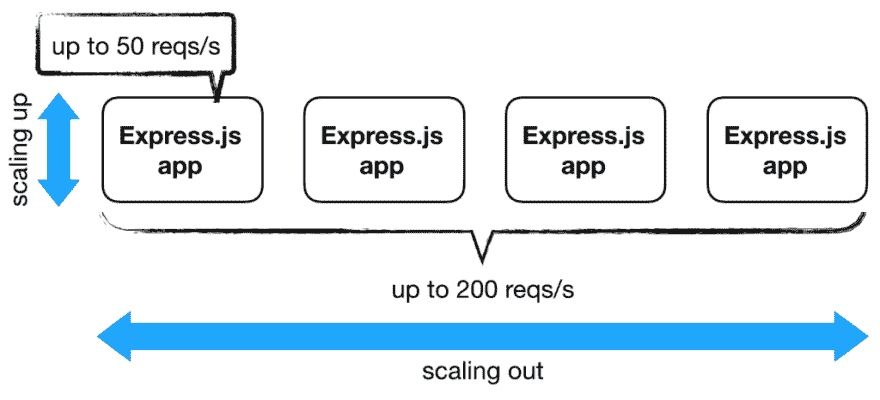
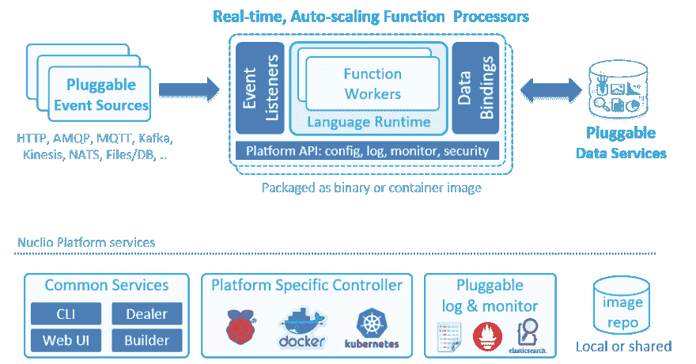
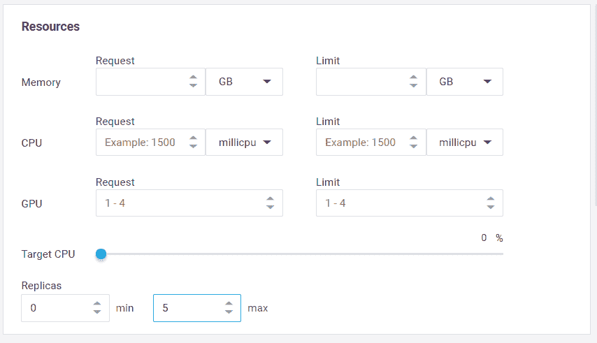
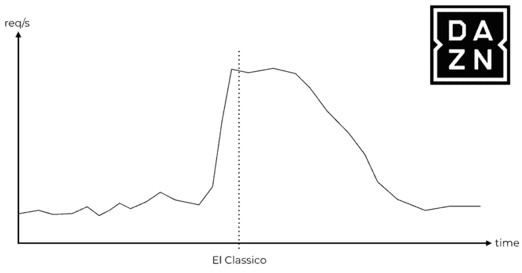
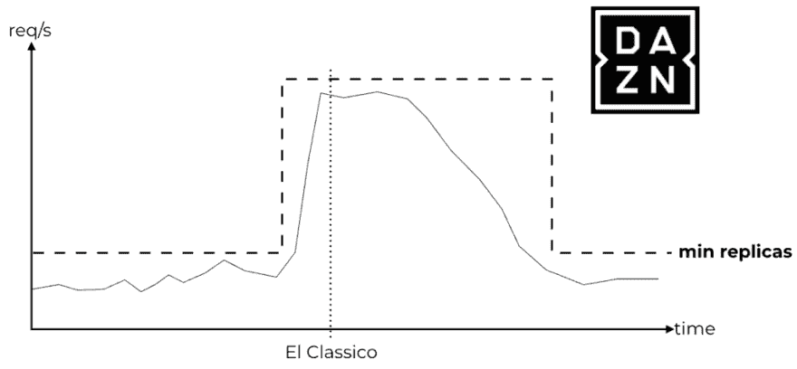
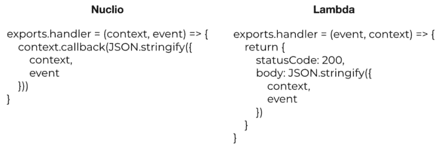
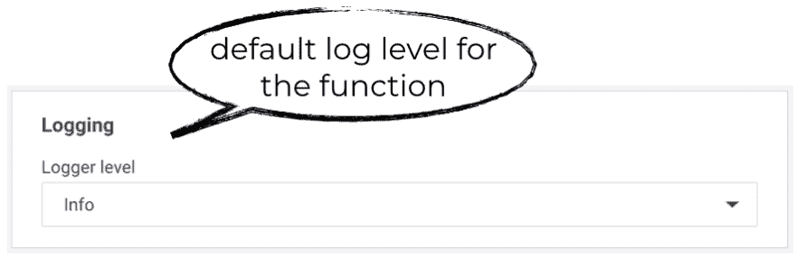
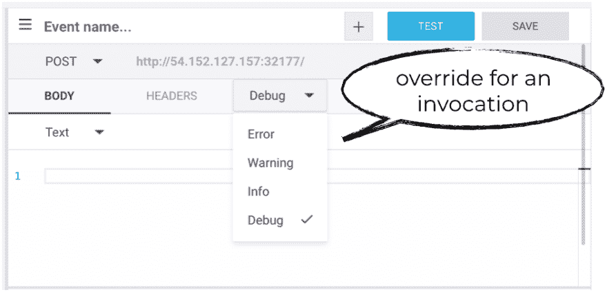
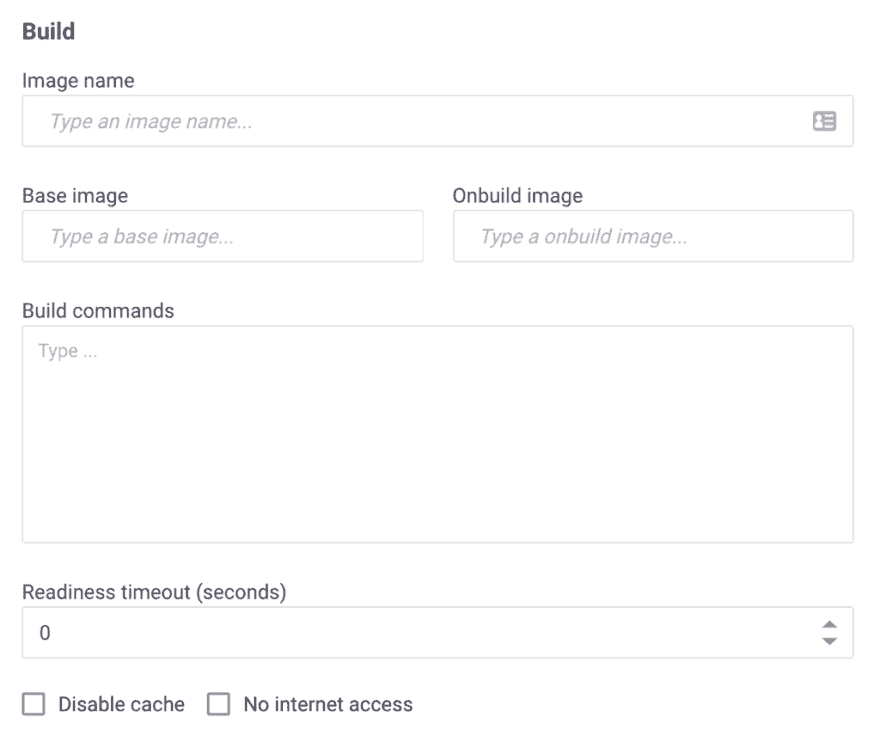
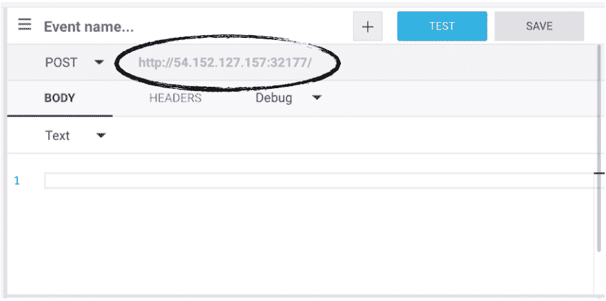

# 比较 Nuclio 和 AWS Lambda

> 原文：<https://dev.to/theburningmonk/comparing-nuclio-and-aws-lambda-234b>

使用无服务器，您可以尽可能地将运行基础设施的责任委托给平台提供商。这使您的工程师可以专注于构建客户对您的需求——使您的企业区别于竞争对手的特性。然而，为了让这一理念发挥作用，该平台不仅需要为您提供构建这些功能的工具，还需要提供让工程师满意的性能。

是的，像 AWS Lambda 这样的服务是强大的，但是它们有许多记录良好的限制，使它们不适合一些工作负载。其中包括:

*   冷启动和高延迟使它们不适合要求一致的毫秒级响应时间的实时应用。
*   按调用付费的模式使得它们在高吞吐量的场景中成本很高。
*   事件驱动模型，加上最大执行时间或数据大小限制，使它们不适合长时间运行的任务或繁重的数据或人工智能处理。
*   它们仅限于特定于云提供商的触发器和事件源。

进入 [Nuclio](https://nuclio.io/) ，这是一个基于 Kubernetes 构建的开源无服务器平台，有托管平台即服务(PaaS)和自托管两种风格。在本帖中，我们将比较 Nuclio 和 AWS Lambda，了解 Nuclio 如何解决上述限制，并探索 Nuclio 正在开发的新用例，例如:

*   高吞吐量数据处理管道或 ETL。
*   实时服务于机器学习模型。
*   多人游戏等实时应用。
*   长期运行的作业和服务。

## **nucl io vs AWS Lambda**

### 并发

从传统应用程序开发到 AWS Lambda 的最大转变之一是如何管理并发性。在容器/VM 中运行的 Express.js web 应用程序可以同时处理多个请求。换句话说，您的应用程序管理自己的并发性。您可以通过增加应用程序可以处理的并发请求的数量(向上扩展)然后增加容器的数量(向外扩展)来扩展应用程序。

<figure> 

<figcaption id="caption-attachment-8708">图 1:传统应用程序按比例增加应用程序中的货币，然后按比例增加运行应用程序的节点数量。</figcaption>

</figure>

有了 AWS Lambda，并发由平台管理，并发执行一次只处理一个请求——很像 [actor 模型](https://www.brianstorti.com/the-actor-model/)中的 actor，一次处理一条消息。通过增加函数的并发执行次数，应用程序可以向外扩展。

Lambda 的并发模型有其优势:

*   它简化了应用程序开发。并发性是 bug 和性能问题的一个经常性来源，因为开发人员正在努力编写高度并发的应用程序。
*   它允许您为每个调用单独定价，因为您不会因为处理并发请求而发生资源争用。这使得按使用付费的定价模式成为可能，也是 findev 的基石之一。

尽管如此，Lambda 也有一些缺点:

*   当一个函数在 IO 上等待时，你不能利用空闲的 CPU 周期。由于大多数函数都是 IO 密集型的，这导致效率非常低。
*   它需要更多的缩放，这意味着更多的冷启动。要处理 X 个并发请求，您需要 X 个并发执行，这相当于 X 个冷启动。这使得几乎不可能实现可预测的性能。

另一方面，Nuclio 既可以纵向扩展，也可以横向扩展。一个函数处理器(类似于一个容器)可以容纳多个函数工作者。然后，每个工作人员能够一次处理一条消息。该系统支持同一处理器内的并发，然后根据负载自动调整处理器副本的数量。

<figure> 

<figcaption id="caption-attachment-8709">图 2:一个 Nuclio 函数的架构。</figcaption>

</figure>

Lambda 和 Nuclio 之间另一个有趣的区别是，Nuclio 允许您指定副本的最小和最大数量。另外，Nuclio 也支持 GPU。

<figure> 

<figcaption id="caption-attachment-8710">图 3: Nuclio 允许您配置最小和最大数量的副本。</figcaption>

</figure>

使用 Lambda，您可以为一个函数配置一个保留的并发性，这(与直觉相反)设置了它的最大并发执行数。但是没有办法告诉系统总是保持一定数量的并发执行一直运行。当没有流量时，系统总是扩展到零，这种行为对于经常经历流量高峰的系统来说是非常不希望的。

例如，我的雇主 [DAZN](https://www.dazn.com/) 从事体育流媒体业务。我们一直都能看到巨大的流量峰值，数百万用户在体育赛事开始前的几秒钟内涌入。

<figure> 

<figcaption id="caption-attachment-8711">图 4:体育流媒体平台，如 DAZN，在体育赛事开始前经历了巨大的流量高峰。</figcaption>

</figure>

如果不能配置并发执行的最小数量，这些峰值会导致大量冷启动。此外，在这些情况下，Lambda 必须快速扩展并发执行的数量，以满足激增的需求。在这里，我们还遇到了 Lambda 扩展速度的[500/分钟限制](https://docs.aws.amazon.com/lambda/latest/dg/scaling.html)。因此，我们目前无法在系统的关键路径上使用 Lambda，因为它必须承受这些尖峰。

使用 Nuclio，您可以在事件发生之前以编程方式更新最小副本数量，这样当峰值到来时，您就不必担心达到扩展限制或忍受冷启动带来的性能冲击。还可以通过 API 调用告诉 Nuclio 立即扩展到零，这样可以节省资源。

<figure> 

<figcaption id="caption-attachment-8712">图 5:调整副本的最小数量使您能够应对可预测的流量高峰。</figcaption>

</figure>

### 超时

Lambda 和 Nuclio 的另一个主要区别是如何处理超时。使用 Lambda，一次调用最多可以运行 15 分钟。虽然您可以使用[递归函数](https://hackernoon.com/write-recursive-aws-lambda-functions-the-right-way-4a4b5ae633b6)或阶跃函数来扩展这个限制，但是这两种方法都有自己的问题。因此，Lambda 函数非常适合于事件驱动的架构和执行短暂的任务。

使用 Nuclio，没有最大执行时间。容器可以继续运行，这反过来允许您超越事件驱动模型的约束。现在，您可以将一个功能转变为一个长期运行的服务，这将释放一些有趣的用例，如长期运行的 ETL 作业和训练机器学习(ML)模型。

### 缓存调用之间的状态

Lambda 和 Nuclio 函数在调用过程中都接受事件和上下文。

<figure> 

<figcaption id="caption-attachment-8713">图 6:nucl io 和 Lambda 函数都接受一个调用事件和上下文作为参数。</figcaption>

</figure>

对于 Lambda，[上下文对象](https://docs.aws.amazon.com/lambda/latest/dg/nodejs-prog-model-context.html)是短暂的，不会在调用之间持续。如果您想要在调用之间持久化数据(例如静态配置、数据库连接)，那么您需要在函数处理程序之外将它们声明为全局变量。

在 Nuclio 中，执行上下文本身在调用之间是持久的，可以用来缓存状态。context 对象还包括一个内置的日志记录器，它支持 JSON 和四个日志级别的结构化日志记录:调试、信息、警告和错误。

您可以为函数配置默认的日志级别，甚至可以覆盖每次调用的默认日志级别，这对于调试非常有用。您还可以将日志导出到外部服务，如 Elasticsearch。

<figure> 

<figcaption id="caption-attachment-8714">图 7:使用 Nuclio，您可以为每个函数选择默认的日志级别。</figcaption>

</figure>

<figure> 

<figcaption id="caption-attachment-8715">图 8:您还可以覆盖调用的默认日志级别。</figcaption>

</figure>

此外，还有用于执行上下文初始化的钩子，它在函数的第一次调用之前被调用。这允许您在容器投入使用之前执行初始化逻辑，并消除 Lambda 遇到的可怕的冷启动问题。

### 数据量和持久数据连接

使用 Lambda，函数只有在被事件触发时才会运行。此外，当并发执行空闲几分钟时，它们会被垃圾收集。当您使用关系数据库管理系统(RDBMS)和其他需要持久连接的系统时，这种行为会使工作变得困难。事实上，已经开发了一套 [指南](https://www.jeremydaly.com/manage-rds-connections-aws-lambda/)来帮助你避免在 RDBMS 中使用 Lambda 的许多陷阱。此外，Lambda 不允许您在标准文件系统挂载中使用持久数据，这迫使您在处理大型文件(如图像、日志、ML 模型等)之前向/从对象存储中复制数据。

然而，使用 Nuclio，您可以使用[上下文对象](https://nuclio.io/docs/latest/concepts/architecture/#data-bindings)来维护到数据库的持久连接。因为上下文是在处理器级别维护的，所以可以更好地重用，因为它们可以在调用之间共享。您还可以使用数据绑定处理数据获取的其他方面，包括批处理和缓存，这有助于提高应用程序的 IO 性能。此外，您可以将卷挂载到函数，这对于使用 ML 模型或 Tensorflow 非常有用，并且您可以将 Kubernetes secrets 挂载为卷。事实上，Nuclio 支持 Kubernetes 支持的所有[卷类型](https://kubernetes.io/docs/concepts/storage/volumes/)。

### 运行时

Lambda 和 Nuclio 都支持 Go、Node.js、Python、.Net 核心，Java 和 Ruby。此外，这两个平台都为您提供了定制执行运行时的方法。

有了 Lambda，你可以创建一个[定制运行时](https://docs.aws.amazon.com/lambda/latest/dg/runtimes-custom.html)，并通过 [AWS Lambda 层](https://docs.aws.amazon.com/lambda/latest/dg/configuration-layers.html)分发。这允许您引入 Lambda 平台本身不支持的其他语言运行时。举几个例子，一些供应商已经发布了 PHP、Rust、Erlang 和 Elixir 的运行时。

使用 Nuclio，您可以在自己的 Docker 映像上运行函数(参见图 9)，该映像可以来自私有的映像存储库。这允许您定制执行环境本身。

您还可以通过 Shell 函数支持其他语言运行时，这允许您用任何可执行的二进制文件处理调用事件。详见[本例](https://github.com/nuclio/nuclio/blob/master/docs/reference/runtimes/shell/writing-a-shell-function.md)。

<figure> 

<figcaption id="caption-attachment-8716">图 9: Nuclio 允许您在自己的 Docker 映像上运行函数，该映像可以来自私有映像存储库。</figcaption>

</figure>

### 触发器

Lambda 由[广泛的事件源](https://docs.aws.amazon.com/lambda/latest/dg/invoking-lambda-function.html)支持。

Nuclio 自带 [13](https://github.com/nuclio/nuclio/tree/master/pkg/processor/trigger) [触发器](https://github.com/nuclio/nuclio/tree/master/pkg/processor/trigger)，包括 cron、HTTP、Kafka、Kinesis 和 RabbitMQ。由于 Nuclio 是开源的，您也可以为您想要集成的服务编写自己的触发器，并利用其他人的贡献。HTTP 触发器为您提供了一种将 Nuclio 与其他支持 HTTP 作为目标的事件源(如 SNS)集成的简单方法。此外，由于 Nuclio 支持 [CNCF CloudEvents](https://cloudevents.io/) 标准，它可以支持更多兼容 CloudEvents 的事件源。

Nuclio 触发器都被规范化为同一个事件对象。这消除了理解每个事件源的特定事件签名的需要，这在使用 Lambda 时经常令人困惑。这也使得在不同的触发器之间切换功能变得容易。

### 内置 HTTP 触发器

使用 Lambda，您需要使用 API Gateway 为您的函数创建一个 HTTP 端点。API Gateway 是一个功能丰富的服务，但是它也很复杂，并且运行成本通常比 Lambda 调用本身更高。这也为您的 API 增加了另一个延迟源，最小延迟大约为 5 毫秒到 10 毫秒，并且它的开销可能会超过 100 毫秒。这种成本和延迟开销使其不适合具有高吞吐量或严格实时要求的应用程序。

在 Nuclio 中，默认情况下每个函数都有一个私有的 HTTP 接口。要公开暴露端点，需要指定一个类似于 API Gateway 的 [HTTP 触发器](https://nuclio.io/docs/latest/reference/triggers/http/)。然而，与 API Gateway 不同，这个 HTTP 触发器不会产生额外的成本，并且具有最小的延迟开销。

<figure> 

<figcaption id="caption-attachment-8717">图 10:使用 Nuclio，每个函数都默认获得一个私有的 HTTP 接口。</figcaption>

</figure>

## **用 Nuclio 解锁新用例**

从我们的比较中可以看出，Nuclio 在许多重要方面与 Lambda 不同，比如它的并发模型和它没有最大执行时间。这为一系列用例打开了大门。让我们花点时间来看几个。

### 高吞吐量数据处理管道或 API

对于一个高吞吐量的 API 来说，API Gateway 和 Lambda 的成本远远高于在容器中运行的同等应用程序。这种成本差异导致许多人重写他们的应用程序。

Nuclio 的并发模型可以更有效地利用可用资源，从而在大规模运行时显著降低运营成本。函数有内置的 HTTP 接口，所以你也不需要支付昂贵的 API 网关服务。

将卷装载到您的函数的能力还允许您高速地从装载的卷读取和写入数据，并允许构建有状态的应用程序。同样，今天你不能用 Lambda 做到这一点，因为它不允许你将[亚马逊弹性文件系统](https://aws.amazon.com/efs/)(亚马逊 EFS)卷附加到函数上。

这些特性使得在 Nuclio 函数上运行高吞吐量和高性能的 API 在经济上变得可行。这同样适用于每小时必须处理数 TB 数据的高吞吐量数据处理管道。

### 流量峰值可预测的 API

Nuclio 使您能够配置最小数量的副本。这允许经历可预测的流量峰值的系统提前预留足够的资源，并避免在峰值发生时降低用户体验。例子包括食品订购服务，如 Just Eat 或 Deliveroo，或体育流媒体服务，如 DAZN。

同时，Nuclio 仍然允许您通过将副本的最小数量设置为零来扩展到零。它使您能够根据具体情况控制资源使用或延迟的优化。

### 实时应用

Nuclio 不会遭受冷启动，并且能够在调用时提供一致的亚毫秒级响应时间。这使得它成为对实时性有严格要求的应用程序(如多人游戏和实时机器人)的合适解决方案。

### 实时服务机器学习模型

为了实时服务 ML 模型，您需要有强大且可预测的 API 延迟，以及加载和处理通常很大(GBs)的 ML 模型的能力。

Nuclio 允许您将 Kubernetes 卷附加到您的函数上，并且对这些卷没有大小限制。结合性能特征，可以用 Nuclio 函数实现这些要求苛刻的工作负载。

Nuclio 还具有与 Jupyter 的本机[集成，并允许您自动部署 Jupyter 笔记本和 ML 模型作为 Nuclio 功能。](https://github.com/nuclio/nuclio-jupyter)

### 长期运行的作业和服务

Nuclio 不会对函数调用施加最大执行超时。这允许您将您的功能转变为长期运行的服务，并执行长期运行的 ETL 作业。

Nuclio 的 init_context()钩子允许您创建长期运行的服务，比如一个不断读取 Twitter feed 的应用程序(例如，用上下文加载 TwythonStreamer，这是轮询外部服务，而不是由事件触发)。

## **结论**

正如我们所讨论的，Nuclio 是少数几个商业上可行的开源解决方案之一。对于更高性能或数据驱动型应用，它具有关键的架构优势，包括:

*   Nuclio 是云不可知论者。它可以在多云/混合云场景中使用。您还可以使用 plain Docker 在笔记本电脑上运行 Nuclio，这使得调试更加容易。
*   Nuclio 的并发模型和挂载文件卷的能力允许您构建高性能 API 和高吞吐量数据处理管道。
*   Nuclio 让您能够更好地控制应用程序的并发性，这使得它即使对于流量非常大的应用程序也是可行的。
*   Nuclio 的执行上下文在调用之间是持久的，并且它不会对调用强加最大执行时间。这允许您创建长期运行的有状态应用程序，比如 ETL 作业。
*   Nuclio 允许您将 Kubernetes 卷附加到您的函数上，并且对卷的大小没有限制。这使得您可以处理通常为 GBs 大小的大型 ML 模型。Nuclio 还与 Jupyter 进行了原生集成，可以自动部署您的 Jupyter 笔记本和模型作为功能。
*   Nuclio 提供了良好的开箱即用的开发人员体验。它有一个内置的日志记录器，支持结构化日志记录，您可以轻松地将您的日志导出到外部日志聚合服务。

如果您正在寻找一个不依赖于特定云提供商的无服务器平台，Nuclio 值得一看。