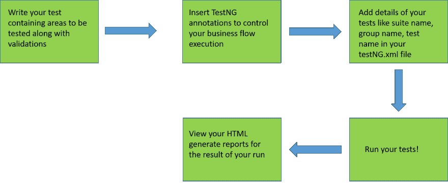
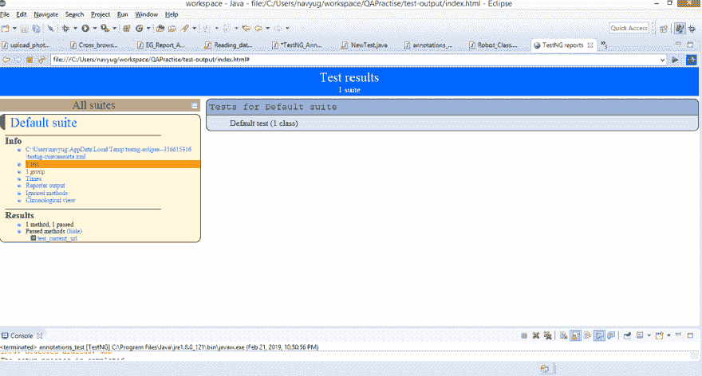
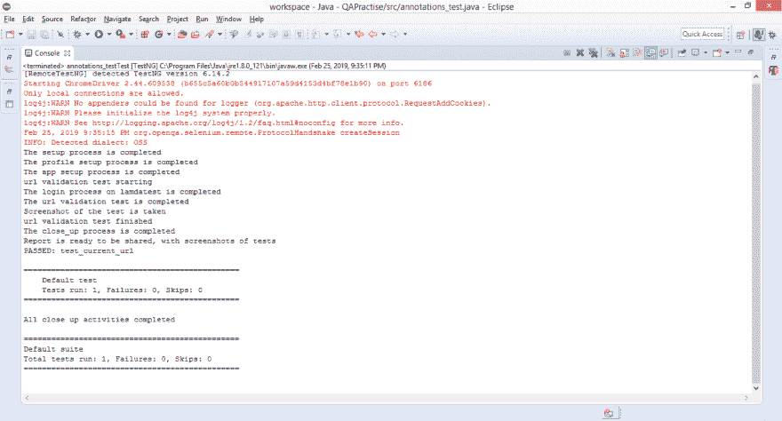
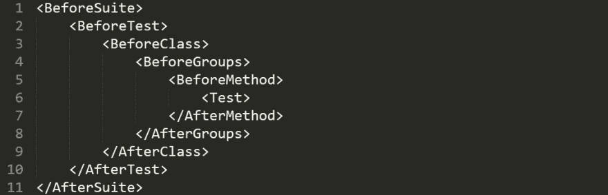
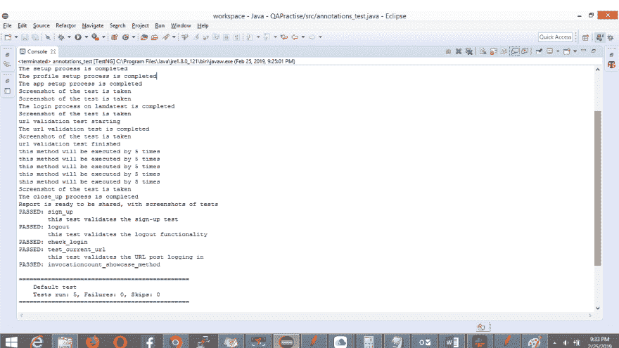
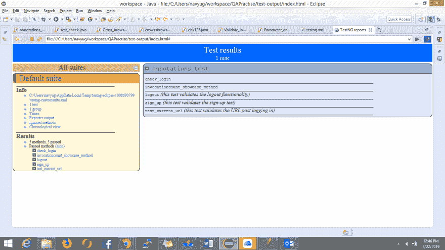
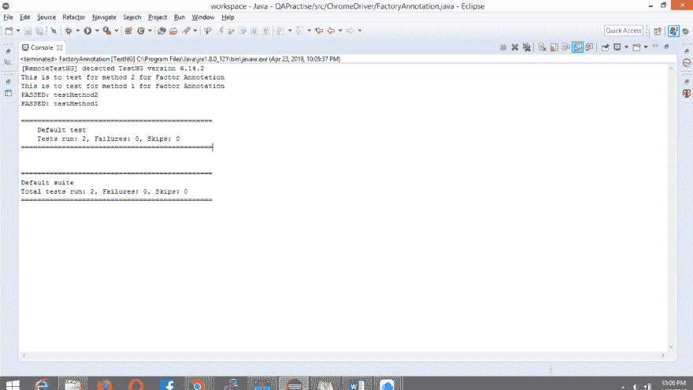

# Selenium WebDriver 测试注释的完整指南

> 原文：<https://dev.to/lambdatest/complete-guide-on-testng-annotations-for-selenium-webdriver-126c>

TestNG 是由 Cédric Beust 创建的测试框架，有助于满足我们的许多测试需求。它广泛应用于硒。想知道 ng 代表什么？嗯，它指的是**‘下一代’**。TestNG 类似于 Junit，但在控制程序的执行流方面，它更强大。由于框架的本质，我们倾向于通过使用 TestNG 注释使我们的测试更加结构化，并提供更好的验证点。

TestNG 的一些值得注意的特性是:

*   强大而多样的 TestNG 注释来支持您的测试用例。

*   帮助执行并行测试，依赖方法测试。

*   通过 TestNG.xml 文件或通过数据提供者概念，通过多组数据运行测试的灵活性。

*   测试用例可以根据需要进行分组和优先排序。

*   提供对 HTML 报告的访问，可以通过各种插件进行定制。

*   测试日志可以跨测试生成。

*   可以很容易地与 eclipse、Maven、Jenkins 等集成。

测试程序的基本流程包括以下步骤:

[](https://res.cloudinary.com/practicaldev/image/fetch/s--eDxS31Qm--/c_limit%2Cf_auto%2Cfl_progressive%2Cq_auto%2Cw_880/https://cdn-images-1.medium.com/max/3828/0%2AQH7wyVsHNrNUr7hZ.png)

因此，在跳到 Selenium automation 的 [TestNG 中的注释之前，最好参考一下设置 TestNG 所需的先决条件。](https://www.lambdatest.com/selenium-automation-testing-with-testng?utm_source=devto&utm_medium=organic&utm_campaign=sep07_sd&utm_term=sd&utm_content=webpage)

**先决条件**

*   Java 开发工具包

*   安装 Eclipse 或任何其他 IDE。

*   在 Eclipse 或任何其他 IDE 中安装 TestNG。

注意:注释只能用于 Java 或更高版本。

如果您是 TestNG 框架的新手，那么请按照我们的指导使用 TestNG 运行您的第一个自动化脚本。

如果你是硒的新手，并且想知道它是什么，那么我们建议查看我们的指南— [什么是硒](https://www.lambdatest.com/selenium?utm_source=devto&utm_medium=organic&utm_campaign=sep07_sd&utm_term=sd&utm_content=webpage)？

***看看这个，如何使用[Safari 开发工具](https://www.lambdatest.com/blog/debug-websites-using-safari-developer-tools/?utm_source=devto&utm_medium=organic&utm_campaign=sep07_sd&utm_term=sd&utm_content=blog)*** 调试网站

## 那么，什么是注释呢？

注释是一个标签，它提供关于类或方法的附加信息。它由**前缀“@”表示。TestNG 使用这些注释来帮助构建一个健壮的框架。让我们来看看这些对 [Selenium](https://www.lambdatest.com/selenium-automation?utm_source=devto&utm_medium=organic&utm_campaign=sep07_sd&utm_term=sd&utm_content=webpage) 的 TestNG 注释。

## [@测试](https://dev.to/test)

主要业务逻辑所在的最重要的 TestNG 注释框架。所有要自动化的功能都保存在 [@test](https://dev.to/test) 注释方法中。它具有各种属性，基于这些属性，该方法可以被重组和执行。

下面验证 url 的代码片段示例:

```
[@Test](http://twitter.com/Test)
    public void testCurrentUrl() throws InterruptedException
    {
        driver.findElement(By.xpath("//*[[@id](http://twitter.com/id)='app']/header/aside/ul/li[4]/a")).click();

        String currentUrl= driver.getCurrentUrl();
        assertEquals(current_url, "[https://automation.lambdatest.com/timeline/?viewType=build&page=1](https://automation.lambdatest.com/timeline/?viewType=build&page=1)", "url did not matched");
    } 
```

Enter fullscreen mode Exit fullscreen mode

## 预测

**这个注释在你的类中的第一个 [@test](https://dev.to/test) TestNG 注释方法之前运行。**您可以在 TestNG for [Selenium](https://www.lambdatest.com/selenium?utm_source=devto&utm_medium=organic&utm_campaign=sep09_sd&utm_term=sd&utm_content=webpage) 中使用该注释来设置您的浏览器配置文件首选项，例如在最大化模式下自动打开您的浏览器，为您的浏览器设置您自己的定制配置文件等。

下面是 BeforeTest 方法的代码片段，确保浏览器以最大化模式打开:

```
[@BeforeTest](http://twitter.com/BeforeTest)
    public void profileSetup()
    {
        driver.manage().window().maximize();

    } 
```

Enter fullscreen mode Exit fullscreen mode

## @事后

这个 TestNG 注释在所有属于你的类的测试方法运行之后运行。这是一个有用的注释，在向您的利益相关者报告您的自动化结果时非常方便。您可以使用这个注释来生成测试报告，并通过电子邮件与您的利益相关者共享。

下面的代码片段示例:

```
[@AfterTest](http://twitter.com/AfterTest)
    public void reportReady()
    {
        System.out.println("Report is ready to be shared, with screenshots of tests");
    } 
```

Enter fullscreen mode Exit fullscreen mode

## @之前的方法

TestNG 中的这个注释在每个 [@test](https://dev.to/test) 注释方法之前运行。您可以在执行测试之前使用它来检查数据库连接，或者在您的 [@test](https://dev.to/test) 带注释的方法中测试不同的功能，该方法要求用户登录某个类。在这种情况下，您也可以将登录代码放在@BeforeMethod 注释方法中。

以下代码片段是一个示例，显示了 LambdaTest 平台的登录功能:

```
[@BeforeMethod](http://twitter.com/BeforeMethod)
    public void checkLogin()
    {
          driver.get("[https://accounts.lambdatest.com/login](https://accounts.lambdatest.com/login)");
          driver.findElement(By.xpath("//input[[@name](http://twitter.com/name)='email']")).sendKeys("[sadhvisingh24@gmail.com](mailto:sadhvisingh24@gmail.com)");
          driver.findElement(By.xpath("//input[[@name](http://twitter.com/name)='password']")).sendKeys("XXXXX");
          driver.findElement(By.xpath("//*[[@id](http://twitter.com/id)='app']/section/form/div/div/button")).click();

    } 
```

Enter fullscreen mode Exit fullscreen mode

## [T1】@ after method](#aftermethod)

**这个注释在每个 [@test](https://dev.to/test) 注释过的方法之后运行。**这个注释可以用来截取每个测试方法在测试运行中的截图。

下面的代码片段显示了在 Selenium 的@AfterTest TestNG 注释中截取的屏幕截图:

```
[@AfterMethod](http://twitter.com/AfterMethod)
    public void screenShot() throws IOException
    {
        TakesScreenshot scr= ((TakesScreenshot)driver);
        File file1= scr.getScreenshotAs(OutputType.FILE);

       FileUtils.copyFile(file1, new File("C:\\Users\\navyug\\workspace\\QAPractise\\test-output\\test1.PNG"));

    } 
```

Enter fullscreen mode Exit fullscreen mode

[https://www.youtube.com/embed/90F7dePW1vo](https://www.youtube.com/embed/90F7dePW1vo)

## @上课前

这个注释在当前类的第一个测试方法之前运行。该注释可用于设置您的浏览器属性、初始化您的驱动程序、使用所需的 URL 打开您的浏览器等。

下面是 BeforeClass 的代码片段:

```
[@BeforeClass](http://twitter.com/BeforeClass)
    public void appSetup()
    {
        driver.get(url);

    } 
```

Enter fullscreen mode Exit fullscreen mode

## @课后

这个 TestNG 注释在当前类的最后一个测试方法之后运行。TestNG 中的这个注释可用于在测试期间执行清理活动，如关闭驱动程序等

下面是代码片段示例，显示了执行的结束活动:

```
[@AfterClass](http://twitter.com/AfterClass)
    public void closeUp()
    {
        driver.close();
    } 
```

Enter fullscreen mode Exit fullscreen mode

## @

一个 suite 可以由多个类组成，这个 TestNG 注释在所有类的所有测试方法之前运行。这个注释标记了执行的入口点。TestNG 中的@BeforeSuite 注释可用于执行所需的通用功能，如设置和启动 Selenium 驱动程序或远程 web 驱动程序等。

TestNG 中@BeforeSuite 注释的示例，展示驱动程序设置的代码片段:

```
[@BeforeSuite](http://twitter.com/BeforeSuite)
    public void setUp()
    {
    System.setProperty("webdriver.chrome.driver", "path to chrome driver");
    driver=new ChromeDriver();
    } 
```

Enter fullscreen mode Exit fullscreen mode

在这篇 WebDriver 教程中，探索什么是 WebDriver，它的特性，它是如何工作的，最佳实践等等。

## @套房

这个 TestNG 注释在所有类的所有测试方法都运行之后运行。当您有多个运行中的类时，该注释可用于在完成测试之前清理进程，例如关闭驱动程序等。

下面是针对 Selenium 的 TestNG 中@AfterSuite 注释的代码片段:

```
[@AfterSuite](http://twitter.com/AfterSuite)
    public void cleanUp()
    {

        System.out.println("All close up activities completed");
    } 
```

Enter fullscreen mode Exit fullscreen mode

## [T1】@ before groups](#beforegroups)

TestNG 帮助测试人员通过在 [@test](https://dev.to/test) TestNG 注释中使用的属性组来创建一组测试。例如，如果您希望将所有与用户管理相关的类似功能放在一起，您可以标记所有测试，如仪表板、配置文件、事务等。作为“用户管理”合并到一个组中。TestNG 中的@BeforeGroups 注释有助于在指定的组之前首先运行定义的测试。如果团队专注于单一功能，如上述示例中所述，可以使用此注释。BeforeGroup 注释可以包含登录功能，该功能需要在任何其他方法(如用户仪表板、用户配置文件等)之前运行。

Selenium 的 TestNG 中@BeforeGroups 注释的代码片段示例:

```
[@BeforeGroups](http://twitter.com/BeforeGroups)("urlValidation")
    public void setUpSecurity() {
        System.out.println("url validation test starting");
    } 
```

Enter fullscreen mode Exit fullscreen mode

## [T1】@ after groups](#aftergroups)

这个 TestNG 注释在指定组的所有测试方法都被执行后运行。
Selenium TestNG 中@AfterGroups 注释的代码片段示例:

```
[@AfterGroups](http://twitter.com/AfterGroups)("urlValidation")
    public void tearDownSecurity() {
        System.out.println("url validation test finished");
    }

The below code displays an example of all annotations used along with TestNG report respectively:

import static org.testng.Assert.assertEquals;

import java.io.File;
import java.io.IOException;
import java.util.concurrent.TimeUnit;

import org.apache.commons.io.FileUtils;
import org.openqa.selenium.By;
import org.openqa.selenium.OutputType;
import org.openqa.selenium.TakesScreenshot;
import org.openqa.selenium.WebDriver;
import org.openqa.selenium.chrome.ChromeDriver;
import org.testng.annotations.AfterClass;
import org.testng.annotations.AfterGroups;
import org.testng.annotations.AfterMethod;
import org.testng.annotations.AfterSuite;
import org.testng.annotations.AfterTest;
import org.testng.annotations.BeforeClass;
import org.testng.annotations.BeforeGroups;
import org.testng.annotations.BeforeMethod;
import org.testng.annotations.BeforeSuite;
import org.testng.annotations.BeforeTest;
import org.testng.annotations.Test;

public class AnnotationsTestNG {

public WebDriver driver;
        public String url="[https://www.lambdatest.com/](https://www.lambdatest.com/)";

    [@BeforeSuite](http://twitter.com/BeforeSuite)
    public void setUp()
    {   
        System.setProperty("webdriver.chrome.driver", "C:\\Users\\navyug\\workspace\\QAPractise\\src\\ChromeDriver\\chromedriver.exe");
        driver=new ChromeDriver();
        driver.manage().timeouts().implicitlyWait(20, TimeUnit.SECONDS);
        System.out.println("The setup process is completed");
    }

    [@BeforeTest](http://twitter.com/BeforeTest)
    public void profileSetup()
    {
        driver.manage().window().maximize();
        System.out.println("The profile setup process is completed");

    }

    [@BeforeClass](http://twitter.com/BeforeClass)
    public void appSetup()
    {
        driver.get(url);
        System.out.println("The app setup process is completed");
    }

    [@BeforeMethod](http://twitter.com/BeforeMethod)
    public void checkLogin()
    {
          driver.get("[https://accounts.lambdatest.com/login](https://accounts.lambdatest.com/login)");
          driver.findElement(By.xpath("//input[[@name](http://twitter.com/name)='email']")).sendKeys("[sadhvisingh24@gmail.com](mailto:sadhvisingh24@gmail.com)");
          driver.findElement(By.xpath("//input[[@name](http://twitter.com/name)='password']")).sendKeys("activa9049");
          driver.findElement(By.xpath("//*[[@id](http://twitter.com/id)='app']/section/form/div/div/button")).click();
          System.out.println("The login process on lamdatest is completed");
    }

    [@Test](http://twitter.com/Test)(groups="urlValidation")
    public void testCurrentUrl() throws InterruptedException
    {
        driver.findElement(By.xpath("//*[[@id](http://twitter.com/id)='app']/header/aside/ul/li[4]/a")).click();
        Thread.sleep(6000);
        String currentUrl= driver.getCurrentUrl();
        assertEquals(currentUrl, "[https://automation.lambdatest.com/timeline/?viewType=build&page=1](https://automation.lambdatest.com/timeline/?viewType=build&page=1)", "url did not matched");
        System.out.println("The url validation test is completed");
    }

    [@AfterMethod](http://twitter.com/AfterMethod)
    public void screenShot() throws IOException
    {
        TakesScreenshot scr= ((TakesScreenshot)driver);
        File file1= scr.getScreenshotAs(OutputType.FILE);

        FileUtils.copyFile(file1, new File("C:\\Users\\navyug\\workspace\\QAPractise\\test-output\\test1.PNG"));
        System.out.println("Screenshot of the test is taken");
    }

    [@AfterClass](http://twitter.com/AfterClass)
    public void closeUp()
    {
        driver.close();
        System.out.println("The close_up process is completed");
    }

    [@AfterTest](http://twitter.com/AfterTest)
    public void reportReady()
    {
        System.out.println("Report is ready to be shared, with screenshots of tests");
    }

    [@AfterSuite](http://twitter.com/AfterSuite)
    public void cleanUp()
    {

        System.out.println("All close up activities completed");
    }

    [@BeforeGroups](http://twitter.com/BeforeGroups)("urlValidation")
    public void setUpSecurity() {
        System.out.println("url validation test starting");
    }

    [@AfterGroups](http://twitter.com/AfterGroups)("urlValidation")
    public void tearDownSecurity() {
        System.out.println("url validation test finished");
    }

} 
```

Enter fullscreen mode Exit fullscreen mode

[](https://res.cloudinary.com/practicaldev/image/fetch/s--tCd9v8xP--/c_limit%2Cf_auto%2Cfl_progressive%2Cq_auto%2Cw_880/https://cdn-images-1.medium.com/max/2000/0%2AznqcLDZxcyw1Pn-3.png)

通过 TestNG 认证，您可以挑战自己在使用 TestNG 执行自动化测试方面的技能，并让您的职业生涯更上一层楼。

以下是来自 LambdaTest 的 TestNG 认证的简要介绍:

[https://www.youtube.com/embed/dzXX2hJhuCY](https://www.youtube.com/embed/dzXX2hJhuCY)

***看看这个，如何在 Safari 中使用 [Dev 工具](https://www.lambdatest.com/blog/debug-websites-using-safari-developer-tools/?utm_source=devto&utm_medium=organic&utm_campaign=sep07_sd&utm_term=sd&utm_content=blog)*** 调试网站

## TestNG 报告:

[](https://res.cloudinary.com/practicaldev/image/fetch/s--HYBdoLXZ--/c_limit%2Cf_auto%2Cfl_progressive%2Cq_auto%2Cw_880/https://cdn-images-1.medium.com/max/2728/0%2A8jUkNlGO7Zh1o0ky.png)

## 控制台输出:

[](https://res.cloudinary.com/practicaldev/image/fetch/s--XsmeJ1dn--/c_limit%2Cf_auto%2Cfl_progressive%2Cq_auto%2Cw_880/https://cdn-images-1.medium.com/max/4000/0%2ASC96KLxlPvyD8pob.png)

观看此视频，了解如何设置和使用 TestNG with Selenium 来自动化您的测试过程。我们还将介绍 TestNG Priority 方法，它允许您编写易于阅读和维护的测试。

[https://www.youtube.com/embed/X3HdVgjafpA](https://www.youtube.com/embed/X3HdVgjafpA)

## TestNG 中注释的执行顺序为 Selenium

上面描述的所有 TestNG 注释都在运行时按以下顺序执行:

*   之前套件

*   测试前

*   上课前

*   在组之前

*   before 方法

*   试验

*   after 方法

*   后组

*   下课后

*   测试后

*   套房

以下是这些注释的基本工作流程图:

[](https://res.cloudinary.com/practicaldev/image/fetch/s--PbYdunhD--/c_limit%2Cf_auto%2Cfl_progressive%2Cq_auto%2Cw_880/https://cdn-images-1.medium.com/max/2024/0%2A13ljJ4IKgZClSMCc.png)

## 与 TestNG 注释一起使用的属性

TestNG 中的这些测试注释有多个属性可以用于我们的测试方法。这些属性进一步帮助定义我们的测试，并帮助提供在 TestNG 类中使用的不同测试方法的执行流程方面的清晰性。列举如下:

*   **描述:**定义了测试方法。人们可以通过描述来定义一个方法做什么。例如， [@test](https://dev.to/test) (description= "该测试验证登录功能")。

*   **alwaysRun:** 当与测试方法一起使用时，该属性确保它总是运行，而不管该方法所依赖的参数是否失败。当该值设置为 true 时，该方法将始终执行。比如 [@test](https://dev.to/test) (alwaysRun= true)。

*   **dataProvider:** 这个属性被设置为从 dataProvider 注释的测试向这个属性提供的测试提供数据。例如，假设您打算在多个跨浏览器上运行您的测试，其中编写了一个 dataProvider 带注释的测试，它包含浏览器的多个输入及其相应的版本。在这种情况下，包含该属性的测试将使用这些数据输入在多个浏览器上运行测试。同样的语法是， [@test](https://dev.to/test) (dataProvider= "跨浏览器测试")。

*   **dependsOnMethods:** 该属性提供了执行流程的细节，其中测试只有在属性中提到的依赖方法被执行时才会被执行。如果该方法所依赖的测试失败或未被执行，则从执行中跳过该测试。比如[@ test](https://dev.to/test)(dependsOnmethod = " log in ")。

*   **groups:** 这个属性有助于将你的测试方法集中到一个功能组中。比如[@ test](https://dev.to/test)(groups = " Payment _ Module ")。当用户可以选择在执行周期中忽略几个组，而选择其他组时，该属性在长期运行中也有帮助。我们只需要在 TestNG.xml 文件的 include 标记中提到包含的组，而排除的组可以在 xml 文件中使用 exclude 标记来定义。

*   **dependsOnGroups:** 该属性在排序规则中执行上述两个属性功能，也就是说，它使用“dependsOn”属性定义测试方法。一旦这组测试运行，只发布这个带注释的方法将执行。比如[@ test](https://dev.to/test)(dependsOnMethods = " Payment _ Module ")。

*   **优先级:**该属性帮助我们定义测试方法的优先级。当 TestNG 执行 [@test](https://dev.to/test) 带注释的方法时，它可能会以随机的顺序执行。在您希望您的 [@test](https://dev.to/test) 带注释的方法以期望的顺序运行的场景中，您可以使用 priority 属性。所有测试方法的默认优先级为 0。优先级按升序排列，首先执行，例如， [@test](https://dev.to/test) (优先级=1)， [@test](https://dev.to/test) (优先级=2)，在这种情况下，优先级等于 1 的测试将首先执行，然后是优先级为 2 的测试。

*   **enabled:** 当你有意忽略一个特定的测试方法，并且不想执行它的时候，这个属性就出现了。您需要做的就是将这个属性设置为 false。比如 [@test](https://dev.to/test) (enabled= false)。

*   **timeout:** 该属性帮助定义一个特定的测试执行所需要的时间，如果超过了该属性定义的时间，测试方法将终止并失败，异常标记为 org . TestNG . internal . thread . threadtimeoutexception，例如， [@test](https://dev.to/test) (timeOut= 500)。**请注意指定的时间是以毫秒为单位的。**

*   **InvocationCount:** 这个属性的工作方式和循环完全一样。根据测试方法中的属性集，它将执行该方法的次数。例如， [@test](https://dev.to/test) (invocationCount = 5)，这将执行 5 次测试。

*   **InvocationTimeOut:** 该属性与上面的 invocationCount 属性一起使用。基于该属性的设置值以及 invocationCount，这确保了测试在 invocationTimeOut 属性设置的定义时间内按照 invocationCount 指定的次数运行。比如 [@test](https://dev.to/test) (invocationCount =5，invocationTimeOut = 20)。

*   * * expected exceptions:* *此属性有助于处理测试方法预期会引发的异常。如果在属性中定义的异常被设置并由测试方法抛出，则它被传递，否则属性中未声明并由测试方法抛出的任何其他异常将使测试方法失败。比如[@ test](https://dev.to/test)(expected exceptions = { arithmetic exception . class })。

上面定义的是用于 Selenium 的 TestNG 中的注释的属性。下面是展示上述属性用法的代码片段:

```
import static org.testng.Assert.assertEquals;
import java.io.File;
import java.io.IOException;
import java.util.concurrent.TimeUnit;
import org.apache.commons.io.FileUtils;
import org.openqa.selenium.By;
import org.openqa.selenium.OutputType;
import org.openqa.selenium.TakesScreenshot;
import org.openqa.selenium.WebDriver;
import org.openqa.selenium.WebElement;
import org.openqa.selenium.chrome.ChromeDriver;
import org.testng.annotations.AfterClass;
import org.testng.annotations.AfterGroups;
import org.testng.annotations.AfterMethod;
import org.testng.annotations.AfterSuite;
import org.testng.annotations.AfterTest;
import org.testng.annotations.BeforeClass;
import org.testng.annotations.BeforeGroups;
import org.testng.annotations.BeforeMethod;
import org.testng.annotations.BeforeSuite;
import org.testng.annotations.BeforeTest;
import org.testng.annotations.Test;

public class AnnotationsTest {

public WebDriver driver;
    public String url="[https://www.lambdatest.com/](https://www.lambdatest.com/)";

    [@BeforeSuite](http://twitter.com/BeforeSuite)
    public void setUp()
    {
        System.setProperty("webdriver.chrome.driver", "C:\\Users\\navyug\\workspace\\QAPractise\\src\\ChromeDriver\\chromedriver.exe");
        driver=new ChromeDriver();
        System.out.println("The setup process is completed");
    }

    [@BeforeTest](http://twitter.com/BeforeTest)
    public void profileSetup()
    {
        driver.manage().window().maximize();
        System.out.println("The profile setup process is completed");

    }

    [@BeforeClass](http://twitter.com/BeforeClass)
    public void appSetup()
    {
        driver.get(url);
        System.out.println("The app setup process is completed");
    }

    [@Test](http://twitter.com/Test)(priority=2)
    public void checkLogin()
    {
          driver.get("[https://accounts.lambdatest.com/login](https://accounts.lambdatest.com/login)");
          driver.findElement(By.xpath("//input[[@name](http://twitter.com/name)='email']")).sendKeys("[sadhvisingh24@gmail.com](mailto:sadhvisingh24@gmail.com)");
          driver.findElement(By.xpath("//input[[@name](http://twitter.com/name)='password']")).sendKeys("xxxxx");
          driver.findElement(By.xpath("//*[[@id](http://twitter.com/id)='app']/section/form/div/div/button")).click();
          System.out.println("The login process on lamdatest is completed");
    }

    [@Test](http://twitter.com/Test)(priority=0 ,description= "this test validates the sign-up test")
    public void signUp() throws InterruptedException
    {
        WebElement link= driver.findElement(By.xpath("//a[text()='Free Sign Up']"));
        link.click();
        WebElement organization=driver.findElement(By.xpath("//input[[@name](http://twitter.com/name)='organization_name']"));
        organization.sendKeys("LambdaTest");
        WebElement firstName=driver.findElement(By.xpath("//input[[@name](http://twitter.com/name)='name']"));
        firstName.sendKeys("Test");
        WebElement email=driver.findElement(By.xpath("//input[[@name](http://twitter.com/name)='email']"));
        email.sendKeys("[User622@gmail.com](mailto:User622@gmail.com)");
        WebElement password=driver.findElement(By.xpath("//input[[@name](http://twitter.com/name)='password']"));
        password.sendKeys("TestUser123");
        WebElement phoneNumber=driver.findElement(By.xpath("//input[[@name](http://twitter.com/name)='phone']"));
        phoneNumber.sendKeys("9412262090");
        WebElement termsOfService=driver.findElement(By.xpath("//input[[@name](http://twitter.com/name)='terms_of_service']"));
        termsOfService.click();
        WebElement button=driver.findElement(By.xpath("//button[text()='Signup']"));
        button.click();

    }

    [@Test](http://twitter.com/Test)(priority=3, alwaysRun= true, dependsOnMethods="check_login", description="this test validates the URL post logging in" , groups="url_validation")
    public void testCurrentUrl() throws InterruptedException
    {
        driver.findElement(By.xpath("//*[[@id](http://twitter.com/id)='app']/header/aside/ul/li[4]/a")).click();
        String currentUrl= driver.getCurrentUrl();
        assertEquals(current_url, "[https://automation.lambdatest.com/timeline/?viewType=build&page=1](https://automation.lambdatest.com/timeline/?viewType=build&page=1)", "url did not matched");
        System.out.println("The url validation test is completed");
    }

    [@Test](http://twitter.com/Test)(priority=1, description = "this test validates the logout functionality" ,timeOut= 25000)
    public void logout() throws InterruptedException
    {
        Thread.sleep(6500);
         driver.findElement(By.xpath("//*[[@id](http://twitter.com/id)='userName']")).click();
         driver.findElement(By.xpath("//*[[@id](http://twitter.com/id)='navbarSupportedContent']/ul[2]/li/div/a[5]")).click();   
    }

    [@Test](http://twitter.com/Test)(enabled=false)
    public void skipMethod()
    {
        System.out.println("this method will be skipped from the test run using the attribute enabled=false");
    }

    [@Test](http://twitter.com/Test)(priority=6,invocationCount =5,invocationTimeOut = 20)
    public void invocationcountShowCaseMethod()
    {
        System.out.println("this method will be executed by 5 times");
    }

    [@AfterMethod](http://twitter.com/AfterMethod)()
    public void screenshot() throws IOException
    {
        TakesScreenshot scr= ((TakesScreenshot)driver);
        File file1= scr.getScreenshotAs(OutputType.FILE);

       FileUtils.copyFile(file1, new File("C:\\Users\\navyug\\workspace\\QAPractise\\test-output\\test1.PNG"));
       System.out.println("Screenshot of the test is taken");
    }

    [@AfterClass](http://twitter.com/AfterClass)
    public void closeUp()
    {
        driver.close();
        System.out.println("The close_up process is completed");
    }

    [@AfterTest](http://twitter.com/AfterTest)
    public void reportReady()
    {
        System.out.println("Report is ready to be shared, with screenshots of tests");
    }

    [@AfterSuite](http://twitter.com/AfterSuite)
    public void cleanUp()
    {

        System.out.println("All close up activities completed");
    }

    [@BeforeGroups](http://twitter.com/BeforeGroups)("urlValidation")
    public void setUpSecurity() {
        System.out.println("url validation test starting");
    }

    [@AfterGroups](http://twitter.com/AfterGroups)("urlValidation")
    public void tearDownSecurity() {
        System.out.println("url validation test finished");
    }

} 
```

Enter fullscreen mode Exit fullscreen mode

## 控制台输出:

[](https://res.cloudinary.com/practicaldev/image/fetch/s--gPp1NLlE--/c_limit%2Cf_auto%2Cfl_progressive%2Cq_auto%2Cw_880/https://cdn-images-1.medium.com/max/4000/0%2ADAUXKV0zYdPgpbvm.png)

## TestNG 报告:

[](https://res.cloudinary.com/practicaldev/image/fetch/s--s2EtpfED--/c_limit%2Cf_auto%2Cfl_progressive%2Cq_auto%2Cw_880/https://cdn-images-1.medium.com/max/2732/0%2AxZSLVl744nVMPnY2.png)

观看此视频，了解 TestNG 注释以及它们如何帮助为代码提供更好的结构和可读性。

[https://www.youtube.com/embed/zI7Xbaj4RIs](https://www.youtube.com/embed/zI7Xbaj4RIs)

## 用于预期目的的 TestNG 中的注释

除了上面定义的注释之外，还有更多注释，这些注释仅用于预期目的。

## @DataProvider

这个带注释的方法用于向定义 dataProvider 属性的测试方法提供数据。这个带注释的方法有助于创建一个数据驱动的框架，其中可以给出多组输入值，返回一个 2D 数组或对象。TestNG 中的@DataProvider 注释有两个属性。

*   **name-** 该属性用于为 dataprovider 提供名称。如果没有设置，它默认为所提供的方法的名称。

*   **parallel-** 这是一个有助于用不同的数据变量并行运行测试的属性。这个属性是让 TestNG 比 Junit 更强大的原因之一。其默认值为 false。

下面的代码片段显示了@DataProvider 注释的使用，并设置了 name 和 parallel 属性。

```
[@DataProvider](http://twitter.com/DataProvider)(name="SetEnvironment", parallel=true)
public Object[][] getData(){

Object[][] browserProperty = new Object[][]{

{Platform.WIN8, "chrome", "70.0"},
{Platform.WIN8, "chrome", "71.0"}
};
return browserProperty;

} 
```

Enter fullscreen mode Exit fullscreen mode

## @工厂

该注释有助于通过单个测试类运行多个测试类。它基本上动态地定义和创建测试。

下面的代码片段显示了@Factory 注释的使用，它有助于调用测试方法类。

```
package ChromeDriver;

import org.testng.annotations.Test;

public class FactorySimplyTest1 {

[@Test](http://twitter.com/Test)
    public void testMethod1() {
        System.out.println("This is to test for method 1 for Factor Annotation");

}}

package ChromeDriver;

import org.testng.annotations.Test;

public class FactorySimpleTest2 {

[@Test](http://twitter.com/Test)
    public void testMethod2() {
        System.out.println("This is to test for method 2 for Factor Annotation");

}
}

package ChromeDriver;

import org.testng.annotations.Factory;
import org.testng.annotations.Test;

public class FactoryAnnotation {

[@Factory](http://twitter.com/Factory)()
    [@Test](http://twitter.com/Test)
    public Object[] getTestFactoryMethod() {
        Object[] factoryTest = new Object[2];
        factoryTest[0] = new FactorySimplyTest1();
        factoryTest[1] = new FactorySimpleTest2();
        return factoryTest;
    }

} 
```

Enter fullscreen mode Exit fullscreen mode

## 控制台输出:

[](https://res.cloudinary.com/practicaldev/image/fetch/s--1Tre752B--/c_limit%2Cf_auto%2Cfl_progressive%2Cq_auto%2Cw_880/https://cdn-images-1.medium.com/max/4000/0%2AqeJT4jMm0s6UNJc4.png)

## @参数

这个注释帮助您通过 testNG.xml 文件直接向测试传递参数。通常，当您的测试数据集有限时，这是首选。在复杂和大型数据集的情况下，最好使用@dataProvider 注释或 excel。

下面的代码片段展示了同样的内容:

```
[@Parameters](http://twitter.com/Parameters)({ "username", "password"})
    [@Test](http://twitter.com/Test)()
    public void checkLogin(String username, String password)
    {
          driver.get("[https://accounts.lambdatest.com/login](https://accounts.lambdatest.com/login)");
          driver.findElement(By.xpath("//input[[@name](http://twitter.com/name)='email']")).sendKeys(username);
          driver.findElement(By.xpath("//input[[@name](http://twitter.com/name)='password']")).sendKeys(password);
          driver.findElement(By.xpath("//*[[@id](http://twitter.com/id)='app']/section/form/div/div/button")).click();
          System.out.println("The login process on lamdatest is completed");
    } 
```

Enter fullscreen mode Exit fullscreen mode

参数值在 TestNG.xml 文件中定义如下:

```
<?xml version="1.0" encoding="UTF-8"?>

<!DOCTYPE suite SYSTEM "[http://testng.org/testng-1.0.dtd](http://testng.org/testng-1.0.dtd)">

<suite name="Suite">

  <test thread-count="5" name="Annotations">

```
 &lt;parameter name="username"  value="[sadhvisingh24@gmail.com](mailto:sadhvisingh24@gmail.com)" /&gt;
    &lt;parameter name="password"  value="XXXXX" /&gt;

    &lt;classes&gt;
        &lt;class name="Parameter_annotation"/&gt;
    &lt;/classes&gt; 
```

    Enter fullscreen mode 

    Exit fullscreen mode 

</组曲> <！>-组曲- 
```

Enter fullscreen mode Exit fullscreen mode

## 
  
@听众

该注释有助于记录和报告。我们有多个听众，比如:

*   **IExecutionListener**

*   **IAnnotationTransformer**

*   **ISuiteListener**

*   **测试清单**

但是深入了解这些听众和他们的用途将是另一个博客的话题。我很快会写一篇，所以请继续关注。

***看看这个，如何在 Mac 上测试【this 浏览器*T5】**

## 仅此而已！

在使用所有这些注释和属性时需要注意的关键点是，您的系统应该具有 java 1.5 或更高版本，因为这些注释并非所有较低版本的 java 都支持，您可能会收到关于它们的错误。

上面提到的所有 TestNG 注释和 TestNG 属性有助于为代码提供更好的结构和可读性。它有助于提供详细的报告，使状态报告部分更加容易和有用。在 TestNG for Selenium 中使用这些注释完全取决于您的业务需求。因此，为正确的用途选择正确的产品非常重要。现在就在 LambdaTest Selenium Grid 上的 TestNG 中试用这些注释吧！