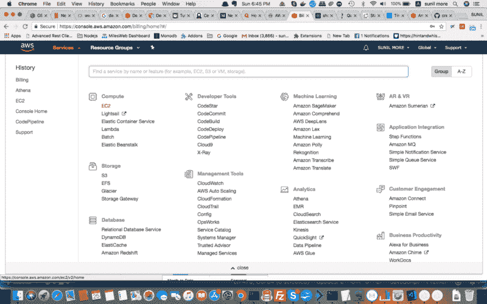
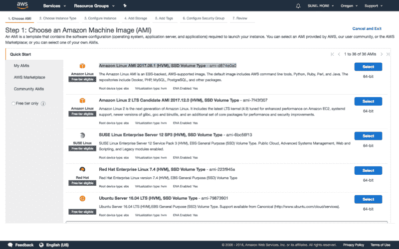
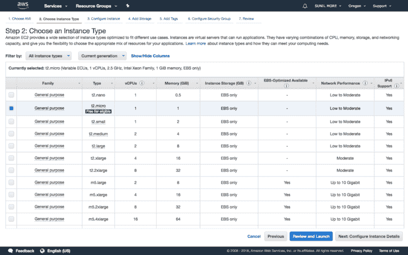
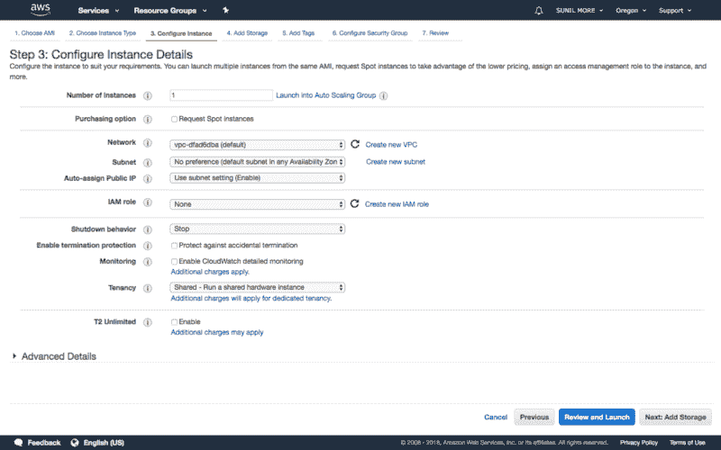
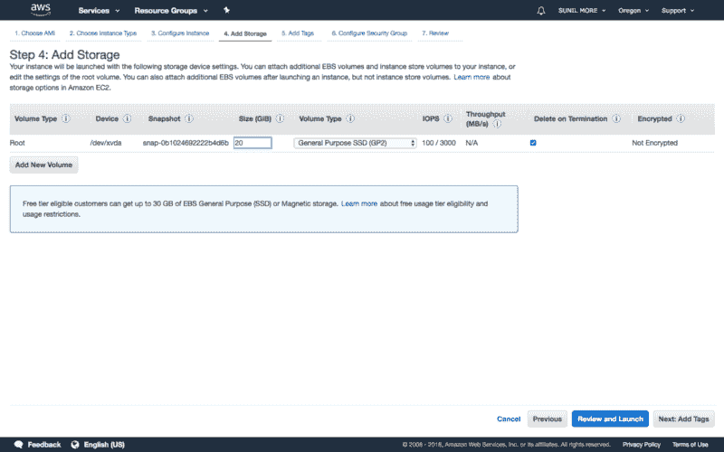
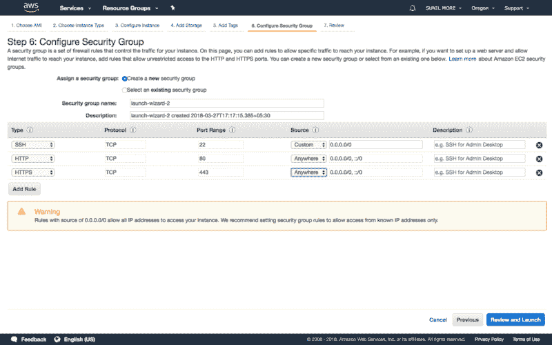
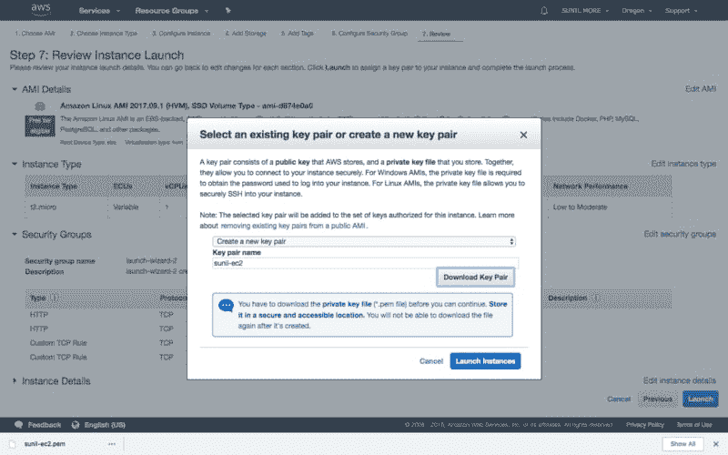
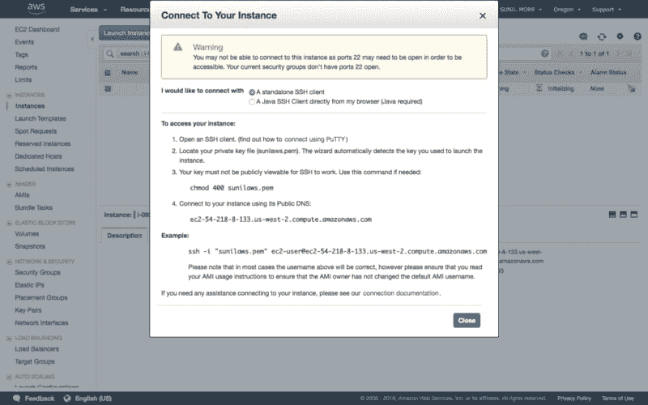
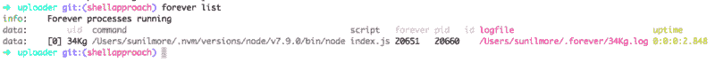
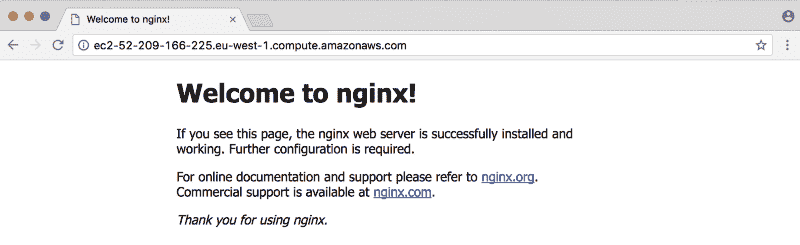

# 在 Amazon ec2 上使用 mongodb 数据库部署 Nodejs 应用程序的完整设置

> 原文：<https://dev.to/sunilmore690/complete-setup-for-deploying-nodejs-app-with-mongodb-database-on-amazon-ec2-3plj>

### [T1】简介](#intro)

运行服务器的方式有很多种，市场上也有大量的云平台可供选择。但是最著名的云平台是亚马逊 Ec2。所以本文打算对在 Amazon EC2 上设置 NodeJs App(如 ExpressJs)给予全面指导。

这些是步骤

1.  从亚马逊 Web 服务启动一个新的 ec2 实例。
2.  设置 SSH 连接以连接 ec2 实例
3.  使用[**nvm**T3】安装 Nodejs](https://github.com/creationix/nvm)
4.  安装 MongoDB 数据库
5.  设置 Nodejs(快速)应用程序

### 步骤 1 #从 [Amazon Web Service 创建一个新的 ec2 实例。](https://aws.amazon.com/)

要创建新实例，您应该在 AWS 上有一个活动帐户。登录 Aws 后

从服务中选择一个 ec2 选项

[](https://res.cloudinary.com/practicaldev/image/fetch/s--wdNG9FEq--/c_limit%2Cf_auto%2Cfl_progressive%2Cq_auto%2Cw_880/https://cdn-images-1.medium.com/max/800/1%2AVs3i4kxZ4WlCm-wR8PpYAA.png)

然后点击**启动实例**按钮，你将进入下面的页面。

[](https://res.cloudinary.com/practicaldev/image/fetch/s--J228mAiz--/c_limit%2Cf_auto%2Cfl_progressive%2Cq_auto%2Cw_880/https://cdn-images-1.medium.com/max/800/1%2AMP4tFrD3qYNoGfWY50unMQ.png)

然后从选项列表中选择一个图像。请根据您的要求选择适合您的图像。所以在我的例子中，我将选择 Amazon Linux。

**注意:**之后，如果您选择的映像不是 Amazon Linux、Centos，一些安装命令可能无法运行。

**接下来**选择实例类型，让我们选择 ***t2.micro*** ，它符合[免费层](https://aws.amazon.com/free/)的条件，因此如果您的帐户不到 12 个月，您可以免费运行您的服务器。感谢亚马逊！

[](https://res.cloudinary.com/practicaldev/image/fetch/s--7GN5T54g--/c_limit%2Cf_auto%2Cfl_progressive%2Cq_auto%2Cw_880/https://cdn-images-1.medium.com/max/800/1%2AP5iugqyzOXTDUqHJ60QVmQ.png)

**接下来**配置实例细节，这是更复杂的步骤，但我们现在可以忽略它。

[](https://res.cloudinary.com/practicaldev/image/fetch/s--Qc5HhU8k--/c_limit%2Cf_auto%2Cfl_progressive%2Cq_auto%2Cw_880/https://cdn-images-1.medium.com/max/800/1%2ABfqS4QUpP4clrUdxzBevag.png)

**接下来**添加存储，默认大小为 8 Gb，但您可以根据需要更新大小，但目前 8gb 已经足够

[](https://res.cloudinary.com/practicaldev/image/fetch/s--gyK2dLqE--/c_limit%2Cf_auto%2Cfl_progressive%2Cq_auto%2Cw_880/https://cdn-images-1.medium.com/max/800/1%2AXB_6HEh1Ygo4oTKEUkebRA.png)

**接下来**添加标签，例如添加键值对，但是现在我们将跳过这一步。标签是有用的，如果你更多的情况下，最好是通过标签搜索

**接下来**配置安全组，在我看来这一步更重要，在这里我们入站(暴露我们的服务器端口)和出站(限制访问其他服务器)

在我们的例子中，要连接 ec2 实例，我们需要打开 **ssh** 端口 22，并公开访问我们的站点，我们需要暴露 **http** 端口 80(当你访问任何网站时，默认情况下它连接到端口 80)并选择选项 **anywhere** 作为源

**入境和出境来源**

1.  我们可以从任何地方访问这个端口
2.  **自定义**仅提供 IP 访问该端口
3.  **我的 IP** 仅访问同一服务器内的该端口

但是你可以根据你的需求开放任何端口，比如为 **ftp** 开放端口 21，为 **https** 开放端口 443

[](https://res.cloudinary.com/practicaldev/image/fetch/s--gWVDIJOF--/c_limit%2Cf_auto%2Cfl_progressive%2Cq_auto%2Cw_880/https://cdn-images-1.medium.com/max/800/1%2A-z8-SNST_ggBSTzZa1lQTQ.png)

**接下来**点击查看并启动，然后你会看到在所有步骤中选择的选项

[](https://res.cloudinary.com/practicaldev/image/fetch/s--v3820sk7--/c_limit%2Cf_auto%2Cfl_progressive%2Cq_auto%2Cw_880/https://cdn-images-1.medium.com/max/800/1%2AWbBZ48CMg0aEx-l3SIj39g.png)

**接下来**点击“Launch ”,然后它会要求创建新的密钥对，这将用于使用 ssh 和这个密钥连接我们的服务器。

下载这个密钥对，然后单击“启动”

[](https://res.cloudinary.com/practicaldev/image/fetch/s--dCoJPKqS--/c_limit%2Cf_auto%2Cfl_progressive%2Cq_auto%2Cw_880/https://cdn-images-1.medium.com/max/800/1%2AuX_oJdrU_9WKYSSD8GLvdQ.png)

### 步骤 2#设置 ssh 连接以连接 EC2 实例

创建实例后，转到该实例。在这个页面中有**连接**按钮，点击这个连接按钮，你就会看到这个模式

[](https://res.cloudinary.com/practicaldev/image/fetch/s--23lWltqn--/c_limit%2Cf_auto%2Cfl_progressive%2Cq_auto%2Cw_880/https://cdn-images-1.medium.com/max/800/1%2AzJ1WQymYdukR5lH6g6GlTg.png)

因此，请按照打开模式时看到的步骤操作。

步骤:

```
> chmod 400 <pem file path>  
> ssh -i <pem file path> <user>@<public DNS> 
```

Enter fullscreen mode Exit fullscreen mode

ec2-user@ec2-54-218-8-133.us-west-2.compute.amazonaws.com

**注意:**在我的例子中，我的 ec2 服务器的用户是**ec2-用户**，因为我选择了**亚马逊 Linux 映像**。因此，在您的情况下，如果您选择了亚马逊机器映像而不是亚马逊 Linux。这是亚马逊图片的默认用户列表。[看到这里](https://alestic.com/2014/01/ec2-ssh-username/)

### 步骤 3#在 ec2 实例上安装节点 Js

在 Linux 实例上设置 Node.js

1.  使用 SSH 以`ec2-user`的身份连接到您的 Linux 实例。
2.  通过在命令行中键入以下内容来安装 33.8 版的节点版本管理器(nvm)的当前版本。

`curl -o- [https://raw.githubusercontent.com/creationix/nvm/v0.33.8/install.sh](https://raw.githubusercontent.com/creationix/nvm/v0.33.8/install.sh) | bash`

我们将使用 nvm 来安装 Node.js，因为 nvm 可以安装多个版本的 Node.js，并允许您在它们之间切换。请参见 GitHub 上的 [nvm repo，了解要安装的当前版本。](https://github.com/creationix/nvm)

1.  通过在命令行键入以下命令来激活 nvm。

`. ~/.nvm/nvm.sh`

1.  通过在命令行键入以下命令，使用 nvm 安装您想要使用的 Node.js 版本。

`nvm install 7.9.0`

1.  通过在命令行中键入以下命令，测试 Node.js 是否已安装并正确运行。

    `node -e "console.log('Running Node.js ' + process.version)"`

这将显示以下消息，确认已安装的 Node.js 版本正在运行。

`Running Node.js v7.9.0`

更多信息，请点击此[链接](https://docs.aws.amazon.com/sdk-for-javascript/v2/developer-guide/setting-up-node-on-ec2-instance.html)

### 步骤 4#在 ec2 实例上安装 Mongodb

我们选择了 **Amazon Image，**我们将使用 **yum** 命令安装 mongodb

步骤:

1.  **配置包管理系统(yum)** 创建一个`/etc/yum.repos.d/mongodb-org-3.6.repo`文件，这样就可以直接安装 MongoDB，使用`yum`。使用以下存储库文件:

```
**[mongodb-org-3.6]**  
name=MongoDB Repository  
baseurl=https://repo.mongodb.org/yum/amazon/2013.03/mongodb-org/3.6/x86_64/  
gpgcheck=1  
enabled=1  
gpgkey=https://www.mongodb.org/static/pgp/server-3.6.asc 
```

Enter fullscreen mode Exit fullscreen mode

1.  **安装 mongodb 包**

    `sudo yum install -y mongodb-org`

2.  **启动 mongodb 服务器**

    `sudo service mongod start`

3.  **检查通过运行下面的命令**启动的 mongodb 服务器

    `mongo`

欲了解更多信息，请访问此[链接](https://docs.mongodb.com/manual/tutorial/install-mongodb-on-amazon/)

### 第 5 步#设置启动 Nodejs 应用程序(快速)

在这一步中，我们将使用 [**mongodb**](https://www.npmjs.com/package/mongodb) 客户端库* *设置一个带有 mongodb 连接的新示例 express 应用程序。

* *根据您的需求，您可以使用 npm 中任何可用的 mongo 库，如[**mongose**](https://www.npmjs.com/package/mongoose)**、***mongojs** 】([https://www.npmjs.com/package/mongojs](https://www.npmjs.com/package/mongojs))等。*

 *首先使用步骤 1 中提供的命令连接到 ec2 实例

`ssh -i <pem file path> <user>@<public DNS>`

然后

```
mkdir SampleExpressApp  
npm init 
```

Enter fullscreen mode Exit fullscreen mode

用下面的代码
创建新文件 *app.js*

```
var express = require("express");  
var app = express();  
var MongoClient = require("mongodb").MongoClient;  

app.get("/", function(req, res) {  
  res.send("Hello World!");  
});  

app.get("/users", function() {  
  MongoClient.connect("mongodb://localhost:27017/test", function(err, db) {  
    if (err) next  
    db  
      .collection("users")  
      .find()  
      .toArray(function(err, result) {  
        if (err) throw err;  

        res.json(result)  
      });  
  });  
});

app.listen(3000,function(){  
    console.log('Express app start on port 3000')  
}); 
```

Enter fullscreen mode Exit fullscreen mode

然后安装 MongoDB & express dependency

```
npm install mongodb --save  
npm install express --save 
```

Enter fullscreen mode Exit fullscreen mode

然后启动服务器

`node app.js`

现在快速应用程序在端口 3000 上启动

然后在浏览器中打开下面的 url

`http://<your public DNS>:3000`

但是如果你关闭这个终端或者你执行 Ctrl+C，服务器将会停止。

因此，在后台启动服务器有多个 NPM 库，但我们将永远使用**来启动服务器。下面是不同的选项

【https://expressjs.com/en/advanced/pm.html】**

使用 npm 在全球范围内永久安装

`npm install -g forever`

启动服务器永远使用

`forever start app.js`

查看永久进程列表

`forever list`

[](https://res.cloudinary.com/practicaldev/image/fetch/s--qZwYS2el--/c_limit%2Cf_auto%2Cfl_progressive%2Cq_auto%2Cw_880/https://cdn-images-1.medium.com/max/800/1%2ATU-6sRZRmJUSYTUSfhPIxw.png)

要查看 Express 服务器日志

`tail -f <logfile path>`

如果您希望将日志存储在预定义的文件中，请使用以下命令启动服务器

`forever start app.js -l /path/to/log/file`

要公开访问此服务器，您必须通过添加入入站规则来打开安全组的端口 3000，正如我们在**步骤 1** 中打开端口一样

公开打开 3000 端口后，点击下面的 url

`http://<your pblic DNs>:3000`
例如:http:**//ec2-0-0-0-0 . us-west-2 . compute . Amazon AWS . com:3000**

但是要在公共域(端口 80)上访问您的应用程序，您必须将端口 80 转发到 3000。

我们有两种方式将端口 3000 转接到 80，你可以选择任何一种。但是我更愿意选择 nginx

1.  iptables
2.  nginx

**iptables**

```
iptables -A INPUT -i eth0 -p tcp --dport 80 -j ACCEPTiptables -A INPUT -i eth0 -p tcp --dport 3000 -j ACCEPTiptables -A PREROUTING -t nat -i eth0 -p tcp --dport 80 -j REDIRECT --to-port 3000 
```

Enter fullscreen mode Exit fullscreen mode

**nginx**

安装 nginx

```
sudo yum install nginx -y

Start nginx Server

sudo service nginx start 
```

Enter fullscreen mode Exit fullscreen mode

要查看 nginx 的启动情况，请在浏览器中输入您的公共 DNS URL

[](https://res.cloudinary.com/practicaldev/image/fetch/s--obIneKIR--/c_limit%2Cf_auto%2Cfl_progressive%2Cq_auto%2Cw_880/https://cdn-images-1.medium.com/max/800/1%2AWfHU-5yYgTNQ4GkcyHUEbw.png)

下一步，将端口 3000 转发到 80

编辑以下 nginx 配置文件

`vi /etc/nginx/nginx.config`

并修改下面的代码

```
location / {  
    root html;  
    index index.html index.htm;  
} 
```

Enter fullscreen mode Exit fullscreen mode

下面有一个

```
location / {  
    proxy_set_header  X-Real-IP  $remote_addr;  
    proxy_set_header  Host       $http_host;  
    proxy_pass        [http://127.0.0.1:3000;](http://127.0.0.1:3000;/)  
  } 
```

Enter fullscreen mode Exit fullscreen mode

重启 ***nginx*** 使新配置生效。

现在访问你的服务器的公共 DNS URL，它应该显示" **hello word"** 作为响应而不是 nginx 欢迎页面

如果仍然不起作用，那么检查 nginx.config 文件，包括另一个配置文件*