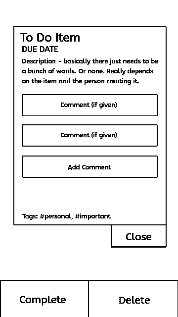

# 完成 Todos #2 -缠结的电线

> 原文：<https://dev.to/justsharkie/completing-the-todos-2-tangled-wires-5522>

欢迎回来！如果你是新来的，我正试着创建一个完美的待办事项 Web 应用程序，因为我喜欢做列表，但没有一个像我希望的那样简单，同时又复杂。

我对写我的项目的博客还很陌生，所以请原谅我！我只是想尝试一下，看看它是否能坚持下去。

(点击找到第一期[！)](https://dev.to/justsharkie/completing-the-todos-1-the-beginning-1jkg)

正如我上次提到的，我是从头开始的——在这种情况下，这意味着线框！我绝对喜欢线框。坐下来研究一个新的设计是如此有趣，即使它非常简单。

证明:

> /* Sharkie *//[@ just Sharkie](https://dev.to/justsharkie)我不知道为什么，但设计线框是我最喜欢的事情之一。
> 
> 我很怪异，我知道，你不用告诉我。2019 年 5 月 14 日下午 14:46

因为我是移动优先设计的坚定信仰者，这就是我的出发点！目前我只有几个页面，包括登陆，一般类别页面和详细信息页面。这只是待办事项详细信息页面的一个小例子:

我其实挺喜欢的。我认为它足够简单，但同时又有足够的可塑性，你可以把它变成你自己的。

如果任何人有任何想法，评论，批评，我很乐意听到他们！这个星期我只有很少的时间来做这件事，所以我还没有达到我希望的程度。但我就要成功了，这才是最重要的！

这个线框是用 InkScape 制作的。