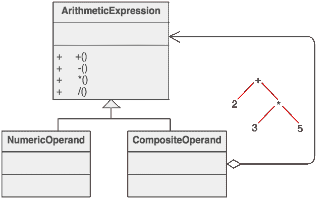

# 复合设计模式[结构]

> 原文：<https://dev.to/itscoderslife/composite-design-pattern-structural-35pa>

此模式可用于创建相关对象的递归树结构，其中任何元素都可以是对象的组合或单个对象。结构中的每个元素都可以以统一的方式访问，而不必知道我们使用的是集合还是叶对象。

*   客户端可以忽略叶对象和组合对象之间的差异，并且在访问组合结构中的元素时只使用一种类型或协议。
*   参与复合的所有类型必须实现相同的接口。这是一个正式的定义。
*   使用复合模式，我们可以表示对象的部分或整体层次结构。
*   我们可以访问元素，而不必知道我们使用的是集合还是叶对象。
*   调用方可以依赖相同的类型或协议来访问复合结构中的元素。

> 复合模式允许相关的单个对象和对象集合被统一处理。

统一对待单个对象和对象集合。使用相同的接口访问元素。

这里有一个来自 [sourcemaking](https://sourcemaking.com/design_patterns/composite) 的例子:

虽然这个例子是抽象的，但是算术表达式是复合的。算术表达式由一个操作数、一个运算符(+–*/)和另一个操作数组成。操作数可以是一个数字，也可以是另一个算术表达式。因此，2 + 3 和(2 + 3) + (4 * 6)都是有效的表达式。

另一个例子是文件管理器目录清单。文件系统中的条目可以是目录或文件。一个目录可以包含目录和文件。这里我们制作了一个文件系统入口接口，并实现了目录和文件类。目录将组成一个文件系统条目数组，这些条目可以是目录也可以是文件。

**总结**:叶子和复合对象必须实现同一个接口，这样才能被统一对待。使用复合模式，我们可以表示对象的部分或整体层次结构。我们可以访问元素，而不必知道我们使用的是集合还是叶对象。调用方可以依赖相同的类型或协议来访问复合结构中的元素。

**常见故障**:在实现复合模式时，您可能面临的一个问题是您的设计可能变得过于一般化。