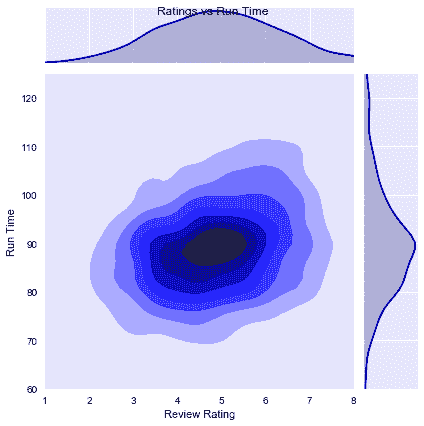
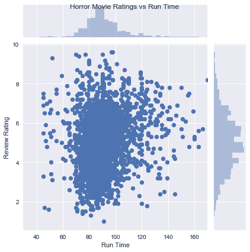
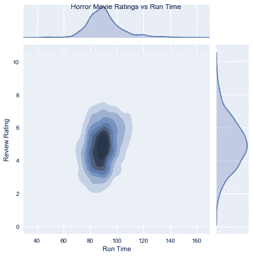
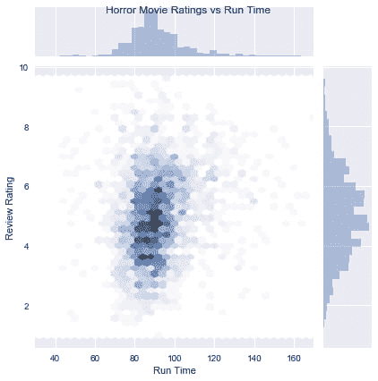
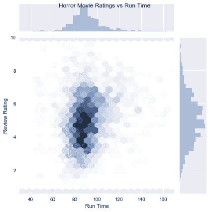

# 浓度检查:KDEs 和 Hexbins

> 原文：<https://dev.to/zmbailey/concentration-check-kdes-and-hexbins-1cn0>

我们都知道直方图对于显示单个变量的分布很有用，但事实证明，我们也可以使用六进制箱柜和多元 KDE 图来查看两个变量的类似直方图的分布。在我们比较这两种类型的图之前，了解每种类型的工作原理是很重要的。它们都类似于散点图，并且它们都绘制了对应于 2 个轴的点的密度。但是它们有一些重要的区别。多元 KDE 图显示了密度梯度，而六边形图显示了特定区域密度之间的更多区别。因此，让我们从每种类型的情节本身开始。

多元 KDE 图

KDE 代表核密度估计，正常的 KDE 图类似于直方图，只有一个数据变量。它还用于可视化单个变量的分布，但 KDE 显示的是一条连续、平滑的圆形线，近似于直方图的形状，而不是将数值范围的体积显示为一系列不同的条形或“条柱”。

多元 KDE 显示了图表中各点的密度，这些点位于用于绘制散点的同一轴上。通过这种方式，多元 KDE 更像散点图而不是直方图，但它的功能与散点图不同，有助于观察数据中的其他趋势。MKDE 图不关心绘制单个点，相反，它更关心这些点在图中的分布。它显示了数据点所在区域的颜色渐变，较亮的区域表示这些区域中数据点的密度较低，较暗的区域表示数据点的密度较高。这是很有用的，因为在散点图上有许多非常接近的数据点，有时您会看到一个实心的点团，并且很难辨别单个区域中数据点的数量。它有助于理解散点图上出现的较大数据集，并了解数据在哪里更紧密地压缩。

###### 一个散点图，描述了过去 7 年恐怖电影的分级，并与它们的播放时间进行了比较。来自 IMDB 的电影数据。

###### KDE 地块上的相同数据。

在 KDE 图上，你可以看到有很多很多的点集中在一个区域，即使在散点图上看起来是均匀的。这也是一种简单的方法，可以在看起来更分散的图上显示数据的集中程度。

十六进制箱

乍一看，十六进制箱柜图似乎非常类似于 KDE，实际上它们起着类似的作用。十六进制框还显示散点图轴上数据的密度和分布。同样，它也用浅色和深色来表示注意力的集中或缺乏。但是一个六边形的箱子显示了更多不同的集中区域。在某些方面，十六进制容器就像从顶部看直方图，高的柱看起来更暗，矮的柱看起来更亮。但是每个六边形都是一个“仓”,而不是列，因此称为 Hex-Bin。与 KDE 图相比，这里的优势在于，使用十六进制箱，您可以更容易地显示特定点的浓度，而不是总体梯度。像直方图一样，六边形可以调整大小以扩大或缩小数据范围。

###### 用更大的六边形绘图

###### 用非常大的六边形绘制

在这里，我们可以看到一个六边形图，六边形越来越大，这改变了数据集中的排列方式。较小的六边形有更多的单个密度点，相邻六边形之间有更多的对比。在具有中等六边形的图上，分布看起来更平滑，接近与多变量 KDE 图相似的外观。但是，当我们进一步增加六边形的尺寸时，密度从一个六边形到下一个六边形的下降变得更加剧烈，我们可以看到最高浓度现在只在一个或两个六边形中。

目的

这两种类型的图对于查看两个轴上的数据集中的位置都很有用。与直方图的比较出现了多次，这是有充分理由的。直方图显示数据在一个轴上的分布，显示更多或更少的数据点落入的范围。十六进制箱和多变量 kde 可视化一个类似的概念，但是跨越两个轴。KDE 更有助于使用更具地形特征的方法显示整体区域或集中区域，而六边形箱可以使用六边形将区域划分为更小的六边形来聚焦更具体的浓度。因此，尽管看起来非常相似，但这两种类型的地块可以各有各的用途。