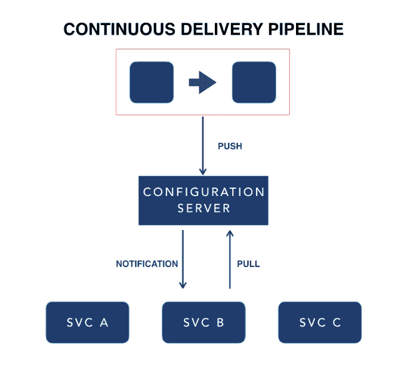

# 持续交付微服务的配置策略

> 原文：<https://dev.to/gocd/configuration-strategy-for-continuous-delivery-of-microservices-5a26>

这是系列的第五篇帖子——[持续交付微服务](https://www.gocd.org/tags/cd-for-microservices.html)。在[的上一篇文章](https://www.gocd.org/2018/06/12/cd-microservices-environment-strategy/)中，我们谈到了环境策略——包括人工制品的推广和利用现代基础设施构建动态环境的方法。在本帖中，我们将讨论配置策略。

## 简介

应用程序的配置是跨部署环境(如开发、测试和生产)可变的一切。部署相同的代码，但是切换出某些方面(比如到后台服务的 URL、数据库连接信息、到第三方服务的凭证等。)是我在这个上下文中所说的变量的例子。这种配置应该与应用程序代码分开存储。

在基于微服务架构的系统中，配置还需要跨多个服务分布。以分布式方式管理配置有两种方法:*在部署时使配置在环境变量中可用，*使用设计用于公开配置的外部配置服务器产品

对于您的微服务配置策略，您应该考虑以下三点:

## 1:集中管理应用配置

外部配置服务器是更适合管理应用程序配置的系统，它引入了更清晰的关注点分离。

配置管理代码(在 chef 或 puppet 中)可以单独负责集群管理。使用 Chef，更新应用程序配置将需要缓慢的集群收敛操作。使用外部配置服务器，应用程序配置的更新可以更加动态，而无需更新基础架构的任何其他方面。

这种方法的另一个额外的优点是，它强制按照应用程序和环境组织配置的一致实践。

有许多专门构建的外部配置服务器可供您考虑。Spring 云配置服务器是 Spring 应用程序的一个好选择。有了对多个后端的支持，您可以与行业标准的 KV 商店集成，例如针对非敏感配置的[consult](https://www.consul.io)，以及针对敏感配置的 [Vault](https://www.vaultproject.io/) 。

## 2:配置分发的标准流程

对于微服务系统，系统中可能有不同的技术堆栈。如果对不同的堆栈采用不同的配置方式，那么复杂性将变得难以管理。因此，无论微服务的技术体系如何，都应该以标准的方式将配置分发到节点。

我们使用的一种技术是按照[十二因素应用](https://12factor.net/)方法将配置作为环境变量提供。根据经验，总是避免分发配置文件。

十二要素应用是一个宣言，提供了一些在构建云原生应用时要遵循的准则。这些指导方针让您能够构建云友好的应用程序。为了真正利用云环境的优势，应用程序需要接受云概念，例如弹性可伸缩性、可独立部署和操作的服务以及无状态。

## 3:围绕秘密的施政方针

需要安全地访问 API 密钥、密码和证书等秘密。您需要一个治理流程来确保机密访问得到适当的管理。我们推荐的一种存储所有秘密的技术是中央秘密存储器。中央外部配置服务器可以提供这种能力。

这个中央存储为您提供了策略更改方式和时间的可追溯性。这种可追溯性对建立治理过程大有帮助。

我们推荐的一个储存秘密的工具是 Hashicorp 的 [Vault](https://www.vaultproject.io/) 。

**举例:**

这是一个架构示例，其中配置集中存储在配置服务器中，由 CD 管道更新，并推送到服务实例。

顶部是 CD 管道的抽象。这将更新配置服务器，然后来自配置服务器的配置被推送到服务实例。在运行时，服务实例知道如何使用这个配置。当建立这样的架构时，您需要考虑应该有多少配置服务器。我们建议每个 CD 环境都有一个配置服务器，或者至少一个用于生产环境，一个用于所有其他环境。

## 总结

这是我们微服务博客系列的 [CD 的第 5 部分。我们已经讨论了您的 CD 管道的配置策略。在下一篇文章中，我们将讨论最后一个考虑因素:出现问题时的补救策略。](https://www.gocd.org/tags/cd-for-microservices.html)