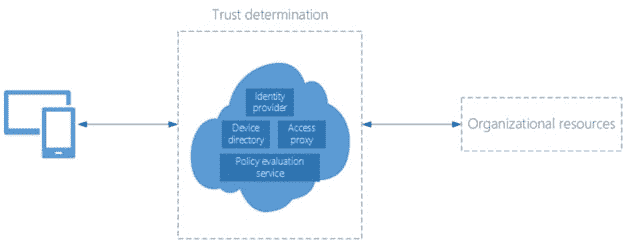
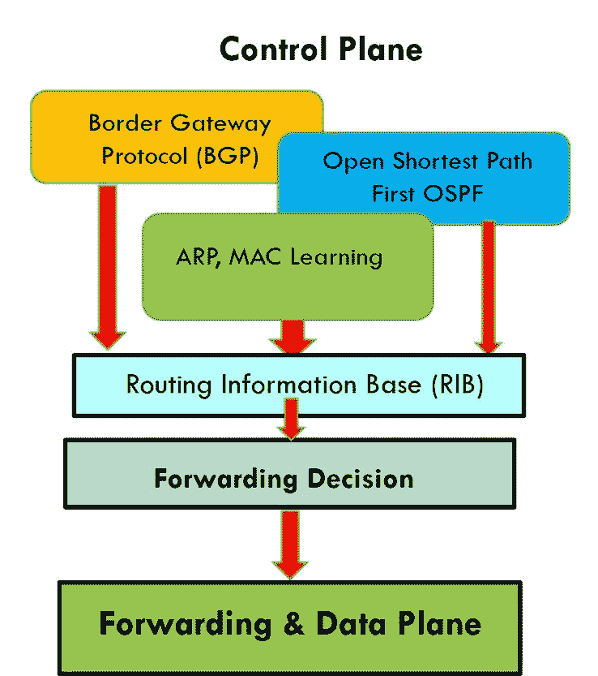
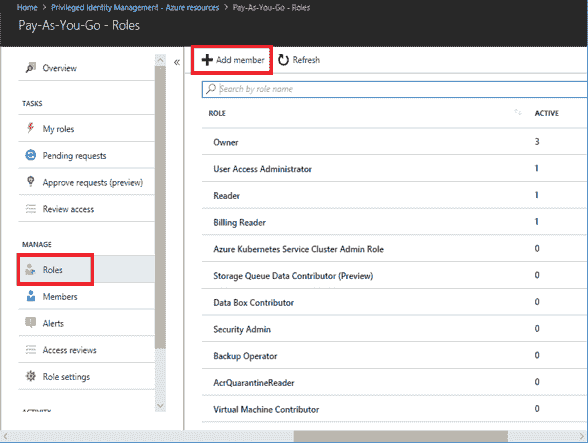
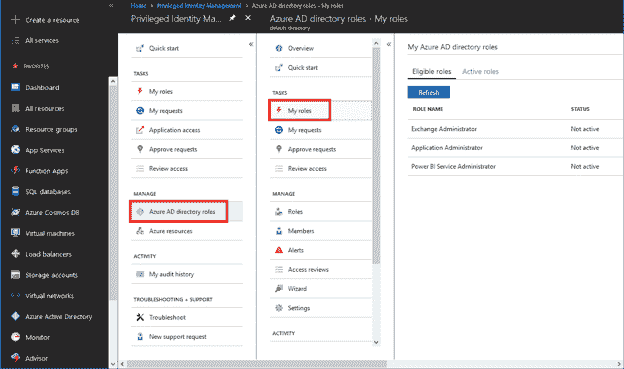
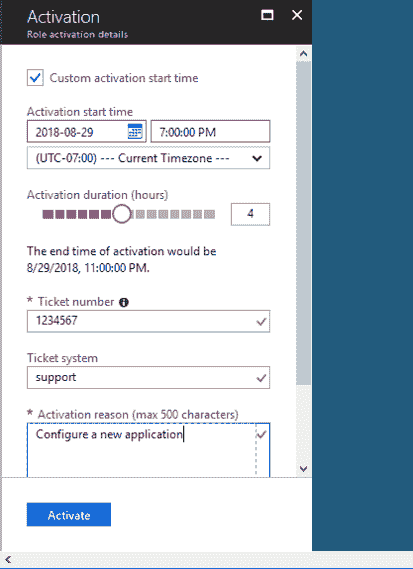
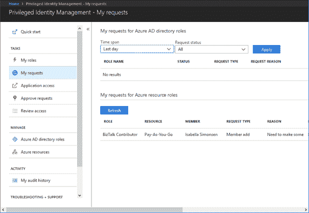

# 配置 Azure AD 特权身份管理

> 原文：<https://dev.to/cheahengsoon/configure-azure-ad-privileged-identity-management-4p92>

**零信任模型**

*   零信任模型声明从不假设信任，而是不断验证信任
*   随着大多数用户现在从互联网访问应用和数据，大多数交易组件不再受组织控制
*   信任确定组件包括:
    *   身份提供者
    *   设备目录
    *   政策评估服务
    *   访问代理
*   身份即服务(IDaaS)—新的控制平面
*   我们的身份就像一个控制平面，因为它控制着:
    *   我们与哪些协议交互
    *   我们可以访问哪些组织的计划
    *   我们可以使用什么设备来访问它们

**身份管理**

**Azure AD 特权身份管理**

*   Azure AD PIM 是一项服务，使您能够管理、控制和监控对组织中重要资源的访问
*   PIM 的主要功能允许您:
    *   提供对 Azure AD 的即时特权访问
    *   分配对资源的限时访问
    *   需要批准才能激活特权角色
    *   为角色激活实施多因素身份验证(MFA)
    *   使用理由来理解用户激活角色的原因
    *   当特权角色被激活时获得通知
    *   进行访问检查以确保用户仍然需要角色
    *   下载审计历史

**配置 PIM**

*   第一个在 Azure AD 实例中使用 PIM 的人会被自动分配目录中的安全管理员和特权角色管理员角色
*   只有特权角色管理员可以管理用户的 Azure AD 目录角色分配
*   要开始在您的目录中使用 PIM，您必须首先使用 Azure 门户启用 PIM

**激活角色**

*   启用 PIM 后，当需要执行特权操作时，必须激活特权操作
*   您可以使用 PIM 中的“我的角色”导航选项请求激活
*   如果角色不需要批准，它将被激活并添加到活动角色列表中
*   定义 PIM 角色后，您可以开始向这些角色添加用户

[T6】](https://res.cloudinary.com/practicaldev/image/fetch/s--LU9oAjGY--/c_limit%2Cf_auto%2Cfl_progressive%2Cq_auto%2Cw_880/https://thepracticaldev.s3.amazonaws.com/i/l0e9k72ak4h2jexgfgm1.png)

**监控您的请求状态**

*   您可以查看激活特权角色的待定请求的状态
*   要管理请求状态，您应该:
    1.  开放 Azure AD 特权身份管理
    2.  单击我的请求
    3.  向右滚动以查看请求状态列

**提醒:**
网络安全不仅仅是网络安全，还包括应用安全和云安全。