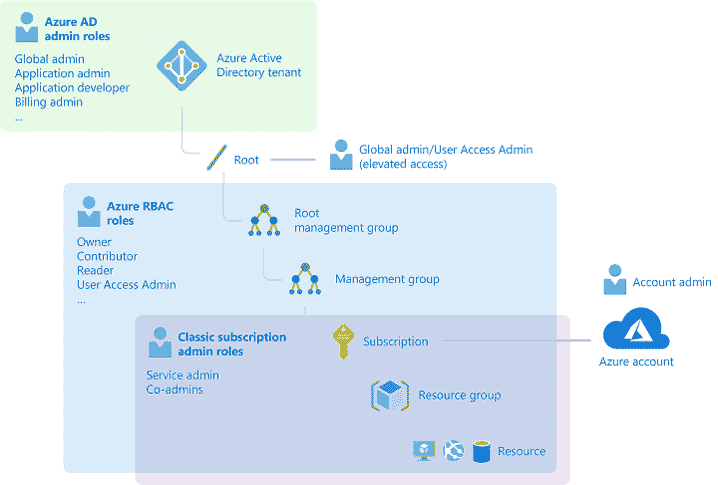
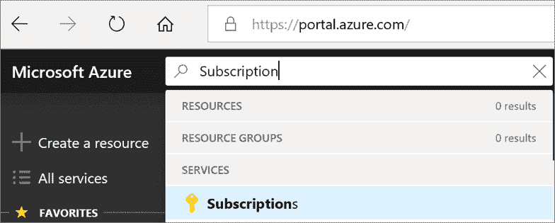
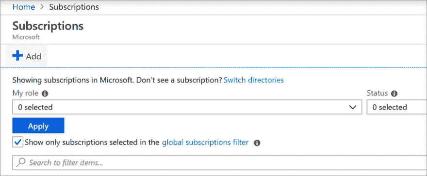
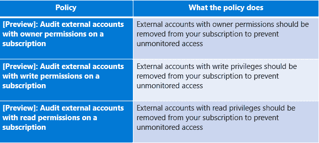
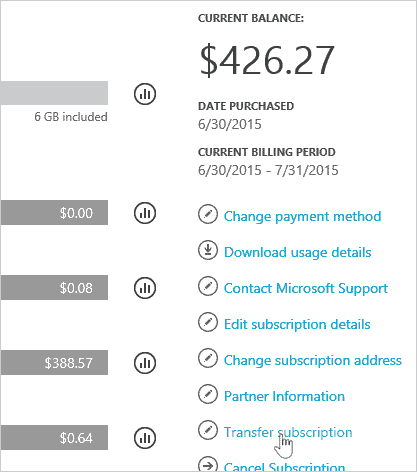

# 为 Azure 订阅配置安全性

> 原文：<https://dev.to/cheahengsoon/configure-security-for-an-azure-subscription-4kbi>

**配置自定义 Azure RBAC**

*   当大多数组织考虑使用公共云时，他们会关注两件事:
    *   确保当人们离开组织时，他们无法访问云中的资源
    *   在自治和中央治理之间取得恰当的平衡
*   Azure AD 和 RBAC 让你轻松实现这些目标

**配置订阅和资源权限**

*   你可以在 Azure 中为你的帐户创建更多订阅
*   要根据贵组织的企业协议(EA)创建 Azure 订阅，您必须拥有贵组织的帐户所有者角色 

**识别具有 Azure 管理访问权限的外部帐户**

*   Azure Security Center 是一个统一的基础架构安全管理系统，可增强您的数据中心的安全状况，并为您的混合工作负载提供高级威胁防护
*   Azure Policy 是 Azure 中的一项服务，用于创建、分配和管理策略

**在 Azure AD 租户之间转移 Azure 订阅**

*   通常，大型组织会将 Azure 订阅分配给公司的各个业务部门
*   有时，组织需要在所有者和 Azure AD 租户之间转移订阅
*   Azure 提供了一个转移 Azure 订阅所有权的过程

**管理对 Azure 订阅和资源的 API 访问**

*   当您通过 Azure API 管理发布 API 时，通常会使用订阅密钥来保护对这些 API 的访问
*   需要使用已发布 API 的客户端应用程序在调用这些 API 时，必须在 HTTP 请求中包含有效的订阅密钥
*   API 管理还支持保护 API 访问的其他机制，包括以下示例:OAuth 2.0
    *   客户端证书
    *   IP 白名单