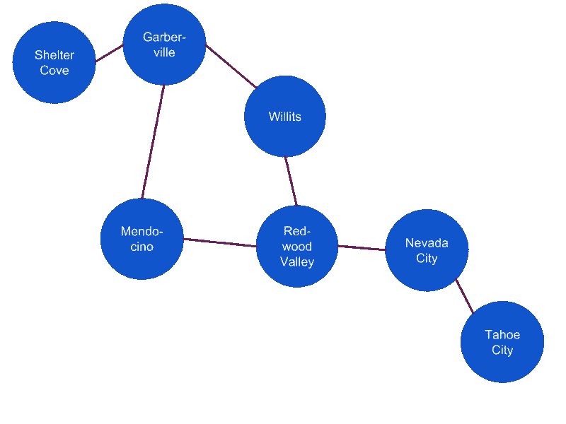
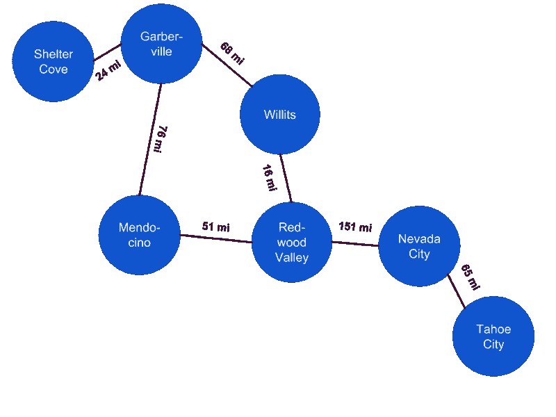

# 连接加州图上的城市

> 原文：<https://dev.to/eveporcello/connecting-cities-on-the-california-graph-1h1a>

2018 年我最喜欢的回忆之一是徒步迷失海岸小径。几天的背包旅行把我们带到了崎岖的加利福尼亚海岸线上，观看令人难以置信的日落，给海豹拍照，吃袋子里的食物。开车去 trailhead 花了大约六个小时，几乎没有使用一条主要的高速公路。当蜿蜒的双车道公路在全州的小镇间划出一道道线时，我意识到我不仅仅是在穿越加利福尼亚州。哦，不…我离开了工作，但又一次，我在遍历一个图表。

图是表示一组相互连接的对象的正式方式。我们可以用一个图表来表示去失落海岸旅行中的城市以及它们之间的联系。下图描述了整个旅程，并将其表示为节点(数据点)和边(节点之间的连接)的集合:

[](https://res.cloudinary.com/practicaldev/image/fetch/s--uOG40MIV--/c_limit%2Cf_auto%2Cfl_progressive%2Cq_auto%2Cw_880/https://moonhighway.com/static/d234e2f607a239c7a5d4e1ad705d2970/39bb6/city-to-city-diagram.png)

要用 GraphQL 描述这些城市之间的关系，我们可以从考虑数据开始。我们将创建一个包含代表城市的对象的数组:

```
var connectedCities = [
  { from: 'Tahoe City', to: 'Nevada City' },
  { from: 'Nevada City', to: 'Redwood Valley' },
  { from: 'Redwood Valley', to: 'Willits' },
  { from: 'Willits', to: 'Garberville' },
  { from: 'Garberville', to: 'Shelter Cove' },
  { from: 'Garberville', to: 'Mendocino' },
  { from: 'Mendocino', to: 'Redwood Valley' },
] 
```

数组中的每个对象描述一条边。它代表一条从一个城市到另一个城市的线。从那里，我们可以通过为一个`City`创建一个类型来建模这个数据。城市应该有一个`name`。它还应该有一个名为`connections`的字段，返回与之连接的城市列表。我们的模式应该是这样的:

```
type  City  {  name:  String!  connections:  [City!]!  }  type  Query  {  allCities:  [City!]!  } 
```

要查询数据，可以执行以下查询:

```
query  {  allCities  {  name  connections  {  name  }  }  } 
```

这是一个好的开始，但在每次公路旅行中，了解从一个城市到另一个城市有多远是非常重要的。我们需要找到一种方法来表示城市之间的距离，如图所示:

[](https://res.cloudinary.com/practicaldev/image/fetch/s---jxZK448--/c_limit%2Cf_auto%2Cfl_progressive%2Cq_auto%2Cw_880/https://moonhighway.com/static/452f0c7e1ebee39ad412407b2f14daad/39bb6/city-to-city-connection-distances.png)

现在，城市之间的边缘或连接变得更加复杂。现在，每个连接都包含关于两个城市之间距离的数据。为了反映这个维度，我们将调整模式以包含另一种类型，Connection:

```
type  City  {  name:  String!  connections:  [Connection!]!  }  type  Connection  {  distance:  Int!  to:  City!  } 
```

`Connection`类型提供城市间距离的信息。现在，如果我们开始遍历太浩城的图表，我们可以确定太浩城与内华达城相连，两个城市之间的距离为 65 英里。这种类型的连接通常被称为通过类型的**或连接对象**的**。**

数据也应更新以包括距离:

```
var distances = [
  { from: 'Tahoe City', to: 'Nevada City', distance: 65 },
  { from: 'Nevada City', to: 'Redwood Valley', distance: 151 },
  { from: 'Redwood Valley', to: 'Willits', distance: 16 },
  { from: 'Willits', to: 'Garberville', distance: 68 },
  { from: 'Garberville', to: 'Shelter Cove', distance: 24 },
  { from: 'Garberville', to: 'Mendocino', distance: 76 },
  { from: 'Mendocino', to: 'Redwood Valley', distance: 51 },
] 
```

当我执行`allCities`查询时，应该会返回一个城市列表，这个城市所连接的一个或多个城市，以及它们之间的距离。

`Connection`对象允许我们定义城市之间的关系，其中边有与之相关的数据:距离和城市。在数据连接超出返回标量或列表的字段的情况下，创建一个连接对象对于确保返回正确的数据非常有用。

图表无时无刻不在我们身边，甚至在假期也是如此。幸运的是，GraphQL 的灵活性允许我们建模任何我们想要的数据关系。

要查看该示例的代码，请访问 CodeSandbox:

[](https://codesandbox.io/s/1wqpz240wl?fontsize=14)