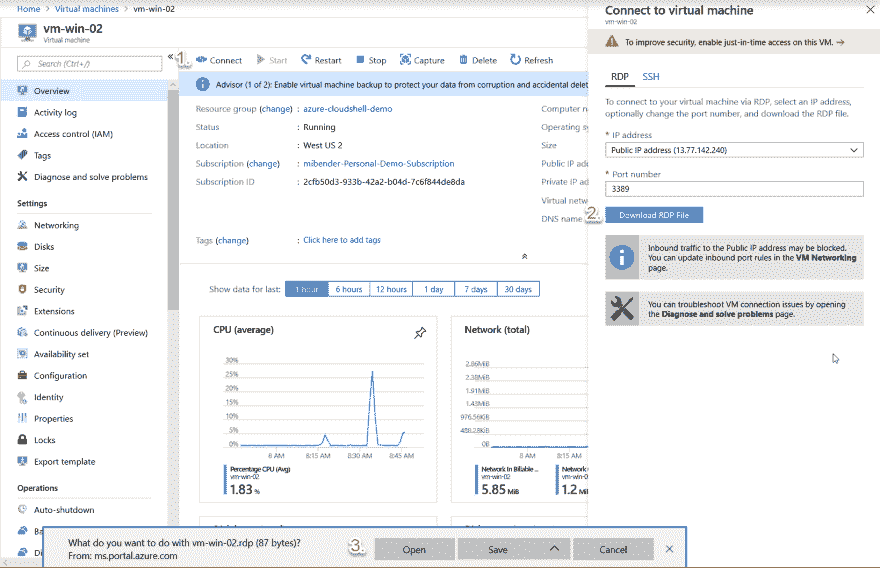

# 在 Azure 中连接到 Windows 和 Linux 虚拟机

> 原文：<https://dev.to/azure/connecting-to-windows-and-linux-vms-in-azure-288f>

*我们选择了由[迈克尔·克伦普](https://twitter.com/mbcrump)创造的我们最喜欢的技巧和诀窍，并在整个四月在 Azure 上提供新的技术内容！错过一天(或更多)？[赶上系列](https://dev.to/t/azureapril)。*

**没有天蓝色？** [抢免费订阅](https://azure.microsoft.com/en-us/free?&WT.mc_id=azureapril_devto-blog-cxa)。

当你将虚拟机部署到 Azure 时，很有可能你需要连接到它们。这可以通过门户以及 Azure Cloud Shell 中的命令行来完成。

## 连接到门户中的 Windows 虚拟机

通过门户访问 Windows 虚拟机非常简单。您浏览到合适的虚拟机，并选择*连接*。这将为您的虚拟机下载一个 RDP 客户端配置文件。启动后，您将连接到您的虚拟机。

[](https://res.cloudinary.com/practicaldev/image/fetch/s--kpayij06--/c_limit%2Cf_auto%2Cfl_progressive%2Cq_auto%2Cw_880/https://thepracticaldev.s3.amazonaws.com/i/wao44h0x5j70pg4m5mos.png)

## 使用 PowerShell 连接到 Windows 虚拟机

但是假设你想在 Azure 云壳中使用 PowerShell 连接？没问题。只需在 Azure Cloud Shell 中打开 PowerShell，并遵循以下流程:

#### - 1 -在虚拟机上启用 Azure PSRemoting。

这将打开网络安全组中的必要端口，并确保 WinRM 正在虚拟机上运行。这个命令也适用于使用 SSH 的 Linux 虚拟机。

```
 PS  Azure:\>  Enable-AzVMPSRemoting  -Name  'vm-win-01'  -ResourceGroupName  'azure-cloudshell-demo'  -Protocol  https  -OsType  Windows 
```

#### - 2 -使用`Enter-AzVm`连接到虚拟机

使用`Enter-AzVm` cmdlet，可以启动与单个 Azure VM 的交互会话。在会话期间，您键入的命令在 Azure VM 上运行，就像您直接在 Azure VM 的 PowerShell 控制台上键入一样。这非常适合那些实时的特别场景。

```
 PS  Azure:\>  Enter-AzVM  -name  'vm-win-01'  -ResourceGroupName  'azure-cloudshell-demo'  -Credential  (get-credential) 
```

#### - 3 -用`Invoke-Command`在远程机器上执行一个代码块

此 cmdlet 允许您针对远程系统运行命令和脚本块。有时称为“扇出远程处理”，它允许您执行一对多远程处理，允许您执行任务，比如让 Windows 服务在一个或多个系统上运行。这种工具最适用于不需要提供连续输入的情况，比如在 shell 中运行命令时。

```
 PS  Azure:\>  Invoke-AzVMCommand  -Name  'vm-win-01'  -ResourceGroupName  'azure-cloudshell-demo'  -ScriptBlock  {get-service  win*}  -Credential  (get-credential) 
```

#### - 4 -禁用 Azure PSRemoting

一个重要的注意事项是，这种方法依赖于您的虚拟机具有公共 IP 地址和向您的虚拟机开放的端口；它对私人 IP 不起作用。这意味着 SSH 和 WinRM 是开放端口。要解决这个问题，只要在使用完`Disable-AzVMPSRemoting`后关闭它们即可。

```
 PS  Azure:\>  Disable-AzVMPSRemoting  -Name  vm-win-02  -ResourceGroupName  azure-cloudshell-demo 
```

执行时，cmdlet 将

*   从网络安全组中删除端口
*   对于 Windows 虚拟机，从 Windows 虚拟机中删除 PowerShell 远程处理并重置 UAC
*   对于 Linux 虚拟机，恢复到原始的 SSH 守护进程配置并重新启动 sshd 服务来选择配置

这就是你在 Azure Cloud Shell 中使用 Powershell 连接 Azure 虚拟机所需要的一切。

## 连接到 Linux 虚拟机

对于 Linux 虚拟机，选择非常简单:使用 CLI。为此，您浏览到合适的虚拟机并选择*连接*。从菜单中，使用虚拟机本地帐户字符串将*登录复制到 Azure Cloud Shell，Bash 或 PowerShell 都可以，以连接到虚拟机。* 

```
 Azure:/
PS Azure:\> ssh michael@vm-linux-02.westus2.cloudapp.azure.com
Warning: Permanently added the ECDSA host key for IP address '13.66.200.165' to the list of known hosts.
Enter passphrase for key '/home/michael/.ssh/id_rsa':
Welcome to Ubuntu 18.04.2 LTS (GNU/Linux 4.18.0-1014-azure x86_64)

 * Documentation:  https://help.ubuntu.com
 * Management:     https://landscape.canonical.com
 * Support:        https://ubuntu.com/advantage

  System information as of Thu Apr 11 10:46:28 UTC 2019

  System load:  0.24              Processes:           121
  Usage of /:   9.1% of 28.90GB   Users logged in:     0
  Memory usage: 11%               IP address for eth0: 10.1.0.5
  Swap usage:   0%

 * Ubuntu's Kubernetes 1.14 distributions can bypass Docker and use containerd
   directly, see https://bit.ly/ubuntu-containerd or try it now with

     snap install microk8s --classic

  Get cloud support with Ubuntu Advantage Cloud Guest:
    http://www.ubuntu.com/business/services/cloud

 * Canonical Livepatch is available for installation.
   - Reduce system reboots and improve kernel security. Activate at:
     https://ubuntu.com/livepatch

18 packages can be updated.
0 updates are security updates.

Last login: Tue Apr  9 02:51:07 2019 from 104.42.62.28
To run a command as administrator (user "root"), use "sudo <command>".
See "man sudo_root" for details.

michael@vm-linux-02:~$ 
```

从上面可以看到，这个命令可以在 PowerShell 中的 Azure Cloud Shell 中运行，也可以在 Bash 中运行。这是一个很棒的特性，也是我推荐在 Azure Cloud Shell 中使用 PowerShell 的原因之一

仅此而已。现在，您可以连接到 Azure 中的所有虚拟机！

想要 Azure 云壳中更多的 PowerShell？查看我们的[快速入门和教程](https://docs.microsoft.com/en-us/azure/cloud-shell/quickstart-powershell?WT.mc_id=azureapril_devto-blog-cxa)！

* * *

我们将在 4 月份每天发布文章，所以请继续关注或提前查看更多提示和技巧[现在](http://azuredev.tips)。