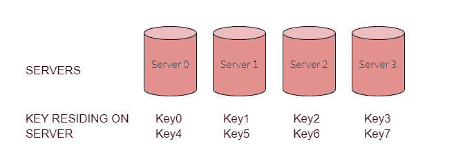
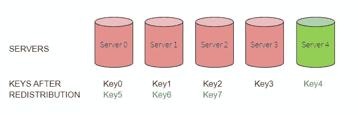
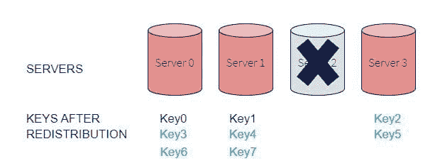
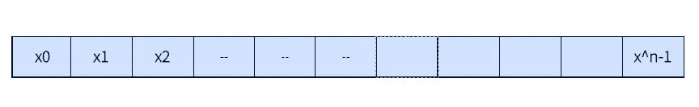
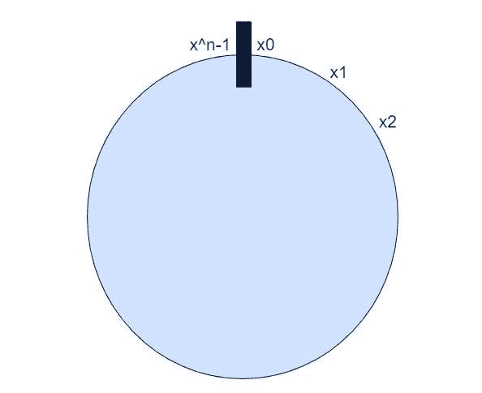
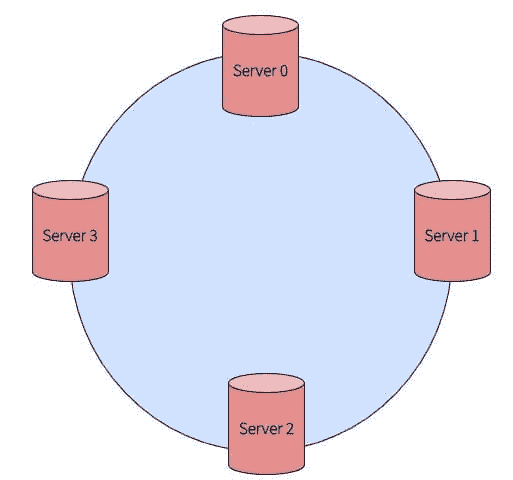
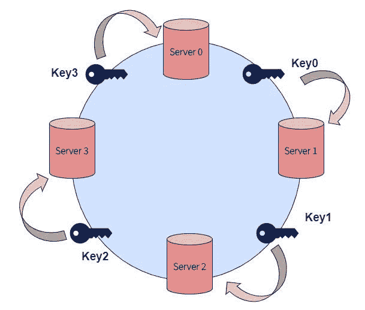
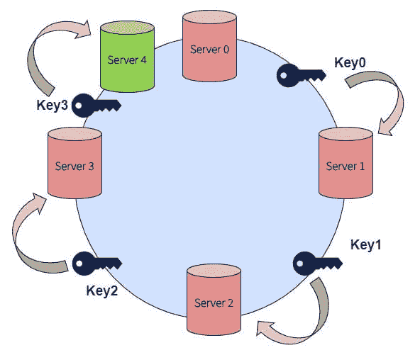
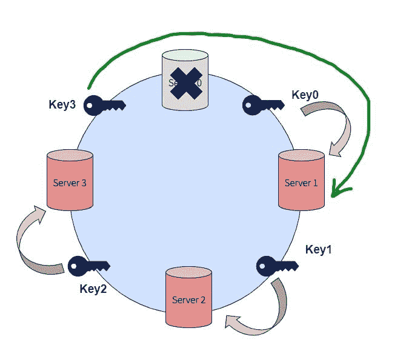
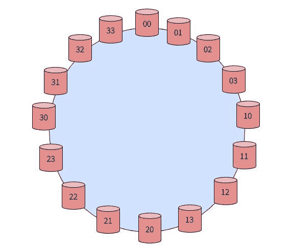

# 简化的一致散列法

> 原文：<https://dev.to/rohitpatil5/consistent-hashing-simplified-44lb>

### 分布式系统问题:-

***我们希望根据使用负载动态添加/移除缓存服务器。*T3】**

因为这些是缓存服务器，所以我们有一组键和值。这可能是 Memcached、Redis、Hazelcast、Ignite 等。

这种设置由一个缓存服务器池组成，该池托管许多键/值对，用于提供对最初存储(或计算)在其他地方的数据的快速访问。例如，为了减少数据库服务器上的负载，同时提高性能，可以将应用程序设计为首先从缓存服务器获取数据，只有当数据不在那里时(这种情况称为*缓存未命中*)，才求助于数据库，运行相关查询并用适当的关键字缓存结果，以便下次需要时可以找到它。我们希望将密钥分布在服务器上，这样我们就可以再次找到它们。

我们的目标是设计一个系统，以便:

1.  我们应该能够在“n”台服务器中均匀地分发密钥。
2.  我们应该能够动态地添加或删除服务器。
3.  当我们添加/删除服务器时，我们需要在服务器之间移动最少量的数据。

这是最简单的方法

1.  从传入的数据生成密钥的哈希。例如，在 python 中，我们会使用散列函数。

```
hashValue = hash(key) 
```

1.  通过使用当前服务器的数量(n)取 data 值的模，找出要将数据发送到的服务器:

```
serverIndex = hashValue % n 
```

现在考虑以下场景:-

*   假设我们有 4 台服务器
*   假设我们的散列函数返回一个从 0 到 7 的值
*   我们假设“key0”在通过我们的散列函数时，生成一个散列值或 0，“key1”生成 1，依此类推。
*   “key0”的 serverIndex 是 0，“key1”是 1，依此类推。

假设密钥数据均匀分布的情况如下图所示。我们收到 8 条数据，我们的哈希算法将它均匀地分布在我们的四台数据库服务器上。

[](https://res.cloudinary.com/practicaldev/image/fetch/s--Ri62-ojv--/c_limit%2Cf_auto%2Cfl_progressive%2Cq_auto%2Cw_880/https://cdn-images-1.medium.com/max/686/1%2AGPaE8st5PCsM3yljFULzGw.jpeg) 

<figcaption>***跨 4 台服务器分片数据***</figcaption>

问题解决了，对吧？不尽然——这种方法有两个主要缺点，即**水平可伸缩性**和**跨服务器的非均匀数据分布**。

#### 水平可扩展性:-

上述方案不是水平可扩展的。如果我们在集合中添加或删除服务器，所有现有的映射都会被破坏。这是因为计算 serverIndex 的函数中“n”的值发生了变化。结果是所有现有的数据都需要重新映射并迁移到不同的服务器上。这可能是一项艰巨的任务。

让我们看看当我们将另一台服务器(server4)添加到原来的服务器池时会发生什么。请注意，我们需要更新原来 4 台服务器中的 3 台，这意味着 75%的服务器需要更新。

[](https://res.cloudinary.com/practicaldev/image/fetch/s--L_nxo7fG--/c_limit%2Cf_auto%2Cfl_progressive%2Cq_auto%2Cw_880/https://cdn-images-1.medium.com/max/715/1%2ALGO2Fhv50XKxcK8LA5OqYA.jpeg) 

<figcaption>***向集群添加新服务器并重新分配密钥的效果***</figcaption>

如下所示，当服务器停机时，影响会更加严重。在这种情况下，我们需要更新所有的服务器。

[](https://res.cloudinary.com/practicaldev/image/fetch/s--nxmt_yap--/c_limit%2Cf_auto%2Cfl_progressive%2Cq_auto%2Cw_880/https://cdn-images-1.medium.com/max/627/1%2A45Yqak6sZHWnnUaRy72q7w.jpeg) 

<figcaption>***从集群中移除服务器的效果以及密钥的重新分配***</figcaption>

#### 数据分布—避免集群中的“数据热点”:

我们不能期望所有时间都有均匀分布的数据。与其他服务器相比，可能有更多的键的 case 值映射到服务器 1，在这种情况下，服务器 1 将成为键的热点。

> 一致散列允许 up 解决这两个问题。

### 一致哈希到底是什么？

那么，这个问题怎么解决呢？我们需要一个分布方案，它不直接依赖于服务器的数量，这样，当添加或删除服务器时，需要重新定位的键的数量被最小化。一致散列有助于在一组节点之间分发数据，从而在添加或删除节点时最大限度地减少数据的重新映射/重组。它是这样工作的:

一致散列是一种分布式散列方案，它通过在*散列环*上给服务器或对象分配一个位置，独立于分布式*散列表*中的服务器或对象的数量进行操作。这允许服务器和对象在不影响整个系统的情况下进行扩展。它是这样工作的:

1.  **创建散列密钥空间:**假设我们有一个散列函数，它生成范围为[0，2-1]的散列值。我们可以将它表示为一个 2 -1 槽的整数数组。我们将第一个槽称为 x0，最后一个槽称为 x<sup>n-1。</sup>

[](https://res.cloudinary.com/practicaldev/image/fetch/s--rTVkvRoD--/c_limit%2Cf_auto%2Cfl_progressive%2Cq_auto%2Cw_880/https://cdn-images-1.medium.com/max/864/1%2AaWM8uj5NG1mBAOppaZqVsA.jpeg) 

<figcaption>***线性哈希密钥空间***</figcaption>

**2。将哈希空间表示为一个环:**设想将哈希后生成的这些整数放在一个环上，使得最后一个值环绕起来，形成一个循环。

[](https://res.cloudinary.com/practicaldev/image/fetch/s--rIMzjDAg--/c_limit%2Cf_auto%2Cfl_progressive%2Cq_auto%2Cw_880/https://cdn-images-1.medium.com/max/594/1%2Ab2zrdJkPQciCb-0PSn2HfA.jpeg)

**3。将服务器放在 HashRing 上:**我们首先得到一个服务器列表。使用散列函数，我们将每个服务器映射到环上的特定位置。这模拟了将四台服务器放置在环上的不同位置，如下所示。

[](https://res.cloudinary.com/practicaldev/image/fetch/s--yF7LPgyY--/c_limit%2Cf_auto%2Cfl_progressive%2Cq_auto%2Cw_880/https://cdn-images-1.medium.com/max/513/1%2AILnfwKrlTfUtXvHvFDJakg.jpeg) 

<figcaption>***将服务器放置在哈希环上***</figcaption>

**4。确定密钥在服务器上的位置:**为了找到传入的密钥驻留在哪个服务器上，我们执行以下操作:

*   使用哈希函数计算密钥的哈希。
*   在散列密钥之后，我们将得到一个包含在散列空间中的整数值，也就是说，它可以被映射到散列环中的某个位置。可能有两种情况:

1.  哈希值映射到环上没有服务器的位置。在这种情况下，我们在环上从键映射到的点顺时针行进，直到找到第一个服务器。一旦我们发现第一个服务器在环上顺时针移动，我们就在那里插入密钥。同样的逻辑也适用于在戒指中寻找钥匙。
2.  键的哈希值直接映射到服务器的同一个哈希值上——在这种情况下，我们将它放在服务器上。

*示例:*假设我们有 4 个输入键:key0、key1、key2、key3，并且它们都不直接映射到哈希环上 4 个服务器中任何一个的哈希值。因此，我们从这些密钥映射到的点开始顺时针行进，直到我们找到第一个服务器并在那里插入密钥。如下图所示。

[](https://res.cloudinary.com/practicaldev/image/fetch/s--cHR875zV--/c_limit%2Cf_auto%2Cfl_progressive%2Cq_auto%2Cw_880/https://cdn-images-1.medium.com/max/609/1%2A2QliibITykaLRoPAfKlpkg.jpeg) 

<figcaption>***散列环中服务器上的密钥放置点***</figcaption>

1.  **添加一个服务器到环:**如果我们添加另一个服务器到散列环，服务器 4，我们将需要重新映射密钥。但是，只有位于服务器 3 和服务器 0 之间的密钥需要重新映射到服务器 4。**平均来说，我们只需要重新映射 k/n 个键，其中 k 是键的数量，n 是服务器的数量。**在基于模数的方法中，我们需要重新映射几乎所有的键。

下图显示了插入新服务器 4 的效果。由于服务器 4 位于 key3 和 server4 之间，key3 将从 server0 重新映射到 server 4。

[](https://res.cloudinary.com/practicaldev/image/fetch/s--8bGuTrLA--/c_limit%2Cf_auto%2Cfl_progressive%2Cq_auto%2Cw_880/https://cdn-images-1.medium.com/max/592/1%2Al4LD0o6JzG80sWSoXlYwGw.jpeg) 

<figcaption>***向哈希环添加服务器的效果***</figcaption>

1.  **从环中移除服务器:**服务器可能停机，一致的散列方案确保它对受影响的密钥和服务器的数量具有最小的影响。

正如我们在下图中看到的，如果服务器 0 关闭，只有服务器 3 和服务器 0 之间的键需要重新映射到服务器 1。其余的键不受影响。

[](https://res.cloudinary.com/practicaldev/image/fetch/s--sZ6NmOzM--/c_limit%2Cf_auto%2Cfl_progressive%2Cq_auto%2Cw_880/https://cdn-images-1.medium.com/max/665/1%2AT0JUu9g-R3PdYWnhm-g6Nw.jpeg) 

<figcaption>***从哈希环中移除服务器的效果***</figcaption>

因此，我们可以说,**一致散列法**成功地解决了**水平可伸缩性问题**,它确保了每次我们扩大或缩小规模时，我们不必重新分配所有的键。

现在我们来谈谈第二个问题**跨服务器的数据非均匀分布**。

为了确保对象键在服务器之间均匀分布，我们需要应用一个简单的技巧: ***为散列环上的每个服务器分配多个标签，而不是一个。*T3】**

因此，我们可以将服务器 00…服务器 03、服务器 10…服务器 13、服务器 20…服务器 23 和服务器 30…服务器 33 散布在圆圈中，而不是使用服务器 0、服务器 1、服务器 2、服务器 3 这样的标签。

随着哈希环中副本或虚拟节点数量的增加，密钥分布变得越来越均匀。

增加标签(服务器密钥)数量的因子，称为*权重*，取决于情况(甚至可能因每个服务器而异)来调整密钥在每个服务器上结束的概率。例如，如果 server0 的功能是其他服务器的两倍，那么它可以被分配两倍的标签，结果，它最终将拥有两倍的对象(平均而言)。

[](https://res.cloudinary.com/practicaldev/image/fetch/s--zJlF7x6S--/c_limit%2Cf_auto%2Cfl_progressive%2Cq_auto%2Cw_880/https://cdn-images-1.medium.com/max/570/1%2AmubrfLB-mf_eyY1JGnAOEg.jpeg) 

<figcaption>***使用虚拟节点/复制在哈希环中创建更好的密钥分发***</figcaption>

现在想象服务器 0 被移除。为了说明这一点，我们必须从圆圈中移除标签 server00…server03。这导致先前与已删除标签相邻的对象键现在被随机标记为服务器 3x 和服务器 1x，将它们重新分配给服务器 3 和服务器 1。

但是，其他对象键(最初属于 server3 和 server1 的那些对象键)会发生什么情况呢？没什么！这就是它的妙处:没有 server0 标签不会以任何方式影响这些键。因此，删除一个服务器会导致它的对象键被随机地重新分配给其余的服务器，而其他的键则保持不变。

而这就是**一致哈希**解决**非均匀分布**问题的方法。

### 参考文献:-

我发现作者从来没有发表过带证明的扩展版，即使他们说他们会。最接近扩展纸的是，

1.  [缓解万维网上的热点](http://citeseerx.ist.psu.edu/viewdoc/download?doi=10.1.1.17.8503&rep=rep1&type=pdf)

感谢您的阅读。你可以在 Twitter @Rohitpatil5 上找到我，或者在 [LinkedIn 上联系我。](https://www.linkedin.com/in/rohitrpatil/)

* * *