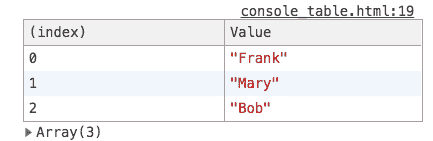
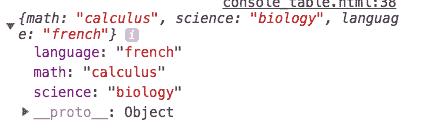
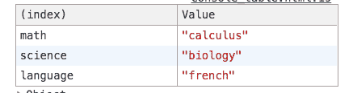
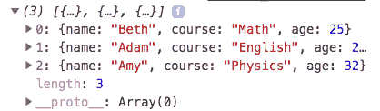
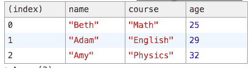
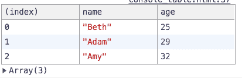

# Console.table()

> 原文：<https://dev.to/denisepen/consoletable-25l8>

像所有的 javascript 程序员一样，我会经常在代码中抛出一个 *console.log* 。我发现登录控制台比使用调试器进行快速检查要快得多。最近我偶然发现了**控制台。桌子**，它让我大吃一惊，并在我心中占据了永久的位置。

# 什么事？

听起来确实如此——它允许您将数据以表格的形式记录到控制台。假设我们有以下数组:

`let people = ["Frank", "Mary", "Bob"]`

如果我们使用 *console.log* ，我们会在控制台中得到这个输出:

`["Frank", "Mary", "Bob"]`

但是，用*我们得到*:

您可以看到，我们得到了数组中每一项的列表以及该项的索引(或在数组中的位置)。对于这样一个简单的数组来说，这似乎有些过分，但是 *console.table* 也可以用于对象。事实上，Mozilla Web 文档声明:
*如果数据是一个数组，那么它的值将是数组的索引。如果数据是一个
对象，那么它的值就是属性名。*

## 我们来看一个对象:

`let courses = {
math: "calculus",
science: "biology",
language: "french"
}`

*console.log* 给了我们这个:
 
而 *console.table* 给了我们这个:

## 现在，一组物体:

我们来看下面这个数组:

`let students = [
{
name: "Beth",
course: "Math",
age: 25
},
{
name: "Adam",
course: "English",
age: 29
},
{
name: "Amy",
course: "Physics",
age: 32
},
]`

*console.log* 将返回:

*console.table* 返回:

这太棒了，因为现在我们复杂的对象数组在一个易于阅读的表中。对我来说，当数据以表格的形式出现时，理解和处理数据要容易得多。

## 最后一件事...

使用 *console.table* 时，您还可以限制表格中显示的列。继续上面使用的对象数组，如果我们只想注销学生的姓名和年龄，我们可以使用下面的:

`console.table(students, ["name", "age"])`

返回:

如您所见， *console.table* 为您提供了几个选项来快速查看和分析您的数据。

您偶然发现的其他哪些调试工具可能会有所帮助？