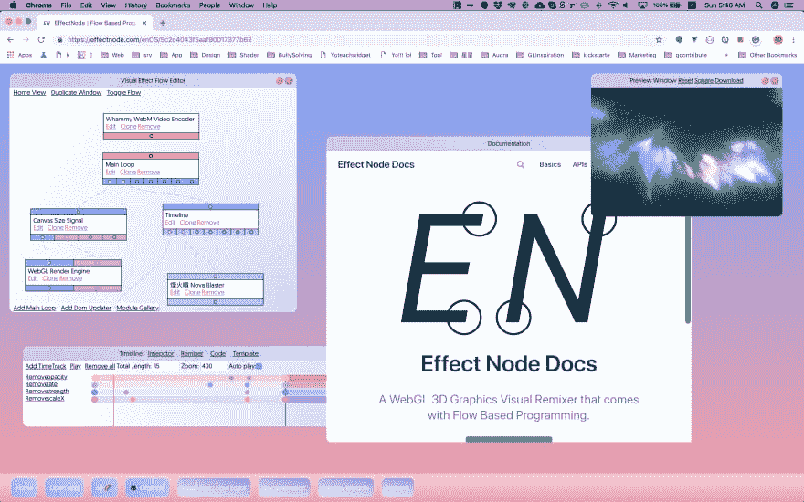

# 对 WebGL / Canvas 2D 基于流程编程思想的思考

> 原文：<https://dev.to/wonglok/contemplating-on-idea-of-flow-based-programming-for-webgl--canvas-2d-4b70>

# 我为什么选择基于流程的编程来探究。

1.  基于流程的编程是很棒的，因为我喜欢我们可以用一种可视化的和鼠标点击的方式用特定的输入输出来模块化代码....
2.  IO 的自然电缆感觉像 Vuejs 道具和事件。
3.  嗯，让我们把道具和事件模仿成一个基于流程的范例。
4.  在这里，我们 gooooooo lol 这就是为什么我做了我的边项目效果节点。

# 有时候，仅仅将代码作为工具是不够的....

1.  编写视觉效果与按钮、滑块和颜色选择器有很大关系。
2.  等待重新加载来更新颜色调整是缓慢和无效的。
3.  有时我们也需要使用范围滑块来调整效果速度和数量。
4.  有时，我们还需要动态地将基于时间轴的淡入淡出序列数据提供给代码。

[https://github.com/EffectNode/EffectNode-GUI](https://github.com/EffectNode/EffectNode-GUI)

# 我认为组织动画数据的创作、流动和消费的方式.....:)

有拉力，有推力思维....

我认为会有三种类型的模块

1.  真相来源模块，如用户界面滑块、时间轴、颜色选择器
2.  RequestAnimationFrame 事件发射器
3.  处理动画设置和渲染操作模块。

我喜欢思考不同的编程范例。希望你喜欢我的作品。呜呜呜。< 3