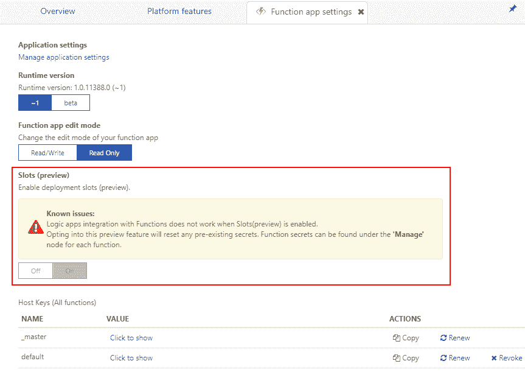
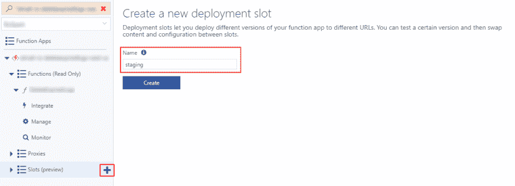
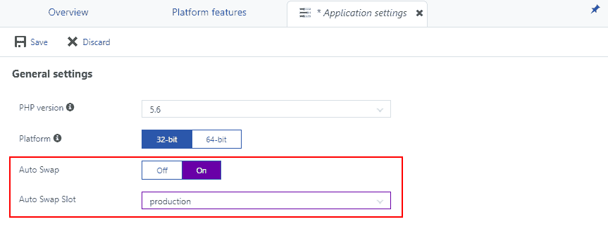
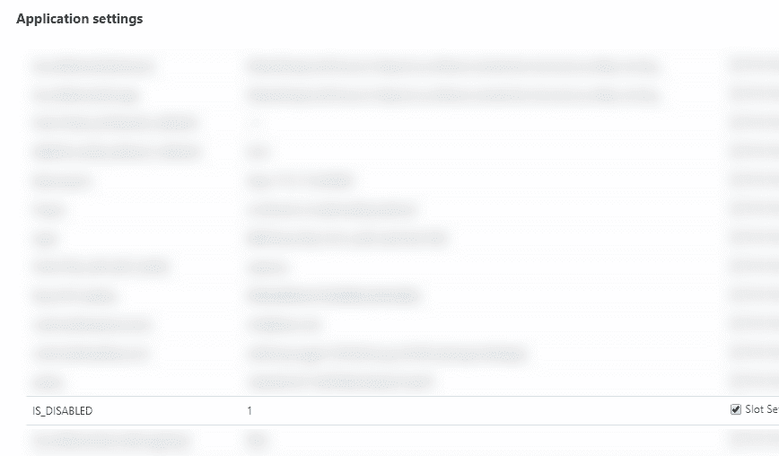

# 使用插槽持续部署 Azure 功能

> 原文：<https://dev.to/thomasardal/continuous-deployment-of-azure-functions-with-slots-3pcc>

在[第 3 部分](https://blog.elmah.io/configure-and-deploy-azure-functions-with-kudu/)中，我展示了如何从源代码控制中设置 Azure 函数的部署。在某些场景中，部署到正在运行的函数中或者部署所有的更改并不是我们想要的行为。幸运的是，函数现在像普通的 Azure Web 应用程序一样支持部署插槽。

> 请注意，部署插槽目前处于预览状态，因此不建议用于生产。我们遇到了一些函数槽的问题，比如函数停止使用来自服务总线的消息等等。

要开始利用部署插槽，您必须在*功能应用设置*屏幕上启用它:

[](https://res.cloudinary.com/practicaldev/image/fetch/s--8VzRTbhZ--/c_limit%2Cf_auto%2Cfl_progressive%2Cq_auto%2Cw_880/https://blog.elmah.io/conteimg/old/enable_deployment_slots.png)

启用后，您可以通过单击*插槽*树节点旁边的加号图标并输入名称来创建一个新插槽。对于这个例子，我将创建一个名为 *staging* 的插槽:

[](https://res.cloudinary.com/practicaldev/image/fetch/s--CaxVmzQx--/c_limit%2Cf_auto%2Cfl_progressive%2Cq_auto%2Cw_880/https://blog.elmah.io/conteimg/old/create_new_deployment_slot.png)

因为我们希望每个提交在交换到生产之前都部署在 staging 上，所以您将需要从生产插槽中断开源代码控制部署(如果已经如第 3 部分所示进行了设置)。与本系列的第 3 部分一样，在新的登台槽中从源代码控制(或者您喜欢的任何部署方式)设置部署。详情见[第三部分](https://blog.elmah.io/configure-and-deploy-azure-functions-with-kudu/)。

现在，所有更改都应该部署到试运行中。当一切正常并经过测试后，您可以通过单击*交换*按钮来交换暂存和生产插槽:

[](https://res.cloudinary.com/practicaldev/image/fetch/s--gBoW4pY6--/c_limit%2Cf_auto%2Cfl_progressive%2Cq_auto%2Cw_880/https://blog.elmah.io/conteimg/old/swap_delpoyment_slots.png)

Azure 支持一个名为 *Auto Swap* 的特性，当新的变化被部署到一个插槽时，它会自动交换部署插槽。最终结果将类似于直接在生产插槽上设置自动部署，但是在组合中放置一个暂存插槽也有好处。我们注意到，在部署时运行的定时功能有时会跳过一次或多次迭代。虽然这可能被认为是一个错误，但它实际上是有意义的。当部署新构建的函数时，需要在磁盘上覆盖文件，这会在函数应用程序上造成一点停机时间。部署插槽是消除这种停机时间的好方法，因为您在后台进行部署，并在部署成功时进行交换。

通过暂存槽上的*应用程序设置*视图可以实现自动交换:

[](https://res.cloudinary.com/practicaldev/image/fetch/s--ti7vYiFe--/c_limit%2Cf_auto%2Cfl_progressive%2Cq_auto%2Cw_880/https://blog.elmah.io/conteimg/old/set_up_auto_swap.png)

就是这样！现在，所有更改都已部署到暂存中，并自动交换到生产中。但是等一下！两个部署槽(生产和 staging)不就意味着你的功能 app 是分两个实例部署的吗？确实如此。在拥有定时函数(以及其他类型的函数)的场景中，您只希望函数在生产环境中运行。幸运的是，函数提供了一种通过应用程序设置来禁用功能的机制。要设置它，在函数类
上添加`Disable`属性

```
[Disable("IS_DISABLED")]
public static class MyFunctions
{
    ...
} 
```

当查看生成的`function.json`时，`disabled`字段现在看起来像这样:

```
{  ...  "disabled":  "IS_DISABLED",  ...  } 
```

`IS_DISABLED`应与您的功能应用程序上的应用程序设置相匹配。要进行设置，请在两个插槽上添加新的插槽设置。在这种情况下，暂存:

[](https://res.cloudinary.com/practicaldev/image/fetch/s--_9wkov2_--/c_limit%2Cf_auto%2Cfl_progressive%2Cq_auto%2Cw_880/https://blog.elmah.io/conteimg/old/disable_function_on_staging.png)

注意值`1`(真)以及检入*槽设置*。类似地，您的生产插槽也需要相同的设置，但值为`0`。功能现在在暂存时禁用，在生产时启用。

> 门户中有一个错误，显示生产和暂存功能都被禁用。显然，门户还不知道`disabled`字段可以从应用程序设置中填充，因此当它不是布尔值时会将其标记为禁用。

* * *

## 你的用户会喜欢更少的错误吗？

elmah.io 是一个简单的错误记录和正常运行时间监控服务。通过对所有的支持，重新控制你的错误。NET web 和日志框架。

➡️ [错误监控。NET 网络应用](https://elmah.io/?utm_source=devto&utm_medium=social&utm_campaign=devtoposts) ⬅️

本文首次出现在 elmah.io 博客上，网址为[https://blog . elmah . io/continuous-deployment-of-azure-functions-with-slots/](https://blog.elmah.io/continuous-deployment-of-azure-functions-with-slots/)