# 使用 Bitbucket 管道将 Vue.js 应用程序持续部署到 AWS

> 原文：<https://dev.to/pavanvora/continuous-deployment-of-vue-js-app-to-aws-using-bitbucket-pipelines-3ol7>

大家好，我最近创建了一个 Bitbucket Pipelines 来在亚马逊 S3 上部署我的 Vue.js 应用程序，今天在这篇文章中，我想分享一步一步的过程。在开始之前，我假设你已经在 bitbucket 和 AWS 帐户上运行 vuejs 应用程序。

### 有哪些步骤？

1.  创建和配置**亚马逊 S3 桶**。
2.  在 AWS 控制台中创建能够从 Bitbucket 访问 S3 存储桶的 IAM 用户。
3.  配置 Bitbucket 以使用**管道**。
4.  在我们的项目中添加 **bitbucket-pipelines.yml** 文件。
5.  将代码推送到 Bitbucket，并检查 live vue 应用程序。

## 第一步:创建并配置亚马逊 S3 桶

点击[此处](https://console.aws.amazon.com/console/home)登录您的 AWS 控制台。登录到 aws 控制台后，点击标题中的**服务**，在存储部分查找 **S3** 服务并点击它。

[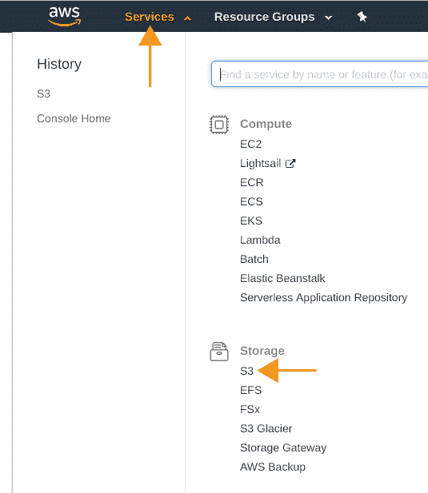](https://res.cloudinary.com/practicaldev/image/fetch/s--a4dhcRmW--/c_limit%2Cf_auto%2Cfl_progressive%2Cq_auto%2Cw_880/https://i.imgur.com/dI6ykRf.png)

重定向到 S3 页面后，单击**创建存储桶**按钮。在**名称和区域**页面中，为您的存储桶键入名称，并选择您希望存储桶所在的区域，然后单击下一步按钮。在**配置选项**页面上，无需做任何更改，保持原样，点击下一步按钮。现在，在**设置权限**页面中，我们需要做一些改变，如下图所示，使文件可以公开使用。

[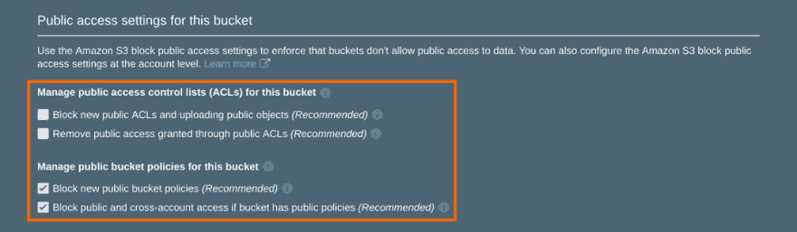](https://res.cloudinary.com/practicaldev/image/fetch/s--v2p4Dw6U--/c_limit%2Cf_auto%2Cfl_progressive%2Cq_auto%2Cw_880/https://i.imgur.com/jCHLlMN.png)

您可以看到 amazon 建议勾选**管理公共访问控制列表(ACL)**部分中的选项，但前提是您想在这个桶中存储私有数据。因此，要创建可公开访问的存储桶，我们将忽略该建议并取消选择上图中给出的两个选项。之后，您可以单击下一步按钮，**查看**S3 存储桶，然后单击**创建存储桶**。

创建一个存储桶需要几秒钟时间，然后您可以在存储桶列表中看到该存储桶。单击您刚刚创建的 bucket 名称，您将看到如下内容。

[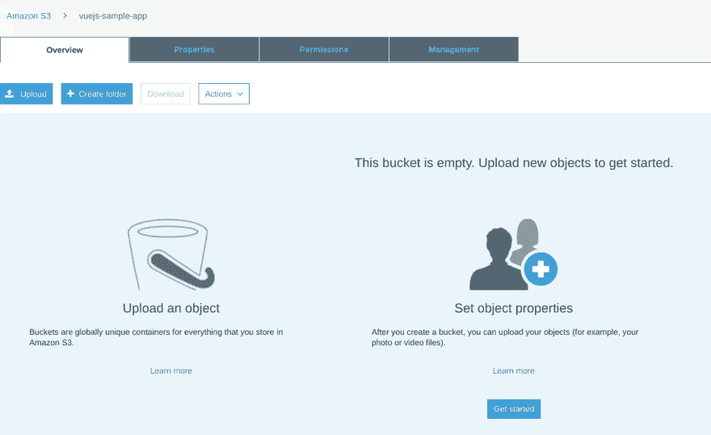](https://res.cloudinary.com/practicaldev/image/fetch/s--n-ZZjBCC--/c_limit%2Cf_auto%2Cfl_progressive%2Cq_auto%2Cw_880/https://i.imgur.com/cVKlV1p.png)

现在，随着我们的 Bucket 被创建，我们需要**为这个 Bucket 启用静态站点托管**。为此，您可以转到**属性**选项卡。点击**静态网站托管**，然后选择**用这个桶托管一个网站**。系统将提示您提供索引文档(网站的主页或默认页面)，输入**index.html**，在点击保存之前，您可以记下**端点** URL，您的网站将在第 5 步中上线。

[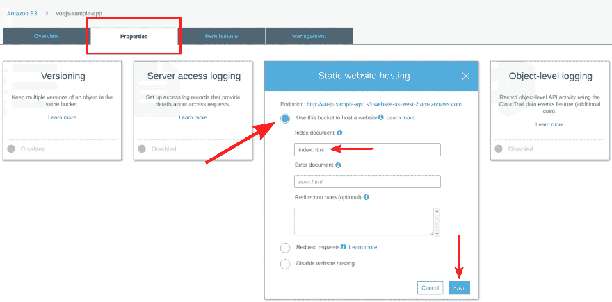](https://res.cloudinary.com/practicaldev/image/fetch/s--ot4VPM1q--/c_limit%2Cf_auto%2Cfl_progressive%2Cq_auto%2Cw_880/https://i.imgur.com/pbW39x4.png)

现在，我们已经准备好亚马逊 S3 桶静态网站托管，所以让我们继续下一步。

## 步骤 2:在 AWS 控制台中创建 IAM 用户

在这一步中，我们将创建 IAM 用户，它将为我们提供两个密钥 **1。访问密钥 ID** 和 **2。秘密访问密钥**。我们的 bitbucket 帐户将使用这些密钥将存储库代码上传到亚马逊 S3 bucket。要进入 IAM 服务页面，请导航至**服务>安全、身份、&合规性> IAM** ，或者您也可以跟随下图。

[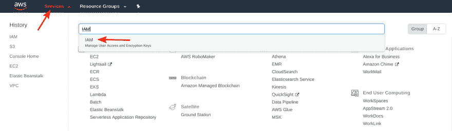](https://res.cloudinary.com/practicaldev/image/fetch/s--MODBuXmU--/c_limit%2Cf_auto%2Cfl_progressive%2Cq_auto%2Cw_880/https://i.imgur.com/ht42aUz.png)

在导航窗格中移动到 **IAM** 服务页面后，选择**用户**，然后选择**添加用户**。

[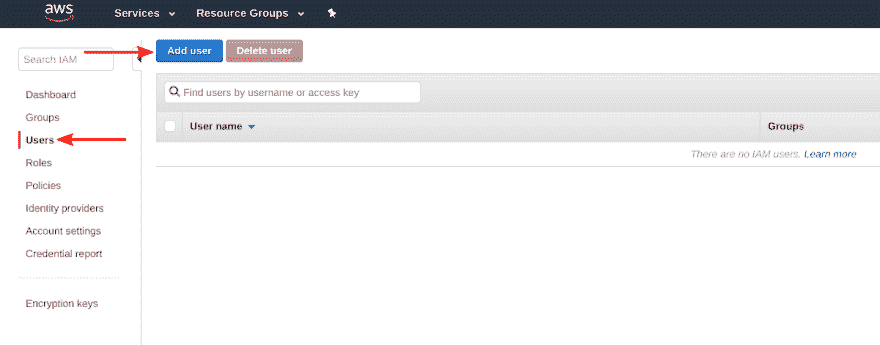](https://res.cloudinary.com/practicaldev/image/fetch/s--Knj9bwnl--/c_limit%2Cf_auto%2Cfl_progressive%2Cq_auto%2Cw_880/https://i.imgur.com/Zc6Ww6o.png)

为新用户键入**用户名**，并在访问类型中选择**程序化访问**，然后点击下方的**下一步:权限**按钮。我们正在创建此用户，以便从 Bitbucket 访问 S3 存储桶，因此我将用户名命名为 s3-full-access，您可以使用任何名称。

[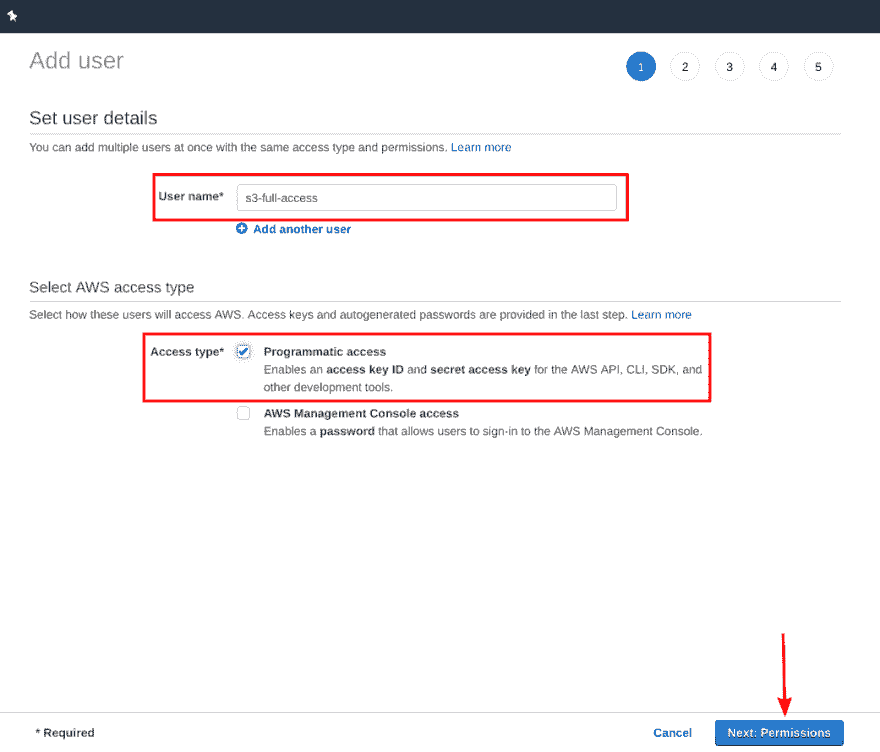](https://res.cloudinary.com/practicaldev/image/fetch/s--CfZOlFoe--/c_limit%2Cf_auto%2Cfl_progressive%2Cq_auto%2Cw_880/https://i.imgur.com/OCu5BHH.png)

在**设置权限**页面有三个选项，选择**直接附加已有策略**会看到可用策略列表。在搜索字段中键入 **s3full** 并选择名为 **AmazonS3FullAccess** 的策略，然后单击 **Next: Tags** 按钮。

[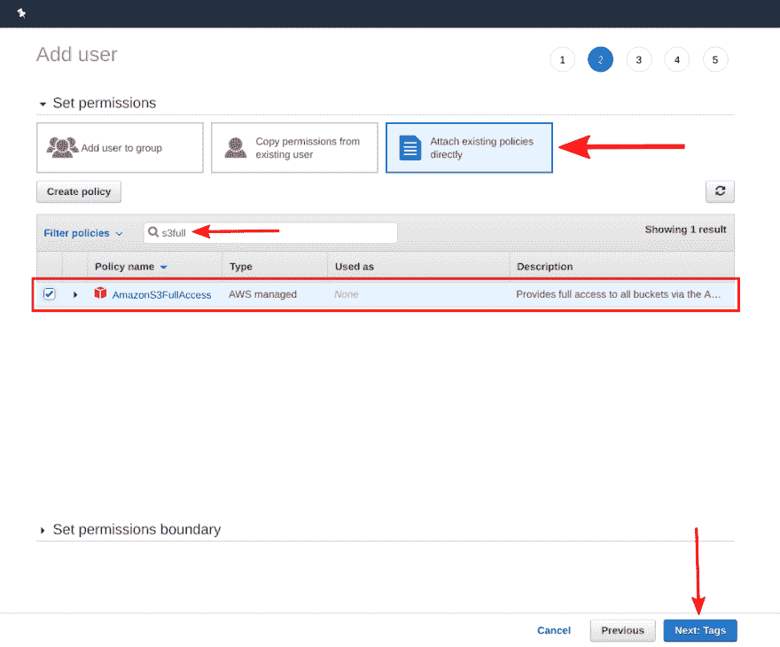](https://res.cloudinary.com/practicaldev/image/fetch/s--LJBUs-rr--/c_limit%2Cf_auto%2Cfl_progressive%2Cq_auto%2Cw_880/https://i.imgur.com/NxtLsRh.png)

在**添加标签**页面上，您可以通过输入将作为元数据添加到用户的键值对来添加标签。但这是可选的，所以你可以继续点击**下一步:审查**按钮。查看您的用户详细信息，并点击**创建用户**按钮。如前所述，你将得到两把钥匙。访问密钥 ID 和 **2。已创建用户的秘密访问密钥**。此密钥对我们的应用程序部署非常重要，请将两个密钥复制/粘贴到您电脑上的安全位置。

[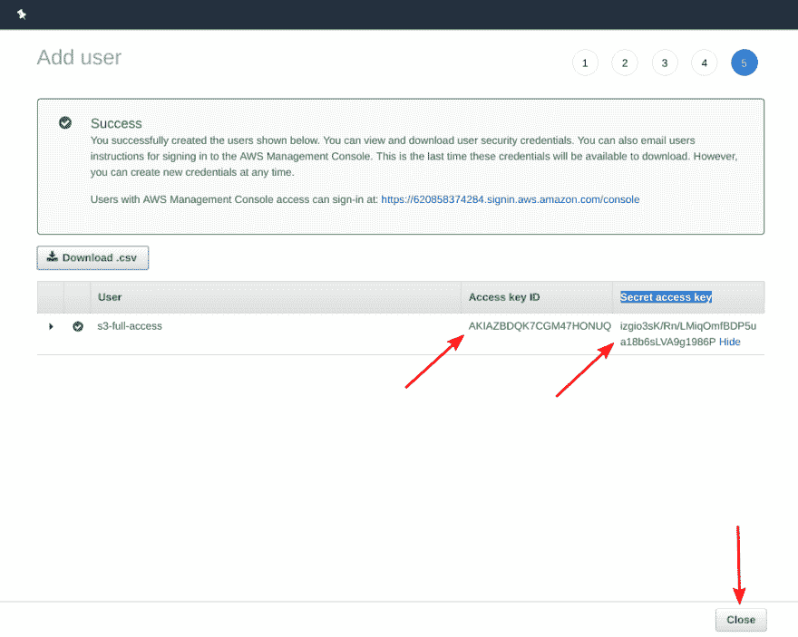](https://res.cloudinary.com/practicaldev/image/fetch/s--mJzpbUTY--/c_limit%2Cf_auto%2Cfl_progressive%2Cq_auto%2Cw_880/https://i.imgur.com/PoFAEuy.png)

> 不要试图从 image 中复制我的密钥，因为在你阅读这篇文章的时候它是无效的😬

现在，随着我们的用户成功创建，我们将进入下一步。

## 第三步:配置 Bitbucket 使用管道

登录到您的 Bitbucket 帐户，移动到您的项目存储库，然后按照下图为存储库启用管道。

[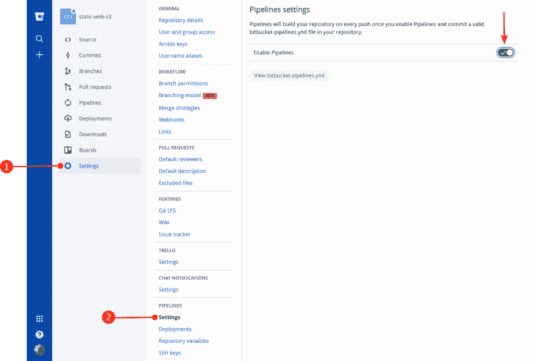](https://res.cloudinary.com/practicaldev/image/fetch/s--FleY8F83--/c_limit%2Cf_auto%2Cfl_progressive%2Cq_auto%2Cw_880/https://i.imgur.com/qDOHTbi.png)

启用管道后，在库**设置**中从导航面板中选择**库变量**。在名称字段中写入 **AWS_ACCESS_KEY_ID** ，并在值中粘贴您在上一步中复制的访问密钥 ID 的值，然后单击 **Add** 按钮，再次按照相同的方式将秘密访问密钥命名为 **AWS_SECRET_ACCESS_KEY** 。之后，你应该会看到类似下图的东西。

[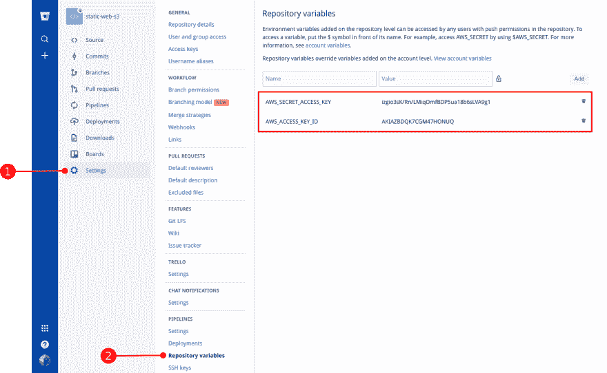](https://res.cloudinary.com/practicaldev/image/fetch/s--RexWaU21--/c_limit%2Cf_auto%2Cfl_progressive%2Cq_auto%2Cw_880/https://i.imgur.com/oBXvUuZ.png)

这个添加的存储库变量将在下一步的 **bitbucket-pipelines.yml** 文件中使用。

## 步骤 4:将 bitbucket-pipelines.yml 文件添加到项目中

转到项目根目录，创建一个名为 **bitbucket-pipelines.yml** 的新文件。复制之后，将下面的代码粘贴到 **bitbucket-pipelines.yml** 文件中。