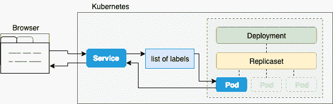

# 使用 Java 和 Kubernetes 进行持续开发

> 原文：<https://dev.to/pozo/continuous-development-with-java-and-kubernetes-3d08>

如果您同时为 Kubernetes 开发多个应用程序，您将会意识到在日常工作中运行和调试这些应用程序是非常复杂和耗时的，因为我们必须重复以下步骤:

*   构建应用程序
*   建立码头工人形象
*   将容器映像推送到 docker 注册表
*   创建/刷新 Kubernetes 的对象

另外有一个数据库和一个 MQ 连接就够了，你就麻烦大了。我并不是说不可能一起测试所有的东西，但是我绝对肯定，如果你需要手工完成上面的步骤，这将会打断你的生产流程。

幸运的是，Google [最近宣布了 Jib 1.0.0](https://cloud.google.com/blog/products/application-development/jib-1-0-0-is-ga-building-java-docker-images-has-never-been-easier) ，它与 [Skaffold](https://github.com/GoogleContainerTools/skaffold) 相结合能够解决这个问题。在这篇文章中，我将向你展示 Spring Boot 和[赫尔姆](https://helm.sh/)使用这些工具的工作流程。

### 一个 Spring Boot 应用程序

首先，我们需要一个基本的 Spring Boot 应用程序。我建议使用[Spring initializr](https://start.spring.io/)，它可以帮助你在几秒钟内启动一个 Spring Boot 应用程序。在这篇文章中，我将 Spring Boot 2.1.3 和 gradle 一起使用，但是你也会在库中找到 maven 相关的文件[。](https://github.com/Pozo/continuous-java-kubernetes)

只需下载生成的项目，让我们创建一个`RestController`

```
@RestController
public class TestController {

    @GetMapping(value = "/echo/{text}")
    public ResponseEntity test(@NotNull @PathVariable String text) {
        return ResponseEntity.ok(text);
    }

    @GetMapping
    public ResponseEntity hello() {
        return ResponseEntity.ok("HELLO");
    }
} 
```

Enter fullscreen mode Exit fullscreen mode

在本文中，我想展示 Jib 的可定制性，所以让我们将默认端口号改为`55000`。创建一个`application.properties`并将这一行放入文件

```
server.port=55000 
```

Enter fullscreen mode Exit fullscreen mode

打开你喜欢的外壳，运行`./gradlew bootRun`。如果`http://localhost:55000`和`http://localhost:55000/echo/test`看起来都有效，让我们继续容器化阶段。

### 使用 Jib 进行 docker 图像创建

Jib 是用 Java 实现的[，作为你的 Maven 或 Gradle 版本的一部分运行。你不需要维护一个 Docker 文件，运行一个 Docker 守护进程。你只需要打开你的`build.gradle`文件，在插件部分添加`id 'com.google.cloud.tools.jib' version '1.0.0'`并在末尾添加下面的代码](https://cloudplatform.googleblog.com/2018/07/introducing-jib-build-java-docker-images-better.html) 

```
jib {
    to {
        image = 'com.github.pozo/spring-boot-jib'
    }
    container {
        ports = ['55000']
    }
} 
```

Enter fullscreen mode Exit fullscreen mode

应当注意，上述配置不是强制性的。然而，如果没有这些线，Jib 将产生一个名为`spring-boot-jib:0.0.1-SNAPSHOT`的图像，其中第一部分是来自`settings.gradle`的`rootProject.name`的值，第二部分是由来自`build.gradle`的`version`变量提供的。为了建立更高级的形象，我建议查看一下[可用选项](https://github.com/GoogleContainerTools/jib/tree/master/jib-gradle-plugin#extended-usage)。

上面的配置看起来像是[这个](https://github.com/GoogleContainerTools/jib/blob/master/docs/faq.md#what-would-a-dockerfile-for-a-jib-built-image-look-like)和 Dockerfile

```
FROM gcr.io/distroless/java:latest

COPY dependencyJars /app/libs
COPY snapshotDependencyJars /app/libs
COPY resources /app/resources
COPY classFiles /app/classes

COPY src/main/jib /

ENTRYPOINT ["java", jib.container.jvmFlags, "-cp", "/app/resources:/app/classes:/app/libs/*", jib.container.mainClass]
CMD [jib.container.args] 
```

Enter fullscreen mode Exit fullscreen mode

Jib 使用[distroles](https://github.com/GoogleContainerTools/distroless)Java 作为默认的基础映像，默认情况下似乎使用了[容器相关的 JVM 标志](https://github.com/GoogleContainerTools/distroless/pull/295)。多拷贝语句用于将应用程序分成多个层，允许在小的更改后更快地重建。

如果要指定不同的基础图像，只需添加一个 [`from`](https://github.com/GoogleContainerTools/jib/tree/master/jib-gradle-plugin#extended-usage) 段

```
jib {
    from {
        image = 'java:8-jre-alpine'
    }
    to {
        image = 'com.github.pozo/spring-boot-jib'
    }
    container {
        ports = ['55000']
    }
} 
```

Enter fullscreen mode Exit fullscreen mode

如果我们想要构建容器映像，我们有两个选择。使用 [`jib`](https://github.com/GoogleContainerTools/jib/tree/master/jib-gradle-plugin#build-your-image) 任务将应用程序的容器映像推送到容器注册表，或者使用 [`jibDockerBuild`](https://github.com/GoogleContainerTools/jib/tree/master/jib-gradle-plugin#build-to-docker-daemon) 使用 docker 命令行工具，并要求您的路径上有 docker 可用，或者您可以通过 [`dockerClient`](https://github.com/GoogleContainerTools/jib/tree/master/jib-gradle-plugin#extended-usage) 对象设置可执行文件的位置。

打开终端并执行

```
./gradlew jibDockerBuild 
```

Enter fullscreen mode Exit fullscreen mode

我将在下一段解释为什么我们需要使用这个任务而不是`jib`。

检查`docker images`命令的输出。如果你想知道为什么你的图像是在大约 49 年前创建的，那么为了再现的目的，Jib 将容器图像的创建时间设置为 0。为了使用当前时间，只需在`jib.container`中添加`useCurrentTimestamp = true`。对于更高级的问题，请查看[三角帆的常见问题](https://github.com/GoogleContainerTools/jib/blob/master/docs/faq.md)。

在构建阶段之后，我们可以用
运行我们的映像

```
docker run -p 8080:55000 com.github.pozo/spring-boot-jib 
```

Enter fullscreen mode Exit fullscreen mode

如果`http://localhost:8080`和`http://localhost:8080/echo/test`都正常工作，我们可以继续使用我们的 Kubernetes 对象。

### 在 Kubernetes 内部运行应用程序映像

如果你不熟悉 Kubernetes，我推荐你从官方文档开始。

首先，我们需要一个正在运行的 Kubernetes 集群。幸运的是，如今我们有几种选择。例如，我们可以使用 [Minikube](https://kubernetes.io/docs/setup/minikube/) ，它在您笔记本电脑上的虚拟机内运行一个[单节点 Kubernetes 集群](https://kubernetes.io/docs/setup/minikube/)。

另一个选择是桌面 Kubernetes 的 Docker。它在您的 Docker 实例中本地运行一个[单节点集群](https://docs.docker.com/v17.09/docker-for-mac/kubernetes/)**。我相信这个是用 Kubernetes 黑来黑去最舒服的方式，所以我建议用这个。**

我们还需要 [kubectl](https://kubernetes.io/docs/tasks/tools/install-kubectl/) ，它是一个命令行接口，用于[对 Kubernetes 集群运行命令](https://kubernetes.io/docs/reference/kubectl/overview/)。

如果您决定使用 Minikube，则使用
启动集群

```
minikube start 
```

Enter fullscreen mode Exit fullscreen mode

这个命令[创建并配置](https://kubernetes.io/docs/setup/minikube/#starting-a-cluster)一个运行单节点集群的虚拟机。这个命令还配置您的 kubectl 安装来与这个集群通信。你还需要跑

```
eval $(minikube docker-env) 
```

Enter fullscreen mode Exit fullscreen mode

命令`minikube docker-env`返回一组 Bash 环境变量导出来配置您的本地环境，以便重用 Minikube 实例中的 Docker 守护进程。[(来源)](https://stackoverflow.com/a/52310892)

这意味着您[不必在您的主机上构建](https://github.com/kubernetes/minikube/blob/0c616a6b42b28a1aab8397f5a9061f8ebbd9f3d9/README.md#reusing-the-docker-daemon)并将映像推入 docker 注册表，您可以在与 Minikube 相同的 docker 守护进程中构建。所以在
之后

```
./gradlew jibDockerBuild 
```

Enter fullscreen mode Exit fullscreen mode

Minikube 将能够接触到图像`com.github.pozo/spring-boot-jib`。每次提示新的终端时，不要忘记运行`eval $(minikube docker-env)`。

要在 Docker for Desktop 的情况下启用 Kubernetes 集群，只需遵循[平台特定说明](https://docs.docker.com/docker-for-mac/#kubernetes)。

为了在集群中运行我们的映像，我们需要首先定义一个[部署](https://kubernetes.io/docs/concepts/workloads/controllers/deployment/)。部署代表一组没有唯一身份多个相同的[吊舱](https://kubernetes.io/docs/concepts/workloads/pods/pod/)。部署运行应用程序的多个副本，并自动替换任何失败或无响应的实例。此外，我们需要一个对外公开的[服务](https://kubernetes.io/docs/concepts/services-networking/service/)，这样我们就可以从集群外部访问我们的应用程序。这里有一个图表，是关于我们想要实现的
[](https://res.cloudinary.com/practicaldev/image/fetch/s--ilClAiNm--/c_limit%2Cf_auto%2Cfl_progressive%2Cq_auto%2Cw_880/https://thepracticaldev.s3.amazonaws.com/i/65s6556zsypdlwx39dxa.png)

让我们在项目的根目录下创建一个`kubernetes`目录，并在新创建的目录
下创建一个包含以下内容的文件`spring-boot-jib.yaml`

```
apiVersion: apps/v1
kind: Deployment
metadata:
  name: spring-deployment
spec:
  replicas: 1
  selector:
    matchLabels:
      app: spring-boot-jib
  template:
    metadata:
      labels:
        app: spring-boot-jib
    spec:
      containers:
        - name: spring-boot-jib-pod
          image: com.github.pozo/spring-boot-jib
          imagePullPolicy: IfNotPresent
          ports:
            - name: http
              containerPort: 55000
---
apiVersion: v1
kind: Service
metadata:
  name: spring-boot-jib-service
spec:
  type: LoadBalancer
  ports:
    - port: 8080
      targetPort: 55000
      protocol: TCP
      name: http
  selector:
    app: spring-boot-jib 
```

Enter fullscreen mode Exit fullscreen mode

这里要提几个重要的事情。

*   部署的`spec.selector.matchLabels.app`值必须与`spec.template.metadata.labels.app`值相同
*   服务的`spec.selector.app`值必须与部署的`spec.selector.matchLabels.app`值相同。因此服务可以找到我们的 Pod，并将每个请求交给它。
*   服务的`spec.ports.port`值应该是我们想要向外界公开的，在我们的例子中是`8080`
*   服务的`spec.ports.targetPort`必须与部署的`spec.template.spec.containers.ports.containerPort`相同，因此服务会将所有内容重定向到容器的端口号`55000`。
*   最后，Pod 的`spec.containers.imagePullPolicy` **必须是`IfNotPresent`或`Never`** 。默认值`Always`会产生一个错误，因为不存在这样的`com.github.pozo`库。

正如我们之前使用的`jibDockerBuild`,我们在本地有我们的映像，并且因为 Docker for Desktop 的集群使用我们主机的 Docker 实例，它将能够默认到达映像。在 Minikube 的情况下，由于`eval $(minikube docker-env)`Minikube 的 docker 守护进程构建的映像，它也将能够访问该映像。

打开终端并运行

```
kubectl create -f kubernetes/ 
```

Enter fullscreen mode Exit fullscreen mode

[create](https://kubernetes.io/docs/reference/generated/kubectl/kubectl-commands#create) 命令遍历`kubernetes`目录，并从其内容创建 Kubernetes 资源。

打开浏览器，再次尝试访问`http://localhost:8080`和`http://localhost:8080/echo/test`。如果是 Minikube，执行`minikube service list`找出部署的服务地址。如果我们得到状态代码`200`，那么我们做得很好，我们的集群中有一个正在运行的应用程序。

### 用斯卡福德把一切都拼起来

我们几乎越过了终点线！目前我们有一个容器化的应用程序，我们可以随时手动将其部署到集群*中*。此时，我们必须在每次更改后重复构建和部署步骤。

斯卡福德将帮助我们消除这种手工。去[他们的网站](https://skaffold.dev/docs/getting-started/#installing-skaffold)并遵循安装说明。如果一切都设置好了，那么在项目的根目录下创建一个`skaffold.yaml`，内容如下

```
apiVersion: skaffold/v1beta4
kind: Config
build:
  local:
    push: false
  artifacts:
    - image: com.github.pozo/spring-boot-jib
      jibGradle: {}
deploy:
  kubectl:
    manifests:
      - kubernetes/*.yaml 
```

Enter fullscreen mode Exit fullscreen mode

这是我们全新的 [Skaffold 管道文件](https://skaffold.dev/docs/concepts/#configuration-of-the-skaffold-pipeline-skaffold-yaml)。

*   `build.local.push: false` [强制 Skaffold](https://skaffold.dev/docs/how-tos/builders/) 使用`jibDockerBuild`。
*   [`build.artifacts`](https://skaffold.dev/docs/how-tos/builders/#dockerfile-locally-with-docker) 是我们将要构建的实际图像的列表。
*   `build.artifacts.jibGradle`配置 Skaffold 在映像构建阶段使用 Jib。
*   [`deploy.kubectl.manifests`](https://skaffold.dev/docs/how-tos/deployers/#deploying-with-kubectl) 值设置我们已经拥有 kubernetes 清单文件的文件夹名称。如果我们跳过这一步，默认的目录名将是 [`k8s`](https://github.com/GoogleContainerTools/skaffold/blob/cff3918df8c165f2c4bb17b07f3ed50222f6a63c/pkg/skaffold/constants/constants.go#L79) 。

如果您正在寻找更高级的管道配置，我推荐您查看[这个注释良好的示例](https://github.com/GoogleContainerTools/skaffold/blob/b9c979d7b59a15bba9e4a9c7977ece407b21d0c4/integration/examples/annotated-skaffold.yaml)。

打开终端并运行

```
skaffold dev --trigger notify 
```

Enter fullscreen mode Exit fullscreen mode

这个命令在开发模式下运行我们的管道文件，这意味着我们代码库中的每一个变化都将触发 Skaffold 调用 Jib 来构建映像，并调用 kubectl 来部署它。听起来很酷，对吧？

将`TestController`的`hello`方法的返回值改为`"GOODBYE"`，看看终端会发生什么。几秒钟后刷新浏览器，你会看到`"GOODBYE"`而不是`"HELLO"`。

### 使用舵

如果你不熟悉 helm，我建议你先看一下[官方快速入门指南](https://docs.helm.sh/using_helm/#quickstart)。

我必须承认使用 [Helm](https://docs.helm.sh/using_helm/#quickstart) 进行开发绝对不是强制性的，有人建议你[在使用它之前三思](https://medium.com/virtuslab/think-twice-before-using-helm-25fbb18bc822)，然而根据我的经验 Helm 使应用程序部署变得容易、标准化和可重用，尤其是当你必须使用几个应用程序时。

用
为我们的应用程序创建一个[舵图](https://helm.sh/docs/developing_charts/)

```
helm create spring-boot-jib 
```

Enter fullscreen mode Exit fullscreen mode

掌舵人的[创建命令](https://docs.helm.sh/helm/#helm-create)将生成一个包含几个文件的目录结构。为了使它更清晰，我们在这个文件夹中有什么，重命名为`helm`。最重要的文件在模板目录和`values.yaml`本身中。

将生成的`service.yaml`的`spec.ports.targetPort`更改为

```
targetPort: {{ .Values.service.containerPort }} 
```

Enter fullscreen mode Exit fullscreen mode

将`deployment.yaml`的`spec.template.spec.containers.image`值转换为

```
image: "{{  .Values.image.repository  }}{{  if  .Values.image.tag  }}:{{  .Values.image.tag  }}{{  end  }}" 
```

Enter fullscreen mode Exit fullscreen mode

并且将`deployment.yaml`的`spec.template.spec.containers.ports`值转换为

```
ports:
  {{- toYaml .Values.container.ports | nindent 12 }} 
```

Enter fullscreen mode Exit fullscreen mode

`{{ }}`之间的一切都来自于`values.yaml`或`_helper.tpl`文件。事实上我们正在使用 [Go 模板](https://helm.sh/docs/chart_template_guide/)。然后把`values.yaml`文件改成这样

```
replicaCount: 1

image:
  repository: com.github.pozo/spring-boot-jib
  tag: latest
  pullPolicy: IfNotPresent

nameOverride: ""
fullnameOverride: "spring-boot-jib"

service:
  type: LoadBalancer
  port: 8080
  containerPort: 55000

container:
  ports:
    - name: http
      containerPort: 55000
      protocol: TCP 
```

Enter fullscreen mode Exit fullscreen mode

由于我们想使用 Helm 而不是 kubectl，我们需要相应地调整 Skaffold 管道

```
apiVersion: skaffold/v1beta4
kind: Config
build:
  local:
    push: false
  artifacts:
    - image: com.github.pozo/spring-boot-jib
      jibGradle: {}
deploy:
  helm:
    releases:
      - name: spring-boot-jib
        chartPath: helm
        values:
          image.repository: com.github.pozo/spring-boot-jib
        setValues:
          image.tag: "" 
```

Enter fullscreen mode Exit fullscreen mode

我们必须配置`chartPath`、`image.repository`，并且我们必须[将`image.tag`值设置为 Helm 的空字符串](https://stackoverflow.com/a/50936738)，这样 Skaffold 将能够管理部署上的定制标记。

如果一切就绪，运行

```
skaffold dev --trigger notify 
```

Enter fullscreen mode Exit fullscreen mode

如果我们使用 Minikube，我们就不需要再执行`eval $(minikube docker-env)`了，因为 Skaffold 会处理它。如果你想看看引擎盖下发生了什么，只需添加`-v debug`开关。

```
skaffold dev --trigger notify -v debug 
```

Enter fullscreen mode Exit fullscreen mode

### 现场调试

在开发过程中，设置断点并在应用程序运行时检查其状态是一种自然的需求。在本地，这是一个非常简单的过程，但是如果我们在集群中拥有一切，那该怎么办呢？实际上，这比你想象的要简单，我们只需要调整一些东西。

*   将`5005`添加到`build.gradle`中悬臂配置下的端口列表中
*   在`jvmFlags`属性中添加`agentlib`相关配置

```
jib {
    to {
        image = 'com.github.pozo/spring-boot-jib'
    }
    container {
        useCurrentTimestamp = true
        ports = ['55000', '5005']
        jvmFlags = [ '-agentlib:jdwp=transport=dt_socket,server=y,suspend=n,address=5005' ]
    }
} 
```

Enter fullscreen mode Exit fullscreen mode

*   用扩展`values.yaml`的`container.ports`

```
- name: debug
  containerPort: 5005
  protocol: TCP 
```

Enter fullscreen mode Exit fullscreen mode

*   为调试器创建一个[远程配置](https://stackoverflow.com/a/30793101)

然后运行管道。Skaffold 会自动转发每个列出的端口，但是要小心，在更改之后，如果请求的端口不可用，Skaffold 可能会随机选择一个端口。设置一个断点，运行之前创建的远程配置，调用相应的端点，瞧。

我希望你喜欢读这篇文章，就像我喜欢写它一样。我不是一个熟练的作家，所以如果你有评论，请在评论区自由分享。这篇文章的源代码可以在 GitHub 的[上找到。](https://github.com/Pozo/continuous-java-kubernetes)

我要感谢[gergő·萨博](https://dev.to/@szgergo)和[丹尼尔·萨博](https://dev.to/@szada92)的所有帮助。

如果你对这个话题感兴趣，我建议你也看看这些文章

*   [用起重臂对接 Spring Boot 应用](http://mrhaki.blogspot.com/2018/09/spring-sweets-dockerize-spring-boot.html)
*   [使用 Jib 对接 Java 应用](https://www.baeldung.com/jib-dockerizing)
*   【Kubernetes(幻灯片)的持续开发
*   [介绍 Jib——更好地构建 Java Docker 映像](https://cloudplatform.googleblog.com/2018/07/introducing-jib-build-java-docker-images-better.html)
*   [awesome-kubernetes-awesome kubernetes 来源的精选列表](https://github.com/ramitsurana/awesome-kubernetes)
*   [Kubernetes Helm:为什么重要](https://platform9.com/blog/kubernetes-helm-why-it-matters/)
*   [Draft vs git kube vs Helm vs Ksonnet vs meta particle vs ska ffold](https://blog.hasura.io/draft-vs-gitkube-vs-helm-vs-ksonnet-vs-metaparticle-vs-skaffold-f5aa9561f948/)