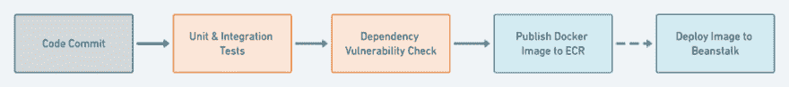
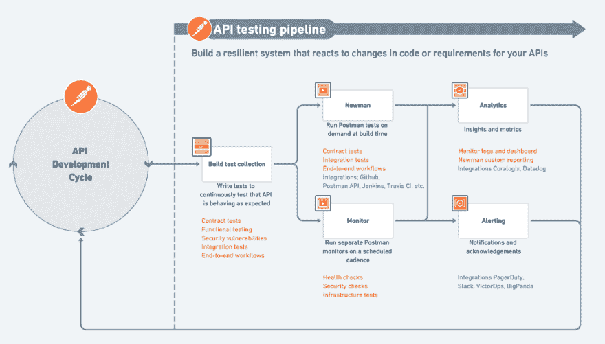

# 原料药的连续测试

> 原文：<https://dev.to/kaustavdm/continuous-testing-of-apis-3e5f>

确保你所有的 API 在任何时候都被测试的策略。T3】

软件组合越来越趋向于 API 驱动的世界。如果你了解我们在[邮递员](https://www.getpostman.com)上写的和谈论的，你可能已经多次遇到这种说法。我们再怎么强调这一点也不为过。

API 是当今正在构建的大型软件系统的构建块。越来越多的公司正在转向 API 优先的方法。将系统构建为 API 正在成为一项商业决策，而不仅仅是一项技术决策。在这种情况下，确保稳定性、安全性、性能和可用性是重中之重。这些转变使得 API 测试成为构建和发布 API 时的首要目标。

在 Postman，由于我们可爱的社区，我们对这个不断发展的景观有独特的看法。我们看到 API 测试策略正在成为 API 设计生命周期的一个必要部分。正如为服务或产品的 API 设计接口不是像我们这样以 API 为先的组织的事后想法一样，为这些 API 设计弹性测试系统的需求也是如此。自 2019 年 1 月以来，我和我的同事 [Joyce](https://twitter.com/PetuniaGray) 一直在谈论这个话题，现在是我们实际写下这个话题的时候了。

### 策略的集合

[best Practices](https://medium.com/better-practices)出版物已经包含了相当多的关于 API 测试自动化的文章。我已经谈到了在面向服务架构的环境中，API 的[集成测试](https://dev.to/kaustavdm/integrating-in-an-api-first-world-235m-temp-slug-2752213)如何变化。接下来，我们将介绍 Postman 如何让你踏上[通往更好自动化的道路](https://medium.com/better-practices/from-manual-to-automated-testing-the-roadblocks-and-the-journey-6333dfacc5ae)。我们深入探讨了[消费者驱动的合同](https://medium.com/better-practices/consumer-driven-contract-testing-using-postman-f3580dba5370)以及它们如何帮助您[走出微服务依赖的地狱](https://medium.com/better-practices/conquering-the-microservices-dependency-hell-at-postman-with-postman-part-1-introduction-a1ae019bb934)。我们还写过[快照测试](https://medium.com/better-practices/snapshot-testing-for-apis-using-postman-7f9f26295d6b)如何提高 API 的可靠性保证。

所有这些解决方案都有一些共同的实践。它们的核心是围绕一组工具的工作流，当以某种方式使用时，可以解决 API 生产者和消费者经常面临的一系列问题。如果不严谨，这些测试模式中的每一个都不是很有用。

API 代表了业务领域的需求。它们随着需求的发展而变化。API 生命周期的发展需要与依赖它的其他系统以及它所依赖的系统相协调。API 必须是灵活的，并且在增长和扩展时不会破坏事物。

### 需要一个紧密的反馈回路

[用 API 优先模型构建 API](https://medium.com/better-practices/api-first-software-development-for-modern-organizations-fdbfba9a66d3)考虑分布式系统的设计方面。这在微服务环境中尤为重要。这些设计和开发需要弹性测试系统的支持，该系统允许您对 API 的代码或业务需求的变化做出反应。

您需要知道您的 API 何时失败，它们失败的原因，并且您需要一个紧密的反馈循环来尽快提醒您。那么，如何着手构建一个满足所有这些需求的 API 测试管道呢？

**您的 API 测试管道需要 3 个关键阶段:**

1.  为你的 API 定义良好的测试。
2.  按需并按计划运行测试的能力。
3.  向警报和分析系统报告回传和失败。

#### 写好试卷

测试系统和测试一样好。一切都从编写良好的测试开始。在测试 API 时，您需要断言应用程序发送的响应。

您可以测试响应数据结构、响应中特定参数的存在(或不存在)、响应计时、响应头、cookies 和响应状态。如果您的 API 不是基于 HTTP，这些语义可能会有所不同。这是一个更大的讨论，但是您将在响应中测试的核心内容仍然保持不变。

所有这些都需要好的测试用例。这些测试用例应该映射到业务需求。这些可以是用户故事、用户旅程或端到端工作流。您可以在您的产品管理平台或 Postman 集合中将测试用例记录为 BDD 规范或史诗/故事。

你可以选择任何你选择的工具，只要你能够创作这样的测试，最好是合作的，并且在你需要的时候执行这些测试。

#### 按需或按计划运行您的测试

这是持续测试的关键。为了达到这个阶段，您需要有一个持续集成(CI)管道。假设您有一个，您将希望在构建时运行一些 API 测试，并定期运行一些测试。节奏会根据系统的规模和提交代码变更的频率而变化。

**按需运行:**您将在构建系统中运行契约测试、集成测试和端到端测试。代码变更、合并和发布流程是触发构建管道的典型来源。根据构建管道的设置方式，每个测试阶段只能在前一阶段通过后运行。下图显示了如何设置 Postman 的连续部署管道。

 

<figcaption>邮递员部署管道概述。来源:[连续调配与邮递员集合](https://medium.com/better-practices/continuous-deployment-with-postman-collections-e2fb0b5d2235)</figcaption>

**计划运行:**然后，您会希望定期对您的试运行和生产部署运行一些测试，以确保一切按预期运行。这是运行 API 健康检查、DNS 检查、安全检查和任何基础设施相关检查的地方。例如，您可以测试上游依赖 API 是否以正确的数据结构响应，或者，您的[云安全许可是否已经到位](https://medium.com/better-practices/auditing-identity-access-management-iam-systems-at-postman-using-postman-8e7549237813)。您甚至可以测试像 API 端点的响应时间这样简单的事情。

**结合两者的力量:**当你对你的 API 进行预定的和按需的测试时，你最终会得到你的 API 的完整的测试覆盖。按需测试防止破损的 API 被运出。计划运行确保它们在与更大的系统集成或投入生产后仍能保持性能和质量。

#### 分析和警报

现在您已经有了一些从测试中生成的数据，您会想要利用它。弹性 API 测试管道的第三阶段是将其与警报和分析系统连接起来。

警报系统将让您的利益相关者知道系统失败的时刻——在这种情况下，这些应该是失败的测试。你可以在这里使用像 Pagerduty 或者 BigPanda 这样的服务。如果您在工作中使用 Slack，您也可以将通知推送到 Slack。

分析系统可让您了解一段时间内系统的运行状况、性能、稳定性、弹性、质量和敏捷性。如果您遵循您的服务的成熟度模型，这些数据也将被提供给那里。这些数据可以通过提供有效和无效的重要指标来丰富产品设计和产品管理路线图。将这些数据反馈给产品管理部门会关闭我前面提到的反馈回路。

### 用邮递员连续测试

持续测试的哲学是工具不可知的。但是，如果你要在你的组织中用 Postman 实现连续测试，这就是你要做的。让我们把我上面提到的 API 测试管道的三个关键阶段映射到 Postman 给你的特性上。

1.  **编写好的测试— *集合* :** 这就是[邮差集合](https://learning.getpostman.com/docs/postman/collections/intro_to_collections/)的用武之地。集合是一组可以一次执行的 API 请求。您可以为每个请求和一组请求编写测试。当您[运行集合](https://learning.getpostman.com/docs/postman/collection_runs/intro_to_collection_runs)时，Postman 会告诉您有多少测试通过或失败。您将拥有每个测试套件的集合。例如，您可以有一个集合来运行给定消费者对生产者的期望的契约测试，您还可以有一个单独的集合来运行该服务的健康检查。
2.  **运行测试— *newman 和 Monitors* :** 您可以将邮递员的命令行集合运行程序 [newman](https://learning.getpostman.com/docs/postman/collection_runs/command_line_integration_with_newman) 集成到您的 CI 系统中，并作为 CI 管道的一部分按需运行您的集合。这些运行在您的设置。另一方面，Postman 中的[监视器允许您按照预定义的时间间隔安排收集运行。监视器可以在全球多个地区运行。这些运行在邮递员托管的云基础设施上。](https://learning.getpostman.com/docs/postman/monitors/intro_monitors)
3.  **分析和警报— *集成&定制请求* :** 邮递员拥有[与外部服务的预定义集成](https://learning.getpostman.com/docs/postman_pro/integrations/intro_integrations)。您的监测运行可以与分析系统集成，并记录一段时间内的运行情况。还有与通知系统的集成，可以在监控器运行失败时提醒您。除此之外，您还可以在您的收集中包含将数据推送到第三方服务的请求。当您使用 newman 在自己的基础设施上运行集合时，这很有用。

这个工作流程将使你获得我前面提到的严谨性。您将拥有强大的管道和弹性的流程，确保您的服务中的所有系统能够很好地相互协作。

最后，这里有一个相当大的值得张贴的插图，展示了这些项目如何在概念上合适的位置。

 

<figcaption>流，可用于通过 Postman 监控和 Newman CLI 工具执行 API 的连续测试。图像鸣谢:[林心如](https://twitter.com/PetuniaGray)。</figcaption>

<small>封面图片鸣谢:照片由[布鲁克·拉克](https://unsplash.com/@brookelark?utm_source=medium&utm_medium=referral)在[Unsplash](https://unsplash.com?utm_source=medium&utm_medium=referral)T5 拍摄</small>