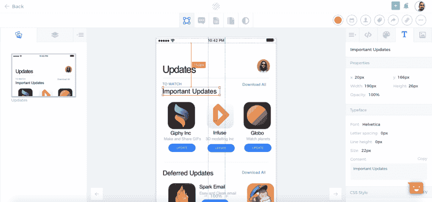

# draftapp.io 诚聘投稿人

> 原文：<https://dev.to/wazery/contributors-wanted-for-draftappio-4ohl>

嗨，

我正在开发一个像 Zeplin.io 和 Invision Inspect 一样的工具，但它是开源的，对优秀的社区完全免费。

这里是工具: [Draftapp](https://www.draftapp.io) ，你可以注册并探索一个演示项目。

*当前堆栈为:*

1.  前端角度为 1.5°
2.  后端的 Rails 5
3.  基于开源插件[的草图插件草图测量](http://utom.design/measure)

所以你可以看到前端是非常过时的，我想在 React 和 Webpack 中重写它的一些帮助。

我们还可以为 Mac 和 Windows 开发一个电子应用程序，那将会非常棒。

我也开始用 Golang 重写后端，以提高效率和性能。

我真的希望为社区提供一个开源工具，拥有当前非开源工具所拥有的所有特性。

这里是一个针对 [Draftapps](https://github.com/draftapps) 的 GitHub 组织。
前端[回购](https://github.com/draftapps/frontend):

如果您对捐款感兴趣，请填写此[表格](https://wazery.typeform.com/to/zYPrZl)；)

