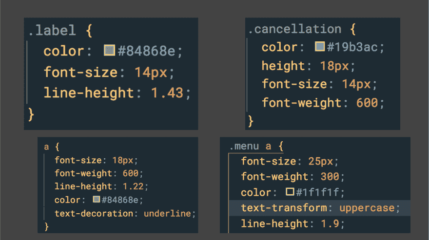
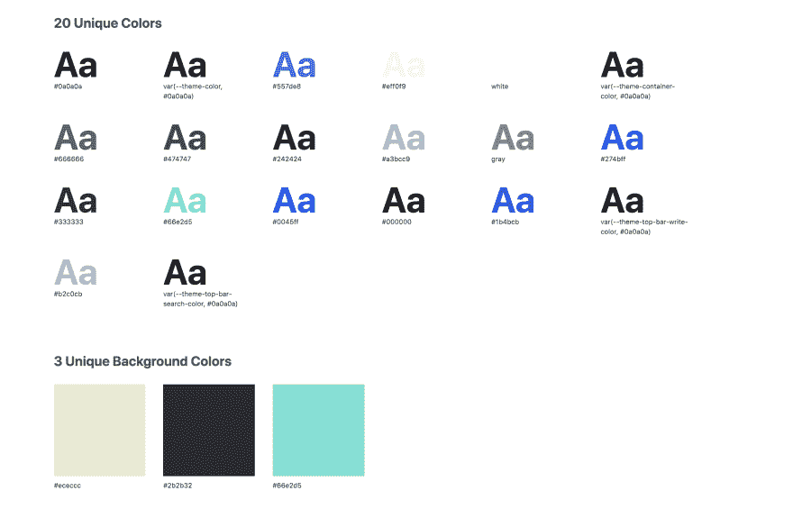
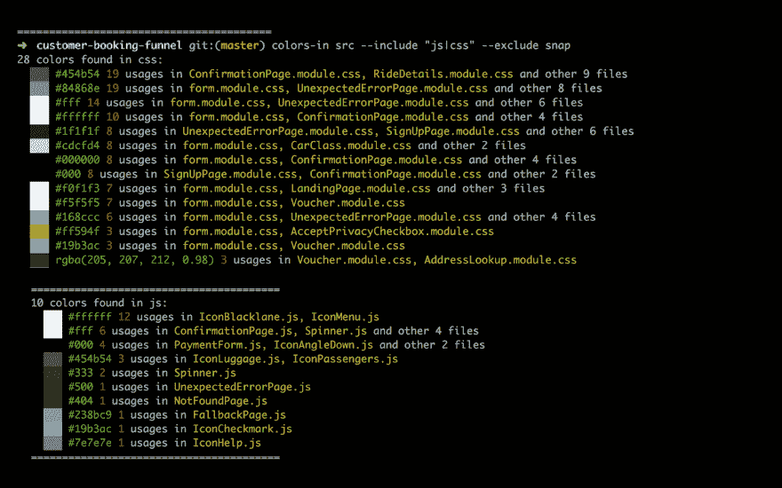
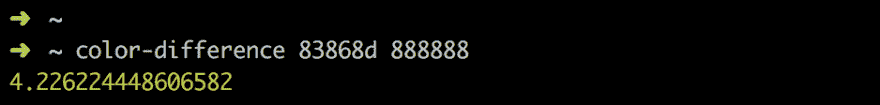
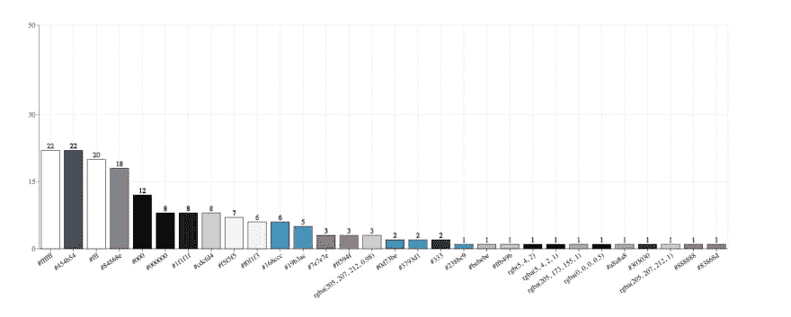
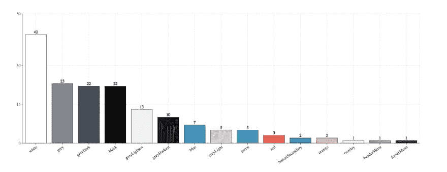

# 控制项目中的颜色

> 原文：<https://dev.to/omaiboroda/control-the-colors-in-your-project-5gf4>

有时你可能会面临这样的项目:

<figure>

<figcaption>Hard case, huh?</figcaption>

</figure>

这会让你的胃有点不舒服。今天我们将特别讨论颜色以及如何组织它们。

## 审核

一个很好的选择是使用在线工具，比如 cssstats.com

<figure>

<figcaption>dev.to on cssstats.com</figcaption>

</figure>

它的问题是，它只显示出现在单个页面上的颜色，所以如果你有代码分割，一些颜色可能会丢失。我需要一些东西来显示源文件中使用的颜色，但是没有任何东西，所以我不得不写一个小工具 [colors-in](https://github.com/omaiboroda/colors-in) 。它遍历文件夹并提取所用的颜色:

<figure>

<figcaption>Colors in src folder</figcaption>

</figure>

## 搞定

有了这个，你就可以查看你的设计 UI 工具包或者与你的设计交流来定义你将在整个项目中使用的颜色。

在这一点上，我们需要“合并”相似的颜色，有一种方法可以做到这一点。由于所有颜色都生活在三维空间中，我们可以计算它们之间的距离:

<figure>

<figcaption>Euclidean distance</figcaption>

</figure>

从我的经验感觉，那些色差小于 10%的颜色可以被弃用，取而代之的是更常用的成对颜色。

<figure>

<figcaption>Difference between two shades of gray with npmjs.com/package/color-difference</figcaption>

</figure>

您可以做的其他事情:

*   将颜色格式统一为十六进制；
*   同意 6 位十六进制格式；
*   删除不必要的不透明层；

在我们的案例中，我们能够将唯一颜色定义的数量从 29 个减少到 14 个:
之前:

<figure>

<figcaption>29 color definitions</figcaption>

</figure>

之后:

<figure>

<figcaption>14 color definitions</figcaption>

</figure>

所以，如果你有“动物园”——做一个审计。或者如果你有条理地保存你的颜色——用`>colors-in src`检查你是否忘记在其他地方使用它；