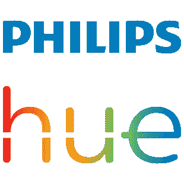

# 从您的 Laravel 代码控制您的飞利浦色调灯

> 原文：<https://dev.to/dennis_smink/control-your-philips-hue-lights-from-your-laravel-code-2bj6>

[](https://res.cloudinary.com/practicaldev/image/fetch/s--YwSinWya--/c_limit%2Cf_auto%2Cfl_progressive%2Cq_auto%2Cw_880/https://cdn-images-1.medium.com/max/310/1%2ANrzQWJCq-Dn3pCputatnyg.png)

最近，我创建了一个软件包来管理我的飞利浦色调灯。我需要一种简单的方法，在发生特殊情况时，给办公室的灯发信号。例如，特殊的事物可以是:

*   新用户注册
*   新支付订单
*   新支持票
*   新时事通讯订阅
*   …等等

以下是该软件包的链接:

[cannonb4ll/laravel-Philips-hue](https://github.com/Cannonb4ll/laravel-philips-hue)

我还在做一些工作，但是基本的东西已经实现并且完全可以工作了。

您可以按 ID 开关灯，也可以在整个组中开关灯。

语法就这么简单:

```
(new HueClient)->lights()->on(1) 
```

一些命令示例:

```
$hue = new HueClient();

$hue->groups()->all();
$hue->lights()->all();
$hue->lights()->get(1);
$hue->lights()->on(1);
$hue->lights()->off(1);
$hue->lights()->customState(1, [
 "hue" => 25500,
 "bri" =>200,
 "alert" => 'select'
]); 
```

你想做什么就做什么！