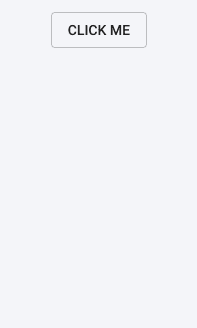
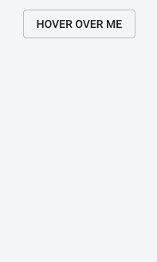
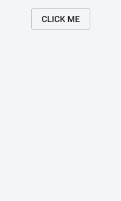

# 在 React 中使用复合组件控制工具提示和弹出菜单

> 原文：<https://dev.to/bnevilleoneill/controlling-tooltips-pop-up-menus-using-compound-components-in-react-539o>

[](https://res.cloudinary.com/practicaldev/image/fetch/s--wQGUNE65--/c_limit%2Cf_auto%2Cfl_progressive%2Cq_auto%2Cw_880/https://cdn-images-1.medium.com/max/1024/1%2ARL8EObVPvcNzqLtDvkgl2A.jpeg)

在与图标、按钮或文本的交互背后隐藏更多的信息是一个让你的界面干净整洁的好方法。这就是工具提示和弹出菜单发挥作用的地方。

本文将向您介绍我在 React 中实现工具提示控制器组件所遵循的方法。虽然我称之为 tooltip，但它可以是当 DOM 中的元素通过单击或悬停进行交互时，您想要显示的任何内容。

[](https://res.cloudinary.com/practicaldev/image/fetch/s--d_p3HRCC--/c_limit%2Cf_auto%2Cfl_progressive%2Cq_66%2Cw_880/https://cdn-images-1.medium.com/max/329/1%2AL90N9_dMREB43yrxRuFS2g.gif) 

<figcaption>中弹出菜单示例。</figcaption>

我在这里将只涉及基本原理。但是，如果您有兴趣查看详细的功能，请查看 Github 资源库以了解完整的项目。

## /[反应-工具提示-控制器](https://github.com/dbilgili/React-Tooltip-Controller)

### 这是一个功能丰富的 React 组件，用于控制工具提示/弹出菜单

<article class="markdown-body entry-content p-5" itemprop="text">

# 反应-工具提示-控制器

这是一个功能丰富的 React 组件，用于控制工具提示。不仅仅是工具提示，你还可以用它来满足各种交互需求。

它无缝集成到您的标记中，而不会破坏它。

访问[示例页面](https://dbilgili.github.io/React-Tooltip-Controller/)了解功能。

| 基本工具提示 | 动画工具提示 | 高级工具提示 |
| --- | --- | --- |
| [](https://user-images.githubusercontent.com/22943912/48679619-e6849000-eb92-11e8-99e7-35e147b5fcc1.gif) | [](https://user-images.githubusercontent.com/22943912/48679620-e6849000-eb92-11e8-8a8b-0499ff333046.gif) | [](https://user-images.githubusercontent.com/22943912/48679621-e6849000-eb92-11e8-8e9a-a8d709b96f82.gif) |

#### 突出

*   支持`click`、`hover`、`hover-hold`和`hover-interact`检测。
*   每个工具提示都可以单独制作动画。
*   设置点击工具提示时是否关闭。
*   通过分配变量来手动关闭工具提示。
*   检索工具提示的状态(无论是否打开)。
*   设置超时以自动关闭工具提示。
*   相对于触发元素定位工具提示。
*   对于动态调整大小的元素，自动将工具提示沿 X 轴居中。

## 安装

`npm install react-tooltip-controller`

安装模块后，导入以下组件:

```
import {ToolTipController, Select} from 'react-tooltip-controller'
```

## 基本用法

```
<ToolTipController
  detect="click"
  offsetY=
```

…</article>

[View on GitHub](https://github.com/dbilgili/React-Tooltip-Controller)
[](https://logrocket.com/signup/)

让我们首先列出工具提示控制器组件的一些基本要求。

*   **它应该无缝集成到现有的 JSX 标记中**

能够将组件集成到您现有的 JSX 中而不引入额外的 HTML 元素(如`<div>`或`<span>`)是很重要的，因为它不会影响 JSX 的输出和样式。

*   它应该出现在所有其他元素之上

很明显，工具提示不应该出现在 DOM 中任何其他元素的下面。在某些情况下，使用 z-index 可能对您没有帮助，因为它的使用并不像看起来那么简单。因此，工具提示应该出现在`<body>`的最底部，以保证它在 DOM 树顶部的层次结构。

*   **需要时应该是交互式的**

被动的工具提示只显示文本或图像，通常不需要任何交互。它甚至可能会在被点击时关闭。但是上面显示的例子，举例来说，要求工具提示在被点击使用按钮/链接时保持活动状态。

考虑下面的代码块，并假设我们想要在一个

*   elements.

    ```
    // vim: syntax=JSX

    render() {
      return (
        <div className="App">
          <div>
            <ul>
              <li>List element-1</li>
              <li>List element-2</li>
              <li>List element-3</li>
            </ul>
          </div>
        </div>
      )
    } 
    ```

    将这个特定的`<li>`元素与我们想要控制的工具提示组件包装在一起，是我们将遵循的方法。

    ```
    // vim: syntax=JSX

    render() {
      return (
        <div className="App">
          <div>
            <ul>
              <li>List element-1</li>
              <Controller>
                <Select><li>List element-2</li></Select>
                <Tooltip/>
              </Controller>
              <li>List element-3</li>
            </ul>
          </div>
        </div>
      )
    } 
    ```

    这将使我们能够灵活地完全控制所选的元素和工具提示组件或我们包含在组件中的 JSX 标记。

    我们可以添加事件监听器、控制样式、获取位置信息等等。当一个或几个组件被另一个组件包装时，这种设计模式通常被称为 ***复合组件。*T3】**

    ### 组件

    我们将创建两个组件:`<Controller>`和`<Select>`。

    `<Controller>`会持有我们要互相通话的那部分代码；工具提示和选定的元素。`<Select>`另一方面，组件将只处理选中的 DOM 元素，它将控制工具提示。

    ### 原料药

    由于`<Controller>`组件将包装两个子组件，我们将使用下面的 React APIs 来处理这些子组件。

    #### 做出反应。儿童

    做出反应。Children 是 React APIs 之一，用于处理组件的子道具，这意味着组件包装的任何东西都可以作为组件内的道具来访问。在 React 上调用 map 方法。children with this . props . children 帮助我们迭代它并从中创建一个新的修改过的子数组。

    #### [T1】react . clone element](#reactcloneelement)

    这个 API 创建一个输入的克隆，并返回一个新的 react 元素。将此与 React 相结合。Children 使我们能够操作我们将要实现的`<Controller>`组件的子组件。

    #### [回应性。createPortal](#reactdomcreateportal)

    因为我们的目标是将工具提示组件安装在主体的最底部，所以我们需要以某种方式防止 React 在默认情况下将它附加到最近的父节点。门户是 React 提供的原生解决方案。我们可以指定在 DOM 中的什么位置安装哪个元素。

    ### 从基础开始

    在我们开始实现详细的功能之前，让我们快速看一下`<Controller>`组件的基本结构。

    ```
    // vim: syntax=JSX

    import React from 'react'
    import ReactDOM from 'react-dom'

    class Controller extends React.Component{
      render(){
        const { children } = this.props

        const inputChildren = React.Children.map(children, child => {
          if(child.type.displayName === "Select"){
            return React.cloneElement(child)
          }
          else{
            return ReactDOM.createPortal(React.cloneElement(child), document.body)
          }
        })
        return inputChildren
      }
    }

    export default Controller 
    ```

    注意 React 的用法。Children with map 函数迭代所有子元素，并使用 React.cloneElement 返回每个子元素的克隆。

    此外，React.createPortal 的使用非常简单，它获取克隆的孩子并将其呈现给 document.body，后者返回 DOM 中的`<body>`元素。

    注意，为了区分`<Controller>`的子元素，我使用了 displayName 属性，稍后它将被定义为`<Select>`组件中的一个静态属性。

    ### 功能性

    下一步是添加以下功能。

    *   向*所选元素*添加事件监听器，以控制工具提示
    *   相对于*所选元素*定位工具提示
    *   检测在工具提示组件外部单击以关闭它
    *   防止工具提示冒泡事件，这样当点击它时它不会关闭

    #### 1。打开工具提示

    [](https://res.cloudinary.com/practicaldev/image/fetch/s--Q8JyGW8d--/c_limit%2Cf_auto%2Cfl_progressive%2Cq_66%2Cw_880/https://cdn-images-1.medium.com/max/207/1%2A1Ou7mKbUWjlQj-k1YMEhEA.gif) 

    <figcaption>将工具提示组件连接到一个元素。</figcaption>

    * *首先创建`<Controller>`
    的状态

    ```
    // vim: syntax=JSX

    state = {
      isOpen: false,
      style: {
        position: "absolute",
        top: 0,
        left: 0,
      }
    } 
    ```

    isOpen 用于安装和卸载工具提示组件/JSX 标记，而 style 用于相对于*选定元素*定位工具提示。默认情况下，工具提示相对于正文绝对定位。因此，通过获取*所选元素的位置和大小信息，*我们可以相对于它定位工具提示。

    **现在，创建控制工具提示状态的函数**

    ```
    // vim: syntax=JSX

    open = () => {
      this.setState({isOpen: true})
    }

    close = () => {
      this.setState({isOpen: false})
    } 
    ```

    接下来，使用 isOpen 和 style 状态分别显示/隐藏和定位工具提示组件。此外，还需要将 open()函数作为道具传递给`<Select>`组件，以便在单击所选元素时，我们可以显示工具提示。

    ```
    // vim: syntax=JSX

    render(){
      const { children } = this.props
      const { isOpen, style } = this.state

      const inputChildren = React.Children.map(children, child => {
        if(child.type.displayName === "Select"){
          return React.cloneElement(child, {open: this.open})
        }
        else{
          return (
            isOpen && ReactDOM.createPortal(
              <span style={style}>{React.cloneElement(child)}</span>, document.body
            )
          )
        }
      })
      return inputChildren
    } 
    ```

    React.cloneElement 的第二个参数是我们传递给`<Select>`组件的新道具。

    让我们看看`<Select>`组件，看看我们如何处理克隆的孩子和道具。

    ```
    // vim: syntax=JSX

    import React from 'react'

    class Select extends React.Component{
      static displayName = "Select"

      render(){
        const { children, open } = this.props
        return React.cloneElement(children, {onClick: open})
      }
    }

    export default Select 
    ```

    > 注意我们之前在`<Controller>`中使用的 displayName 的静态定义。

    虽然我们可以简单地在`<Select>`组件的 render 方法中执行`return children`，但是使用 cloneElement API 使我们能够用 onClick 事件处理程序创建子属性的新克隆。

    我们将 open prop 分配给这个 onClick 事件处理程序，以调用`<Controller>`组件中的 open()函数，结果在屏幕的左上角显示工具提示。

    现在，是时候获取`<Select>`组件中克隆的子元素的位置和大小信息，并将这些数据传递回`<Controller>`以与样式状态一起使用来定位工具提示。

    #### 2。定位工具提示

    [](https://res.cloudinary.com/practicaldev/image/fetch/s--rpEDJa-7--/c_limit%2Cf_auto%2Cfl_progressive%2Cq_66%2Cw_880/https://cdn-images-1.medium.com/max/207/1%2Apj1LRr6W0edl1c-r9WIHMw.gif) 

    <figcaption>相对于某个元素定位工具提示。</figcaption>

    获取元素在`<Select>`组件中的位置需要使用 ref 属性。ReactJS 有自己的创建 refs 的方法。一旦使用 React.createRef()定义了一个 ref 并将其附加到一个元素，就可以在整个组件中引用它。

    ```
    // vim: syntax=JSX

    constructor(){
      super()
      this.selectedElement = React.createRef()
    }

    render(){
      const { children, open } = this.props
      return React.cloneElement(children, {ref: this.selectedElement, onClick: open})
    } 
    ```

    对 selectedElement ref 调用 getBoundingClientRect()方法会返回元素的位置和大小信息。我们将通过在`<Select>`上部署一个函数作为道具，把这个信息从`<Select>`组件传递到`<Controller>`组件。

    ```
    // vim: syntax=JSX

    getPos = (left, top, height) => {
      this.setState(prevState => ({style: {...prevState.style, left, top: top + height}}))
    }

    // return React.cloneElement(child, {open: this.open, getPos: this.getPos}) 
    ```

    一旦 getPos()函数作为道具可用于`<Select>`组件，在 componentDidMount 生命周期挂钩内调用它将更新`<Component>`的样式状态变量，并将工具提示定位在所选元素的左下方。

    ```
    // vim: syntax=JSX

    state = {
      isOpen: false,
      style: {
        position: "absolute",
        top: 0,
        left: 0,
      }
    } 
    ```

    #### 3。关闭工具提示

    [](https://res.cloudinary.com/practicaldev/image/fetch/s--HAF1hy9F--/c_limit%2Cf_auto%2Cfl_progressive%2Cq_66%2Cw_880/https://cdn-images-1.medium.com/max/207/1%2A72ErS1trXeuywoN78EqSgw.gif) 

    <figcaption>切换提示栏。</figcaption>

    到目前为止，我们通过一个*选择的元素*来控制工具提示，并相对于这个元素来定位它。现在，下一件事是实现当在工具提示之外单击时关闭工具提示的机制。

    监听窗口对象上的 click 事件并切换 isOpen 状态变量非常简单。然而，这种方法需要一些小技巧才能正常工作。

    考虑下面来自`<Controller>`组件的片段。

    ```
    // vim: syntax=JSX

    componentDidUpdate(){
      if(this.state.isOpen){
        window.addEventListener('click', this.close)
      }
      else{
        window.removeEventListener('click', this.close)
      }
    } 
    ```

    当组件更新时，我们根据工具提示的状态为窗口对象添加或删除事件监听器。但是，这种尝试会导致工具提示几乎同时打开和关闭。

    对于这个问题，我想到了两种不同的解决方案:

    1.  不是同时监听 foropen()和 close()函数的 click 事件，而是分别监听 close()和 open()函数的 tomousedown 和 mouseup，以防止调用 close()函数，因为它监听在工具提示打开之前发生的 mousedown 事件。

    然而，如果您试图通过点击*所选元素来关闭工具提示，这种方法就会失败。*

    1.  就其背后的推理而言，第二种方法更先进一些。使用延迟为 0 毫秒或未定义任何时间延迟的 setTimeout 方法，将下一个事件循环要执行的新任务排队。虽然使用 0 毫秒通常描述了应该立即执行的任务，但 JavaScript 的单线程同步特性并非如此。当使用 setTimeout 时，它只是创建一个异步回调。您可以参考具体的 [MDN web 文档](https://developer.mozilla.org/en-US/docs/Web/JavaScript/EventLoop#Zero_delays)了解关于该主题的详细说明。

    下面的代码片段确保在执行了与*所选元素*的交互任务后，将添加或删除事件监听器。

    ```
    // vim: syntax=JSX

    componentDidUpdate(){
      setTimeout(() => {
        if(this.state.isOpen){
          window.addEventListener('click', this.close)
        }
        else{
          window.removeEventListener('click', this.close)
        }
      }, 0)
    } 
    ```

    尽管点击*选中的元素*调用 open()函数，window 对象上的事件监听器调用 close()函数并关闭工具提示。

    #### 4。防止事件冒泡

    [](https://res.cloudinary.com/practicaldev/image/fetch/s--JIng8VIh--/c_limit%2Cf_auto%2Cfl_progressive%2Cq_66%2Cw_880/https://cdn-images-1.medium.com/max/207/1%2AEypcod9_hWGK-HqarXYtlQ.gif) 

    <figcaption>防止事件在工具提示上冒泡。</figcaption>

    如前所述，在某些特定情况下，您可能需要防止工具提示在被点击时关闭。点击工具提示调用 close()函数的原因是**事件冒泡**的结果。

    当一个事件(比如 onClick)发生在一个元素上时，它也会在父元素和所有其他祖先元素上被调用。在我们的例子中，由于 tooltip 是 body 的子体，并且 body 附加了一个 click 事件，所以单击 tooltip 最终会调用附加到 body 上的 click 事件的函数。

    为了防止这种现象，我们需要在子元素的 click 处理程序上明确指定事件不应该向上冒泡到祖先。

    event.stopPropagation()方法是我们需要在 onClick 事件处理程序上使用的方法，以阻止 onClick 事件在 DOM 中进一步传播。

    ```
    // vim: syntax=JSX

    return (
      isOpen && ReactDOM.createPortal(
        <span onClick={e => e.stopPropagation()} style={style}>{React.cloneElement(child)}</span>, document.body
      )
    ) 
    ```

    ### 结论

    通读本文后，您应该熟悉提到的 React APIs，并对如何利用和组合它们来构造复合组件以完成更具体的任务有一个总体的想法。让不同的组件在内部相互交流可以让你的代码更加结构化和有目的。

    * * *

    ### Plug: [LogRocket](https://logrocket.com/signup/) ，一款适用于网络应用的 DVR

    [](https://logrocket.com/signup/)

    <figcaption>[https://logrocket.com/signup/](https://logrocket.com/signup/)</figcaption>

    LogRocket 是一个前端日志工具，可以让你回放问题，就像它们发生在你自己的浏览器中一样。LogRocket 不需要猜测错误发生的原因，也不需要向用户询问截图和日志转储，而是让您重放会话以快速了解哪里出错了。它可以与任何应用程序完美配合，不管是什么框架，并且有插件可以记录来自 Redux、Vuex 和@ngrx/store 的额外上下文。

    除了记录 Redux 操作和状态，LogRocket 还记录控制台日志、JavaScript 错误、堆栈跟踪、带有头+正文的网络请求/响应、浏览器元数据和自定义日志。它还使用 DOM 来记录页面上的 HTML 和 CSS，甚至为最复杂的单页面应用程序重新创建像素级完美视频。

    免费试用。

    * * *

    在 React 中使用复合组件的帖子[控制工具提示&弹出菜单最早出现在](https://blog.logrocket.com/controlling-tooltips-pop-up-menus-using-compound-components-in-react-ccedc15c7526/)[日志博客](https://blog.logrocket.com)上。