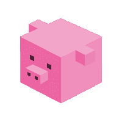
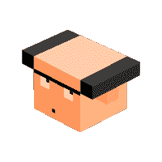
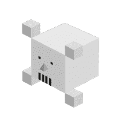
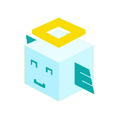

# 轻松交谈

> 原文：<https://dev.to/ijlee2/converse-with-ease-4274>

在我的演讲会上，我做了一个关于如何进行有意义的对话并对你的生活产生积极影响的演讲。我鼓励你在下次会议和社交活动中应用这些经验！

* * *

今天，我要谈谈为什么对话很重要，如何进行不同类型的对话，以及如何在这次会议后运用今天学到的知识。

交谈是我们生活中重要的一部分。我们交谈是为了了解某人，同时也让他们了解我们。我们交谈是为了分享想法和消除误解。我们交谈是因为**我们渴望与人接触**。对我们来说，每一段友谊都始于一次交谈。

谈话也可能会令人生畏，尤其是当我们在一个新的地方遇到新的人时。如果你是一个从未来过这个俱乐部的客人，你可能会在进来时感到害怕，想知道，*我必须和任何人说话吗？*答案是*是的，你应该*，原因如下。

三月份，我在波特兰参加一个科技会议。这是我第一次参加，有来自世界各地的 1000 多人参加。我把和尽可能多的人交谈和尽可能多的和他们在一起作为我的使命。由于我的努力，我建立了 30 多个专业联系，我加入了这项技术背后的一个官方团队，我只是玩得很开心，离开了会议，希望明年再回来。如果我没有交谈，我就不会获得这些好处。

我成功的秘诀是知道如何进行不同类型的对话。在基本水平上，我能进行小谈话。在下一个层次，我可以谈论关于我自己的事实。而在最后一个层面，我可以说说我的想法，我的感受。对于每个级别，让我告诉你我在会议上做了什么。

在第一阶段——闲聊——我从自我介绍开始。*嗨，我是艾萨克！很高兴见到你。*一旦对方做了自我介绍，我就努力寻找我们双方都能认同的话题。*这是我的第一次会议，我很高兴来到这里。你呢？这也是你第一次吗？*

如果是他们的第一次，那太好了！我刚发现了我们的共同点。如果这不是他们的第一次，那也很好，因为现在，我有一个了解波特兰的人，我可以向他推荐食物(每个人都吃)，咖啡(每个开发人员都喝)，以及其他喜欢的当地景点(每个人都有一个)。

这些都是我们可以轻松进行的小谈话，但可以帮助我们了解对方的一些情况。这后半部分很重要。不管多小，谈论一些有助于我们了解他人的事情。天气不是闲聊。除非你和对方都是气象学家，否则你应该留意奥斯卡·王尔德的话:“关于天气的谈话是缺乏想象力的人最后的避难所。”

在第二阶段——事实——我谈论我做什么，并问他们做什么。*我从事开发工作是因为我想成为团队的一员。*这是事实。*我能问一下你是如何成为一名开发者的吗？*

那个简单的词— **如何？**—可以很厉害。这不仅表明我们对他们感兴趣，也为后续问题打开了许多大门。我们可以很容易地使我们的谈话更长，更有意义。

我也喜欢问，*工作之外你喜欢做什么？因为我知道他们不仅仅是一名开发者。如果他们喜欢做的事情和你喜欢做的事情没有重叠也没关系。把它作为一个机会去了解他们和他们的爱好。*

再问**为什么**。让你的谈话开放式。

最后，在第三个层次——感受和想法——我敞开心扉，以此作为信任和有兴趣更多地了解他人的标志。在这个阶段，倾听成为一项至关重要的技能。*最近，我一直觉得自己被困在工作中。我已经到了不能再进一步学习的地步了。你对我能做什么有建议吗？*

开发者——他们会让你大吃一惊。没有其他职业让人们乐于互相帮助。他们喜欢为开源做贡献。他们喜欢在空闲时间做导师。他们甚至与可能为其竞争对手工作的开发人员分享知识和经验。

这个问题，*可以给我建议吗？*，就是我怎么加入官方团队的。我与之交谈的人 Kenneth 恰好是这个团队的成员。尽管 Kenneth 来自不同的国家，有着不同的背景，但他能够理解我作为一名开发人员所经历的事情，并提供一个解决方案— *加入我的团队，在工作之外学习更多的技术知识*。

你有过那样的**偶遇**吗？我打赌是从一次谈话开始的。

总之，很容易进行一场有意义的对话，并对你的生活产生积极影响。关键是知道如何进行不同类型的对话。有一级，小谈；第二层，事实；第三层，感觉和想法。

在我们的会议之后，我要求你和你的邻居交谈，特别是如果你以前从未见过他们的话。会后我们还会一起吃晚餐。看看今晚你如何利用三个层次的对话来更好地了解他们。