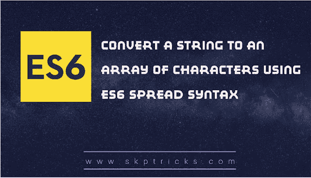

# 使用 ES6 扩展语法将字符串转换为字符数组

> 原文：<https://dev.to/skptricks/convert-a-string-to-an-array-of-characters-using-es6-spread-syntax-3b1e>

Post Link : [使用 ES6 spread 语法将字符串转换为字符数组](https://www.skptricks.com/2018/12/convert-string-to-array-of-characters-using-es6-js.html)

本教程解释了如何使用 ES6 扩展语法将字符串转换为字符数组。让我们看看下面的例子，我们使用 split 方法和 spread 操作符将字符串转换为字符数组。

方法-1 :
让我们看看这个例子，我们使用 split 方法将字符串转换成一个字符数组。
var word = "skptricks 博客"

//使用 javascript split 函数。
var get data = word . split(" ")；

console.log(getData)

## 输出:-

> 数组["s "，" k "，" p "，" t "，" r "，" I "，" c "，" k "，" s "，" B "，" l "，" o "，" g]]

[使用 ES6 扩展语法将字符串转换为字符数组](https://www.skptricks.com/2018/12/convert-string-to-array-of-characters-using-es6-js.html)

[继续阅读...](https://www.skptricks.com/2018/12/convert-string-to-array-of-characters-using-es6-js.html)