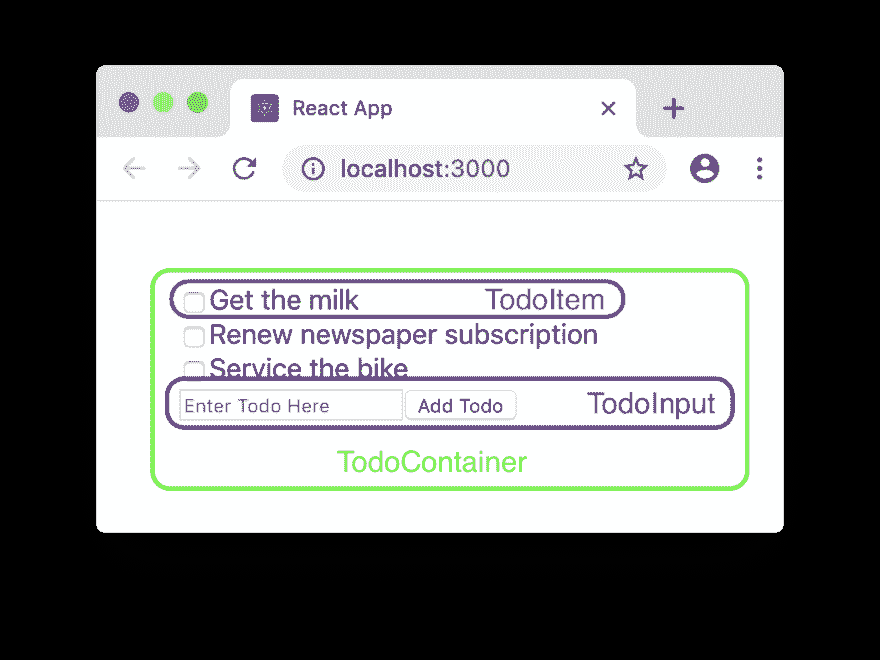

# 使用钩子将 React 类组件转换为函数组件

> 原文：<https://dev.to/asleepysamurai/converting-react-class-components-to-function-components-using-hooks-56dl>

在过去的一个月中，我花了很多时间使用 React hooks，并使用 hooks 构建功能组件，而不是传统的基于类的组件。我不会说钩子一定优于基于类的组件，但是在将组件写成功能组件时，可用性会有很大的提高，特别是因为这些功能组件现在可以通过使用 React 钩子来访问状态和生命周期。

在本文中，我将向您展示如何将基于类的 React 组件转换为函数组件，用 React 钩子代替基于类的`setState`和生命周期方法，如`componentWillMount`、`componentWillReceiveProps`。

因此，让我们首先构建一个基于类的 React 组件，它利用状态和生命周期方法。为此，我们当然要构建传统的 React Todo 应用程序。

我们的 Todo 应用程序将如下所示:

*   文本输入，您可以在其中键入新的待办事项。
*   “添加待办事项”按钮，点击该按钮，文本输入中的新待办事项被添加到待办事项列表中。
*   显示每个单独待办事项的列表。
*   每个单独的待办事项都有一个关联的复选框，可用于将该项标记为已完成。
*   todos 保存在本地存储中，并在应用程序启动时再次从本地存储中加载。

我们的组件将使用`state`、`componentDidMount`、`componentDidUpdate`和`getDerivedStateFromProps`生命周期方法。这些方法中的一些(我正看着你`getDerivedStateFromProps`)以一种非常做作的方式被使用，为了能够演示基于钩子的替换看起来会是什么样子。

* * *

##### 构建基于类的 Todo 应用

我们的 todo 应用程序将实现为三个不同的组件，如下所示:

[](https://res.cloudinary.com/practicaldev/image/fetch/s--PgS7Y6RR--/c_limit%2Cf_auto%2Cfl_progressive%2Cq_auto%2Cw_880/https://asleepysamurai.com/articles/converting-react-class-components-to-function-components-using-hooks/img/components.png)

> 这些例子的完整代码可以在 [Github](https://github.com/asleepysamurai/example-react-class-to-function-component) 上找到。使用标签在类组件和函数组件之间导航。

我们先来看看`TodoContainer`组件。这个组件在`state`的任何时候都维护应用程序的完整状态。它有两个方法`addTodoItem`和`toggleItemCompleted`，分别作为回调传递给`TodoInput`和`TodoItem`组件，用于添加一个新的待办事项，并将一个项目标记为完成或未完成。

此外，`TodoContainer`组件利用`componentDidMount`生命周期方法从`localStorage`中加载保存的待办事项。如果没有保存的 todo 项，那么一个空列表被实例化为`TodoContainer`组件的状态。`TodoContainer`也使用`componentDidUpdate`生命周期方法将`TodoContainer`组件的状态保存到`localStorage`。这样，无论何时对`TodoContainer`的`state`进行更改，它都会保存到`localStorage`中，并且可以在重新启动应用程序时恢复。

将所有这些放在一起，`TodoContainer`组件看起来像这样:

```
/**
 * Todo Root Container Component
 */

import React, { Component } from 'react';
import TodoItem from './TodoItem';
import TodoInput from './TodoInput';

class Todo extends Component {
    constructor(props) {
        super(props);

        this.state = {
            todoItems: [],
            completedItemIds: []
        };
    }

    generateID() {
        return Date.now().toString(36) + '-' + (Math.random() + 1).toString(36).substring(7);
    }

    addTodoItem = (text) => {
        const newTodoItem = {
            text,
            id: this.generateID()
        };

        const todoItems = this.state.todoItems.concat([newTodoItem]);
        this.setState({ todoItems });
    }

    toggleItemCompleted = (todoItemId) => {
        const todoItemIndexInCompletedItemIds = this.state.completedItemIds.indexOf(todoItemId);

        const completedItemIds = todoItemIndexInCompletedItemIds === -1 ?
            this.state.completedItemIds.concat([todoItemId]) :
            ([
                ...this.state.completedItemIds.slice(0, todoItemIndexInCompletedItemIds),
                ...this.state.completedItemIds.slice(todoItemIndexInCompletedItemIds + 1)
            ]);

        this.setState({ completedItemIds });
    }

    componentDidMount() {
        let savedTodos = localStorage.getItem('todos');

        try {
            savedTodos = JSON.parse(savedTodos);
            this.setState(Object.assign({}, this.state, savedTodos));
        } catch (err) {
            console.log('Saved todos non-existent or corrupt. Trashing saved todos.');
        }
    }

    componentDidUpdate() {
        localStorage.setItem('todos', JSON.stringify(this.state));
    }

    render() {
        const todoList = this.state.todoItems.map(todoItem => {
            return (
                <TodoItem
                    key={todoItem.id}
                    completedItemIds={this.state.completedItemIds}
                    toggleItemCompleted={this.toggleItemCompleted}
                    {...todoItem} />
            );
        });

        const todoInput = (
            <TodoInput
                onAdd={this.addTodoItem} />
        );

        return (
            <div
                className="todo-container">
                {todoList}
                {todoInput}
            </div>
        );
    }
};

export default Todo; 
```

接下来让我们看看`TodoInput`组件。这是一个非常简单的组件，由一个文本输入和一个按钮组成。组件使用自己的`state`来跟踪文本输入的值，并在点击按钮时，将文本传递给由`TodoContainer`组件作为`onAdd`属性传入的`addTodoItem`方法。

`TodoInput`组件看起来像这样:

```
/**
 * TodoInput Component
 */

import React, { Component } from 'react';

class TodoInput extends Component {
    constructor(props) {
        super(props);

        this.state = {
            text: ''
        };
    }

    onTextChange = (ev) => {
        this.setState({ text: ev.currentTarget.value });
    }

    addTodoItem = () => {
        this.props.onAdd(this.state.text);
        this.setState({ text: '' });
    }

    render() {
        return (
            <div
                className="todo-input">
                <input
                    type="text"
                    onChange={this.onTextChange}
                    value={this.state.text}
                    placeholder="Enter Todo Here" />
                <button
                    onClick={this.addTodoItem}>
                    Add Todo
                </button>
            </div>
        );
    }
};

export default TodoInput; 
```

最后是`TodoItem`组件。这是另一个简单的组件，它基本上由一个复选框和一个标签组成，前者指示 todo 项是否完成，后者指定 todo 项的文本。为了演示`getDerivedStateFromProps`的用法，`TodoItem`组件从`TodoContainer`组件获取整个`completedItemIds`作为道具，并使用它来计算这个特定的`TodoItem`是否完整。

`TodoItem`组件看起来像这样:

```
/**
 * TodoItem Component
 */

import React, { Component } from 'react';

class TodoItem extends Component {
    constructor(props) {
        super(props);

        this.state = {
            completed: false
        };
    }

    toggleItemCompleted = () => {
        this.props.toggleItemCompleted(this.props.id);
    }

    static getDerivedStateFromProps(props, state) {
        const todoItemIndexInCompletedItemIds = props.completedItemIds.indexOf(props.id);

        return { completed: todoItemIndexInCompletedItemIds > -1 };
    }

    render() {
        return (
            <div
                className="todo-item">
                <input
                    id={`completed-${this.props.id}`}
                    type="checkbox"
                    onChange={this.toggleItemCompleted}
                    checked={this.state.completed} />
                <label>{this.props.text}</label>
            </div>
        );
    }
};

export default TodoItem; 
```

* * *

##### 上瘾时要记住的规则

为了演示我们将用来转换我们的 Todo 应用程序以使用 React 函数组件的各种 React 挂钩，我将从简单的挂钩开始，然后转到更复杂的挂钩。但是在我们这样做之前，让我们快速地看一下在使用钩子时要记住的最重要的规则。

*   挂钩只能从 React 函数组件或另一个挂钩中调用。
*   在渲染单个组件时，相同的钩子应该以相同的顺序调用相同的次数。这意味着钩子不能在循环或条件块中调用，而必须总是在函数的顶层调用。

这些使用钩子的规则背后的原因是一个主题，它本身可以成为一篇文章，如果你有兴趣阅读更多关于这方面的内容，你应该在 React 官方文档网站上查看钩子的规则。

现在，我们知道了使用钩子时要遵循的基本规则，让我们继续并开始转换我们的 Todo 应用程序以使用函数组件。

* * *

##### 功能组件为我们的待办事宜 App

最简单的，也可能是你最终会用到最多的一个钩子是`useState`钩子。`useState`钩子基本上为您提供了一个 setter 和一个 getter 来操作组件上的单个状态属性。`useState`挂钩有以下签名:

```
const [value, setValue] = useState(initialValue); 
```

第一次调用钩子时，用`initialValue`初始化状态项。在对`useState`的后续调用中，将返回之前设置的值，以及一个 setter 方法，该方法可用于为特定的状态属性设置一个新值。

所以让我们使用`useState`钩子将`TodoInput`组件转换成一个函数组件。

```
/**
 * TodoInput Component
 */

import React, { useState } from 'react';

function TodoInput({
    onAdd
}) {
    const [text, setText] = useState('');

    const onTextChange = (ev) => setText(ev.currentTarget.value);

    const addTodoItem = () => {
        onAdd(text);
        setText('');
    };

    return (
        <div
            className="todo-input">
            <input
                type="text"
                onChange={onTextChange}
                value={text}
                placeholder="Enter Todo Here" />
            <button
                onClick={addTodoItem}>
                Add Todo
            </button>
        </div>
    );
};

export default TodoInput; 
```

正如你所看到的，我们使用`useState`来获得`text`状态属性值和`setText`设置值，它们是从`useState`方法中获得的。`onTextChange`和`addTodoItem`方法都被改为使用`setText` setter 方法，而不是`setState`。

* * *

您可能已经注意到，`input`的`onChange`事件处理程序，以及`Add Todo`按钮`onClick`事件处理程序都是匿名函数，在渲染过程中创建，正如您可能知道的，这对于性能来说并不是很好，因为对函数的引用在渲染之间会发生变化，从而迫使 React 重新渲染`input`和`button`。

为了避免这些不必要的重新渲染，我们需要保持对这些函数的引用不变。这就是我们将要使用的下一个钩子`useCallback`出现的地方。`useCallback`具有以下签名:

```
const memoizedFunction = useCallback(inlineFunctionDefinition, memoizationArguments); 
```

其中:

*   `inlineFunctionDefinition` -是您希望在渲染之间保持引用的函数。这可以是内联匿名函数，也可以是从其他地方导入的函数。然而，由于在大多数情况下我们想要引用组件的状态变量，我们将把它定义为一个内联函数，这将允许我们使用闭包来访问状态变量。
*   `memoizationArguments`-`inlineFunctionDefinition`函数引用的参数数组。第一次调用`useCallback`钩子时，`memoizationArguments`和`inlineFunctionDefinition`一起被保存。在随后的调用中，新的`memoizationArguments`数组中的每个元素与先前保存的`memoizationArguments`数组中相同索引处的元素值进行比较，如果没有变化，则返回先前保存的`inlineFunctionDefinition`，从而保留引用，并防止不必要的重新呈现。如果任何参数已经改变，那么保存并使用`inlineFunctionDefinition`和新的`memoizationArguments`，从而改变对函数的引用，并确保重新渲染。

所以改编`TodoInput`来使用`useCallback`:

```
/**
 * TodoInput Component
 */

import React, { useState, useCallback } from 'react';

function TodoInput({
    onAdd
}) {
    const [text, setText] = useState('');

    const onTextChange = useCallback((ev) => setText(ev.currentTarget.value), [setText]);

    const addTodoItem = useCallback(() => {
        onAdd(text);
        setText('');
    }, [onAdd, text, setText]);

    return (
        <div
            className="todo-input">
            <input
                type="text"
                onChange={onTextChange}
                value={text}
                placeholder="Enter Todo Here" />
            <button
                onClick={addTodoItem}>
                Add Todo
            </button>
        </div>
    );
};

export default TodoInput; 
```

* * *

既然我们已经将`TodoInput`转换为一个函数组件，让我们对`TodoItem`做同样的事情。使用`useState`和`useCallback`、`TodoItem`改写成:

```
/**
 * TodoItem Component
 */

import React, { useState, useCallback } from 'react';

function TodoItem({
    id,
    text,
    toggleItemCompleted,
    completedItemIds
}) {
    const [completed, setCompleted] = useState(false);

    const onToggle = useCallback(() => {
        toggleItemCompleted(id);
    }, [toggleItemCompleted, id]);

    return (
        <div
            className="todo-item">
            <input
                id={`completed-${id}`}
                type="checkbox"
                onChange={onToggle}
                checked={completed} />
            <label>{text}</label>
        </div>
    );
};

export default TodoItem; 
```

如果您将其与类组件版本的`TodoItem`进行比较，您会注意到，我们用来确定这个特定的`TodoItem`是否完成的`getDerivedStateFromProps`在函数组件版本中丢失了。那么我们将使用哪个钩子来实现它呢？

没有特定的钩子来实现这一点。相反，我们必须将它作为渲染函数本身的一部分来实现。所以一旦我们实现了它，`TodoItem`看起来就像这样:

```
/**
 * TodoItem Component
 */

import React, { useState, useCallback } from 'react';

function TodoItem({
    id,
    text,
    toggleItemCompleted,
    completedItemIds
}) {
    const [completed, setCompleted] = useState(false);

    const todoItemIndexInCompletedItemIds = completedItemIds.indexOf(id);
    const isCompleted = todoItemIndexInCompletedItemIds > -1;

    if (isCompleted !== completed) {
        setCompleted(isCompleted);
    }

    const onToggle = useCallback(() => {
        toggleItemCompleted(id);
    }, [toggleItemCompleted, id]);

    return (
        <div
            className="todo-item">
            <input
                id={`completed-${id}`}
                type="checkbox"
                onChange={onToggle}
                checked={completed} />
            <label>{text}</label>
        </div>
    );
};

export default TodoItem; 
```

您可能会注意到，在组件呈现期间，我们调用了`setCompleted` state setter 方法。在编写类组件时，我们从不在`render`方法中调用`setState`，那么为什么这在函数组件中是可以接受的呢？

这在功能组件中是允许的，特别是允许我们执行`getDerivedStateFromProps`式的动作。要记住的一件重要事情是，要确保在函数组件内部，我们总是在条件块内部调用状态设置器方法。否则，我们将陷入无限循环。

> 请注意，我在这里实现`isCompleted`检查的方式有点做作，是为了演示从函数组件内部设置状态。理想情况下，不使用`completed`状态，计算出的`isCompleted`值将用于设置复选框的`checked`状态。

* * *

最后，我们只需要转换`TodoContainer`组件。我们需要实现`state`以及`componentDidMount`和`componentDidUpdate`生命周期方法。

既然我们已经看到了`useState`，我也没有一个好的借口来演示`useReducer`，我将假装`TodoContainer`组件的状态太复杂，无法使用`useState`单独管理每个状态属性，并且更好的选择是使用`useReducer`。

`useReducer`钩子的签名，看起来是这样的:

```
const [state, dispatch] = useReducer(reducerFunction, initialState, stateInitializerFunction); 
```

其中:

*   `reducerFunction` -是将现有的`state`和一个`action`作为输入，返回一个新的`state`作为输出的函数。这对于使用过 Redux 及其 reducers 的人来说应该很熟悉。
*   `initialState` -如果没有提供`stateInitializerFunction`，那么这就是组件的初始`state`对象。如果提供了一个`stateInitializerFunction`，它将作为参数传递给该函数。
*   `stateInitializerFunction` -允许您执行组件状态的惰性初始化的功能。`initialState`参数将作为参数传递给这个函数。

因此将`TodoContainer`组件转换为使用`useReducer`:

```
/**
 * Todo Root Container Component
 */

import React, { useReducer, useCallback } from 'react';
import TodoItem from './TodoItem';
import TodoInput from './TodoInput';

const generateID = () => {
    return Date.now().toString(36) + '-' + (Math.random() + 1).toString(36).substring(7);
};

const reducer = (state, action) => {
    if (action.type === 'toggleItemCompleted') {
        const { todoItemId } = action;
        const todoItemIndexInCompletedItemIds = state.completedItemIds.indexOf(todoItemId);

        const completedItemIds = todoItemIndexInCompletedItemIds === -1 ?
            state.completedItemIds.concat([todoItemId]) :
            ([
                ...state.completedItemIds.slice(0, todoItemIndexInCompletedItemIds),
                ...state.completedItemIds.slice(todoItemIndexInCompletedItemIds + 1)
            ]);

        return { ...state, completedItemIds };
    }

    if (action.type === 'addTodoItem') {
        const newTodoItem = {
            text: action.text,
            id: generateID()
        };

        const todoItems = state.todoItems.concat([newTodoItem]);
        return { ...state, todoItems };
    }

    return state;
};

const initialState = {
    todoItems: [],
    completedItemIds: []
};

function Todo() {
    const [state, dispatch] = useReducer(reducer, initialState);

    const toggleItemCompleted = useCallback((todoItemId) => {
        dispatch({ type: 'toggleItemCompleted', todoItemId });
    }, [dispatch]);

    const todoList = state.todoItems.map(todoItem => {
        return (
            <TodoItem
                key={todoItem.id}
                completedItemIds={state.completedItemIds}
                toggleItemCompleted={toggleItemCompleted}
                {...todoItem} />
        );
    });

    const addTodoItem = useCallback((text) => {
        dispatch({ type: 'addTodoItem', text });
    }, [dispatch]);

    const todoInput = (
        <TodoInput
            onAdd={addTodoItem} />
    );

    return (
        <div
            className="todo-container">
            {todoList}
            {todoInput}
        </div>
    );
};

export default Todo; 
```

* * *

接下来我们需要将`TodoContainer`组件的状态写入`localStorage`，每当组件更新时，类似于我们在`componentDidUpdate`中所做的。为此，我们将使用`useEffect`挂钩。在组件的每一次渲染完成后，`useEffect`钩子允许我们将一个特定的动作加入队列。它的签名是:

```
useEffect(enqueuedActionFunction); 
```

只要你遵守我们之前谈到的钩子规则，你可以在你的函数组件的任何地方插入一个`useEffect`块。如果你有多个`useEffect`块，它们将被依次执行。`useEffect`的总体思想是执行任何不直接影响`useEffect`块中组件的动作(例如:API 调用、DOM 操作等)。).

我们可以使用`useEffect`来确保在我们的`TodoContainer`的每一次渲染之后，组件的状态都被写入`localStorage`。

```
/**
 * Todo Root Container Component
 */

import React, { useReducer, useCallback, useEffect } from 'react';
import TodoItem from './TodoItem';
import TodoInput from './TodoInput';

const generateID = () => {
    return Date.now().toString(36) + '-' + (Math.random() + 1).toString(36).substring(7);
};

const reducer = (state, action) => {
    if (action.type === 'toggleItemCompleted') {
        const { todoItemId } = action;
        const todoItemIndexInCompletedItemIds = state.completedItemIds.indexOf(todoItemId);

        const completedItemIds = todoItemIndexInCompletedItemIds === -1 ?
            state.completedItemIds.concat([todoItemId]) :
            ([
                ...state.completedItemIds.slice(0, todoItemIndexInCompletedItemIds),
                ...state.completedItemIds.slice(todoItemIndexInCompletedItemIds + 1)
            ]);

        return { ...state, completedItemIds };
    }

    if (action.type === 'addTodoItem') {
        const newTodoItem = {
            text: action.text,
            id: generateID()
        };

        const todoItems = state.todoItems.concat([newTodoItem]);
        return { ...state, todoItems };
    }

    return state;
};

const initialState = {
    todoItems: [],
    completedItemIds: []
};

function Todo() {
    const [state, dispatch] = useReducer(reducer, initialState);

    useEffect(() => {
        localStorage.setItem('todos', JSON.stringify(state));
    });

    const toggleItemCompleted = useCallback((todoItemId) => {
        dispatch({ type: 'toggleItemCompleted', todoItemId });
    }, [dispatch]);

    const todoList = state.todoItems.map(todoItem => {
        return (
            <TodoItem
                key={todoItem.id}
                completedItemIds={state.completedItemIds}
                toggleItemCompleted={toggleItemCompleted}
                {...todoItem} />
        );
    });

    const addTodoItem = useCallback((text) => {
        dispatch({ type: 'addTodoItem', text });
    }, [dispatch]);

    const todoInput = (
        <TodoInput
            onAdd={addTodoItem} />
    );

    return (
        <div
            className="todo-container">
            {todoList}
            {todoInput}
        </div>
    );
};

export default Todo; 
```

* * *

接下来，每当组件被安装时，我们需要从`localStorage`恢复状态，类似于我们在`componentDidMount`中所做的。现在没有特定的钩子来执行这个，但是我们可以使用`useReducer`钩子惰性初始化函数(只在第一次渲染时调用)，来实现这个。

```
/**
 * Todo Root Container Component
 */

import React, { useReducer, useCallback, useEffect } from 'react';
import TodoItem from './TodoItem';
import TodoInput from './TodoInput';

const generateID = () => {
    return Date.now().toString(36) + '-' + (Math.random() + 1).toString(36).substring(7);
};

const reducer = (state, action) => {
    if (action.type === 'toggleItemCompleted') {
        const { todoItemId } = action;
        const todoItemIndexInCompletedItemIds = state.completedItemIds.indexOf(todoItemId);

        const completedItemIds = todoItemIndexInCompletedItemIds === -1 ?
            state.completedItemIds.concat([todoItemId]) :
            ([
                ...state.completedItemIds.slice(0, todoItemIndexInCompletedItemIds),
                ...state.completedItemIds.slice(todoItemIndexInCompletedItemIds + 1)
            ]);

        return { ...state, completedItemIds };
    }

    if (action.type === 'addTodoItem') {
        const newTodoItem = {
            text: action.text,
            id: generateID()
        };

        const todoItems = state.todoItems.concat([newTodoItem]);
        return { ...state, todoItems };
    }

    return state;
};

const initialState = {
    todoItems: [],
    completedItemIds: []
};

const initState = (state) => {
    let savedTodos = localStorage.getItem('todos');

    try {
        savedTodos = JSON.parse(savedTodos);
        return Object.assign({}, state, savedTodos);
    } catch (err) {
        console.log('Saved todos non-existent or corrupt. Trashing saved todos.');
        return state;
    }
};

function Todo() {
    const [state, dispatch] = useReducer(reducer, initialState, initState);

    useEffect(() => {
        localStorage.setItem('todos', JSON.stringify(state));
    });

    const toggleItemCompleted = useCallback((todoItemId) => {
        dispatch({ type: 'toggleItemCompleted', todoItemId });
    }, [dispatch]);

    const todoList = state.todoItems.map(todoItem => {
        return (
            <TodoItem
                key={todoItem.id}
                completedItemIds={state.completedItemIds}
                toggleItemCompleted={toggleItemCompleted}
                {...todoItem} />
        );
    });

    const addTodoItem = useCallback((text) => {
        dispatch({ type: 'addTodoItem', text });
    }, [dispatch]);

    const todoInput = (
        <TodoInput
            onAdd={addTodoItem} />
    );

    return (
        <div
            className="todo-container">
            {todoList}
            {todoInput}
        </div>
    );
};

export default Todo; 
```

正如你所看到的，我们从`localStorage`中读取保存的先前状态，并使用它来初始化`TodoContainer`组件的`state`，从而模仿我们在`componentDidMount`中所做的。这样，我们就把整个 todo 应用程序转换成了功能组件。

* * *

##### 总之...

在本文中，我只介绍了 React 中现成可用的一些挂钩。除了这些现成的挂钩，我们还可以编写自己的定制挂钩来执行更具体的任务。

从这个将类组件转换成函数组件的小练习中，关键的一点是，在生命周期方法和 React 挂钩之间没有一对一的映射。虽然`useState`和`useReducer`的用法与`setState`非常相似，但你可能需要改变完成某些任务的方式，以便让它们在功能组件中工作(就像我们 Todo 应用程序中的`getDerivedStateFromProps`)。

因此，根据组件的不同，将 React 类组件转换成函数组件可能是微不足道的，或者是相当复杂的。除非您正在编写一个新的组件，否则真的没有必要将类组件转换为函数组件，尤其是因为 React 将在可预见的未来继续支持这两种形式。

也就是说，如果您发现自己需要将现有的类组件转换为函数组件，我希望本文为您提供了一个良好的起点。我很想听听你对我在这篇文章中所写的东西的看法，所以请在下面插话。

* * *

本文最初发表于[asleepysamurai.com](https://asleepysamurai.com/articles/converting-react-class-components-to-function-components-using-hooks?ref=dev.to)