# 卷积神经网络:直观入门

> 原文：<https://dev.to/nestedsoftware/convolutional-neural-networks-an-intuitive-primer-k1k>

在[神经网络初级读本](https://dev.to/nestedsoftware/neural-networks-primer-374i)中，我们回顾了如何从头实现一个基本神经网络的细节。我们看到，这个简单的神经网络虽然不代表该领域的最新技术，但仍然可以很好地从 [mnist](http://yann.lecun.com/exdb/mnist/) 数据库中识别手写数字。大约 95%的准确度是很容易达到的。

当我了解到这样一个网络是如何运作的时，我立即想到的一件事是，输入层中的每个神经元都与下一层中的所有神经元相连:就网络而言，所有的像素开始时都好像是以随机顺序混杂在一起的！

在某种程度上，这很酷。网络自己学习一切，不仅是数据中的模式，还有输入数据本身的结构。然而，这是有代价的:在这样一个*完全连接的*网络中，权重和偏差的数量增长非常快。每个 mnist 图像有 *28×28* 个像素，因此输入层有 *28×28* ，或 *784* 个神经元。假设我们用 *30* 个神经元建立了一个全连接的隐藏层。这意味着我们现在有 *28×28×30* 或 *23，520* 权重，加上 *30* 偏差，供我们的网络跟踪。这已经加起来有 *23，550 个*参数！想象一下 4k 超高清彩色图像需要多少参数！

## 引入卷积

> 我相信这篇文章是独立工作的，但它也可以被认为是对迈克尔·尼尔森(Michael Nielsen)的*神经网络和深度学习*的[第 6 章](http://neuralnetworksanddeeplearning.com/chap6.html)的补充。在那一章中，有对卷积神经网络的一般讨论，但反向传播和链接的细节留给读者作为练习。在很大程度上，这些是我在本文中详细解决的问题。

使用*卷积*，可以减少训练网络所需的参数数量。我们可以利用我们对输入数据结构的了解。以图像为例，我们知道彼此靠近的像素可以聚集成特征。

卷积一直是*深度学习*发展中的一块重要拼图。深度学习这个术语听起来几乎是形而上学的，但它的含义实际上很简单:它是增加深度的想法——网络中隐藏层的数量。每一层都从上一层逐步提取更高级别的特征。来自[维基百科](https://en.wikipedia.org/wiki/Deep_learning):

> 例如，在图像处理中，较低层可以识别边缘，而较高层可以识别人类有意义的项目，例如数字/字母或面部。

卷积是如何工作的？让我们从基本的想法开始，我们将继续深入细节。我们将从神经元的二维矩阵形式的输入数据开始，每个输入神经元代表相应的像素。接下来，我们对输入数据应用*叠加*，也称为*滤波器*。覆盖图也是一个比输入矩阵小(或相同大小)的二维矩阵。我们可以选择合适的覆盖尺寸。我们将覆盖图放在输入数据的左上角。现在，我们将叠加层与*底层*相乘，即叠加层覆盖的输入数据部分，以产生一个单一的值(稍后我们将看到这个乘法是如何工作的)。

我们将这个值分配给二维结果矩阵中的第一个神经元，我们称之为*特征图*。我们将覆盖图移到右边，再次执行相同的操作，为特征图生成另一个神经元。一旦我们以这种方式到达输入的第一行的末尾，我们向下移动并重复这个过程，一直继续到右下角的最后一个覆盖图。我们还可以增加每一步的覆盖滑动量。这被称为*步长*。在下图中，蓝色覆盖层产生蓝色神经元；红色覆盖层产生红色神经元；依此类推。绿色覆盖是特征图中的最后一个，并产生绿色神经元:

[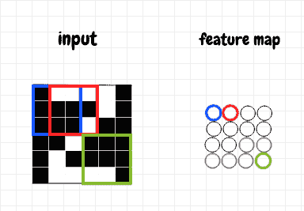](https://res.cloudinary.com/practicaldev/image/fetch/s--3N1GH5HA--/c_limit%2Cf_auto%2Cfl_progressive%2Cq_auto%2Cw_880/https://thepracticaldev.s3.amazonaws.com/i/95ix7dbm60k3cv57oy6t.png)

如果我们的图像是一个 *M×N* 网格，我们的覆盖图是一个 *I×J* 网格(我们使用的步长是 *1* ，那么以这种方式移动覆盖图将产生一个 *(M-I+1)×(J-N+1)* 网格。例如，如果我们有一个 *4×5* 输入网格和一个 *2×2* 覆盖，结果将是一个 *3×4* 网格。卷积就是我们所说的通过在输入矩阵上移动覆盖来生成新网格的操作。

卷积层通常链接在一起。原始输入，如图像数据，被发送到包含几个特征图的卷积层。该卷积层又可以连接到另一个卷积层，该卷积层进一步组织来自前一个卷积层的特征。我们可以在这个想法中看到深度学习的出现。

## 功能图激活

在上一节中，我们学习了卷积过程用于创建特征图。现在让我们更详细地了解一下它是如何工作的。我们如何计算特征图中神经元的激活？

我们知道一个覆盖图，或者说滤波器，是与输入数据卷积的*。这个叠加是什么？原来这是一个矩阵，表示将每个特征神经元连接到前一层中的底层的权重。我们将权重叠加在输入数据上。我们将覆盖层所覆盖的每个细胞的活性乘以其相应的权重，然后将这些乘积相加。*

对于给定的特征神经元，计算该操作的一种简单方法是将底层的激活展平为一列，将权重过滤器展平为一行，然后在权重和激活之间执行点积。这会将覆盖图中的每个像元与其参考底图中的相应像元相乘，然后将这些乘积相加。结果是单个值。这就是我们之前提到的叠加层和底层的意义。

为了获得相应特征神经元的原始激活 *z* ，我们只需要将偏差加到这个值上。然后我们应用激活函数 *σ(z)* 来获得 *a* 。希望这看起来很熟悉:为了在特征图中生成单个神经元的激活，我们执行我们在上一篇文章中使用的相同计算——不同的是，我们这次将它应用于输入的一个小区域。这个想法如下图所示:

[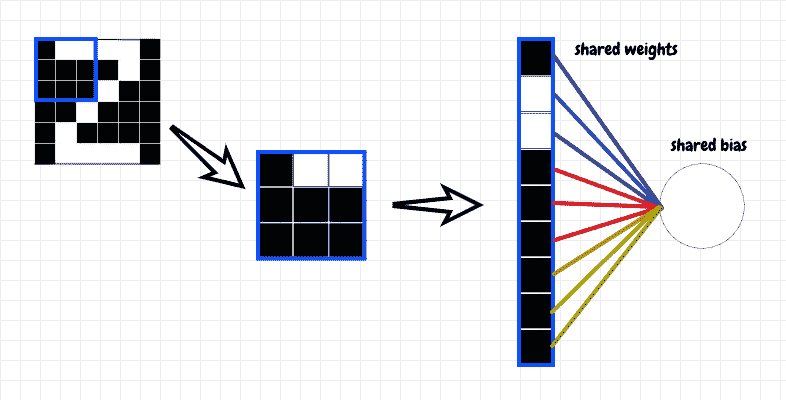](https://res.cloudinary.com/practicaldev/image/fetch/s--QoPja0Q5--/c_limit%2Cf_auto%2Cfl_progressive%2Cq_auto%2Cw_880/https://thepracticaldev.s3.amazonaws.com/i/4r1k6wskpkclp9dzdar1.png)

执行此步骤以生成特征图中第一个神经元的激活值后，我们现在可以在输入矩阵中滑动权重覆盖，并在进行的同时重复相同的操作。生成的特征图是输入矩阵与权重矩阵卷积的结果。实际上，在数学中，我描述的运算在技术上被称为*互相关*而不是卷积。卷积首先将滤波器旋转 180°。这两种操作非常相似，似乎这两个术语在机器学习中经常互换使用。在本文中，我们将同时使用互相关和卷积。

注意，我们在整个输入矩阵中使用相同的权重矩阵作为过滤器。这是一个重要的技巧:我们只保持一个偏差和一组权重，它们在给定的特征图中的所有神经元之间共享。这为我们节省了很多参数！假设我们有相同的 *28×28* ，或 *784* 个输入神经元，我们选择一个 *4×4* 覆盖。这将产生一个 *25x25* 特征图。该特征图将仅具有 *16* 共享权重和 *1* 共享偏差。我们通常会在第一个*卷积层*设置几个独立的特征图。假设我们在这种情况下建立了 *16* 特征地图。这意味着我们在这个卷积层中有 *17×16* 或 *272* 个参数，远远少于我们之前考虑的全连接层的 *23，550* 个参数。

让我们检查一个简单的例子:我们的输入层是一个 *3×3* 矩阵，我们使用一个 *2×2* 覆盖。下图显示了如何将输入矩阵与权重矩阵互相关作为叠加，以生成特征图，在本例中也是一个 *2×2* 矩阵:

[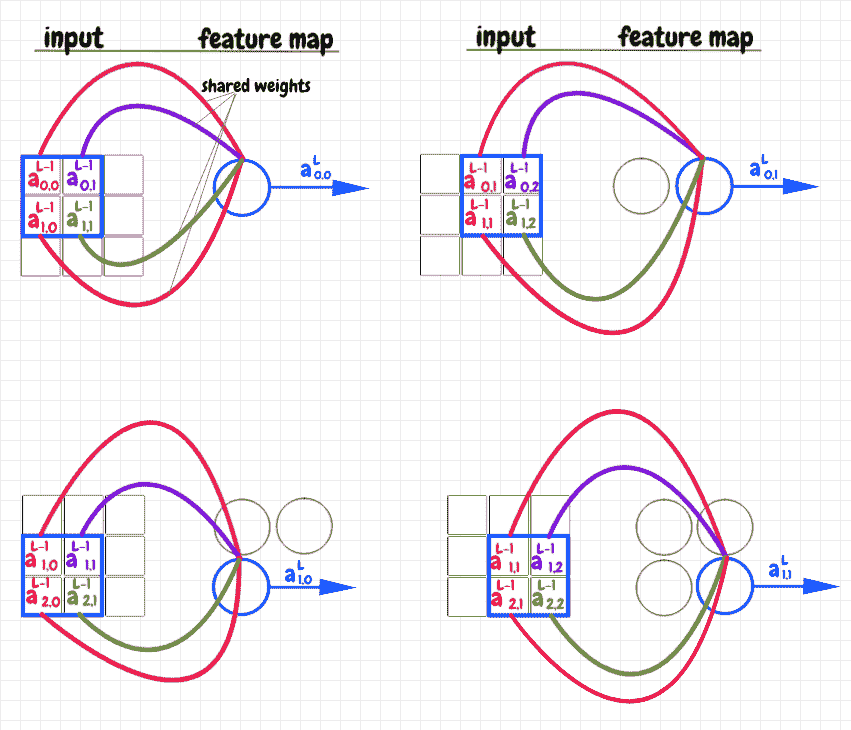](https://res.cloudinary.com/practicaldev/image/fetch/s--0V6BJg92--/c_limit%2Cf_auto%2Cfl_progressive%2Cq_auto%2Cw_880/https://thepracticaldev.s3.amazonaws.com/i/d9ozlga64618v41xez4c.png)

覆盖图是一个 *2×2* 的权重矩阵。我们首先将这个矩阵放在 *3×3* 输入矩阵左上角的激活之上。在上图中，覆盖矩阵中的每个权重都表示为指向特征图中相应神经元的彩色曲线。底层中的每个激活(输入矩阵中被覆盖层覆盖的部分)被着色以匹配其对应的权重。我们将底层中的每个激活乘以其相应的权重，然后将这些乘积相加得到一个值。这个值被馈入相应的特征神经元。我们现在可以在图像上滑动覆盖，对每个特征神经元重复这个操作。同样，我们说这样产生的特征图是将输入数据与共享权重矩阵互相关作为叠加或过滤器的结果。

生成特性图激活的代码如下所示(完整的代码可以在文章末尾的代码部分获得):

```
self.z = sp.signal.correlate2d(self.a_prev, self.w, mode="valid") + self.b
self.a = sigmoid(self.z) 
```

共享权重和偏差的含义是什么？这个想法是，给定特征图中的每个神经元都在寻找一个出现在部分输入中的*特征*。该功能实际上并没有硬编码到网络中。每个特征图学习的特定特征是从网络训练中产生的涌现属性。

值得注意的是，由于特征图中的所有神经元共享它们的权重和偏差，所以它们在某种意义上是同一个神经元。每一个都在输入的不同部分寻找相同的特征。这就是所谓的*平移不变性*。例如，假设我们想要识别代表字母 *U* 的图像，如下所示:

[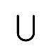](https://res.cloudinary.com/practicaldev/image/fetch/s--JEix2lqW--/c_limit%2Cf_auto%2Cfl_progressive%2Cq_auto%2Cw_880/https://thepracticaldev.s3.amazonaws.com/i/yuzxnfax89dhnaxopy41.png)

也许网络会学习一条垂直直线作为单一特征。然后，它可以将字母 *U* 识别为两个相邻的特征——由底部的不同特征连接。这有点过于简化，但希望它能让人们理解这个想法——这个例子中的垂直线是同一特征图中的两个不同的神经元。

请记住，如果特征图中的每个神经元接收到相同的输入，它们将产生相同的激活:如果一个图像在屏幕的两个部分具有相同的特征，那么两个相应的特征神经元将以完全相同的激活触发。当我们通过特征图推导反向传播的计算时，我们将使用这种直觉。

对于给定的输入神经元网格，我们可能想要训练不止一个特征图。因此，我们可以将输入图层连接到几个独立的要素地图。每个要素地图都有自己的权重和偏差，完全独立于该图层中的其他要素地图。我们可以将这样的特征地图集合称为卷积层。

## 通过特征图进行反向传播

接下来，让我们研究如何通过特征图进行反向传播。让我们使用一个同样简单的例子，一个 *3×3* 输入矩阵和一个 *2×2* 权重滤波器。由于我们的特征图也是一个 *2×2* 矩阵，我们可以预期在反向传播期间从下一层接收*∂c/da<sup>l</sup>T9】作为 *2×2* 矩阵。*

### 偏置渐变

反向传播的第一步是计算 *∂C/db <sup>L</sup>* 。我们知道通过使用链式法则得到的下列等式:

[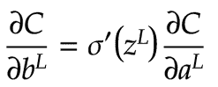](https://res.cloudinary.com/practicaldev/image/fetch/s--2LHBjr7M--/c_limit%2Cf_auto%2Cfl_progressive%2Cq_auto%2Cw_880/https://thepracticaldev.s3.amazonaws.com/i/jshtp4d6293m0819y17b.png)

在这个上下文中，我们可以看到，对于每个特征神经元，我们可以将其*σ’(z)*值乘以其 *∂C/da* 值。这产生了一个 *2×2* 矩阵，它告诉我们每个特征神经元的 *∂C/db* 的值，即成本相对于偏差的导数。下图显示了这一结果:

[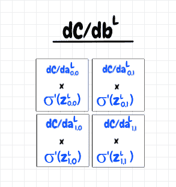](https://res.cloudinary.com/practicaldev/image/fetch/s--xIUHFJpH--/c_limit%2Cf_auto%2Cfl_progressive%2Cq_auto%2Cw_880/https://thepracticaldev.s3.amazonaws.com/i/4fuejk6fszlzcof12x8r.png)

现在，所有的特征神经元共享一个偏差，那么我们应该如何将这四个值聚合成一个值呢？这里，回忆一下在某种意义上，所有的特征图神经元实际上是一个神经元是有帮助的。

特征图中的每个神经元接收前一层中自己的一小部分作为输入，结果产生一些激活。在反向传播期间，*∂c/da<sup>l</sup>T3】告诉我们对这些激活中的每一个的调整将如何影响成本函数。这就好像我们只有一个接收多个连续训练输入的单个神经元，对于这些输入中的每一个，它在反向传播期间接收到一个值 *∂C/da <sup>L</sup>* 。在这种情况下，我们将对每个训练输入连续调整偏差，如下所示:*

*   *b -= ∂c/db <sub>1</sub> *步长*
*   *b -= ∂c/db <sub>2</sub> *步长*
*   *b -= ∂c/db <sub>3</sub> *步长*
*   *b -= ∂c/db <sub>4</sub> *步长*

事实上，我们可以这样做。我们将每个特征神经元的 *∂C/db* 的值相加。我们可以看到，由于加法的结合性，使用该和调整偏置产生了与我们在上述等式中看到的相同的结果:

*b-=(∂c/db<sub>1</sub>+∂c/db<sub>2</sub>+∂c/db<sub>3</sub>+∂c/db<sub>4</sub>)*步长*

现在我们对这个计算有了一些直觉，我们能找到一个简单的方法用数学表达它吗？事实上，我们可以认为这是另一个非常简单的互相关。对于*∂c/da<sup>l</sup>t5】我们有一个 *2×2* 矩阵，对于 *σ'(z <sup>L</sup> )* 我们有一个 *2×2* 矩阵。因为它们的大小相同，所以将它们互相关得到一个值。互相关将覆盖图中的每个单元格乘以其在底层中对应的单元格，然后将这些乘积加在一起，这就是我们想要的*∂c/db<sup>l</sup>t15】的累积值。我们还将保留 *∂c/db* 的四个组成值，用于随后的反向传播计算。**

下面一行代码演示了这种计算(完整的代码清单在本文末尾的代码部分):

```
b_gradient = sp.signal.correlate2d(sigmoid_prime(self.z), a_gradient, mode="valid") 
```

### 权重渐变

反向传播的下一步是计算*∂c/dw<sup>l</sup>T3】。链式法则告诉我们:*

[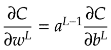](https://res.cloudinary.com/practicaldev/image/fetch/s--PwAXmBVO--/c_limit%2Cf_auto%2Cfl_progressive%2Cq_auto%2Cw_880/https://thepracticaldev.s3.amazonaws.com/i/rciq7sxoh8wwhrgyv0qg.png)

我们能否找到一种方法，以直观的方式将这种想法应用到我们的特征地图上？我们知道特征图中的每个神经元对应于前一层激活的 *2×2* 部分。我们可以将每个特征神经元的∂c/db 的局部值乘以前一层中的每个匹配激活。这产生了四个 *2×2* 矩阵。每个矩阵代表特征图中给定神经元的*∂c/dw<sup>l</sup>T7】的分量。如前所述，我们可以将这些加在一起，以获得该特征图的 *∂C/dw <sup>L</sup>* 的累积值。下图说明了这一想法:*

[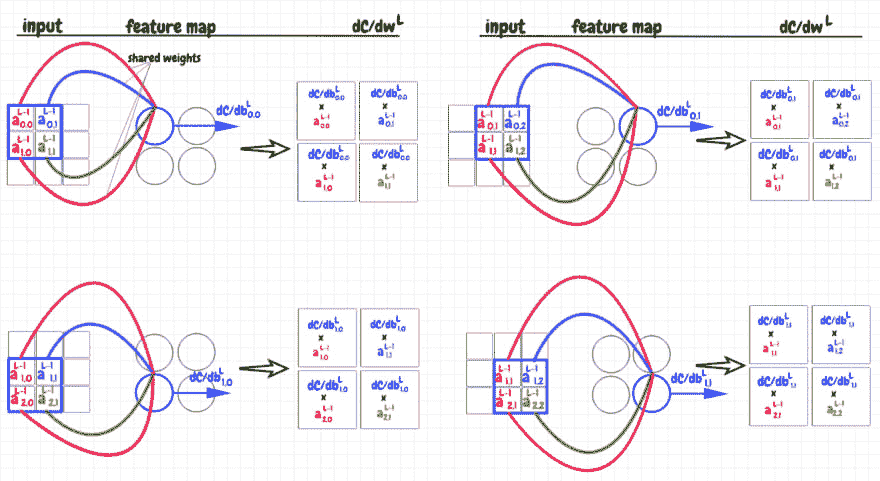](https://res.cloudinary.com/practicaldev/image/fetch/s--SQdx9nP1--/c_limit%2Cf_auto%2Cfl_progressive%2Cq_auto%2Cw_880/https://thepracticaldev.s3.amazonaws.com/i/d9w77c6sdwnis3do577e.png)

事实证明，我们也可以将这种计算简洁地表示为互相关。我们可以取前一层中激活的 *3×3* 矩阵，并将其与代表∂c/db.分量的 *2×2* 矩阵进行互相关这产生了与上图中矩阵之和相同的 *2×2* 矩阵。这个逻辑的代码如下所示(完整的代码清单在本文末尾的代码部分):

```
w_gradient = sp.signal.correlate2d(self.a_prev, b_gradient_components, mode="valid") 
```

### 前一层的激活渐变

反向传播的最后一步是计算*∂c/da<sup>l-1</sup>T3。从链式法则中，我们知道:*

[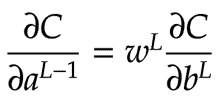](https://res.cloudinary.com/practicaldev/image/fetch/s--Jyzb0fQh--/c_limit%2Cf_auto%2Cfl_progressive%2Cq_auto%2Cw_880/https://thepracticaldev.s3.amazonaws.com/i/p8nbkgq8fz1z9y2ntkyz.png)

我们如何使用卷积特征图来实现这一点？之前，我们为特征图中的每个神经元计算出了 *∂C/db* 的分量。这里，我们将这些值映射回它们在输入矩阵中对应的覆盖图。我们将 *∂C/db* 的每个分量乘以覆盖图中该位置的相应权重。对于每个特征神经元，我们将输入矩阵中未被覆盖的部分设置为零。四个特征映射神经元因此产生 4 个 *3×3* 矩阵。这些是*∂c/da<sup>l-1</sup>T9】对应每个特征映射神经元的组成部分。同样，为了获得累积值，我们将它们加在一起，以获得一个单个的 *3×3* 矩阵，表示*∂c/da<sup>l-1</sup>t15】的累积值。下图说明了这一过程:**

[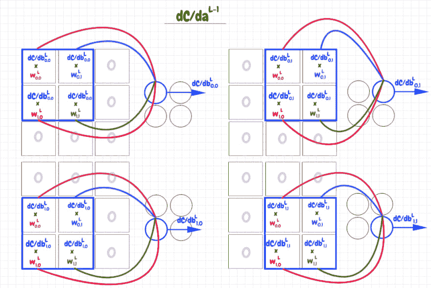](https://res.cloudinary.com/practicaldev/image/fetch/s---gdgmw1x--/c_limit%2Cf_auto%2Cfl_progressive%2Cq_auto%2Cw_880/https://thepracticaldev.s3.amazonaws.com/i/3pxq1dl2ppu55o0jy070.png)

我发现很难用我们以前用过的互相关或卷积来解释这个过程。在做了一些研究后，我发现有几种互相关/卷积的味道。对于我们到目前为止所看到的所有计算，结果是我们一直在使用*有效的*互相关。有效的卷积或互相关是当覆盖完全保持在较大矩阵的边界内时。

我们仍然可以使用到目前为止用于这种计算的相同的基本技术，但是我们需要使用一种叫做*全*卷积/互相关的形式。在这个变体中，覆盖从左上角开始，仅覆盖该角的单个单元格。叠加的其余部分超出了输入数据的边界。覆盖区域中的值被视为零。否则卷积或互相关的过程是相同的。我发现这个关于不同卷积模式的[链接](http://www.johnloomis.org/ece563/notes/filter/conv/convolution.html)很有帮助。

我们可以看到，为了获得我们想要的结果，我们可以使用 *∂C/db* 的 *2×2* 矩阵的组件作为 *2×2* 共享权重矩阵 *w* 的覆盖来应用该过程。由于我们从覆盖左上角的单个权重开始，结果将是一个 *3×3* 矩阵，这就是我们想要的 *∂C/da <sup>L-1</sup>* 。

为了让我们的计算与前面显示的计算相匹配，我们需要先将 *∂C/db* 滤波器矩阵旋转 180°。这样我们从 *∂C/db <sub>0，0</sub>t5】覆盖 *w <sub>0，0</sub>T9】开始。如果您继续进行这个计算，您会发现最终结果与上图中四个 *3×3* 矩阵的总和相同。到目前为止，我们一直使用互相关运算。在这里，由于我们必须旋转滤波器，我们实际上是在进行适当的卷积运算。下图显示了 *∂C/db* 与权重矩阵 *w* 完全卷积的起始位置。**

[](https://res.cloudinary.com/practicaldev/image/fetch/s--irgDHgh9--/c_limit%2Cf_auto%2Cfl_progressive%2Cq_auto%2Cw_880/https://thepracticaldev.s3.amazonaws.com/i/403sghu0k6fehix50zx5.png)

代码如下所示(完整的代码清单在本文末尾的代码部分):

```
a_prev_gradient = sp.signal.convolve2d(self.w, b_gradient_components, mode="full") 
```

## 链接卷积层

在一个网络中，将几个卷积层链接在一起是很常见的。这是如何工作的？基本思想是第一卷积层具有一个或多个特征图。每个特征地图对应一个特征。粗略地说，特征图中的每个神经元告诉我们该特征是否存在于该神经元的感受野中(即，该神经元在前一层中的覆盖)。当我们将激活从一个卷积层发送到另一个卷积层时，我们正在将较低级别的特征聚合到较高级别的特征中。例如，我们的网络可能将形状“◠”和“◡”作为单个卷积层中两个特征地图的特征。这些可以在下一个卷积层的特征图中组合成“O”形。

让我们想想如何计算激活。假设我们在第一卷积层有三个特征图，在第二卷积层有两个特征图。对于第二层中的给定特征地图，我们将需要针对前一层中的每个特征地图的不同权重过滤器。在这种情况下，这意味着第二层中的每个要素地图需要三个过滤器。我们将第一层中的每个特征图与第二层中的特征图的相应权重过滤器进行互相关。这意味着我们为第二层中的第一张地图生成三张特征地图，并为第二层中的第二张地图生成三张特征地图。我们将每个三元组的特征图加在一起，以产生我们在第二层中想要的两个特征图——我们还添加了偏差，并在该点应用激活函数。这种设计类似于完全连接的层。不同之处在于，前一层中的每个特征图都与下一层中的每个特征图相连，而不是单个神经元。

从概念上讲，我们是说如果前一图层中三个要素的正确组合存在，那么下一图层中相应要素地图关注的聚合要素也将存在。由于前一图层中的每个要素地图都有一个单独的权重过滤器，因此我们可以确定前一图层中的要素需要如何聚合在一起才能用于下一图层中的每个要素。

下图说明了如何将给定卷积层中的要素图聚合到下一个卷积层中:

[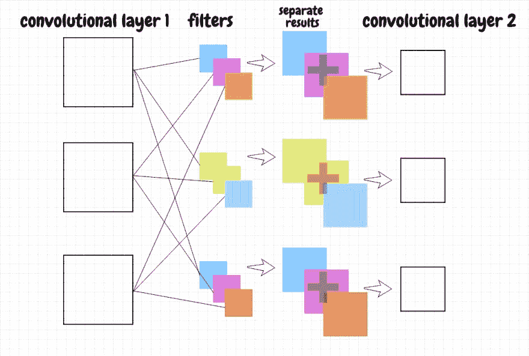](https://res.cloudinary.com/practicaldev/image/fetch/s--weAGOxes--/c_limit%2Cf_auto%2Cfl_progressive%2Cq_auto%2Cw_880/https://thepracticaldev.s3.amazonaws.com/i/vdquca3suwf7t1cu9co3.png)

> 下一图层中每个要素地图的过滤器数量与上一图层中要素地图的数量相匹配。过滤器大小决定了下一图层中要素地图的大小。

这一过程可以用三维矩阵来描述(参见附录 B 中的计算示例)。我们将前一层中的特征地图组合成一个三维矩阵，就像一堆煎饼。对于下一层中的每个特征地图，我们还将过滤器堆叠成一个三维矩阵。我们可以将表示前一层中的特征图的 3-d 矩阵与表示相应滤波器的 3-d 矩阵互相关。因为两个矩阵具有相同的深度，所以结果将是我们想要用于下一层中的特征地图的 2-d 矩阵。

为了理解为什么我们最终得到一个二维矩阵，考虑在有效模式下互相关或卷积两个具有相同宽度的二维矩阵的情况。结果将是一个一维矩阵。例如，如果我们有一个 *7×3* 矩阵，我们将它与一个 *2×3* 矩阵互相关，我们得到一个 *6×1* 矩阵。这里匹配的是 3d 矩阵的深度，因此在互相关或卷积期间，这些值在深度方向上相加，并折叠成单个值。

反向传播应该是我们到目前为止已经研究出的所有原则的应用:

*   我们使用我们通常的方法来获得表示下一层中给定特征图的 *∂C/db* 的分量的二维矩阵。
*   为了计算下一层特征图的过滤器的梯度 *∂C/dw* ，我们将来自前一层的三维特征图激活矩阵与表示偏差梯度分量的二维 *∂C/db* 矩阵进行互相关。这为我们提供了下一层中当前特征图的 *∂C/dw* 的三维矩阵——每个切片对应于前一层中一个特征图的权重。
*   对于*∂c/da<sup>l-1</sup>T3】，我们将我们的三维权重矩阵 *w* 与我们的二维 *∂C/db* 矩阵进行卷积，用于下一层中的给定特征地图。这给了我们一个关于 *∂C/da <sup>L-1</sup>* 的 3d 矩阵，它代表了相对于前一层中的每个特征图的激活的成本的导数(对应于我们在下一层中的当前特征图)。我们对下一层中的每个特征图重复这种计算，并将结果矩阵加在一起。该最终矩阵的每个切片表示前一层中对应特征图的 *∂C/da* 的值。*

> 当我们在概念上将二维矩阵与三维矩阵相关或卷积时，我们需要将二维矩阵放在一组额外的括号中——从技术上讲，这些操作要求两边具有相同的维数。

## 最大池化

另一种有时用于卷积层的技术是*最大池化*。这个想法非常简单:我们以一种类似于卷积的方式在特征图上移动一个覆盖图。然而，最大池映射中的每个神经元只是从相应的叠加中提取具有最高激活的神经元，并将该激活传递给下一层。这显然进一步减少了参数的数量，所以这是这种技术的一个好处。我相信，通过抽象输入，它还可以帮助避免[过拟合](https://en.wikipedia.org/wiki/Overfitting#Machine_learning)问题，这是机器学习中经常出现的问题。

最大池的反向传播非常简单。对于最大池图中的神经元，我们简单地将 *∂C/da* 的值传递回来自前一层的相应覆盖图中具有最大激活的神经元。覆盖图中的其他梯度值被设置为 *0* ，因为这些神经元没有通过它们的激活，因此对成本没有贡献。下图显示了最大池映射的向前和向后传播步骤:

[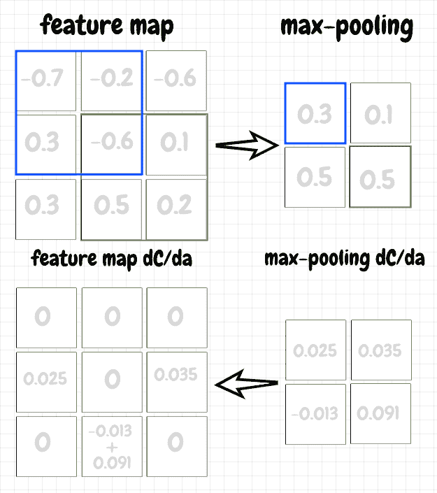](https://res.cloudinary.com/practicaldev/image/fetch/s--Xo7dMP-r--/c_limit%2Cf_auto%2Cfl_progressive%2Cq_auto%2Cw_880/https://thepracticaldev.s3.amazonaws.com/i/r90l2lnvraqju2n14vqm.png)

## 讨论

卷积神经网络，或称*CNN*，代表了神经网络能力的重大实际进步。这样的网络可以获得更好的准确性以及提高的学习速度。在 Michael Nielsen 的[神经网络和深度学习](http://neuralnetworksanddeeplearning.com/)中，他将 CNN 与其他一些技术结合起来，以达到超过 [99%](http://neuralnetworksanddeeplearning.com/chap6.html#convolutional_neural_networks_in_practice) 的准确率来识别最少的数字！与使用完全连接的网络所达到的 95%相比，这是一个显著的进步。

但是，值得注意的是，CNN 并不是万能的。例如，虽然 CNN 在处理感受野的平移不变性方面做得很好，但它们不处理旋转。

在本文中，我努力强调了卷积网络和全连接网络之间的主要区别。为了做到这一点，我尽可能地保持与上一篇文章相同的逻辑。例如，我们在本文中继续使用 sigmoid 激活函数。实际上，这种情况很少发生。在深度学习中，除了卷积，我们通常会看到一些其他技术的使用:

*   二次成本函数被其他东西替代，例如[交叉熵](http://neuralnetworksanddeeplearning.com/chap3.html#the_cross-entropy_cost_function)成本函数
*   使用不同的激活函数代替 sigmoid，如 [ReLU](http://neuralnetworksanddeeplearning.com/chap3.html#other_models_of_artificial_neuron) 、 [Softmax](http://neuralnetworksanddeeplearning.com/chap3.html#softmax) 等。
*   [正则化](http://neuralnetworksanddeeplearning.com/chap3.html#overfitting_and_regularization)应用于网络权重，以减少过度拟合

## 代码

出于演示目的，下面我实现了几个类。有一个`FeatureMap`实现了单个特征的前向和后向传播。几个这样的特征映射通常被用于将单个卷积层放在一起。还有一个`MaxPoolingMap`,它从一个特性图中实现最大池。最后，还有一个`FullyConnectedLayer`，它实现了上一篇文章中讨论的逻辑。在 CNN 中，通常有几个卷积层，然后是一个全连接层作为最后的隐藏层。这个完全连接的层在将其激活发送到输出层之前有效地聚集了在其之前的所有特征构建阶段(我想到我们也可以将其实现为卷积层，其中每个特征映射是一个 *1×1* 矩阵)。

```
import numpy as np
import scipy as sp
from scipy import signal

class FeatureMap:
    def __init__(self, a_prev, overlay_shape):
        # 2d matrix representing input from previous layer
        self.a_prev = a_prev

        # shared weights and bias for this layer
        self.w = np.random.randn(*overlay_shape)
        self.b = np.random.randn(1,1)

    def feed_forward(self):
        self.z = sp.signal.correlate2d(self.a_prev, self.w, mode="valid") + self.b
        self.a = sigmoid(self.z)

        return self.a

    def propagate_backward(self, a_gradient, step_size):
        b_gradient_components = dc_db(self.z, a_gradient)

        b_gradient = sp.signal.correlate2d(sigmoid_prime(self.z), a_gradient, mode="valid")
        w_gradient = sp.signal.correlate2d(self.a_prev, b_gradient_components, mode="valid")
        a_prev_gradient = sp.signal.convolve2d(self.w, b_gradient_components, mode="full")

        self.b -= b_gradient * step_size
        self.w -= w_gradient * step_size
        self.a_prev_gradient = a_prev_gradient

        return self.a_prev_gradient

class MaxPoolingMap:
    def __init__(self, a_prev, overlay_shape):
        self.a_prev = a_prev
        self.overlay_shape = overlay_shape

    def feed_forward(self):
        self.max_values, self.max_positions = max_values_and_positions(
            self.a_prev, self.overlay_shape)

        return self.max_values

    def propagate_backward(self, a_gradient):
        a_prev_gradient = np.zeros(self.a_prev.shape)

        rows, cols = self.max_values.shape
        for r in xrange(rows):
            for c in xrange(cols):
                max_position = self.max_positions[r][c]
                a_prev_gradient[max_position] += a_gradient[r][c]

        self.a_prev_gradient = a_prev_gradient

        return self.a_prev_gradient

class FullyConnectedLayer:
    def __init__(self, a_prev, num_neurons):
        self.a_prev = a_prev
        self.num_neurons = num_neurons

        self.w = np.random.randn(num_neurons, a_prev.size)
        self.b = np.random.randn(num_neurons,1)

    def feed_forward(self):
        a_prev = as_col(self.a_prev)

        self.z = raw_activation(self.w, a_prev, self.b)
        self.a = sigmoid(self.z)

        return self.a

    def propagate_backward(self, a_gradient, step_size):
        b_gradient = dc_db(self.z, a_gradient)

        a_prev = as_col(self.a_prev)
        weights_gradient = dc_dw(a_prev, b_gradient)

        a_prev_gradient = dc_da_prev(self.w, b_gradient)
        self.a_prev_gradient = a_prev_gradient.reshape(self.a_prev.shape)

        self.b -= b_gradient * step_size
        self.w -= weights_gradient * step_size

        return self.a_prev_gradient

# utility functions 
def sigmoid(z):
    return 1.0/(1.0+np.exp(-z))

def sigmoid_prime(z):
    return sigmoid(z)*(1-sigmoid(z))

def dc_db(z, dc_da):
    return sigmoid_prime(z) * dc_da

def get_feature_map_shape(input_data_shape, overlay_shape):
    input_num_rows, input_num_cols = input_data_shape
    overlay_num_rows, overlay_num_cols = overlay_shape
    num_offsets_for_row = input_num_rows-overlay_num_rows+1
    num_offsets_for_col = input_num_cols-overlay_num_cols+1

    return (num_offsets_for_row, num_offsets_for_col)

def get_max_value_position(matrix):
    max_value_index = matrix.argmax()
    return np.unravel_index(max_value_index, matrix.shape)

def max_values_and_positions(a_prev, overlay_shape):
    feature_map_shape = get_feature_map_shape(a_prev.shape, overlay_shape)
    max_values = np.zeros(feature_map_shape)
    max_positions = np.zeros(feature_map_shape, dtype=object)

    overlay_num_rows, overlay_num_cols = overlay_shape
    feature_map_rows, feature_map_cols = feature_map_shape
    for r in xrange(feature_map_rows):
        for c in xrange(feature_map_cols):
            overlay = a_prev[r:r+overlay_num_rows, c:c+overlay_num_cols]
            max_value = np.amax(overlay)
            max_value_overlay_row, max_value_overlay_col = get_max_value_position(overlay)
            max_value_row = r+max_value_overlay_row
            max_value_col = c+max_value_overlay_col

            max_values[r][c] = max_value
            max_positions[r][c] = (max_value_row, max_value_col)

    return (max_values, max_positions)

def raw_activation(w, a, b):
    return np.dot(w,a) + b

def dc_dw(a_prev, dc_db):
    return np.dot(dc_db, a_prev.transpose())

def dc_da_prev(w, dc_db):
    return np.dot(w.transpose(), dc_db)

def as_col(matrix):
    return matrix.reshape(matrix.size, 1)

input_data = np.arange(20).reshape(4,5) # 4x5 array overlay_shape = (2, 2)
cl = FeatureMap(input_data, overlay_shape)
cl.feed_forward()
fl_shape = get_feature_map_shape(input_data.shape, overlay_shape)
cl.propagate_backward(np.random.randn(*fl_shape), 0.1)

max_pool_input_data = np.array([[8,0,11,1,6],[10,2,4,14,17],[5,16,19,15,7],[12,13,9,18,3]])
mpl = MaxPoolingMap(max_pool_input_data, overlay_shape)
mpl.feed_forward()
fl_shape = get_feature_map_shape(max_pool_input_data.shape, overlay_shape)
mpl.propagate_backward(np.random.randn(*fl_shape))

fcl = FullyConnectedLayer(input_data, 10)
fcl.feed_forward()
fcl.propagate_backward(as_col(np.random.randn(10)), 0.1) 
```

## 附录 A:有效与完整模式

下面的 python REPL 代码展示了如何使用`valid`和`full`模式使用互相关和卷积。注意`convolute2d`如何产生与`correlate2d`旋转 180 度滤镜相同的结果。

```
>>> import numpy as np
>>> import scipy as sp
>>> from scipy import signal
>>> values = np.array([[1,2,3],[4,5,6],[7,8,9]])
>>> values
array([[1, 2, 3],
       [4, 5, 6],
       [7, 8, 9]])
>>> f = np.array([[10,20],[30,40]])
>>> f
array([[10, 20],
       [30, 40]])
>>> sp.signal.correlate2d(values,f,mode="valid")
array([[370, 470],
       [670, 770]])
>>> sp.signal.convolve2d(values,f,mode="valid")
array([[230, 330],
       [530, 630]])
>>> f_rot180 = np.rot90(np.rot90(f))
>>> f_rot180
array([[40, 30],
       [20, 10]])
>>> sp.signal.correlate2d(values,f_rot180,mode="valid")
array([[230, 330],
       [530, 630]])
>>> sp.signal.correlate2d(values,f,mode="full")
array([[ 40, 110, 180,  90],
       [180, 370, 470, 210],
       [360, 670, 770, 330],
       [140, 230, 260,  90]])
>>> sp.signal.convolve2d(values,f,mode="full")
array([[ 10,  40,  70,  60],
       [ 70, 230, 330, 240],
       [190, 530, 630, 420],
       [210, 520, 590, 360]])
>>> sp.signal.correlate2d(values,f_rot180,mode="full")
array([[ 10,  40,  70,  60],
       [ 70, 230, 330, 240],
       [190, 530, 630, 420],
       [210, 520, 590, 360]]) 
```

## 附录 B:二维与三维叠加求和:

下面的 REPL 代码表明，执行单独的二维互相关并将它们加在一起产生与叠加输入和滤波器，然后将这两个三维矩阵互相关在一起相同的结果:

```
>>> feature_map1 = np.array([[1,2,3],[4,5,6],[7,8,9]])
>>> feature_map2 = np.array([[9,8,7],[6,5,4],[3,2,1]])
>>> filter1 = np.array([[1,2],[3,4]])
>>> filter2 = np.array([[5,6],[7,8]])
>>> feature_map1
array([[1, 2, 3],
       [4, 5, 6],
       [7, 8, 9]])
>>> feature_map2
array([[9, 8, 7],
       [6, 5, 4],
       [3, 2, 1]])
>>> filter1
array([[1, 2],
       [3, 4]])
>>> filter2
array([[5, 6],
       [7, 8]])
>>> result1 = sp.signal.correlate2d(feature_map1, filter1, mode="valid")
>>> result1
array([[37, 47],
       [67, 77]])
>>> result2 = sp.signal.correlate2d(feature_map2, filter2, mode="valid")
>>> result2
array([[175, 149],
       [ 97,  71]])
>>> sum_of_results = result1 + result2
>>> sum_of_results
array([[212, 196],
       [164, 148]])
>>> feature_maps_stacked = np.array([feature_map1, feature_map2])
>>> feature_maps_stacked
array([[[1, 2, 3],
        [4, 5, 6],
        [7, 8, 9]],

       [[9, 8, 7],
        [6, 5, 4],
        [3, 2, 1]]])
>>> filters_stacked = np.array([filter1, filter2])
>>> filters_stacked
array([[[1, 2],
        [3, 4]],

       [[5, 6],
        [7, 8]]])
>>> stacked_results = signal.sp.correlate(feature_maps_stacked, filters_stacked, mode="valid")
>>> stacked_results.reshape(2,2) # same as sum_of_results array([[212, 196],
        [164, 148]]) 
```