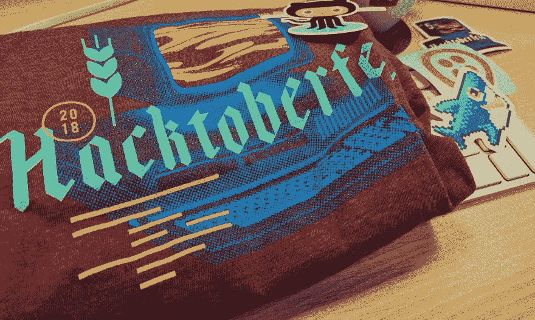
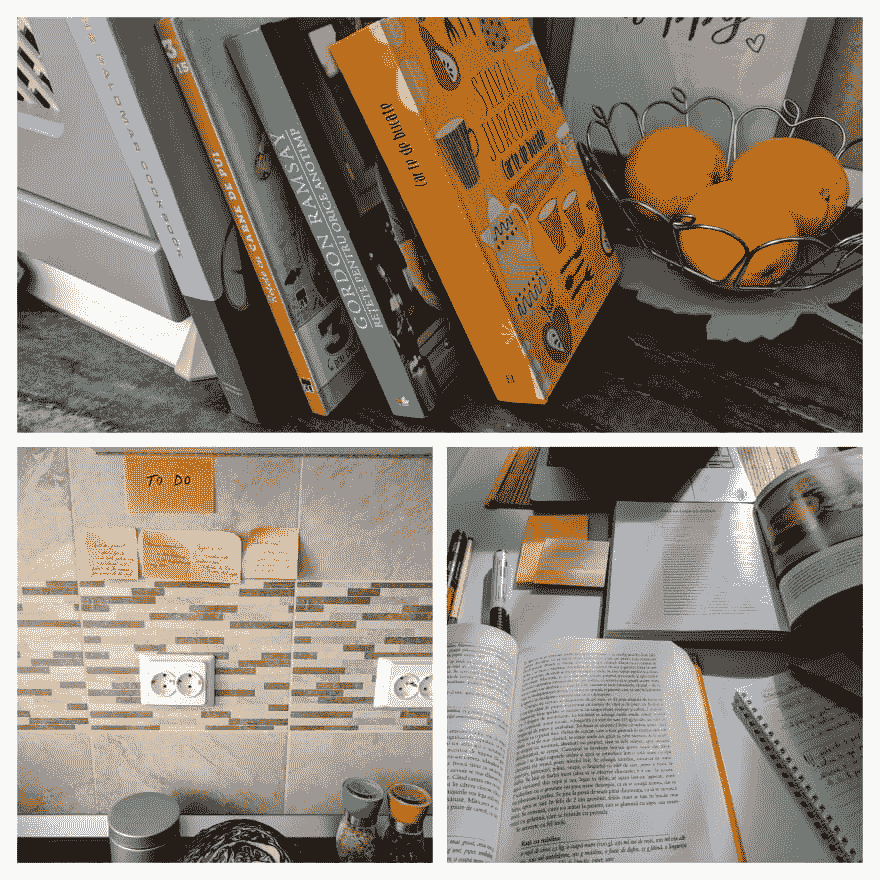

# 像程序员一样烹饪，第 1 部分

> 原文：<https://dev.to/valericaplesu/cooking-like-a-programmer-apo>

这篇文章和下一篇文章(是的，将会有一系列文章)的想法来自于我对编码和烹饪的热情。所以为什么不把两者结合起来。两者都是基于规则的，被认为是艺术和科学的一种形式，但我最喜欢的是它们为即兴创作留下了足够的空间(或者我喜欢怎么说，*“我在《T2》中塑造了一些个性”)。
这并不是什么新鲜事，但我发现自己能够找到这两者之间的相似之处，并写出自己的关于编程日益有用的方法。这是我的概念证明。*

# 背景

7 年前，我爱上了编程，目前，我有一份全职工作，是一名 Android 开发人员。我确实喜欢教练这个想法。在我的空闲时间里，我帮助其他人学习如何编程(在 [MobileAcademy](https://www.mobileacademy.ro/) )，我也是当地 meetup 活动的积极成员(比如[女性科技创客罗马尼亚](https://www.meetup.com/Women-Techmakers-Romania/members/)、[谷歌开发团队布加勒斯特](https://www.meetup.com/Google-Developer-Group-Bucharest/))。去年，我第一次被邀请在一个著名的会议上发言，我非常喜欢。
我在 [#hacktoberfest18](https://hacktoberfest.digitalocean.com/) 买了一件 hacktoberfest t 恤，我学到的是，在打开一个拉请求时，你应该保持积极的态度，表现出热情，并承认你的代码并不完美。
 
我参加过两次 [Google IO](https://events.google.com/io/) 活动，我发现这是最独特的会议，你一生中至少要去一次。活跃在这个行业会给你带来很多好处。我确实认为离开办公室几天去参加一个会议一点也不浪费时间。
*我选择跟随的心态*是我可以赢得朋友，从各种观点中学习，获得新的想法和趋势，所有这些都影响着我未来的结果。

# 我想用这一系列文章完成什么？

我想根据我的编程技能学习如何烹饪，并以一种有趣的方式分享编程的基本概念，任何人都可以理解。我会试着写一些基本规则，比如环境、计划的重要性、变量、算法、数据结构、面向对象、应用架构、团队合作等等。当然，我会去做**敏捷**所以一切都可以改变:D
我发现编程是一生的追求，在那里总是有新的东西要学，你需要尽可能多的学习，也要帮助你旁边的人。烹饪并没有什么不同，我也没有奢望自己在几天内成为一名伟大的厨师，所以这就是为什么我建议自己每周都做一些新的东西。(每周都在提高我的烹饪技术，不断学习)。

# 那么，我们开始吧！

在本文中，我将解决**“设置环境并规划您想要编码的内容！Ups… cook"**

我想做的第一道菜是橘汁鸭胸。

**设置环境。**为了开始编写代码和解决实际任务，我需要在想出问题的解决方案之前将一切准备就绪。
于是，我开始安装 *iTerm，AndroidStudio，GIT，android sdk，android ndk，kotlin，sublime text* (mac 工作站)。一切就绪后，我就可以开始计划下一步需要实现什么了。
 
于是，带着这种想法，我把厨房收拾得井井有条，如同“Mise en place”。根据我的技能，我假设如果我的工作区域是干净的，我的工具在它们应该在的地方，我将能够处理这个复杂的食谱。

计划工作。我喜欢计划我的工作日……实际上是我的一整天。如果我必须处理一个复杂的问题，在真正开始编程之前，我首先开始用伪代码写下来。
我提前规划了应用架构。我正在考虑应用规范，并且阅读了很多关于我将要使用的 API，但是是以敏捷的方式(事情可能会改变)。我的观点必须符合我的团队观点，所以我需要保持一致性。
我喜欢写代码，但编码是一项长期任务，每时每刻都有过去的东西需要重构。

我再次使用这种编码方法来准备鸭胸肉。我正在研究鸭肉的特性、食谱所需的配料，并提取我需要执行的步骤(规划架构)。
 
我所知道的是，鸭子营养丰富，味道鲜美，它是瘦肉，是硒和锌的极好来源，这两种元素都有助于细胞新陈代谢。
鸭油类似于橄榄油，饱和脂肪含量低。这是注重健康饮食的最佳选择。

做完这道菜后，我学到的东西就像在软件中一样，我的应用程序不像我想的那样工作(**bug 无处不在**)我的菜尝起来有点奇怪……但至少看起来不错:D

请继续关注我的下一步，学习如何像程序员一样烹饪，并发现什么是像专家一样的软件开发。保持快乐！

感谢您阅读本文。如果你有任何问题，评论或有趣的笑话，请在下面评论。