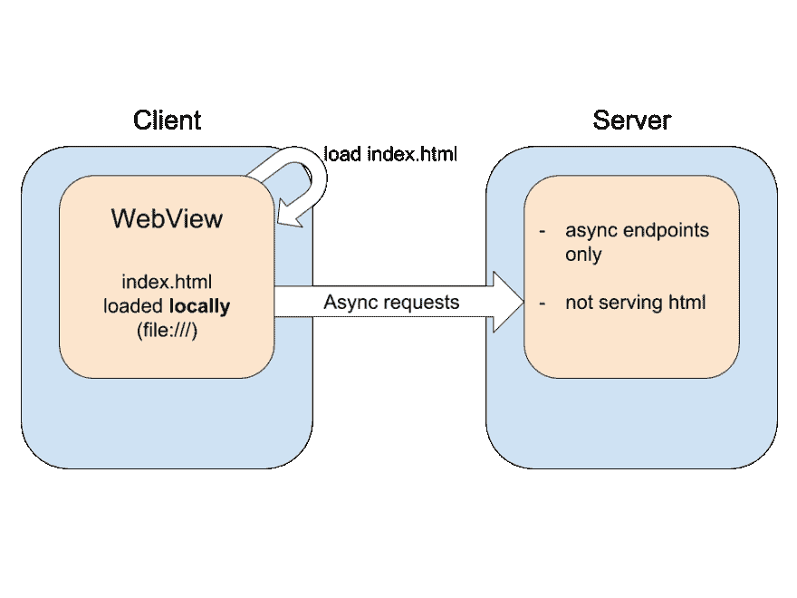
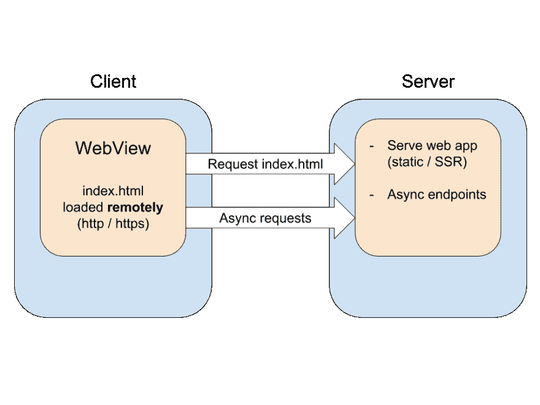
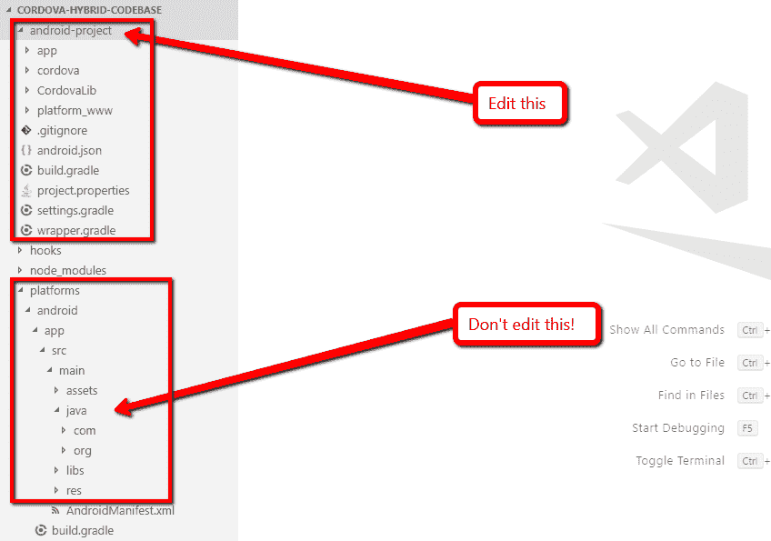

# 科尔多瓦混合应用程序-如何构建您的代码库

> 原文：<https://dev.to/johnnymakestuff/cordova-hybrid-apps---how-to-structure-your-codebase-1jpe>

## 问题

cordova 混合应用程序需要更改生成的本地项目，从而破坏了使用 cordova cli 功能的能力，如添加插件、更新 cordova 等。

## 一些定义

### 科尔多瓦

Cordova 让你构建跨平台的移动应用，同时使用 web 技术(html/js/css)设计 UI。该应用运行在一个原生的 WebView 中，这基本上是一个浏览器。
内部 cordova 浏览器允许通过 *cordova 插件*访问本地设备功能。这些有 js 端和原生端(Java/kot Lin/swift/objective-c/随便什么)。

### Cordova CLI

从您的 web 应用程序生成本机平台项目的 CLI 工具。它们添加 cordova 平台逻辑，用于添加插件、更新平台、生成打包的应用商店安装等。

### 普通科尔多瓦 app

加载应用程序 UI 的通常方式是使用`file:///`协议在本地加载*。因此，您构建了一个静态网站，将其部署到设备上，WebView 从本地设备的文件夹中加载网站。通过 ajax/sockets 访问服务器。*

### 混合科尔多瓦 app

但是等等，如果 cordova 给了我们一个浏览器，我们已经建立了一个响应网站，为什么不在我们的跨平台应用程序中加载这个网站呢？这种方法被称为*混合*，通常涉及一些额外的原生用户界面层，比如主 WebView 之外的菜单或设置屏幕。

> 请注意，加载远程内容不是由 cordova 官方支持的，但在某些情况下是可以的。在我的下一篇文章中会有更多的介绍。

## 断链

为了给你的 *hybrid* app 添加你自己的 UI 层比如菜单或者设置屏，你需要拿生成的平台项目，比方说 android，往里面添加东西。
但问题就在这里，因为 cordova cli 工具会在你下次构建平台时覆盖那些更改。因此[不鼓励](https://cordova.apache.org/docs/en/latest/reference/cordova-cli/index.html#platforms)直接编辑生成的平台文件。

### 你为什么不想断开链接

如果您开始更改生成的项目，您将不再使用 cordova cli 来:

*   添加插件。手动添加插件很头疼。
*   获取 cordova 平台的新版本
*   获取安全更新

## 一个建议的架构

我目前设计代码基础结构的方式如下:

*   用`cordova platform add`生成原生项目
    *   这将在`/platforms/<platform-name>`下生成项目
    *   源代码控制会忽略`/platforms`下的所有内容。
*   将生成的原生项目复制到`<platform>-project` ( `android-project`或`ios-project`)
    *   在该文件夹中进行本地更改。
    *   此文件夹将受源代码管理。
*   编写一个生成平台项目并更新本机项目的任务

### “生成”任务

你可以使用一些任务运行器如 gulp 或 grunt(我使用 grunt)来保持项目同步。
该任务将(以 android 平台为例):

*   将您修改的文件从`android-project`复制到`temp`
*   用`cordova build android`搭建平台
*   将`/platforms/android`复制到`android-project`
*   从`temp`到`android-project`的复制和替换

这样，在`android-project`文件夹中总会有一个工作中的 Android Studio 项目，它是受源代码控制的，但是仍然能够使用 cordova cli 更新 cordova 和添加插件。

### 与嵌入式 WebView 方法的比较

在 [cordova 网站](https://cordova.apache.org/docs/en/latest/guide/hybrid/webviews/index.html)中，他们描述了一种嵌入 WebView 的方法，基本上就是创建一个项目，然后手动添加一个 cordova WebView。
我更喜欢这里描述的方法，有几个原因:

*   你不必从头开始创建一个项目，手动集成 cordova jar 文件等。
*   你可以使用科尔多瓦 cli 的脚手架和文件夹结构，这是受变化/更新。
*   使用 cordova cli 轻松安装/删除插件。
*   轻松的科尔多瓦平台更新。

## 下一步

在以后的文章中，我将展示如何创建一个示例项目来实现所有这些功能，敬请关注:)

> 这是我的[博客](https://www.learningsomethingnew.com/cordova-hybrid-apps-how-to-structure-your-codebase)的交叉帖子