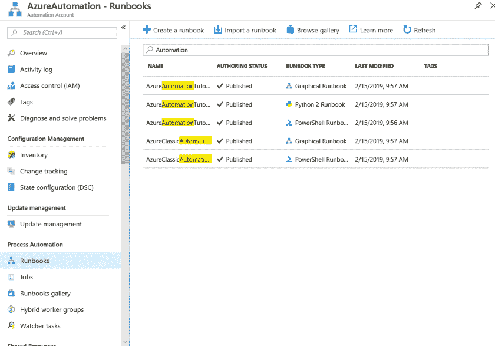
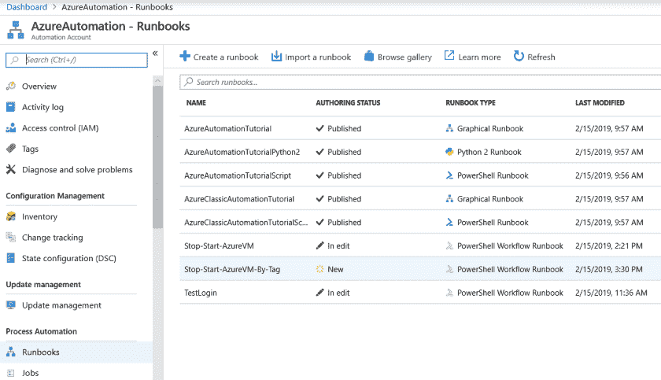
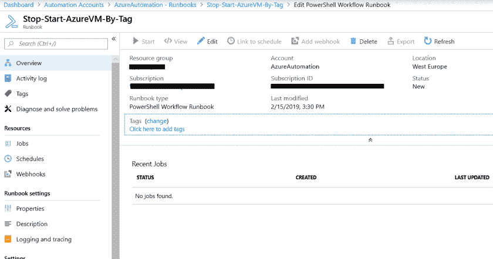
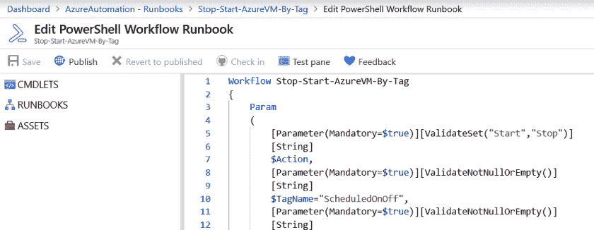
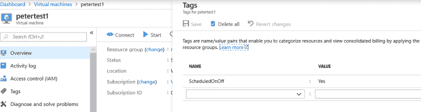
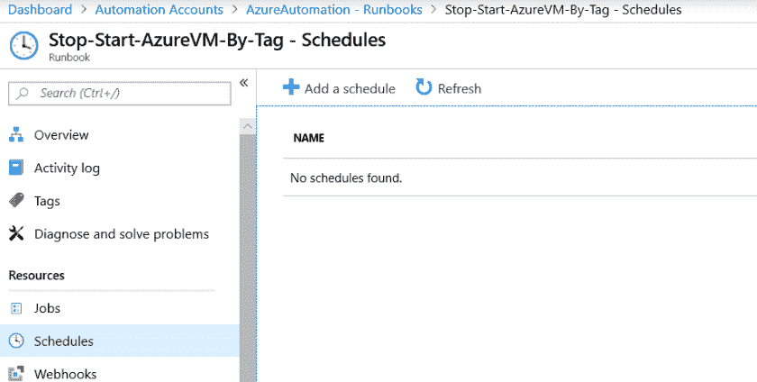
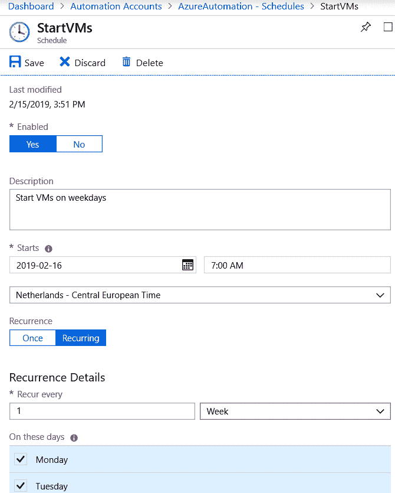
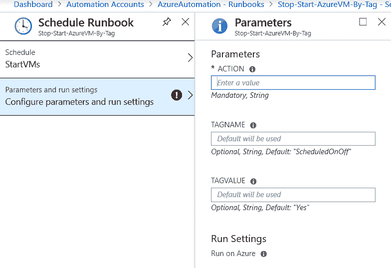

# Azure 中的成本优化

> 原文：<https://dev.to/sogeti/cost-optimization-in-azure-h32>

在我之前的文章中，我展示了使用 C#和 Azure 函数启动或释放机器是多么容易。

Azure VirtualMachines 可能很方便，但如果你忘记关闭它们并让它们 24/7 全天候运行的话，它会非常昂贵。

但是，如果您有几十个现有的虚拟机，并且正在寻找一种快速的方法来安排这些虚拟机的开/关时间以节省资金，该怎么办呢？

在这篇文章中，我将展示一个非常简单的脚本来与 Azure Automation 一起使用，让你在一个小时内就可以启动并运行它。

> 注意:如果你有开发虚拟机，我建议你使用 Azure DevTest labs。这将为您提供在一组用户中重用、申请或共享虚拟机的机会。
> 
> *在这篇博文中，我将在代码和注释中使用单词 **Stop** ，但事实上，这将**释放**机器，并将停止产生成本。

## 计算成本

首先，让我们快速看一下，按照这篇博文中的说明，你实际上可以节省多少钱。如果我们拿一台 D4s v3 机器，让它 24/7 全天候运行，每月大约需要花费 **260 欧元(在西欧)**。如果你有一个由 8 名开发人员组成的团队，加起来超过每月 2000 欧元(T3)的 T2。

为了这篇博文，让我们声明实际的工作时间是(周一到周五)从早上 7 点到晚上 7 点。这使得工作时间减少到 12/5。一台机器的运行成本将降低到大约每月 92 欧元。对于一个由 **8** 开发人员组成的团队来说，通过使用一个简单的脚本，这将每月为**节省 1300 欧元。**

## Azure 自动化

我不会解释如何设置 Azure Automation，因为使用 Azure Portal 进行设置非常简单。我将直接开始导入和创建 runbooks。我们从门户中的 Azure 自动化刀片开始:

单击左侧窗格中的“Runbooks ”,您将看到系统添加的一些预定义的 runbooks。

> 请[在这里下载我的 PowerShell 脚本以便导入](https://gist.github.com/prombouts/43f14670739bab51834bd3753c8c89f7)

下载完我的脚本后，你可以点击 blade 菜单栏中的‘导入 run book’。

导入后，运行手册将处于“新”状态:

要开始使用 runbook，请单击“Stop-Start-azure VM-By-Tag”run book。在下一个屏幕中，单击“编辑”:

这将打开实际的 runbook 脚本，并显示所有的 PowerShell 代码。如果您想添加逻辑或更改参数，可以在这里根据自己的喜好调整代码:

现在，点击“发布”,你就可以运行你的第一本运行手册了！

## 标记您的虚拟机

显然，您不希望手动点击来启动或停止机器。在我的简单代码示例中，我过滤了特定的标记名和标记值。标签可以通过编程或手动方式设置。要使用这个脚本，只需转到一个虚拟机，并确保标记设置如下:

标记名为“**scheduled off**”，值为“**Yes**”。

## 安排您的 runbook

目前，操作手册不是自动化的。没有附加时间表，但是您可以手动触发 runbook 来启动或停止您的机器。

要创建时间表，请返回操作手册，并选择“时间表”:

创建新的时间表很容易；我已经创建了一个计划，在工作日从 07:00 开始:

最后一步是设置参数。在我的预定义脚本中，使用默认参数，我们只需在 action 字段中设置“Start”:

> 应遵循相同的设置来取消分配虚拟机，创建一个在一天中的首选时间执行“停止”操作的计划。

## 结论

这篇博客解释了如何快速有效地节约资源和降低成本。这可以被视为一个补丁或临时解决方案，因为如果某个用户删除或更改了标记，该脚本将不再适用于该特定虚拟机。

尽管如此，它仍然是一个非常方便、快速实现的解决方案，可以修复长期运行的开发或测试机器！