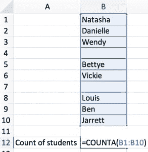
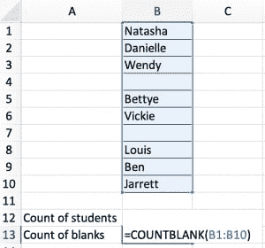
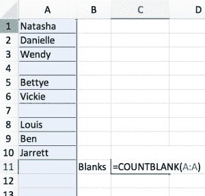

# 计算 Excel 中某个范围内空白值的个数

> 原文：<https://dev.to/albertc44/count-the-number-of-blank-values-in-a-range-in-excel-1dfj>

我制作了一个关于这个 Excel 技巧的[播客片段](https://www.stitcher.com/podcast/dear-analyst/e/60335534?autoplay=true)。

如果您想计算其中包含空白值的单元格的数量，您可能认为这就像使用`COUNTBLANK()`公式一样简单。如果您想知道数据集中丢失了多少数据，通常会这样做。假设您有一个包含 10 名学生的列表，如果数据集中缺少一名学生，您希望快速计算数据范围中缺少多少名学生。

然而，以这种方式使用`COUNTBLANK`只有在您的数据范围有精确的单元格引用时才有效(例如“A1:A20”)。如果不知道确切的小区范围呢？在[这一集](https://www.stitcher.com/podcast/dear-analyst/e/60335534?autoplay=true)中，我讲述了我学到的一个小技巧，当你给`COUNTBLANK()`公式一个动态列引用而不是一个特定范围的单元格时，如何计算空白单元格的数量。我在 Excel 先生论坛的一个帖子中找到了关于这个问题的答案。

假设您有下面的学生列表，并且您想要计算带有值的单元格的数量，您只需像这样使用`COUNTA()`函数:

[](https://res.cloudinary.com/practicaldev/image/fetch/s--583WP_fb--/c_limit%2Cf_auto%2Cfl_progressive%2Cq_auto%2Cw_880/https://www.thekeycuts.com/wp-content/uploads/2019/04/Image-2019-04-28-at-7.10.39-AM-293x300.png)

这样你就有 8 个学生了。你会注意到在第 4 行和第 7 行有两个“空白”。你如何计算这 10 个单元格中的空格数？您可以像这样使用一个`COUNTBLANK()`函数:

[](https://res.cloudinary.com/practicaldev/image/fetch/s--7ywhFxgI--/c_limit%2Cf_auto%2Cfl_progressive%2Cq_auto%2Cw_880/https://www.thekeycuts.com/wp-content/uploads/2019/04/Image-2019-04-28-at-7.13.01-AM-300x280.png)

够简单了吧？这个公式给你的答案是 2。但是，有时您计算空白个数的公式可能不在实际数据区域的正下方，并且您可能不知道区域中确切的单元格引用。在下面的例子中，`COUNTBLANK()`函数的结果导致 1048568 的答案，这是一个大量的空单元格！

[](https://res.cloudinary.com/practicaldev/image/fetch/s--KJWG2WF1--/c_limit%2Cf_auto%2Cfl_progressive%2Cq_auto%2Cw_880/https://www.thekeycuts.com/wp-content/uploads/2019/04/Image-2019-04-28-at-7.16.12-AM-300x286.png)

现在的情况是，Excel 正在计算第 10 行以下的所有空白单元格，而这并不是我的数据集的一部分。当给定一个整列引用时，我如何告诉 Excel 只计算我的数据区域(A1:A10)中的空白单元格数？

上述场景的完整公式如下:

```
=COUNTBLANK(A1:INDEX(A:A,MATCH(REPT("Z",255),A:A))) 
```

关于这个公式有趣的是，它只需要你知道你的范围的“顶端”，也就是“A1”参考。`REPT()`函数是一个我以前没用过的新函数，这个函数在你选择的任何单元格中创建值“ZZZ[…]”(字母“Z”重复了 255 次)。公式的`MATCH(REPT("Z",255),A:A)`部分是一个常用公式，用于查找数据集中最后一个有值单元格的行号。与`VLOOKUP()`类似，`MATCH()`函数也有一个`lookup_type`参数，当设置为“1”或省略时，将对您的数据集进行模糊或近似查找。它试图找到等于或小于您试图匹配的值的最大值。

在这种情况下，由于`REPT("Z", 255)`产生的值很可能不在您的数据集中，并且是您在数据集中找到的“最后”值，因此`MATCH()`函数返回下一个最大值，即您的区域中最后一个包含文本的单元格(例如，上面示例中的单元格“A10”)。为什么“255”意义重大？原来这是 Excel '95 和更早版本中对单元格的字符限制，尽管从 Excel '97 开始限制扩展到 31，000 个字符，但这仍然是 Excel 存储“记录”的限制。