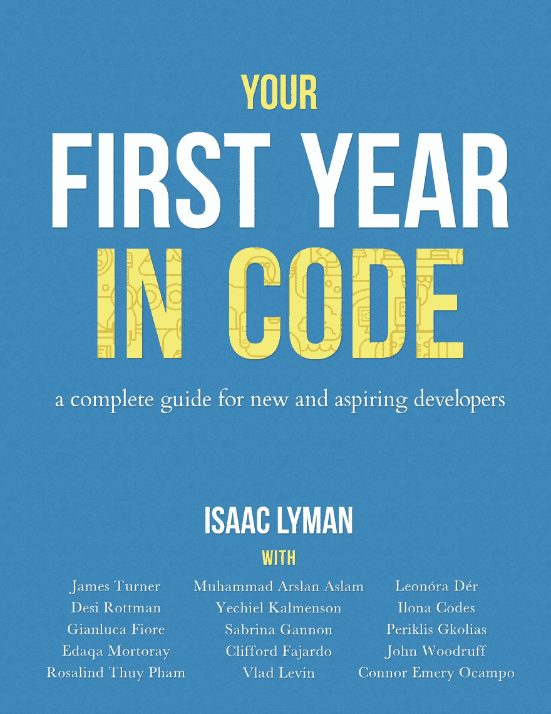

# 封面揭秘！你做代码的第一年

> 原文：<https://dev.to/isaacdlyman/cover-reveal-your-first-year-in-code-2kcb>

你在 Code 的第一年即将到来，这是一次令人惊奇的经历！开发社区中 15 个最好的作家贡献了内容，我们雇佣了一个优秀的封面设计师，一切都在按计划进行。

我们最终的封面是这样的:

我很荣幸能在这个项目中与如此出色的开发人员和作家一起工作，并为我们 7 月的出版日期感到兴奋。

这本书的内容是一流的。Rosa 将解释如何进行有效的代码评审。叶切尔会教你一些在工作中学习的最佳方法。伊洛娜将讲述作为一名科技界女性的酸甜苦辣。Clifford 会比较训练营和大学学位。而这仅仅是开始。这是我们都希望在大三时拥有的书，它很快就会成为你的，无论你想要什么，只要价格非常非常低。

如果这听起来像是你想读的东西，那就在预发布页面上注册:[https://leanpub.com/firstyearincode](https://leanpub.com/firstyearincode)。我们上线的时候你会是第一个知道的。

感谢大家的支持，我们很高兴成为你们从事代码工作的第一年、第二年或第二十年的一部分！