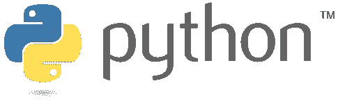
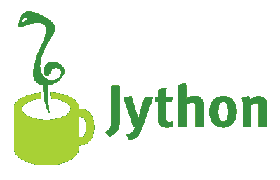
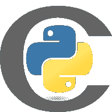

# CPython，Cython，PyPy...不同 Python 变体的介绍性指南

> 原文：<https://dev.to/alexgascon/cpython-cython-pypy-an-introductory-guide-to-the-different-python-variants-i4h>

[](https://res.cloudinary.com/practicaldev/image/fetch/s--CZkR-3Q9--/c_limit%2Cf_auto%2Cfl_progressive%2Cq_auto%2Cw_880/https://www.python.org/static/community_logos/python-logo-inkscape.svg)

如果你对 Python 编程感兴趣，你可能听说过 CPython、Cython、Jython、PyPy 这些词...然而，它们到底是什么？

在本文中，我们将对其中的一些 Python 变体做一个简单的介绍，这样，如果您在任何其他上下文中看到它们，至少可以理解它们具体指的是什么。

### CPython

CPython 是最初的 Python 实现，你可能每天都会用到，你可以从 python.org 官方下载。它的名字来源于这样一个事实:Python 代码是用 c 编译成字节码的。

### Jython

Jython 是一种替代实现，它使用 Java 而不是 C 来获取字节码。这使得字节码可以在 JVM(Java 虚拟机)中运行，就像其他语言(如 Kotlin、Scala 或 Java 本身)一样。

因为 Jython 只是另一个实现，所以语法保持不变:您可以获取所有的 CPython 代码并在 Jython 上运行它，而不需要修改任何代码。

[](https://res.cloudinary.com/practicaldev/image/fetch/s--wbwuRid_--/c_limit%2Cf_auto%2Cfl_progressive%2Cq_auto%2Cw_880/https://jesseross.com/clients/jythimg/jy_logo_large_c.png)

### Cython

Cython 是一个编译器，能够为 Python 编写 C 扩展，通常目标是使它更有效。与前面的示例不同，是一个不同的实现:它使用 CPython 来运行 Python 代码。它可以被认为是 Python 的一个超集，因为它包含了 Python 的所有功能，并在其上添加了额外的 C 能力。

[](https://res.cloudinary.com/practicaldev/image/fetch/s--qH9nLDWv--/c_limit%2Cf_auto%2Cfl_progressive%2Cq_auto%2Cw_880/https://avatars1.githubusercontent.com/u/486082%3Fs%3D400%26v%3D4)

这些扩展是用特定的语法编写的，非常类似于您将用来编写等效 C 代码的语法。让我们看看这个例子(来自 [Cython 的维基百科网站](https://en.wikipedia.org/wiki/Cython) )

```
def sum_up_to_n(n):
    a = 0

    for i in range(n):
        a += i

    return a

cpdef sum_up_to_n(int n):
    cdef int a = 0, i

    for i in range(n):
        a += i

    return a 
```

### py

有了 PyPy，我们有了另一个 Python 实现，比如 CPython 或 Jython。这个实现有趣的一点是它是在...Python 本身*(是的，可能这让你大吃一惊，所以请继续阅读以理解我们的意思)*

[](https://res.cloudinary.com/practicaldev/image/fetch/s--DJm4OH4K--/c_limit%2Cf_auto%2Cfl_progressive%2Cq_auto%2Cw_880/https://pypy.org/image/pypy-logo.png)

PyPy 的核心是一个实时(JIT)编译器，它用来将源代码中重复最多的部分编译成机器的本机代码(而不是字节码，就像 CPython 或 Jython 那样)。运行本机代码比运行字节码更有效，因此即使考虑到编译代码所用的时间，这也能带来巨大的速度提升。

PyPy 的网站上有很多关于它的优点(和缺点)的详细信息，以及一些关于哪些情况可能不太适合它的性能提示和建议，所以如果您感兴趣，我鼓励您查看一下。

## 总结

读完这篇文章，你应该更熟悉 CPython、Jython、Cython 和 PyPy 的概念。然而，你可能有兴趣了解更多，所以我准备了一个链接列表，如果你想更深入地了解这个话题，这些链接会非常有用。希望你觉得有用！

#### 有用的链接

*   [Python.org——替代的 Python 实现](https://www.python.org/download/alternatives/)
*   Jython 的权威指南
*   [Cython 官网](https://cython.org/)
*   [PyPy 官网](https://pypy.org/)
*   [即时编译](https://en.wikipedia.org/wiki/Just-in-time_compilation)
*   [关于 Python 实现的文章](https://www.toptal.com/python/why-are-there-so-many-pythons)