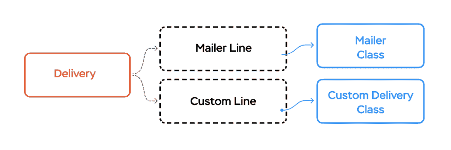

# 通过主动交付在 Rails 中制作用户通知

> 原文：<https://dev.to/evilmartians/crafting-user-notifications-in-rails-with-active-delivery-5cn6>

Rails 框架就像一把瑞士军刀，提供了许多开箱即用的有用功能(并且[它变得](https://weblog.rubyonrails.org/2018/12/20/timeline-for-the-release-of-Rails-6-0/)更加*瑞士化*)。

它建立在*子框架*之上，例如，ActiveRecord、ActiveJob、ActionCable (❤️)、 **ActionMailer** ...好了，就讲到这里吧。
action mailer 的目的是什么？

ActionMailer 是一个**抽象，用于发送电子邮件**(也接收电子邮件，尽管现在我们有了 [ActionMailbox](https://edgeguides.rubyonrails.org/action_mailbox_basics.html) )。

它抽象了交付机制，并提供了一个 *Railsy* API 来*构建*消息。

因此，向用户发送电子邮件通知对 Rails 应用程序来说不是一个大问题。

问题是，在现代世界中，我们有许多不同的方式来发送通知，而不仅仅是电子邮件:推送通知、聊天机器人、短信、*鸽子*。

**注:** DDH [提到](https://youtu.be/m1jOWu7woKM?t=1096)一些来自 Basecamp 的“动作通知器”框架，“有待提取”，听起来像是一个解决方案；但我们还没到那一步。

像这样的代码很常见:

```
def notify_user(user)
  MyMailer.with(user: user).some_action.deliver_later if user.receive_emails?
  SmsSender.send_message(user, "Something happened") if user.receive_sms?
  NotifyService.send_notification(user, "action") if whatever_else?
end 
```

代码库中可能有几十个这样的地方。祝您维护和测试这段代码好运！

我们如何重构这段代码？也许，我们需要一个*另一层抽象*？)

下面是[主动交付](https://github.com/palkan/active_delivery)——我写的一个新的宝石来解决这个难题。

Active Delivery 是一个框架，它为所有类型的通知提供了一个入口点:邮件、推送通知等等。

它帮助你用下面的方式重写上面的代码:

```
def notify_user(user)
  MyDelivery.with(user: user).notify(:some_action)
end 
```

甚至更多——你现在可以优雅地测试它:

```
# my_something_spec.rb
expect { subject }.to have_delivered_to(MyDelivery, :some_action).
  with(user: user) 
```

它是如何工作的？

在最简单的情况下，一个*递送*仅仅是一个包裹在邮件外面的包裹:

```
# suppose that you have a mailer class
class MyMailer < ApplicationMailer
  def some_action
    # ...
  end
end

# the corresponding delivery could look like this
class MyDelivery < ActiveDelivery::Base
  # here we can also apply "delivery rules"
  before_notify :ensure_receive_emails, on: :mailer

  def ensure_receive_emails
    # returning `false` halts the execution
    params[:user].receive_emails?
  end
end

# when you call
MyDelivery.with(user: user).notify(:some_action)

# it invokes under the hood (only if user receives emails)
MyMailer.with(user: user).some_action.deliver_later 
```

我们依靠配置上的**约定来推断相应的邮件程序类。**

好的。我们刚刚包装好我们的邮件。怎么回事？如何处理其他交付方式？

让我们来看看框架的架构:

[](https://res.cloudinary.com/practicaldev/image/fetch/s--Acpb_YQa--/c_limit%2Cf_auto%2Cfl_progressive%2Cq_auto%2Cw_880/https://thepracticaldev.s3.amazonaws.com/i/4l7xds58nedq12aqmvoi.jpg)

请注意，这里有一个内部层—*线条*。每一行都是交付和实际通知渠道(如邮件程序)之间的连接器。

主动交付提供了一个 API 来[添加自定义交付*行*](https://github.com/palkan/active_delivery#custom-lines)——这就是你如何实现几乎任何类型的通知！

为了让它变得更加简单，我们构建了另一个微框架——[抽象通知程序](https://github.com/palkan/abstract_notifier)。

这是一个非常*抽象的*框架:它所做的只是提供一个类似于动作邮件的 API 来描述*通知*类，纯 Ruby 抽象，对“如何发送通知”一无所知

为什么要使用类似邮件的界面？首先，这是一个熟悉的大洲 API。我喜欢它的[参数化类](https://api.rubyonrails.org/classes/ActionMailer/Parameterized.html)特性(我们在主动交付中大量使用)。

要“教”抽象通知程序如何发送通知，您必须实现一个*驱动程序*(任何可调用的对象)。

例如，我们使用 [Twilio Notify](https://twilio.com/notify) 进行推送通知，这就是我们的 driver、`ApplicationDelivery`和`ApplicationNotifier`类的样子:

```
class TwilioDriver
  attr_reader :service

  def initialize(service_id)
    client = build_twilio_api_client
    @service = client.notify.services(service_id)
  end

  def call(params)
    service.notifications.create(params)
  end
end

class ApplicationDelivery < ActiveDelivery::Base
  # NOTE: abstract_notifier automatically registers its default line,
  # you don't have to do that
  #
  # Default notifier infers notifier classes replacing "*Delivery* with
  # "*Notifier"
  register_line :notifier, ActiveDelivery::Lines::Notifier
end

class ApplicationNotifier < AbstractNotifier::Base
  self.driver = TwilioDriver.new(Rails.application.config.twilio_notify_id)
end 
```

现在让我们来定义我们的传递类、邮件类和通知类:

```
class PostsDelivery < ApplicationDelivery
  # here we can define callbacks, for example,
  # we want to enforce passing a target user as a param
  before_notify :ensure_user_provided  

  def ensure_user_provided
    raise ArgumentError, "User must be passed as a param" unless params[:user].is_a?(User)
  end

  # in our case we have a convenient params-reader method
  def user
    params[:user]
  end
end

class PostsMailer < ApplicationMailer
  def published(post)
    mail(
      to: user.email,
      subject: "Post #{post.title} has been published"
    )
  end
end

class PostsNotifier < ApplicationNotifier
  # Btw, we can specify default notification fields
  default action: "POSTS"

  def published(post)
    notification(
      body: "Post #{post.title} has been published",
      identity: user.twilio_notify_id
      # you can pass here any fields supported by your driver
    )
  end
end 
```

最后，这就是我们触发通知的方式:

```
PostsDelivery.with(user: user).notify(:published, post) 
```

如果需要多一个通知渠道呢？我们可以在`ApplicationDelivery` :
中添加另一个通知行

```
class ApplicationDelivery < ActiveDelivery::Base
  register_line :notifier, ActiveDelivery::Lines::Notifier

  register_line :pigeon,
                ActiveDelivery::Lines::Notifier,
                # resolver is responsible for inferring
                # the notifier class from
                # the delivery class name
                resolver: ->(name) { name.gsub(/Delivery$/, "Pigeon").safe_constantize }

end

class PigeonNotifier < AbstractNotifier::Base
  self.driver = PigeonDelivery.new
end

class PostsPigeon < PigeonNotifier
  def published(post)
    notification(
      to: user.pigeon_nest_id,
      message: "coo-chi coo-chi coo"
    )
  end
end 
```

好了🐦！

查看[主动交付](https://github.com/palkan/active_delivery#custom-lines)和[摘要通知者](https://github.com/palkan/abstract_notifier)回购以获取更多技术信息。

* * *

阅读更多关于 https://evilmartians.com/chronicles 的文章！