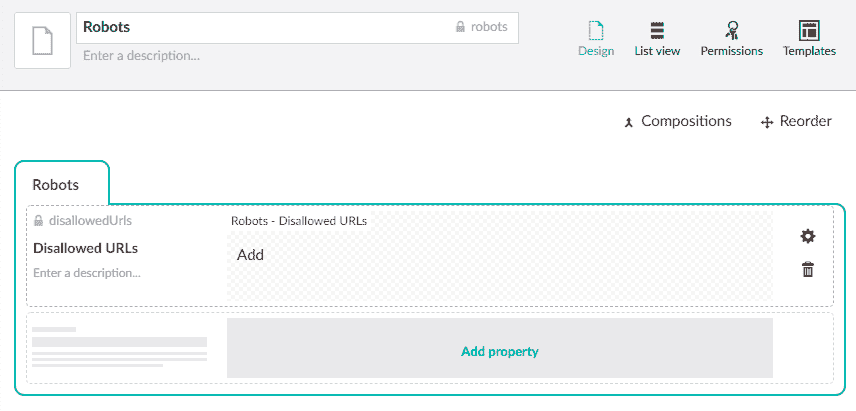
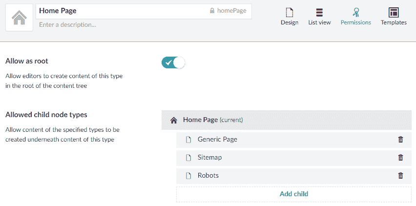
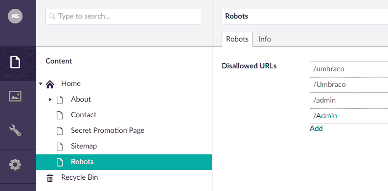
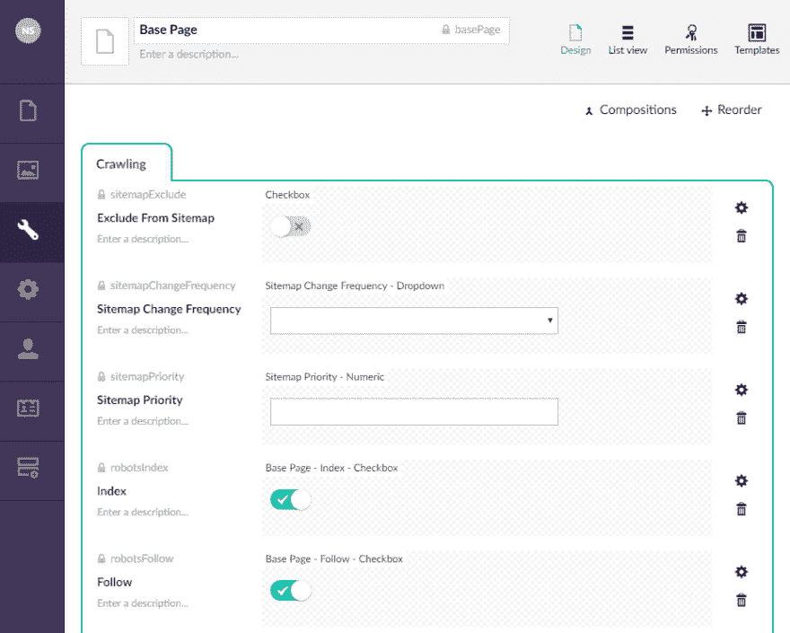

# 带着机器人在翁布拉科爬行

> 原文：<https://dev.to/swimburger/crawling-through-umbraco-with-robots-iab>

这个系列是关于让你的 Umbraco 网站更容易被搜索引擎蜘蛛发现。上一篇文章讨论了如何动态生成站点地图，本周我们将讨论每个网站都需要的另一个东西:文件“ **robots.txt** ”和“**robots**meta 标签。

系列:

1.  [用网站地图在 Umbraco 中爬行](https://swimburger.net/blog/umbraco/crawling-through-umbraco-with-sitemaps/blog/umbraco/crawling-through-umbraco-with-sitemaps)
2.  带着机器人爬过翁布拉科(本帖👍)

## 什么是 Robots 文件？

robots.txt 文件的主要用途是告诉机器人(Google Bot、Bing Bot 等。)为他们的搜索引擎索引什么，以及不索引什么。通常你希望你的大部分网站被谷歌抓取，比如博客文章，产品页面等。，但大多数网站会有一些页面/部分不应该被索引或列在搜索引擎中。一些不需要索引的页面的常见示例:

*   表格确认页(fe: /contact-us/thank-you)
*   直接链接页面，如秘密促销或调查(fe: /dk89f9/rate-talk？talk=keynote-2018)
*   CMS 后端部分(fe: /umbraco)

## Robots.txt 基础知识

robots.txt 文件是一个简单的文本文件，允许我们禁止某些机器人访问我们网站的某些部分。不能保证机器人会尊重你的 robots.txt 文件。

这里有一个允许所有机器人访问整个网站的例子:

```
User-agent: * 
```

Enter fullscreen mode Exit fullscreen mode

这里有一个例子，不允许网站的不同部分被不同的机器人访问:

```
User-agent: Google
Disallow: /dont-show-google

User-Agent: bingbot
Disallow: /dont-show-bing 
```

Enter fullscreen mode Exit fullscreen mode

这里有一个 robots.txt 文件，禁止机器人访问 Umbraco 管理部分:

```
User-agent: *
Disallow: /umbraco 
```

Enter fullscreen mode Exit fullscreen mode

## Robots.txt 和 sitemaps

在我们的网站地图中，我们必须确保<u>而不是</u>列出任何我们的 robots.txt 不允许的 URL，反之亦然。这可能会导致您的页面意外索引或没有索引。

robots.txt 文件中还有另一个允许的属性，名为“ **Sitemap** ”。当你有了站点地图，你可以手动提交到 Google 和 Bing 站长工具，但是很多搜索引擎没有站长工具。使用 robots.txt 文件中的“Sitemap”属性，我们可以共享站点地图的位置。

```
Sitemap: https://www.swimburger.net/sitemap.xml
User-agent: *
Disallow: /umbraco 
```

Enter fullscreen mode Exit fullscreen mode

注意“网站地图”属性**必须是一个绝对 URL** 。不允许相对 URL。

## 在 Umbraco 中实现 robots.txt

对于我们的 robots.txt，我们可以简单地添加一个名为“robots.txt”的文件作为我们项目的根目录，不允许使用 Umbraco admin 部分，然后就到此为止。我们还可以将“Sitemap”属性添加到 robots.txt 中，并硬编码完整的 URL，但是有可能您有不止一个环境，或者您有一个带有多个域名的多站点设置。

我们将动态生成“Sitemap”属性，并添加通过 Umbraco 内容添加排除的功能。

### 添加新的站点地图自定义文档类型

对于本教程，我们将建立在我们之前的设置之上，从[“用站点地图在 Umbraco 中爬行”。](https://dev.to/realswimburger/crawling-through-umbraco-with-sitemaps-46lj-temp-slug-4431015)

让我们创建一个新的自定义文档类型(带模板)名为“Robots”。

配置 Robots 文档类型如下:

*   机器人(选项卡)
    *   不允许的 URL
    *   类型:可重复的文本字符串
    *   别名:不允许的世界

[](https://res.cloudinary.com/practicaldev/image/fetch/s--_XjxjOpD--/c_limit%2Cf_auto%2Cfl_progressive%2Cq_auto%2Cw_880/https://www.swimburger.net/media/1095/robots-content-type.png)

在我们添加 Robots 内容之前，我们需要允许它被添加到主页下。

[](https://res.cloudinary.com/practicaldev/image/fetch/s--hVzMG-o5--/c_limit%2Cf_auto%2Cfl_progressive%2Cq_auto%2Cw_880/https://www.swimburger.net/media/1093/allow-under-home.png)

让我们在主页下添加机器人内容，并禁止一些 URL。

[](https://res.cloudinary.com/practicaldev/image/fetch/s--Kh-vS6n3--/c_limit%2Cf_auto%2Cfl_progressive%2Cq_auto%2Cw_880/https://www.swimburger.net/media/1094/disallow-urls.png)

### 生成 Robots.txt 文件

现在内容已经设置好了，让我们来处理 Robots 视图模板。

将模板改为如下代码:

```
@inherits Umbraco.Web.Mvc.UmbracoTemplatePage<ContentModels.Robots>
@using ContentModels = Umbraco.Web.PublishedContentModels;
@{
    Layout = null;
    umbraco.library.ChangeContentType("text/plain");
    var rootUrl = Request.Url.GetLeftPart(UriPartial.Authority);
}Sitemap: @(rootUrl + "/sitemap.xml")
User-agent: *
@foreach(var url in Model.Content.DisallowedUrls)
{
    @Html.Raw(string.Format("Disallow: {0}\n", url))
} 
```

Enter fullscreen mode Exit fullscreen mode

这个代码片段做了三件事:

1.  将内容类型设置为文本
2.  动态指向站点地图文件
3.  不允许我们在 Umbraco 文档类型中指定的所有 URL

当我们浏览到`/robots`时，我们应该看到以下输出:

```
Sitemap: http://localhost:55848/sitemap.xml
User-agent: *
Disallow: /umbraco
Disallow: /Umbraco
Disallow: /admin
Disallow: /Admin 
```

Enter fullscreen mode Exit fullscreen mode

### 设置重写规则到/robots.txt

根据标准定义，robots.txt 文件必须可以在站点的根目录下使用“robots.txt”文件名进行访问。目前我们只返回/robots URL 上的内容。就像我们对站点地图所做的一样，我们可以设置一个 IIS 重写，这样内容就可以通过/robots.txt.

添加下面的重写配置到你的 web.config 文件:

```
<?xml version="1.0" encoding="utf-8"?>
   ...
   <system.webServer>
     ...
     <rewrite>
      <rules>
        <rule name="Rewrite to Sitemap.xml">
          <match url="^sitemap.xml" />
          <action type="Rewrite" url="sitemap" />
        </rule>
        <rule name="Rewrite to Robots.txt">
          <match url="^robots.txt" />
          <action type="Rewrite" url="robots" />
        </rule>
      </rules>
     </rewrite>
     ...
  </system.webServer>
  ...
</configuration> 
```

Enter fullscreen mode Exit fullscreen mode

`/robots.txt`和`/robots`现在都返回我们的新机器人文件。

## 什么是 robots meta 标签？

robots meta 标记的作用与 robots.txt 文件相同。不同之处在于，你只需指定当前页面 **的**应该被**索引**，而机器人应该**跟随当前页面上的链接**。这个 meta 标签有 4 种不同的组合。**** 

```
<meta name="robots" content="index, follow">
<meta name="robots" content="noindex, nofollow">
<meta name="robots" content="index, nofollow">
<meta name="robots" content="noindex, follow"> 
```

Enter fullscreen mode Exit fullscreen mode

*   **索引**:索引本页
*   **noindex** :不索引此页面

*   **关注**:关注本页的链接

*   不跟随:不要跟随这个页面上的链接

### 在 Umbraco 中实现机器人元标签

我们希望能够为 Umbraco 中的每个页面指定这个 meta 标签的值。让我们从[前一篇文章](https://dev.to/blog/umbraco/crawling-through-umbraco-with-sitemaps)中添加两个复选框到我们现有的 BasePage 组合中。

*   爬网(选项卡)
    *   索引
    *   类型:自定义复选框编辑器
    *   默认值:真
    *   别名:robotsIndex
    *   跟随
    *   类型:自定义复选框编辑器
    *   默认值:真
    *   别名:机器人追随

[](https://res.cloudinary.com/practicaldev/image/fetch/s--wcu3esTc--/c_limit%2Cf_auto%2Cfl_progressive%2Cq_auto%2Cw_880/https://www.swimburger.net/media/1092/add-index-and-follow-properties-to-basepage.png)

现在每个页面都有了这些新属性，让我们添加一些模板代码来输出元数据标签。更新 HomePage.cshtml 如下:

```
@inherits Umbraco.Web.Mvc.UmbracoTemplatePage<ContentModels.HomePage>
@using ContentModels = Umbraco.Web.PublishedContentModels;
@{
    Layout = null;
    var robotsValue = string.Format("{0}, {1}", Model.Content.RobotsIndex ? "index" : "noindex", Model.Content.RobotsFollow ? "follow" : "nofollow");
}
<!DOCTYPE html>
<html>
<head>
    <meta name="robots" content="@robotsValue" />
</head>
<body>
    <h1>@Model.Content.Name</h1>
</body>
</html> 
```

Enter fullscreen mode Exit fullscreen mode

现在我们可以通过改变主页上的 Umbraco 属性来改变 robots meta 标签。如果您没有看到元标记值被正确输出，请尝试发布您的主页。

然而，我们需要所有页面都具有相同的功能，而不仅仅是主页。让我们创建一个“_Layout.cshtml”和“_ViewStart.cshtml”模板，以便在所有页面模板中重用该功能，而不是将代码复制到每个模板中。将以下文件添加到您的 Umbraco 模板中:

_Layout.cshtml

```
@inherits Umbraco.Web.Mvc.UmbracoTemplatePage<ContentModels.IBasePage>
@using ContentModels = Umbraco.Web.PublishedContentModels;
@{
    var robotsValue = string.Format("{0}, {1}", Model.Content.RobotsIndex ? "index" : "noindex", Model.Content.RobotsFollow ? "follow" : "nofollow");
}
<!DOCTYPE html>
<html>
<head>
    <meta name="robots" content="@robotsValue" />
</head>
<body>
    @RenderBody()
</body>
</html> 
```

Enter fullscreen mode Exit fullscreen mode

_ViewStart.cshtml

```
@{
    Layout = "~/Views/_Layout.cshtml";
} 
```

Enter fullscreen mode Exit fullscreen mode

为了使这一更改生效，我们还需要删除“Layout = null”我们页面中的引用-模板。例如，我们的主页应该是这样的:

```
@inherits Umbraco.Web.Mvc.UmbracoTemplatePage<ContentModels.HomePage>
@using ContentModels = Umbraco.Web.PublishedContentModels;
<h1>@Model.Content.Name</h1> 
```

Enter fullscreen mode Exit fullscreen mode

现在所有的页面模板都使用了新的布局，我们的 robots meta 标签在任何地方都是有效的！

### 进一步阅读

以下是首次实现 robots.txt 和 robots 元标记时的一些有用链接:

*   [http://www.robotstxt.org/](http://www.robotstxt.org/)
*   [https://moz.com/learn/seo/robotstxt](https://moz.com/learn/seo/robotstxt)
*   [https://support.google.com/webmasters/answer/6062608?hl=en](https://support.google.com/webmasters/answer/6062608?hl=en)
*   Google Robots.txt 验证器:[https://www . Google . com/web masters/tools/robots-testing-tool？pli=1](https://www.google.com/webmasters/tools/robots-testing-tool?pli=1)

**源代码:**你可以在 GitHub

上找到[的机器人代码还有，别忘了看看这个系列的其他帖子:](https://github.com/SNiels/Umbraco.Crawling.Sitemap)

1.  [用网站地图在 Umbraco 中爬行](https://swimburger.net/blog/umbraco/crawling-through-umbraco-with-sitemaps)
2.  带着机器人爬过翁布拉科(本帖)

干杯

(喜欢，订阅，并点击通知铃🙃)