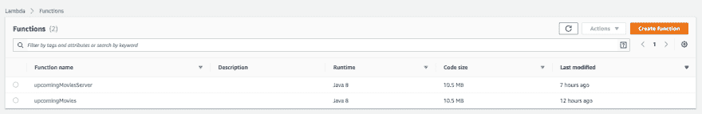
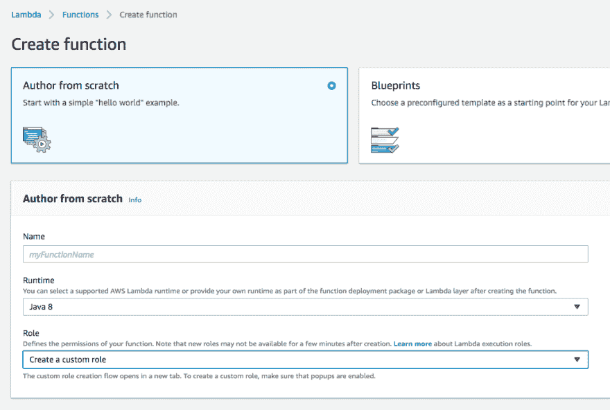
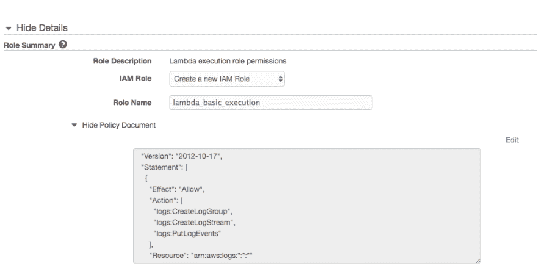
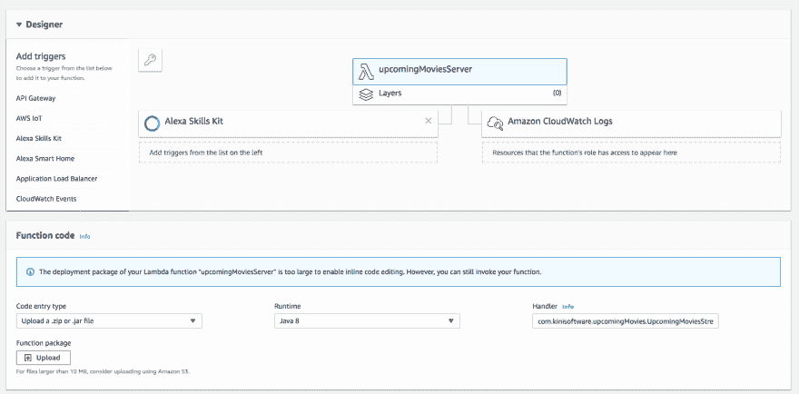
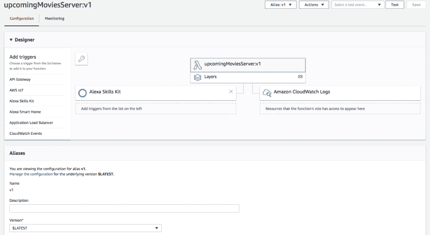
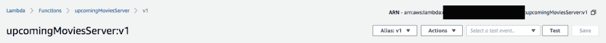
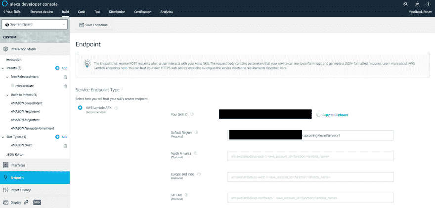

# 自定义技能 para Alexa(III):AWS Lambda y Java 8 中的技能服务器端

> 原文：<https://dev.to/kini/creando-un-custom-skill-para-alexa-iii-skill-server-side-en-aws-lambda-y-java-8-20dg>

在[上一篇帖子](https://kinisoftware.com/creando-un-custom-skill-para-alexa-estrenos-de-cine-ii/)中，我讲述了如何使用 Alexa 开发者控制台创建技能及其交互模型。在这一部分中，我们构建了一个语音界面，用户将与之交互。现在，我们必须将“客户”部分连接到一个端点，该端点将具有处理传入请求所需的知识。这就是我们将在这篇文章中看到的。

## AWSλ

到目前为止，他听过很多关于 serverless 的事，读过一些东西，但什么也没玩。这是一个完美的机会，因为 Alexa 的技巧与一个‘t0’AWS lambda’融为一体，千奇百怪。你可以通过 HTTP 选择自己的 web 服务，但我想要一些简单的东西，顺便学习一些关于无服务器的东西。

您必须先建立 lambda，才能从主控台设定技能端点。关于 AWS Lambda 有很多[的文献](https://aws.amazon.com/lambda/resources/)因为它并不是什么新鲜的东西，被用于很多其他的事情，但是我，不读太多，就能创造出技能所需的东西。加上免费的选项，我们有足够的东西满足我们的需求。

我推荐几种资源:

*   【2018 年提交 Conf 的伊凡演讲，他在那里回顾了整理 lambda 的必要内容。
*   Javier Campos 关于如何处理你的 lambda 的《T0》帖子，用于其版本化的演变。我真希望一开始就能读给我听因为我不太小心。现在我已经为将来的技能认证创建了一个新的 lambda，而且我已经用版本和别名更好地组织了它。
*   [德语会话](https://www.todojs.com/desarrollando-skills-alexa-con-aws-lambda-y-node-js-por-german-viscuso/)，亚马逊 Alexa Evangelist，其中他还计划与 AWS Lambda 但与 Node.js 一起创造一种技能

我会用镜头重复一些事情，没有太多细节来展示所有的步骤。

### lambda 的基本配置

我们首先要做的是[从相应的](https://eu-west-1.console.aws.amazon.com/lambda/home?region=eu-west-1#/functions)控制台创建 lambda。

在我的情况下，我选择 Java 8 作为运行时，但您可以从许多其他选项中进行选择，例如 Node.js、Python、Go-我...。请记住，Java 8 只是一个运行时，但我们不强制使用 Java，而是可以使用其他替代方法，如 Kotlin 或 Groovy。最后，我将把我在 Java 8 中所做的移植到 Kotlin，如果有用的话，我会告诉你。

关于角色，我自己创造了一个基本的。这是我不太清楚的事实，我选择了这一点，但也许有一些预先定义是有效的。我的角色是唯一可以访问 logs 主题的角色。这是默认情况下提供给您的基本功能。

一旦创建了 lambda，我们将进入仪表板，从中管理所有内容。在此，我建议您遵循 Javier 在其帖子中描述的步骤。最后，你会得到一个像这样的东西:

在图中我们可以看到:

*   lambda 的管理部分，现在已被选中，这将使我们能够管理将要执行的代码。
*   触发亚历克莎技能。
*   日志触发器(我将在另一篇文章中进一步讨论日志)。

如果您创建版本主题，您将至少有一个别名配置为与各自版本的 lambda 相对应。

现在我们已经有了把技能和 lambda 联系起来的最低要求。

## 连接技能和舔舔

两者都需要连接，每一步都需要从控制台连接。顺序很重要，因为您必须先设定 lambda 与 Alexa 的连线，才能将端点设定储存至技能。

你需要两个数据:

*   [ARN](https://docs.aws.amazon.com/general/latest/gr/aws-arns-and-namespaces.html) 从 lambda 上把它放到技能上。RNA 可以从你的 lamdba 管理控制台复制。

*   技能 id 以将其置于 lambda 配置中。您可以从控制台端点配置区域复制它。

### 连接 lambda 与技能

使用上图中的技能 id，我们可以配置 lambda 集成。从我们添加的触发器中，我们可以输入我们的技能 id，以便我们验证连接。添加 id 后，请记住保存设置。这对于正确设置 lambda 技能是必要的。

### 连接技能与 lambda

从 Alexa Developer Console 我们的技能，我们可以配置端点。这是我们获取技能 id 的屏幕。

唯一需要指出的是端点类型，AWS Lambda 在我的情况下，以及它的 RNA。请注意，如果您这样做，RNA 将是您创建的版本。否则，将始终默认使用最新版本的 lambda，并且一旦获得证书并发布，管理起来会更加复杂。我的建议是使用版本控制系统。

我们只剩下保存端点设置。控制台将验证 skill 和 lambda 之间的设置，并通知我们一切是否正确或有问题。

## 显示代码

所有之前的管道工程都是必要的，这样技能才能最终说出我们要部署在 lambda 上的代码。我本想在这篇文章里也解释一下代码，但我觉得会太长，下次我会更好地告诉你。我将把[github 的 repo 链接](https://github.com/kinisoftware/alexa-skill-estrenos-de-cine)留在这里，我将把我所做的事情上传到那里，以便你们查阅，如果你们有任何问题，可以在这里或 twitter 上给我写评论。

快速摘要:

*   入口点是“`UpcomingMoviesStreamHandler`”类，其中记录交互模型中定义的所有尝试句柄。
*   我很少关心代码、真相(没有分支管理、零测试等)。我的第一个目标是认证技能的第一个版本，从那以后我就在改进东西。除了测试之外，我认为他们会很有趣的观察和计算。
*   skill 查询的电影明星名单就像 lambda 本身的 csv 文件，我暂时没有使用任何 API，尽管我有一些面向未来的本地化。
*   最有 miga 的班级是`NewReleasesIntentHandler`我在那里处理我技能的主要意图和日期槽。

我将在以下文章中进一步阐述该守则:)