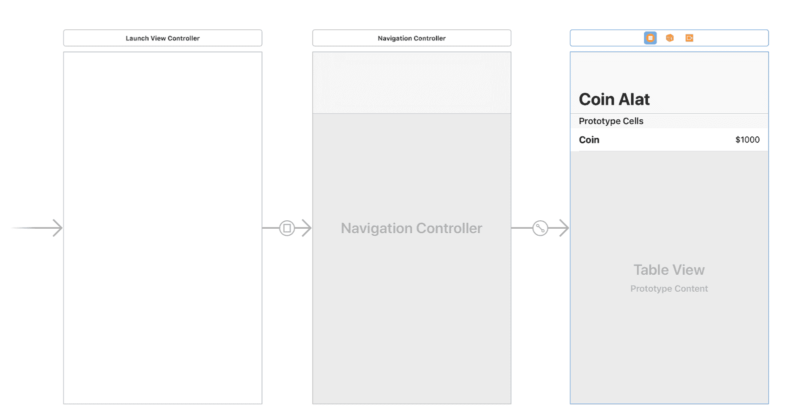
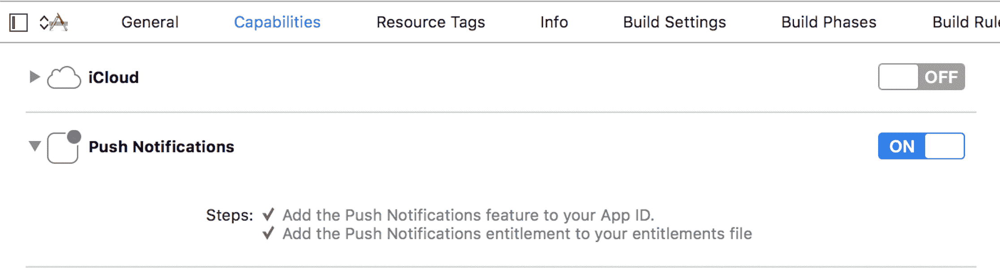
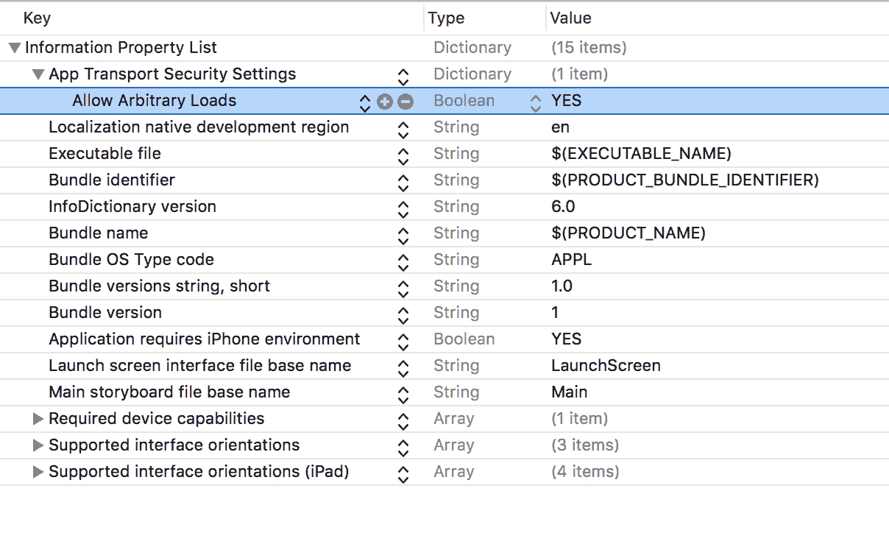

# 使用 Swift 和 Laravel 创建带有推送通知的加密货币跟踪应用程序——第 2 部分:iOS 应用程序

> 原文：<https://dev.to/neo/create-a-cryptocurrency-tracking-app-with-push-notifications-using-swift-and-laravel---part-2-the-ios-app-251a>

> 您需要在您的机器上安装以下软件:Xcode、Laravel CLI、SQLite 和 Cocoapods。熟悉 Xcode IDE 会有所帮助。你应该已经完成了这个系列的第一部分。

在本文的第一部分中，我们开始开发我们的加密货币警报应用程序。我们开发了支持 iOS 应用的应用后端。目前，我们的后端应用程序可以根据设备的 UUID 返回设备的设置，根据设备的 UUID 保存设备的设置，还可以计算出在货币更新时向哪些设备发送推送通知。

在这一部分，我们将重点介绍使用 Swift 和 Xcode 创建 iOS 应用程序。

## 先决条件

要跟进，您需要满足以下要求:

*   完成了本文的第一部分。
*   安装在您机器上的 Xcode 。
*   Xcode IDE 的知识。
*   使用 [Laravel 框架](https://laravel.com/)的基础知识。
*   关于 [Swift 编程语言](http://developer.apple.com/swift)的基础知识。
*   安装在您机器上的 Laravel CLI 。
*   安装在您机器上的 SQLite。[安装指南](http://www.sqlitetutorial.net/download-install-sqlite/)。
*   安装在您机器上的 Cocoapods 。
*   [推梁](https://pusher.com/beams)和[通道](https://pusher.com/channels)应用。

## 我们将建造什么

我们已经开始使用 Laravel 构建应用程序的后端。接下来，我们将使用 Swift 构建 iOS 应用程序。如果您想测试推送通知，那么您需要在一个活动设备上运行该应用程序。

### 客户端应用将如何工作

对于客户端应用程序，iOS 应用程序，我们将创建一个简单的列表，显示可用的货币和美元的当前价格。每当加密货币的价格发生变化时，我们将使用推送渠道触发一个事件，以便更新价格。

从应用程序中，您将能够设置一个最小和最大的价格变化时，你想得到提醒。例如，您可以配置应用程序，当一个以太网(ETH)的价格低于 500 美元时，向应用程序发送推送通知。你也可以配置应用程序在比特币价格超过 5000 美元时接收通知。

### 应用程序的外观

当我们完成应用程序时，下面是应用程序的外观:

[](//images.ctfassets.net/1es3ne0caaid/1K08NTSdaoIIqWQ2YAyOqo/4efdb4fa01a2ee599bf5b71561a717a4/ios-cryptocurrency-part-1-demo.gif)

让我们开始吧。

## 设置您的客户端应用

启动 Xcode 并点击**创建新的 Xcode 项目**。选择**单视图 App** ，点击**下一步**。输入您的**产品名称**，我们将调用我们的项目 *cryptoalat* ，并从**语言**选项中选择 **Swift** 。您也可以在屏幕上更改您想要的任何其他细节，然后点击下一步的**。**

### 安装依赖项

现在您有了 Xcode 项目。关闭 Xcode 并打开一个终端窗口。`cd`到终端中的 iOS 项目目录，运行下面的命令创建一个 Podfile:

```
 $ pod init 
```

Enter fullscreen mode Exit fullscreen mode

> Podfile 是描述一个或多个 Xcode 项目的目标依赖关系的规范。该文件应该简单地命名为 Podfile。指南中的所有例子都是基于 CocoaPods 版本 1.0 和更高版本的。- [椰子导轨](https://guides.cocoapods.org/using/the-podfile.html)

这将在项目的根目录下生成一个名为`Podfile`的新文件。在任何编辑器中打开该文件，并更新文件，如下所示:

```
 // File: Podfile
    platform :ios, '11.0'

    target 'cryptoalat' do
      use_frameworks!

      pod 'Alamofire', '~> 4.7.2'
      pod 'PushNotifications', '~> 0.10.8'
      pod 'PusherSwift', '~> 6.1.0'
      pod 'NotificationBannerSwift', '~> 1.6.3'
    end 
```

Enter fullscreen mode Exit fullscreen mode

> 如果您使用了 cryptoalat 以外的项目名称，那么在 Podfile 中更改它以匹配项目的目标名称。

转到终端并运行下面的命令来安装您的依赖项:

```
 $ pod install 
```

Enter fullscreen mode Exit fullscreen mode

当安装完成时，您将在项目的根目录中拥有一个`*.xcworkspace`文件。在 Xcode 中打开这个文件，让我们开始开发加密货币警报应用程序。

## 构建 iOS 应用

### 创建我们的故事板

我们需要做的第一件事是为应用程序设计故事板。这是我们希望故事板完成后的样子。

[](//images.ctfassets.net/1es3ne0caaid/3CgFeKuZnyMkQ0Kseaw2Gk/9e4a0a12e87fe5685f30c563d9f3ea8d/ios-cryptocurrency-part-2-storyboard.png)

打开`Main.storyboard`文件，如上图所示设计。

上面我们有三个场景。第一个场景，也是切入点，是发射场景。然后，我们用一个名为 **Main** 的标识符绘制一个手动序列。然后我们将序列**种类**设置为**呈现方式**。这将呈现下一个场景，即导航视图控制器。默认情况下，导航控制器已经有一个附加的根视图控制器。

我们将使用这个附加的视图控制器，它是一个`TableViewController`，作为应用程序的主视图。它会列出可用的货币，并向我们显示一个文本字段，允许我们在点击时更改该货币的设置。

在第三个场景中，我们将单元格的重用标识符设置为 **coin** ，并将两个标签拖到原型单元格中。第一个标签是硬币名称，第二个标签是价格。

现在我们有了场景，让我们创建一些控制器和视图类，并将它们连接到我们的故事板场景。

### 创建您的控制器

在 Xcode 中，创建一个新的类`LaunchViewController`并将下面文件的内容粘贴到其中:

```
 <span class="hljs-keyword">import</span> UIKit

    <span class="hljs-class"><span class="hljs-keyword">class</span> <span class="hljs-title">LaunchViewController</span>: <span class="hljs-title">UIViewController</span> </span>{

        <span class="hljs-keyword">override</span> <span class="hljs-function"><span class="hljs-keyword">func</span> <span class="hljs-title">viewDidAppear</span><span class="hljs-params">(<span class="hljs-number">_</span> animated: Bool)</span></span> {
            <span class="hljs-keyword">super</span>.viewDidAppear(animated)

            <span class="hljs-type">SettingsService</span>.shared.loadSettings {
                <span class="hljs-keyword">self</span>.routeToMainController()
            }
        }

        <span class="hljs-keyword">fileprivate</span> <span class="hljs-function"><span class="hljs-keyword">func</span> <span class="hljs-title">routeToMainController</span><span class="hljs-params">()</span></span> {
            performSegue(withIdentifier: <span class="hljs-string">"Main"</span>, sender: <span class="hljs-keyword">self</span>)
        }
    } 
```

Enter fullscreen mode Exit fullscreen mode

> 将控制器设置为`Main.storyboard`文件中第一个场景的自定义类。

在代码中，我们使用稍后将创建的`SettingsService`类加载设置。当为设备加载设置时，我们调用`routeToMainController`方法，该方法使用我们之前创建的 **Main** segue 将应用程序路由到主控制器。

我们将创建的下一个控制器是`CoinsTableViewController`。这将是与第三个场景(即主场景)关联的控制器。

创建`CoinsTableViewController`并用以下代码替换内容；

```
 <span class="hljs-keyword">import</span> UIKit
    <span class="hljs-keyword">import</span> PusherSwift
    <span class="hljs-keyword">import</span> NotificationBannerSwift

    <span class="hljs-class"><span class="hljs-keyword">struct</span> <span class="hljs-title">Coin</span> </span>{
        <span class="hljs-keyword">let</span> name: <span class="hljs-type">String</span>
        <span class="hljs-keyword">let</span> rate: <span class="hljs-type">Float</span>
    }

    <span class="hljs-class"><span class="hljs-keyword">class</span> <span class="hljs-title">CoinsTableViewController</span>: <span class="hljs-title">UITableViewController</span> </span>{

        <span class="hljs-keyword">var</span> coins: [<span class="hljs-type">Coin</span>] = []

        <span class="hljs-keyword">override</span> <span class="hljs-function"><span class="hljs-keyword">func</span> <span class="hljs-title">viewDidLoad</span><span class="hljs-params">()</span></span> {
            <span class="hljs-keyword">super</span>.viewDidLoad()
        }

        <span class="hljs-keyword">override</span> <span class="hljs-function"><span class="hljs-keyword">func</span> <span class="hljs-title">numberOfSections</span><span class="hljs-params">(<span class="hljs-keyword">in</span> tableView: UITableView)</span></span> -> <span class="hljs-type">Int</span> {
            <span class="hljs-keyword">return</span> <span class="hljs-number">1</span>
        }

        <span class="hljs-keyword">override</span> <span class="hljs-function"><span class="hljs-keyword">func</span> <span class="hljs-title">tableView</span><span class="hljs-params">(<span class="hljs-number">_</span> tableView: UITableView, numberOfRowsInSection section: Int)</span></span> -> <span class="hljs-type">Int</span> {
            <span class="hljs-keyword">return</span> coins.<span class="hljs-built_in">count</span>
        }

        <span class="hljs-keyword">override</span> <span class="hljs-function"><span class="hljs-keyword">func</span> <span class="hljs-title">tableView</span><span class="hljs-params">(<span class="hljs-number">_</span> tableView: UITableView, cellForRowAt indexPath: IndexPath)</span></span> -> <span class="hljs-type">UITableViewCell</span> {
            <span class="hljs-keyword">let</span> coin = coins[indexPath.row]
            <span class="hljs-keyword">let</span> cell = tableView.dequeueReusableCell(withIdentifier: <span class="hljs-string">"coin"</span>, <span class="hljs-keyword">for</span>: indexPath) <span class="hljs-keyword">as</span>! <span class="hljs-type">CoinTableViewCell</span>

            cell.name.text = <span class="hljs-string">"1 \(coin.name) ="</span>
            cell.amount.text = <span class="hljs-string">"$\(String(coin.rate))"</span>

            <span class="hljs-keyword">return</span> cell
        }
    } 
```

Enter fullscreen mode Exit fullscreen mode

> 将控制器设置为`Main.storyboard`文件中第一个场景的自定义类。

上面我们已经定义了`Coin`结构，它有一个`name`和`rate`属性。我们有一个控制器，我们将`coins`属性定义为一个`Coin`的数组。然后我们有一些创建表格视图控制器的样板代码。

`numberOfSections`方法指定表格将有多少个部分。在第一个`tableView`方法中，我们返回可用的`coins`的数量，在第二个`tableView`方法中，我们定义我们希望如何处理每一行。

### 创建其他支持类

如果你在上面的代码中注意到了，我们在最后一个`tableView`方法中引用了一个`CoinTableViewCell`作为每一行的类。让我们来创造它。

创建一个`CoinTableViewCell`类，并将下面的代码粘贴到其中:

```
 <span class="hljs-class"><span class="hljs-keyword">class</span> <span class="hljs-title">CoinTableViewCell</span>: <span class="hljs-title">UITableViewCell</span> </span>{
        <span class="hljs-meta">@IBOutlet</span> <span class="hljs-keyword">weak</span> <span class="hljs-keyword">var</span> name: <span class="hljs-type">UILabel</span>!    
        <span class="hljs-meta">@IBOutlet</span> <span class="hljs-keyword">weak</span> <span class="hljs-keyword">var</span> amount: <span class="hljs-type">UILabel</span>!
    } 
```

Enter fullscreen mode Exit fullscreen mode

打开`Main.storyboard`文件，将该类设置为`Main.storyboard`文件第三个场景中原型单元的自定义类。设置好等级后，按照上面单元等级中的规定连接`@IBOutlet`。

我们需要创建的下一个类是`SettingsService`。这个类将负责更新和获取设备的设置。

创建一个新的`SettingsService`类，并用下面的代码替换其内容:

```
 <span class="hljs-keyword">import</span> Foundation
    <span class="hljs-keyword">import</span> Alamofire
    <span class="hljs-keyword">import</span> NotificationBannerSwift

    <span class="hljs-class"><span class="hljs-keyword">class</span> <span class="hljs-title">SettingsService</span> </span>{
        <span class="hljs-keyword">static</span> <span class="hljs-keyword">let</span> key = <span class="hljs-string">"CryptoAlat"</span>
        <span class="hljs-keyword">static</span> <span class="hljs-keyword">let</span> shared = <span class="hljs-type">SettingsService</span>()

        <span class="hljs-keyword">var</span> settings: <span class="hljs-type">Settings</span>? {
            <span class="hljs-keyword">get</span> {
                <span class="hljs-keyword">return</span> <span class="hljs-keyword">self</span>.getCachedSettings()
            }
            <span class="hljs-keyword">set</span>(settings) {
                <span class="hljs-keyword">if</span> <span class="hljs-keyword">let</span> settings = settings {
                    <span class="hljs-keyword">self</span>.updateCachedSettings(settings)
                }
            }
        }

        <span class="hljs-keyword">private</span> <span class="hljs-keyword">init</span>() {}

        <span class="hljs-function"><span class="hljs-keyword">func</span> <span class="hljs-title">loadSettings</span><span class="hljs-params">(completion: @escaping<span class="hljs-params">()</span></span></span> -> <span class="hljs-type">Void</span>) {
            fetchRemoteSettings { settings <span class="hljs-keyword">in</span>
                <span class="hljs-keyword">guard</span> <span class="hljs-keyword">let</span> settings = settings <span class="hljs-keyword">else</span> {
                    <span class="hljs-keyword">return</span> <span class="hljs-keyword">self</span>.saveSettings(<span class="hljs-keyword">self</span>.defaultSettings()) { <span class="hljs-number">_</span> <span class="hljs-keyword">in</span>
                        completion()
                    }
                }

                <span class="hljs-keyword">self</span>.updateCachedSettings(settings)
                completion()
            }
        }

        <span class="hljs-keyword">fileprivate</span> <span class="hljs-function"><span class="hljs-keyword">func</span> <span class="hljs-title">defaultSettings</span><span class="hljs-params">()</span></span> -> <span class="hljs-type">Settings</span> {
            <span class="hljs-keyword">return</span> <span class="hljs-type">Settings</span>(
                btc_min_notify: <span class="hljs-number">0</span>, 
                btc_max_notify: <span class="hljs-number">0</span>, 
                eth_min_notify: <span class="hljs-number">0</span>, 
                eth_max_notify: <span class="hljs-number">0</span>
            )
        }

        <span class="hljs-function"><span class="hljs-keyword">func</span> <span class="hljs-title">saveSettings</span><span class="hljs-params">(<span class="hljs-number">_</span> settings: Settings, completion: @escaping<span class="hljs-params">(Bool)</span></span></span> -> <span class="hljs-type">Void</span>) {
            updateRemoteSettings(settings, completion: { saved <span class="hljs-keyword">in</span>
                <span class="hljs-keyword">if</span> saved {
                    <span class="hljs-keyword">self</span>.updateCachedSettings(settings)
                }

                completion(saved)
            })
        }

        <span class="hljs-keyword">fileprivate</span> <span class="hljs-function"><span class="hljs-keyword">func</span> <span class="hljs-title">fetchRemoteSettings</span><span class="hljs-params">(completion: @escaping <span class="hljs-params">(Settings?)</span></span></span> -> <span class="hljs-type">Void</span>) {
            <span class="hljs-keyword">guard</span> <span class="hljs-keyword">let</span> deviceID = <span class="hljs-type">AppConstants</span>.deviceIDFormatted <span class="hljs-keyword">else</span> {
                <span class="hljs-keyword">return</span> completion(<span class="hljs-literal">nil</span>)
            }

            <span class="hljs-keyword">let</span> url = <span class="hljs-string">"\(AppConstants.API_URL)?u=\(deviceID)"</span>
            <span class="hljs-type">Alamofire</span>.request(url).validate().responseJSON { resp <span class="hljs-keyword">in</span>
                <span class="hljs-keyword">if</span> <span class="hljs-keyword">let</span> data = resp.data, resp.result.isSuccess {
                    <span class="hljs-keyword">let</span> decoder = <span class="hljs-type">JSONDecoder</span>()
                    <span class="hljs-keyword">if</span> <span class="hljs-keyword">let</span> settings = <span class="hljs-keyword">try</span>? decoder.decode(<span class="hljs-type">Settings</span>.<span class="hljs-keyword">self</span>, from: data) {
                        <span class="hljs-keyword">return</span> completion(settings)
                    }
                }

                completion(<span class="hljs-literal">nil</span>)
            }
        }

        <span class="hljs-keyword">fileprivate</span> <span class="hljs-function"><span class="hljs-keyword">func</span> <span class="hljs-title">updateRemoteSettings</span><span class="hljs-params">(<span class="hljs-number">_</span> settings: Settings, completion: @escaping<span class="hljs-params">(Bool)</span></span></span> -> <span class="hljs-type">Void</span>) {
            <span class="hljs-keyword">guard</span> <span class="hljs-keyword">let</span> deviceID = <span class="hljs-type">AppConstants</span>.deviceIDFormatted <span class="hljs-keyword">else</span> {
                <span class="hljs-keyword">return</span> completion(<span class="hljs-literal">false</span>)
            }

            <span class="hljs-keyword">let</span> params = settings.toParams()
            <span class="hljs-keyword">let</span> url = <span class="hljs-string">"\(AppConstants.API_URL)?u=\(deviceID)"</span>
            <span class="hljs-type">Alamofire</span>.request(url, method: .post, parameters: params).validate().responseJSON { resp <span class="hljs-keyword">in</span>
                <span class="hljs-keyword">guard</span> resp.result.isSuccess, <span class="hljs-keyword">let</span> res = resp.result.value <span class="hljs-keyword">as</span>? [<span class="hljs-type">String</span>: <span class="hljs-type">String</span>] <span class="hljs-keyword">else</span> {
                    <span class="hljs-keyword">return</span> <span class="hljs-type">StatusBarNotificationBanner</span>(title: <span class="hljs-string">"Failed to update settings."</span>, style: .danger).show()
                }

                completion((res[<span class="hljs-string">"status"</span>] == <span class="hljs-string">"success"</span>))
            }
        }

        <span class="hljs-keyword">fileprivate</span> <span class="hljs-function"><span class="hljs-keyword">func</span> <span class="hljs-title">updateCachedSettings</span><span class="hljs-params">(<span class="hljs-number">_</span> settings: Settings)</span></span> {
            <span class="hljs-keyword">if</span> <span class="hljs-keyword">let</span> encodedSettings = <span class="hljs-keyword">try</span>? <span class="hljs-type">JSONEncoder</span>().encode(settings) {
                <span class="hljs-type">UserDefaults</span>.standard.<span class="hljs-keyword">set</span>(encodedSettings, forKey: <span class="hljs-type">SettingsService</span>.key)
            }
        }

        <span class="hljs-keyword">fileprivate</span> <span class="hljs-function"><span class="hljs-keyword">func</span> <span class="hljs-title">getCachedSettings</span><span class="hljs-params">()</span></span> -> <span class="hljs-type">Settings</span>? {
            <span class="hljs-keyword">let</span> defaults = <span class="hljs-type">UserDefaults</span>.standard
            <span class="hljs-keyword">if</span> <span class="hljs-keyword">let</span> data = defaults.object(forKey: <span class="hljs-type">SettingsService</span>.key) <span class="hljs-keyword">as</span>? <span class="hljs-type">Data</span> {
                <span class="hljs-keyword">let</span> decoder = <span class="hljs-type">JSONDecoder</span>()
                <span class="hljs-keyword">if</span> <span class="hljs-keyword">let</span> decodedSettings = <span class="hljs-keyword">try</span>? decoder.decode(<span class="hljs-type">Settings</span>.<span class="hljs-keyword">self</span>, from: data) {
                    <span class="hljs-keyword">return</span> decodedSettings
                }
            }

            <span class="hljs-keyword">return</span> <span class="hljs-literal">nil</span>
        }
    } 
```

Enter fullscreen mode Exit fullscreen mode

上面我们有`SettingsService`。第一种方法`loadSettings`从 API 加载设置，然后保存在本地。如果没有远程设置，它调用`defaultSettings`方法并将响应保存到 API。

`saveSettings`方法使用`updateRemoteSettings`远程保存`Settings`，然后在本地使用`updateCachedSettings`。`fetchRemoteSettings`从 API 获取设置，并使用 [Swift decodable API](https://blog.pusher.com/swift-4-decoding-json-codable/) 对响应进行解码。

接下来，让我们定义`Settings`结构并让它扩展`Codable`。在`SettingsService`的同一个文件中，在`SettingsService`类定义的上方添加这个:

```
 <span class="hljs-class"><span class="hljs-keyword">struct</span> <span class="hljs-title">Settings</span>: <span class="hljs-title">Codable</span> </span>{
        <span class="hljs-keyword">var</span> btc_min_notify: <span class="hljs-type">Int</span>?
        <span class="hljs-keyword">var</span> btc_max_notify: <span class="hljs-type">Int</span>?
        <span class="hljs-keyword">var</span> eth_min_notify: <span class="hljs-type">Int</span>?
        <span class="hljs-keyword">var</span> eth_max_notify: <span class="hljs-type">Int</span>?

        <span class="hljs-function"><span class="hljs-keyword">func</span> <span class="hljs-title">toParams</span><span class="hljs-params">()</span></span> -> <span class="hljs-type">Parameters</span> {
            <span class="hljs-keyword">var</span> params: <span class="hljs-type">Parameters</span> = [:]

            <span class="hljs-keyword">if</span> <span class="hljs-keyword">let</span> btcMin = btc_min_notify { params[<span class="hljs-string">"btc_min_notify"</span>] = btcMin }
            <span class="hljs-keyword">if</span> <span class="hljs-keyword">let</span> btcMax = btc_max_notify { params[<span class="hljs-string">"btc_max_notify"</span>] = btcMax }
            <span class="hljs-keyword">if</span> <span class="hljs-keyword">let</span> ethMin = eth_min_notify { params[<span class="hljs-string">"eth_min_notify"</span>] = ethMin }
            <span class="hljs-keyword">if</span> <span class="hljs-keyword">let</span> ethMax = eth_max_notify { params[<span class="hljs-string">"eth_max_notify"</span>] = ethMax }

            <span class="hljs-keyword">return</span> params
        }
    } 
```

Enter fullscreen mode Exit fullscreen mode

上面我们有一个简单的符合`Codable`的`Settings`结构。我们还有一个`toParams`方法，将属性转换为`Parameters`类型，这样我们就可以在发出请求时与 [Alamofire](https://github.com/Alamofire/Alamofire) 一起使用。

我们需要创建的最后一个类是`AppConstants`。我们将使用这个类来保存我们希望在应用程序的整个生命周期中保持不变的所有数据。

创建一个`AppConstants`文件并粘贴以下代码:

```
 <span class="hljs-keyword">import</span> UIKit

    <span class="hljs-class"><span class="hljs-keyword">struct</span> <span class="hljs-title">AppConstants</span> </span>{
        <span class="hljs-keyword">static</span> <span class="hljs-keyword">let</span> <span class="hljs-type">API_URL</span> = <span class="hljs-string">"http://127.0.0.1:8000/api/settings"</span>
        <span class="hljs-keyword">static</span> <span class="hljs-keyword">let</span> deviceID = <span class="hljs-type">UIDevice</span>.current.identifierForVendor?.uuidString
        <span class="hljs-keyword">static</span> <span class="hljs-keyword">let</span> deviceIDFormatted = <span class="hljs-type">AppConstants</span>.deviceID?.replacingOccurrences(of: <span class="hljs-string">"-"</span>, with: <span class="hljs-string">"_"</span>).lowercased()
        <span class="hljs-keyword">static</span> <span class="hljs-keyword">let</span> <span class="hljs-type">PUSHER_INSTANCE_ID</span> = <span class="hljs-string">"PUSHER_BEAMS_INSTANCE_ID"</span>
        <span class="hljs-keyword">static</span> <span class="hljs-keyword">let</span> <span class="hljs-type">PUSHER_APP_KEY</span> = <span class="hljs-string">"PUSHER_APP_KEY"</span>
        <span class="hljs-keyword">static</span> <span class="hljs-keyword">let</span> <span class="hljs-type">PUSHER_APP_CLUSTER</span> = <span class="hljs-string">"PUSHER_APP_CLUSTER"</span>
    } 
```

Enter fullscreen mode Exit fullscreen mode

> 将`PUSHER_*`键替换为从推动器通道和光束仪表板获得的值。

### 更新设备的设置

现在我们已经定义了设置服务，让我们更新我们的控制器，以便用户可以设置每种货币的最低和最高价格。

打开`CoinsTableViewController`类并添加以下方法:

```
 <span class="hljs-keyword">override</span> <span class="hljs-function"><span class="hljs-keyword">func</span> <span class="hljs-title">tableView</span><span class="hljs-params">(<span class="hljs-number">_</span> tableView: UITableView, didSelectRowAt indexPath: IndexPath)</span></span> {
        <span class="hljs-keyword">let</span> coin = coins[indexPath.row]

        <span class="hljs-keyword">var</span> minTextField: <span class="hljs-type">UITextField</span>?
        <span class="hljs-keyword">var</span> maxTextField: <span class="hljs-type">UITextField</span>?

        <span class="hljs-keyword">let</span> title = <span class="hljs-string">"Manage \(coin.name) alerts"</span>
        <span class="hljs-keyword">let</span> message = <span class="hljs-string">"Notification will be sent to you when price exceeds or goes below minimum and maximum price. Set to zero to turn off notification."</span>

        <span class="hljs-keyword">let</span> alert = <span class="hljs-type">UIAlertController</span>(title: title, message: message, preferredStyle: .alert)

        alert.addTextField { textfield <span class="hljs-keyword">in</span>
            minTextField = textfield
            textfield.placeholder = <span class="hljs-string">"Alert when price is below"</span>
        }

        alert.addTextField { textfield <span class="hljs-keyword">in</span>
            maxTextField = textfield
            textfield.placeholder = <span class="hljs-string">"Alert when price is above"</span>
        }

        alert.addAction(<span class="hljs-type">UIAlertAction</span>(title: <span class="hljs-string">"Cancel"</span>, style: .cancel, handler: <span class="hljs-literal">nil</span>))

        alert.addAction(<span class="hljs-type">UIAlertAction</span>(title: <span class="hljs-string">"Save"</span>, style: .<span class="hljs-keyword">default</span>, handler: { action <span class="hljs-keyword">in</span>
            <span class="hljs-keyword">guard</span> <span class="hljs-keyword">let</span> minPrice = minTextField?.text, <span class="hljs-keyword">let</span> maxPrice = maxTextField?.text <span class="hljs-keyword">else</span> {
                <span class="hljs-keyword">return</span> <span class="hljs-type">StatusBarNotificationBanner</span>(title: <span class="hljs-string">"Invalid min or max price"</span>, style: .danger).show()
            }

            <span class="hljs-keyword">var</span> btcMin: <span class="hljs-type">Int</span>?, btcMax: <span class="hljs-type">Int</span>?, ethMin: <span class="hljs-type">Int</span>?, ethMax: <span class="hljs-type">Int</span>?

            <span class="hljs-keyword">switch</span> coin.name {
            <span class="hljs-keyword">case</span> <span class="hljs-string">"BTC"</span>:
                btcMin = <span class="hljs-type">Int</span>(minPrice)
                btcMax = <span class="hljs-type">Int</span>(maxPrice)
            <span class="hljs-keyword">case</span> <span class="hljs-string">"ETH"</span>:
                ethMin = <span class="hljs-type">Int</span>(minPrice)
                ethMax = <span class="hljs-type">Int</span>(maxPrice)
            <span class="hljs-keyword">default</span>:
                <span class="hljs-keyword">return</span>
            }

            <span class="hljs-keyword">let</span> settings = <span class="hljs-type">Settings</span>(
                btc_min_notify: btcMin,
                btc_max_notify: btcMax,
                eth_min_notify: ethMin,
                eth_max_notify: ethMax
            )

            <span class="hljs-type">SettingsService</span>.shared.saveSettings(settings, completion: { saved <span class="hljs-keyword">in</span>
                <span class="hljs-keyword">if</span> saved {
                    <span class="hljs-type">StatusBarNotificationBanner</span>(title: <span class="hljs-string">"Saved successfully"</span>).show()
                }
            })
        }))

        present(alert, animated: <span class="hljs-literal">true</span>, completion: <span class="hljs-literal">nil</span>)
    } 
```

Enter fullscreen mode Exit fullscreen mode

当选择一行时，上面的方法被自动调用。在这个方法中，我们显示一个带有两个文本字段的`UIAlertController`,分别表示最低价格和最高价格。提交价格时，我们之前创建的`SettingsService`负责本地和远程更新价格。

### 增加实时加密货币更新支持

打开`CoinsTableViewController`并将`pusher`属性添加到类中，如下所示:

`<span class="hljs-keyword">var</span> pusher: <span class="hljs-type">Pusher</span>!`然后用下面的代码替换`viewDidLoad`方法:

```
 <span class="hljs-keyword">override</span> <span class="hljs-function"><span class="hljs-keyword">func</span> <span class="hljs-title">viewDidLoad</span><span class="hljs-params">()</span></span> {
        <span class="hljs-keyword">super</span>.viewDidLoad()

        pusher = <span class="hljs-type">Pusher</span>(
            key: <span class="hljs-type">AppConstants</span>.<span class="hljs-type">PUSHER_APP_KEY</span>, 
            options: <span class="hljs-type">PusherClientOptions</span>(host: .cluster(<span class="hljs-type">AppConstants</span>.<span class="hljs-type">PUSHER_APP_CLUSTER</span>))
        )

        <span class="hljs-keyword">let</span> channel = pusher.subscribe(<span class="hljs-string">"currency-update"</span>)

        <span class="hljs-keyword">let</span> <span class="hljs-number">_</span> = channel.bind(eventName: <span class="hljs-string">"currency.updated"</span>) { data <span class="hljs-keyword">in</span>
            <span class="hljs-keyword">if</span> <span class="hljs-keyword">let</span> data = data <span class="hljs-keyword">as</span>? [<span class="hljs-type">String</span>: [<span class="hljs-type">String</span>: [<span class="hljs-type">String</span>: <span class="hljs-type">Float</span>]]] {
                <span class="hljs-keyword">guard</span> <span class="hljs-keyword">let</span> payload = data[<span class="hljs-string">"payload"</span>] <span class="hljs-keyword">else</span> { <span class="hljs-keyword">return</span> }

                <span class="hljs-keyword">self</span>.coins = []

                <span class="hljs-keyword">for</span> (coin, deets) <span class="hljs-keyword">in</span> payload {
                    <span class="hljs-keyword">guard</span> <span class="hljs-keyword">let</span> currentPrice = deets[<span class="hljs-string">"current"</span>] <span class="hljs-keyword">else</span> { <span class="hljs-keyword">return</span> }
                    <span class="hljs-keyword">self</span>.coins.append(<span class="hljs-type">Coin</span>(name: coin, rate: currentPrice))
                }

                <span class="hljs-type">Dispatch</span>.main.async {
                    <span class="hljs-keyword">self</span>.tableView.reloadData()
                }
            }
        }

        pusher.connect()
    } 
```

Enter fullscreen mode Exit fullscreen mode

在上面的代码中，我们使用 [Pusher Swift SDK](https://pusher.com/docs/ios_quick_start) 来订阅我们的`currency-update` Pusher 频道。然后，我们订阅该频道上的`currency.updated`事件。每当该事件被触发时，我们都会实时刷新加密货币的价格。

### 向我们的 iOS 新应用添加推送通知

要添加推送通知支持，请打开`AppDelegate`类并用以下内容替换其内容:

```
 <span class="hljs-keyword">import</span> UIKit
    <span class="hljs-keyword">import</span> PushNotifications

    <span class="hljs-meta">@UIApplicationMain</span>
    <span class="hljs-class"><span class="hljs-keyword">class</span> <span class="hljs-title">AppDelegate</span>: <span class="hljs-title">UIResponder</span>, <span class="hljs-title">UIApplicationDelegate</span> </span>{

        <span class="hljs-keyword">var</span> window: <span class="hljs-type">UIWindow</span>?

        <span class="hljs-function"><span class="hljs-keyword">func</span> <span class="hljs-title">application</span><span class="hljs-params">(<span class="hljs-number">_</span> application: UIApplication, didFinishLaunchingWithOptions launchOptions: [UIApplicationLaunchOptionsKey: <span class="hljs-keyword">Any</span>]?)</span></span> -> <span class="hljs-type">Bool</span> {
            <span class="hljs-type">PushNotifications</span>.shared.start(instanceId: <span class="hljs-type">AppConstants</span>.<span class="hljs-type">PUSHER_INSTANCE_ID</span>)
            <span class="hljs-type">PushNotifications</span>.shared.registerForRemoteNotifications()
            <span class="hljs-keyword">return</span> <span class="hljs-literal">true</span>
        }

        <span class="hljs-function"><span class="hljs-keyword">func</span> <span class="hljs-title">application</span><span class="hljs-params">(<span class="hljs-number">_</span> application: UIApplication, didRegisterForRemoteNotificationsWithDeviceToken deviceToken: Data)</span></span> {
            <span class="hljs-type">PushNotifications</span>.shared.registerDeviceToken(deviceToken) {
                <span class="hljs-keyword">if</span> <span class="hljs-keyword">let</span> deviceID = <span class="hljs-type">AppConstants</span>.deviceIDFormatted {
                    <span class="hljs-keyword">try</span>? <span class="hljs-type">PushNotifications</span>.shared.subscribe(interest: <span class="hljs-string">"\(deviceID)_eth_changed"</span>)
                    <span class="hljs-keyword">try</span>? <span class="hljs-type">PushNotifications</span>.shared.subscribe(interest: <span class="hljs-string">"\(deviceID)_btc_changed"</span>)
                }
            }
        }
    } 
```

Enter fullscreen mode Exit fullscreen mode

在上面的类中，我们使用 [Pusher Beams Swift SDK](https://docs.pusher.com/push-notifications/reference/ios) 为推送通知注册设备。然后我们订阅`*_eth_changed`和`*_btc_changed`兴趣，其中`*`是设备的唯一 UUID。

现在我们已经完成了应用程序的逻辑，让我们在 Xcode 中启用应用程序上的推送通知。

在项目导航器中，选择您的项目，并点击 **Capabilities** 选项卡。[打开开关，启用推送通知](http://help.apple.com/xcode/mac/current/#/devdfd3d04a1)。

[](//images.ctfassets.net/1es3ne0caaid/7wLtGQ4Y00EUWiKgw6oQoE/8eb22b60c3271e6d0e47646c6423a7ad/ios-cryptocurrency-part-2-enable-push.png)

这将在项目的根目录下创建一个授权文件。至此，您已经为您的应用程序提供了完全接收推送通知的能力。

### 允许我们的应用程序本地连接

如果你打算使用本地服务器测试应用程序的后端，那么我们还需要做最后一件事。打开`info.plist`文件并向`plist`文件添加一个条目，以允许连接到我们的本地服务器:

[](//images.ctfassets.net/1es3ne0caaid/5SXadC36VOcMs22Ooayw44/a7272c2b7126b3195878e1bcfad3e57b/ios-cryptocurrency-part-2-local-connection.png)

仅此而已。我们可以运行我们的应用程序。然而，**请记住，要演示推送通知，您需要一个实际的 iOS 设备，因为模拟器无法接收推送通知。**如果你使用的是物理设备，你需要使用 [Ngrok](https://ngrok.com) 公开你的本地 API，然后在 `AppConstants`中修改`API_URL` **。**

每当您想要更新货币价格时，在您的 Laravel 应用程序中手动运行下面的命令:

```
 $ php artisan schedule:run 
```

Enter fullscreen mode Exit fullscreen mode

下面是应用程序运行的屏幕记录:

[](//images.ctfassets.net/1es3ne0caaid/1K08NTSdaoIIqWQ2YAyOqo/4efdb4fa01a2ee599bf5b71561a717a4/ios-cryptocurrency-part-1-demo.gif)

## 结论

在本文中，我们已经能够看到使用 Laravel、Swift、Pusher Channels 和 Pusher Beams 创建加密货币警报网站是多么容易。本文中构建的应用程序的源代码可以在 [GitHub](https://github.com/neoighodaro/cryptocurrency-alert-ios-app) 上获得。

这篇文章最初出现在 [Pusher 博客](https://pusher.com/tutorials/cryptocurrency-tracking-swift-laravel-part-2)上。