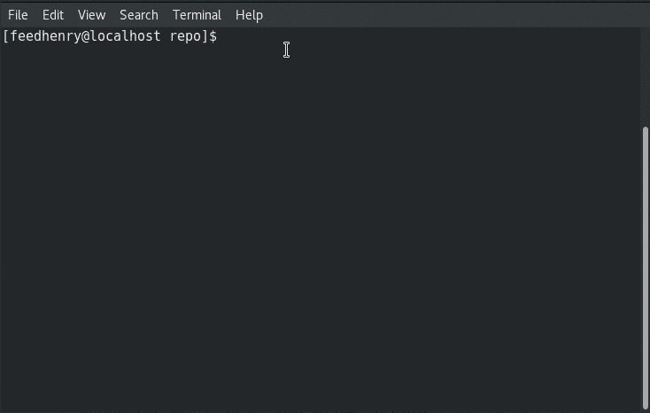
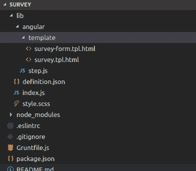
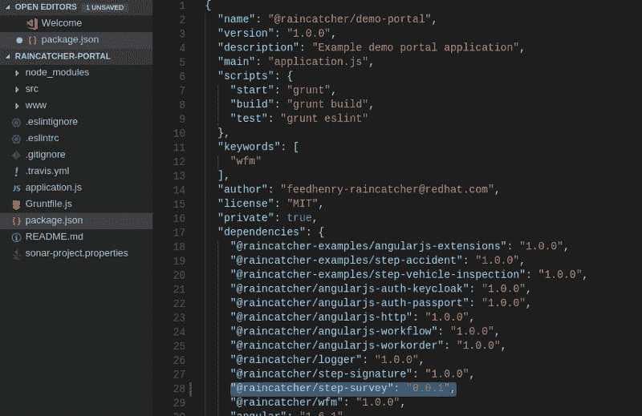
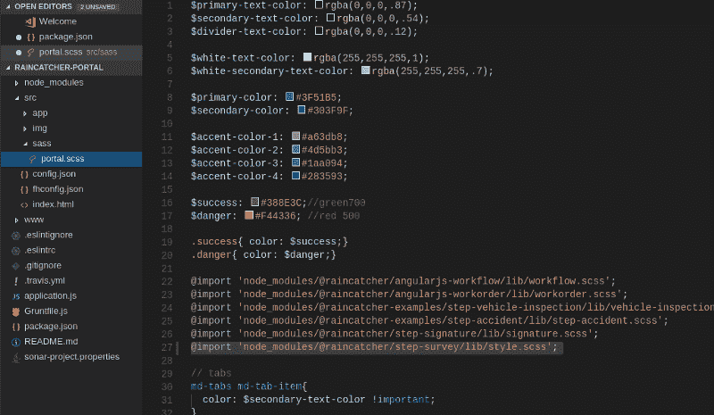
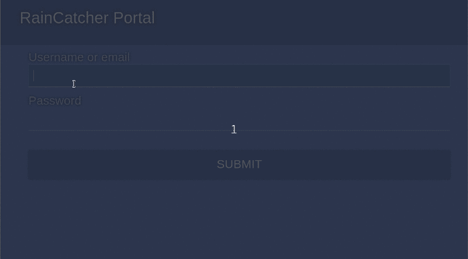
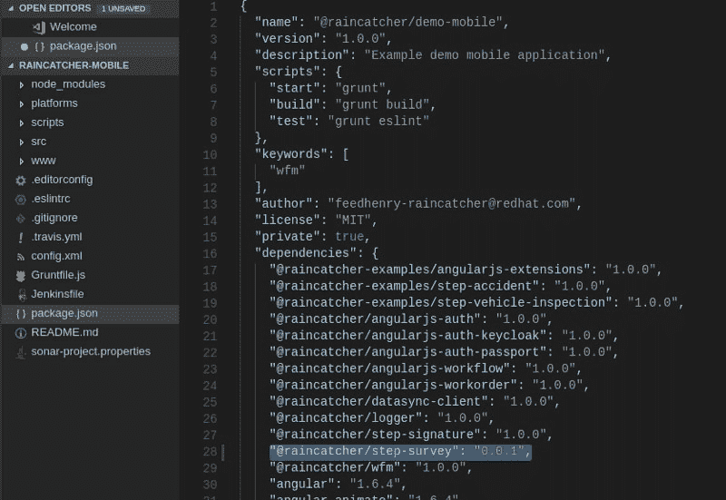
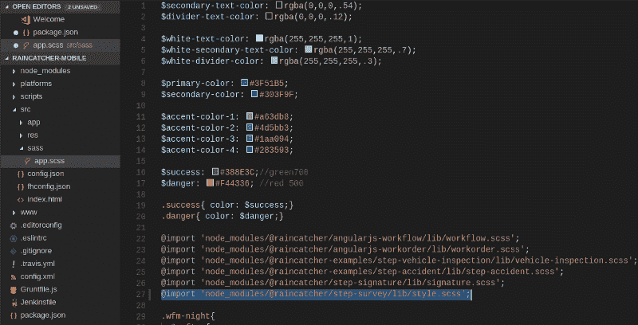
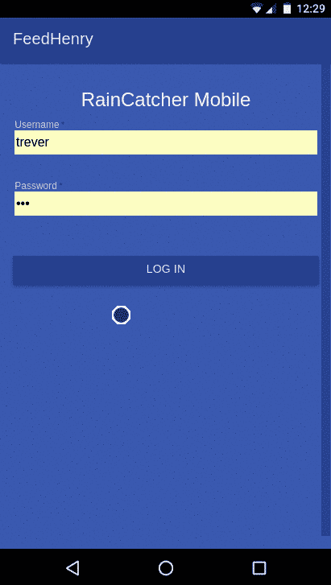

# 为 RainCatcher 创建自定义工作流程

> 原文：<https://dev.to/austincunningham/create-a-custom-workflow-for-raincatcher-2l32>

## 背景

RainCatcher 是一个开源的移动劳动力管理解决方案。它真正的强大之处在于它可以用来构建定制的工作流。RainCatcher 有三个应用程序一起运行来提供解决方案。作为应用程序后端的 [raincatcher-server](https://github.com/feedhenry-raincatcher/raincatcher-server) 、用于管理工作订单和工作流程的 [raincatcher-portal](https://github.com/feedhenry-raincatcher/raincatcher-portal) 以及最终用户或工人用于完成工作订单的 [raincatcher-mobile](https://github.com/feedhenry-raincatcher/raincatcher-mobile) 应用程序。

这是一个如何通过编辑 html 模板和编辑。我还将介绍如何向移动和门户应用程序添加步骤。

## 入门

为应用程序克隆并安装 git repos，更多信息请参见[官方文档](http://raincatcher.feedhenry.io/docs/#%7Bcontext%7D-pro-running-the-demo-repositories)。工作流由步骤组成在开发工作流时，我们构建一个步骤。有一个[步骤生成器应用程序](https://github.com/feedhenry-raincatcher/generator-rcstep)，它附加到 RainCatcher 项目，将使用一个基本模板构建一个自定义步骤。

```
# Install yoeman and step generator 
npm install -g yo
npm install -g generator-rcstep
# Starting step generator
yo rcstep 
```

**注意**:你需要安装 [NVM](https://github.com/creationix/nvm) 来防止权限问题运行 yoeman
下面是我使用 rcstep 生成器创建调查表的步骤

[](https://res.cloudinary.com/practicaldev/image/fetch/s--JzxgQkiL--/c_limit%2Cf_auto%2Cfl_progressive%2Cq_66%2Cw_880/https://cdn-images-1.medium.com/max/800/1%2ALw5X2KEm-V5cGSbi9tPS_w.gif%3Fstyle%3Dcenterme)

这是一个基本的模板，它包含一个简单的表单，我将用它作为这个例子的起点。这个表单由 AngularJS 指令和 html 模板组成。所以我会试着解释其中的各种因素。用于开发一个步骤的所有文件都在 **lib** 目录中。例如

[](https://res.cloudinary.com/practicaldev/image/fetch/s--E-M4qsbB--/c_limit%2Cf_auto%2Cfl_progressive%2Cq_auto%2Cw_880/https://cdn-images-1.medium.com/max/800/1%2ANQOxdQsyvTShBXdJc4pepQ.png%3Fstyle%3Dcenterme)

英寸/lib/angular/template 有两个 html 文件，分别是表格和结果屏幕的模板，即表格屏幕上输入的数据将显示在结果屏幕上。

## 编辑表单

下面是表单模板

```
<!-- Title -->
<p class="wfm-step-row">Please register details</p> 
<!-- Two field form -->
<div class="wfm-step-row" class="form-group" ng-form name="stepForm">

  <md-input-container class="md-block" flex-gt-sm>
    <label>E.g. First Name</label>
    <!-- Customise change ng-model ctrl.model to own variable -->
    <input type="text" id="title" name="title" ng-model="ctrl.model.firstName" required>
  </md-input-container> 
  <md-input-container class="md-block" flex-gt-sm>
    <label>E.g. Last Name </label>
    <input type="text" id="title" name="title" ng-model="ctrl.model.lastName" required>
  </md-input-container> 
</div> 
<md-divider></md-divider> 
<!-- Back and Continue Buttons-->
<div class="workflow-actions md-padding md-whiteframe-z4">
  <md-button class="md-primary md-hue-1" ng-click="ctrl.back($event)">Back</md-button>
  <md-button class="md-primary" ng-disabled="stepForm.$invalid || stepForm.$pristine" ng-click="ctrl.done($event)">Continue</md-button> </div> 
```

该表单现在有两个输入字段，分别是“名字”和“姓氏”。该表单有一个“后退”和一个“继续”按钮。

向表单中添加一个额外的字段就是复制一个现有的字段并对其进行修改。例如，要添加电子邮件字段，请更改标签和 ng 型号

```
<md-input-container class="md-block" flex-gt-sm>
  <label>Email</label>
  <input type="text" id="title" name="title" ng-model="ctrl.model.email" required>
</md-input-container> 
```

AngularJS 材料具有可使用的表单和字段的指令。更多示例见[角度演示](https://material.angularjs.org/latest/demo/select)。我在下面实现了一个下拉菜单

```
<md-input-container class="md-block" flex-gt-sm>
  <md-label>Select Web Language</md-label>
  <md-select ng-model="ctrl.model.webLanguage">
    <md-optgroup label = "Select Web Language">
      <md-option ng-value= "item" ng-repeat="item in ctrl.webLanguages">{{item}}</md-option>
    </md-optgroup>
  </md-select> </md-input-container> 
```

**中的 step.js 文件。/lib/angular** 包含 AngularJs 指令，这些指令控制表单和结果页面背后的逻辑。我向控制表单的指令(即 ngModule.directive('surveyForm ')添加了一个数组，以便填充下拉列表。

```
self.webLanguages = [ 'HTML','CSS', 'JavaScript', 'Java' ]; 
```

点击查看 steps.js [的全部要点](https://gist.github.com/austincunningham/5bb7c4fbc0ea5343c363d6b294a6621e)

## 编辑结果

第二个文件是显示表单输入结果的结果视图。对于表单上的每个输入，都应该有一个结果视图。

```
<!-- Title-->
<md-subheader>survey</md-subheader> <!-- Two field report -->
<md-list>

  <md-list-item class="md-2-line">
    <div class="md-list-item-text">
      <!-- Customise change model. to own variable -->
      <h3>{{model.firstName}} </h3>
      <p>First name </p>
    </div>
    <md-divider></md-divider>
  </md-list-item> 
  <md-list-item class="md-2-line">
    <div class="md-list-item-text">
      <h3>{{model.lastName}} </h3>
      <p>Last Name</p>
    </div>
    <md-divider></md-divider>
  </md-list-item> 
</md-list> 
```

要将 email 字段添加到结果页面，请复制一个现有字段并修改它，看看 model.email 是如何与表单 ctrl.model.email 直接相关的

```
<md-list-item class="md-2-line">
  <div class="md-list-item-text">
    <h3>{{model.email}} </h3>
    <p>Email</p>
  </div>
  <md-divider></md-divider> </md-list-item> 
```

从类似上面的下拉列表中呈现输入。

```
<md-list-item class="md-2-line">
  <div class="md-list-item-text">
    <h3>{{model.webLanguage}} </h3>
    <p>Selected Web Language</p>
  </div>
  <md-divider></md-divider> </md-list-item> 
```

要构建步骤以便它们可用，请使用

```
npm run build 
```

您可以使用 watch 命令在开发步骤的同时不断地构建它

```
npm run watch 
```

## 添加步骤到 raincatcher-portal

从下面的 package.json 文件中获取您的步骤包名称和版本

```
"name":  "@raincatcher/step-survey",  "version":  "0.0.1", 
```

更改了目录 raincatcher-portal 和 npm 链接我的新步骤包

```
npm link @raincatcher/step-survey 
```

将步骤包添加到 **package.json**

[](https://res.cloudinary.com/practicaldev/image/fetch/s--Qh_sv-5t--/c_limit%2Cf_auto%2Cfl_progressive%2Cq_auto%2Cw_880/https://cdn-images-1.medium.com/max/800/1%2AHEKJXSHKiujp90m_bDu9NA.png%3Fstyle%3Dcenterme)

```
npm install 
```

将步骤添加到 **src/app/main.js** 中 angular.modules 中的门户

```
// apply a variable name to the module
var surveyPortal = require('@raincatcher/step-survey'); 
```

将步长定义添加到 angular.modules 步长定义数组

```
stepDefinitions: [
                    surveyPortal.definition 
                 ] 
```

还要在 angular.modules 中添加步骤 ngModule()

```
surveyPortal.ngModule() 
```

导入步骤 scss demo/portal/src/sass/portal . scss

```
@import 'node_modules/@raincatcher/step-survey/lib/style.scss'; 
```

[](https://res.cloudinary.com/practicaldev/image/fetch/s--dx_oNDlp--/c_limit%2Cf_auto%2Cfl_progressive%2Cq_auto%2Cw_880/https://cdn-images-1.medium.com/max/800/1%2Au5rLQY8_SWx9-NrQZ4wSZQ.png%3Fstyle%3Dcenterme)

创建一个新的工作流，并根据该工作流创建一个工作单，然后将其分配给一个工人

[](https://res.cloudinary.com/practicaldev/image/fetch/s--r_NLPo_0--/c_limit%2Cf_auto%2Cfl_progressive%2Cq_66%2Cw_880/https://cdn-images-1.medium.com/max/800/1%2AEyEnSCzfmahlCTNL9MZCvw.gif%3Fstyle%3Dcenterme)

## 将步骤添加到 raincatcher-mobile

更改了目录 raincatcher-mobile 和 npm 链接我的新步骤包

```
npm link @raincatcher/step-survey 
```

并将步骤包添加到 raincatcher-mobile package.json 中

[](https://res.cloudinary.com/practicaldev/image/fetch/s--2Z1d8HJC--/c_limit%2Cf_auto%2Cfl_progressive%2Cq_auto%2Cw_880/https://cdn-images-1.medium.com/max/800/1%2AGRCCrzYlxFCf1xn-l7KybQ.png%3Fstyle%3Dcenterme)

```
npm install 
```

将分步调查添加到 **/src/app/app.js**

```
// apply a variable name to the module
var surveyMobile = require('@raincatcher/step-survey');
// add ngModule() for the module to angular.module array;
surveyMobile.ngModule() 
```

参见 [app.js](https://gist.github.com/austincunningham/9d61c3022a4462d7040cf81e6d5d28af) 要点，了解该实施的示例

将 step-survey 的 step scss 导入 **/src/sass/app.scss**

```
@import 'node_modules/@raincatcher/step-survey/lib/style.scss'; 
```

[](https://res.cloudinary.com/practicaldev/image/fetch/s--DeTtTGxq--/c_limit%2Cf_auto%2Cfl_progressive%2Cq_auto%2Cw_880/https://cdn-images-1.medium.com/max/800/1%2Aabd3WaO4BXC8N9b6h4Yhhw.png%3Fstyle%3Dcenterme)

**注意** : style.scss 可用于影响步骤的 css 样式更改，以更改移动应用程序的整体样式

我们现在可以在移动应用程序上访问在门户上创建的工作订单

[](https://res.cloudinary.com/practicaldev/image/fetch/s--XYPnOTbM--/c_limit%2Cf_auto%2Cfl_progressive%2Cq_66%2Cw_880/https://cdn-images-1.medium.com/max/800/1%2Ag9GcVNV8KclLmhCLrviGvw.gif%3Fstyle%3Dcenterme)

如您所见，我们可以用步骤构建工作流程，我们可以定制步骤，以获取我们想要的任何形式的内容。

[我的博客](https://austincunningham.ddns.net)