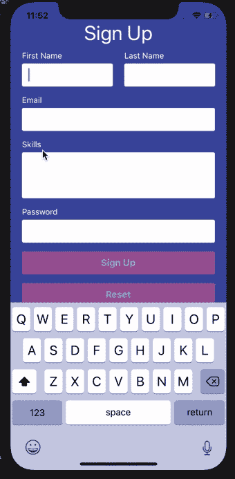

# 在 React Native 中创建一个 FormBuilder 组件(第 6 部分)

> 原文：<https://dev.to/dev_nope/create-a-formbuilder-component-in-react-native-part-6-2ohd>

本系列内容:

*   [第 1 部分:创建新的 React 原生应用](https://dev.to/dev_nope/create-a-formbuilder-component-in-react-native-intro--part-1-1m84)
*   [第 2 部分:创建一个简单的工资计算器表单](https://dev.to/dev_nope/create-a-formbuilder-component-in-react-native-part-2-2dec)
*   [第 3 部分:创建自定义表单输入和按钮组件](https://dev.to/dev_nope/create-a-formbuilder-component-in-react-native-part-3-1aib)
*   [第四部分:关于`FormBuilder`组件的工作](https://dev.to/dev_nope/create-a-formbuilder-component-in-react-native-part-4-5gc3)
*   [第 5 部分:即时启用/禁用表单按钮](https://dev.to/dev_nope/create-a-formbuilder-component-in-react-native-part-5-535h)
*   第 6 部分:创建注册表单(当前)
*   第 7 部分:增加对布尔字段类型的支持

# 第 6 部分:创建注册表单

现在我们已经准备好了我们的`FormBuilder`助手组件，我们可以再次尝试它并创建另一个表单。举个例子，假设我们需要一个基本的移动应用注册表单。让我们在项目的根目录下创建一个新的`SignUp.js`文件，内容如下:

```
import React, { Component } from 'react';
import {
    StyleSheet, KeyboardAvoidingView, SafeAreaView, Text, Alert,
} from 'react-native';

import FormBuilder from './js/components/FormBuilder';

export default class SignUp extends Component {
    getFormFields = () => {
        const formFields = [
            [
                {
                    name: 'firstName',
                    label: 'First Name',
                    type: 'text',
                    inputProps: {
                        autoCorrect: false,
                    },
                },
                {
                    name: 'lastName',
                    label: 'Last Name',
                    type: 'text',
                    inputProps: {
                        autoCorrect: false,
                    },
                },
            ],
            [
                {
                    name: 'email',
                    label: 'Email',
                    type: 'text',
                    inputProps: {
                        autoCorrect: false,
                        autoCapitalize: 'none',
                        keyboardType: 'email-address',
                    },
                },
            ],
            [
                {
                    name: 'skills',
                    label: 'Skills',
                    type: 'text',
                    inputProps: {
                        autoCorrect: false,
                        multiline: true,
                        numberOfLines: 4,
                        blurOnSubmit: false,
                    },
                },
            ],
            [
                {
                    name: 'password',
                    label: 'Password',
                    type: 'text',
                    inputProps: {
                        secureTextEntry: true,
                    },
                },
            ],
        ];

        return formFields;
    };

    /**
     * Grab user's input data.
     */
    handleSubmit = (state) => {
        const {
            firstName, lastName, email, skills, password,
        } = state;

        Alert.alert(
            'Your info',
            `First Name: ${firstName}\n Last Name: ${lastName}\n Email: ${email}\n Skills: ${skills} \n Password: ${password}`,
        );
    };

    render() {
        return (
            <SafeAreaView style={styles.safeArea}>
                <KeyboardAvoidingView behavior="padding" style={styles.container}>
                    <Text style={styles.screenTitle}>Sign Up</Text>
                    <FormBuilder
                        formFieldsRows={this.getFormFields()}
                        handleSubmit={this.handleSubmit}
                        submitBtnTitle="Sign Up"
                    />
                </KeyboardAvoidingView>
            </SafeAreaView>
        );
    }
}

const styles = StyleSheet.create({
    safeArea: {
        flex: 1,
        backgroundColor: '#3F4EA5',
    },
    container: {
        flex: 1,
        justifyContent: 'center',
        paddingHorizontal: 10,
        backgroundColor: '#3F4EA5',
    },
    screenTitle: {
        fontSize: 35,
        textAlign: 'center',
        margin: 10,
        color: '#FFF',
    },
}); 
```

如您所见，我们正在`getFormFields()`中定义表单字段，如下所示:

*   西方人名的第一个字
*   姓
*   电子邮件
*   技能
*   密码

因为我们引入了拥有表单行的概念，所以我们能够控制表单布局并将`First Name`和`Last Name`放在同一行中。

此外，我们可以通过`inputProps`对象属性为表单输入/控件提供默认的 React 本地属性，这样我们就能够:

*   使用`secureTextEntry`属性屏蔽`Password`字段的值；
*   通过使用`multiline`和`numberOfLines`属性，让`Skills`字段成为一个多行文本输入(与 HTML 文本区域相同)。

`multiline`属性应该是开箱即用的，但是从 UI 的角度来看，我们的`Skills`字段看起来与单行常规文本输入一样。当`multiline`属性为真时，我们可以通过有条件地向我们的自定义`FormTextInput`组件添加一些样式来解决这个问题(请注意，我已经用注释替换了一些现有的代码，只是为了突出我们所做的更改):

```
// ...
class FormTextInput extends React.Component {
    render() {
        const { labelText, multiline, ...inputProps } = this.props;

        return (
            <View style={styles.inputWrapper}>
                {/* ... */}
                <TextInput
                    style={[styles.textInput, multiline && styles.textarea]}
                    blurOnSubmit
                    {...inputProps}
                    multiline={multiline}
                />
            </View>
        );
    }
}

FormTextInput.propTypes = {
    // ...
    multiline: PropTypes.bool,
};

FormTextInput.defaultProps = {
    // ...
    multiline: false,
};

const styles = StyleSheet.create({
    // ...
    textarea: {
        height: 80,
    },
});

export default FormTextInput; 
```

现在是时候在应用程序加载时展示我们的新表单了。为此，我们需要修改我们的`index.js`文件，并指示应用程序使用我们的`SignUp`组件作为第一个屏幕，而不是`App`。我们还将在这里添加一个名为`showCalculatorForm`的标志，如果我们希望显示计算器表单，我们可以将它设置为`true`，如果我们希望看到注册表单，我们可以将其设置为`false`。下面是`index.js`的修改版:

```
import { AppRegistry } from 'react-native';
import App from './App';
import SignUp from './SignUp';
import { name as appName } from './app.json';

// NOTE: set this flag to `true` if you want to see the Salary Calculator form
const showCalculatorForm = false;

AppRegistry.registerComponent(appName, () => (showCalculatorForm ? App : SignUp)); 
```

就是这样！再次运行该应用程序，您应该会看到以下内容:

[](https://res.cloudinary.com/practicaldev/image/fetch/s--qr-1lXHl--/c_limit%2Cf_auto%2Cfl_progressive%2Cq_66%2Cw_880/https://thepracticaldev.s3.amazonaws.com/i/qu5yu9b38ojmh3smpnmw.gif)

要查看完整的变更列表，请查看 GitHub 上的这个[提交。](https://github.com/vasilestefirta/react-native-form-builder/commit/fdf9a54ab676e3033c87eb682b1164c9e93217b0)

* * *

太棒了，看起来棒极了！👏 🔥但是，除了常规文本输入之外，如何支持其他一些字段类型呢？🤔 🤓好吧，看看[第 7 部分](https://dev.to/dev_nope/create-a-formbuilder-component-in-react-native-part-7-32c7)，我们将在那里添加对新`Boolean`字段类型的支持👉。