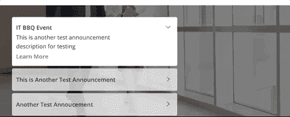
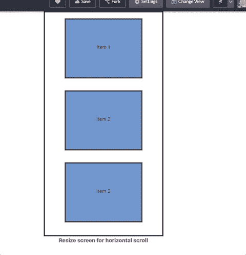

# 使用 CSS Flexbox 和媒体查询创建一个水平移动滚动框

> 原文：<https://dev.to/beznet/create-a-horizontal-mobile-scroll-box-using-css-flexbox-and-media-query-1h5d>

*原文发表[此处](https://www.bennettdungan.com/2019/05/12/create-a-horizontal-mobile-scroll-box-using-css-flexbox-and-media-query/)T3】*

我最近有机会展示一下我的 CSS 能力，结果证明它相当弱，但是我在这个过程中学到了一些很酷的东西。我的任务是创建一个垂直列表，当缩小到移动时，它可以转换为水平滚动。这是结果:

[](https://res.cloudinary.com/practicaldev/image/fetch/s--wWV8D2iZ--/c_limit%2Cf_auto%2Cfl_progressive%2Cq_66%2Cw_880/https://www.bennettdungan.com/wp-content/uploads/2019/05/May-12-2019-00-29-15.gif)

其中两个主要的收获来自于 CSS 的媒体查询和 flexbox。我过去只做过一些快速和肮脏的 CSS 样式，所以这是我第一次接触这两个工具。我做了上面这个[简单的 Codepen 版本](https://codepen.io/Beznet/pen/vwOPRa)，你可以看到垂直到水平的列表和滚动。大部分的魔力来自于这一小块 CSS:

```
@media (max-width: 992px) {
  .container {
      display: flex;
      flex-wrap: nowrap;
      height: 300px;
      overflow-x: auto;
      width: auto;
  }
}
```

您将注意到的第一件事是`@media`规则，这就是我如何告诉包含所有项目的 div 将后续 CSS 属性应用于`.container`类。简单来说，当屏幕尺寸达到 992px 或更低时，`.container`类现在会更改/添加以`display: flex`开头的列表属性。

接下来，我们用`display: flex`添加 flexbox，然后确保当我们用`flex-wrap: nowrap`缩小它时，这些项目不会包裹在容器内。我将容器的高度更改为更窄的 300 像素，这样就可以创建一个移动友好的滚动项目视图。

*旁注:如果你对 Flexbox 不熟悉，我强烈推荐做这个互动学习游戏:*[*Flexbox Froggy*](https://flexboxfroggy.com/)*。它通过操纵一只青蛙到它的 lillypad 上来教你 Flexbox 的大部分基本和一些高级特性。*

最后，我们添加了`overflow-x: auto`来允许容器中的项目在 X 轴上具有可滚动的功能，当项目溢出到父容器之外时。如果没有这个属性，我们会得到如下结果:

<figure>[](https://res.cloudinary.com/practicaldev/image/fetch/s--6GQCVMfJ--/c_limit%2Cf_auto%2Cfl_progressive%2Cq_auto%2Cw_880/https://www.bennettdungan.com/wp-content/uploads/2019/05/Screen-Shot-2019-05-12-at-11.59.11-AM-1024x523.png) 

<figcaption>:(</figcaption>

</figure>

一旦我们将所有这些属性放在一起，我们就剩下一个漂亮的小项目列表，它可以转换为移动友好的水平滚动:

[](https://res.cloudinary.com/practicaldev/image/fetch/s--bRRZM3jf--/c_limit%2Cf_auto%2Cfl_progressive%2Cq_66%2Cw_880/https://www.bennettdungan.com/wp-content/uploads/2019/05/May-12-2019-12-27-55.gif)

通常情况下，你会在桌面屏幕上看到一个水平的项目列表，然后在移动屏幕上把它缩小成一个垂直的列表。因此，我们实际上是在强迫相反的情况发生，这种情况并不常见，这也是为什么在 Stackoverflow 这样的地方有时很难找到解决方案。

希望你觉得这很有用。如果你知道更好的方法或一些我错过的聪明的小技巧，请一定让我知道！