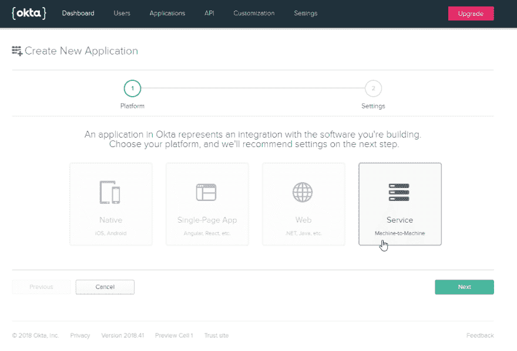
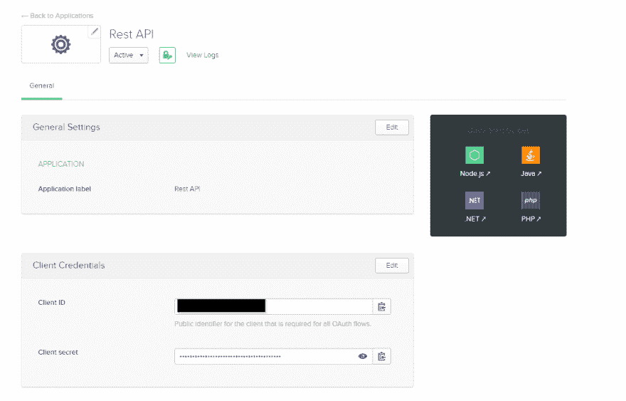
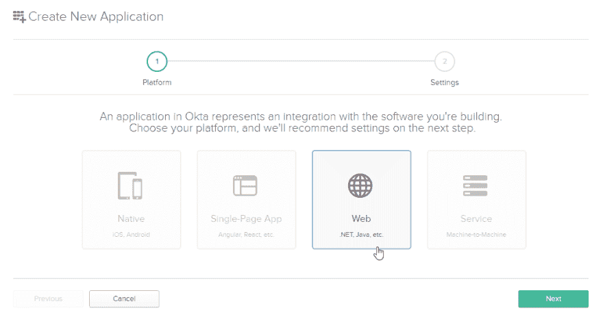
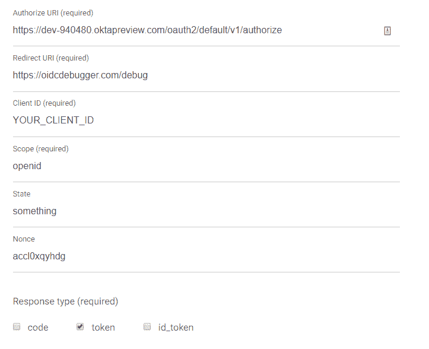
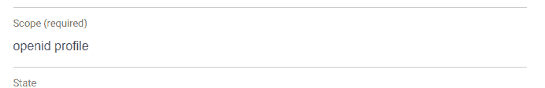

# 创建安全的 Spring REST API

> 原文：<https://dev.to/oktadev/create-a-secure-spring-rest-api-3onb>

*“有用就修改。”这句至理名言来自我的一位 QA 老师，他解释说，所有的软件都是在对某人有用的时候进化的，而且只要它有用。我们都知道这一点。用户每天都向我们询问新特性、错误修复和领域逻辑的变化。随着任何项目(尤其是一个庞然大物)的增长，它可能开始变得难以维护，任何新人的进入门槛也越来越高。在本教程中，我很高兴带您构建一个安全的 Spring REST API，它试图使用微服务架构来解决其中的一些棘手问题。*

在微服务架构中，您可以从逻辑上将应用程序划分为几个更易于维护和扩展的应用程序，使用不同的堆栈，并支持更多团队并行工作。但是微服务是解决所有扩展和维护问题的简单方法。

微服务还提出了许多必须解决的架构挑战:

*   这些服务如何通信？
*   应该如何处理通信故障和可用性？
*   如何在服务之间跟踪用户的请求？
*   此外，您应该如何处理访问单个服务的用户授权？

让我们深入研究并找出在构建 Spring REST API 时如何应对这些挑战。

## 使用 OAuth 2.0 保护您的 Spring REST API

在 [OAuth 2.0](https://www.oauth.com/oauth2-servers/the-resource-server/) 中，资源服务器是一种旨在处理*域逻辑*请求的服务，它没有任何类型的登录工作流或复杂的认证机制:它接收预先获得的访问令牌，该令牌保证用户具有访问服务器的授权许可，并传递预期的响应。

在这篇文章中，你将使用 Spring Boot 和 Okta 构建一个简单的*资源服务器*来演示这有多简单。您将实现一个简单的*资源服务器*，它将接收并验证一个 *JWT 令牌*。

## 添加一个资源服务器你的 Spring REST API

这个例子使用 Okta 来处理所有的认证过程。你可以注册一个[永久免费的开发者账户](https://developer.okta.com/signup/),这样你就可以根据需要创建任意多的用户和应用。

我已经设置了一些东西，所以我们可以很容易地开始。请克隆以下资源库并转到`startup`标签，如下:

```
git clone -b startup https://github.com/oktadeveloper/okta-secure-spring-rest-api-example secure-spring-rest-api
cd secure-spring-rest-api 
```

本项目结构如下:

```
$ tree .
.
├── README.md
├── mvnw
├── mvnw.cmd
├── pom.xml
└── src
    ├── main
    │ ├── java
    │ │ └── net
    │ │ └── dovale
    │ │ └── okta
    │ │ └── secure_rest_api
    │ │ ├── HelloWorldController.java
    │ │ ├── SecureRestApiApplication.java
    │ │ └── SecurityConfig.java
    │ └── resources
    │ └── application.properties
    └── test
        └── java
            └── net
                └── dovale
                    └── okta
                        └── secure_rest_api
                            └── SecureRestApiApplicationTests.java

14 directories, 9 files 
```

我使用优秀的 [Spring Initializr](https://start.spring.io/) 并添加了`Web`和`Security`依赖项来创建它。Spring Initializr 提供了一种简单的方法来创建一个新的 [Spring Boot](https://spring.io/projects/spring-boot) 服务，该服务具有一些常见的*自动发现的*依赖项。它还添加了 [Maven 包装器](https://github.com/takari/maven-wrapper):因此您使用命令`mvnw`而不是`mvn`，该工具将检测您是否有指定的 Maven 版本，如果没有，它将下载并运行指定的命令。

> **趣闻**:你知道 Maven wrapper 最初是由 Okta 自己的 [Brian Demers](https://twitter.com/briandemers) 创造的吗？！

文件`HelloWorldController`是一个简单的`@RestController`，输出“Hello World”。

在终端中，您可以运行以下命令并看到 Spring Boot 启动:

```
mvnw spring-boot:run 
```

> **提示:**如果这个命令对你不起作用，试试`./mvnw spring-boot:run`吧。

一旦它完成加载，您将有一个 REST API 准备好并开始向您发送一条光荣的 *Hello World* 消息！

```
> curl http://localhost:8080/
Hello World 
```

> **提示:**默认情况下，`curl`命令对 Windows 用户不可用。你可以从[这里](https://curl.haxx.se/windows/)下载。

现在，您需要正确地创建一个受保护的*资源服务器*。

## 设置 OAuth 2.0 资源服务器

在 Okta 仪表板中，创建一个类型为 **Service** 的应用程序，它表示一个没有登录页面或任何获取新令牌的方法的资源服务器。

[](https://res.cloudinary.com/practicaldev/image/fetch/s--b4z_CV6X--/c_limit%2Cf_auto%2Cfl_progressive%2Cq_auto%2Cw_880/https://developer.okta.com/assets-jekyll/blog/secure-spring-rest-api/create-new-service-b82c491bf955c249d543fd02ed02c2171bf0a8b5b113b658ade897d616f7896c.png)

点击**下一个**，输入你的服务名称，然后点击**完成**。您将看到一个类似于下图的屏幕。复制并粘贴您的*客户端 ID* 和*客户端密码*以备后用。当您配置应用程序时，它们会很有用。

[](https://res.cloudinary.com/practicaldev/image/fetch/s--dUeC4_i3--/c_limit%2Cf_auto%2Cfl_progressive%2Cq_auto%2Cw_880/https://developer.okta.com/assets-jekyll/blog/secure-spring-rest-api/service-created-d661ec4aaefe7634cf369bb1f054567e01f11f49f7ddb576ecadbb9b769bb436.png)

现在，让我们编写代码吧！

编辑`pom.xml`文件，为 Spring Security 和 Okta 添加依赖项。他们将启用所有你需要的 Spring 和 Okta OAuth 2.0 善良:

```
<!-- security - begin -->
<dependency>
    <groupId>org.springframework.boot</groupId>
    <artifactId>spring-boot-starter-security</artifactId>
</dependency>
<dependency>
    <groupId>org.springframework.cloud</groupId>
    <artifactId>spring-cloud-starter-oauth2</artifactId>
</dependency>
<dependency>
    <groupId>com.okta.spring</groupId>
    <artifactId>okta-spring-boot-starter</artifactId>
    <version>0.6.1</version>
</dependency>
<!-- security - end --> 
```

通过简单地添加这种依赖，您的代码将像一个没有钥匙的上锁的房子。在您向用户提供密钥之前，没有人能够访问您的 API。再次运行下面的命令。

```
mvnw spring-boot:run 
```

现在，尝试访问 Hello World 资源:

```
> curl http://localhost:8080/
{"timestamp":"2018-11-30T01:35:30.038+0000","status":401,"error":"Unauthorized","message":"Unauthorized","path":"/"} 
```

## 将 Spring 安全添加到 REST API 中

Spring Boot 有很多类路径魔法，能够发现*和*自动配置依赖关系。由于您添加了 Spring Security，它会自动保护您的资源。现在，您需要配置 Spring 安全性，以便能够正确地验证请求。

> **注意:**如果你在纠结，可以查看 Git 分支`step-1-security-dependencies`中的修改。

为此，您需要对`application.properties`进行如下修改(使用 Okta dashboard 向您的应用程序提供的 *client_id* 和*client _ secret*):

```
okta.oauth2.issuer=https://{yourOktaDomain}/oauth2/default
okta.oauth2.clientId={clientId}
okta.oauth2.clientSecret={clientSecret}
okta.oauth2.scopes=openid 
```

Spring Boot 使用注释和代码来配置你的应用程序，所以你不需要编辑超级无聊的 XML 文件。这意味着您可以使用 Java 编译器来验证您的配置！

我通常在不同的类中创建配置，每个类都有自己的用途。创建类`net.dovale.okta.secure_rest_api.SecurityConfig`，如下所示:

```
package net.dovale.okta.secure_rest_api;

import org.springframework.security.config.annotation.web.configuration.EnableWebSecurity;
import org.springframework.security.oauth2.config.annotation.web.configuration.EnableResourceServer;

@EnableWebSecurity
@EnableResourceServer
public class SecurityConfig {} 
```

请允许我解释一下这里的注释的作用:

*   告诉 spring 我们将使用 Spring Security 来提供 web 安全机制。
*   `@EnableResourceServer` -方便的注释，支持通过 OAuth 2.0 令牌进行请求认证。通常情况下，你会提供一个`ResourceServerConfigurer`豆，但 Okta 的 Spring Boot 首发方便地为你提供了一个。

就是这样！现在您已经有了一个完全配置好的、安全的 Spring REST API，没有任何样板文件！

再次运行 Spring Boot，并检查它与卷曲。

```
mvnw spring-boot:run
# in another shell
curl http://localhost:8080/
{"error":"unauthorized","error_description":"Full authentication is required to access this resource"} 
```

信息改变了，但你仍然无法访问…为什么？因为现在服务器正在等待一个带有有效令牌的`authorization` *报头*。在下一步中，您将创建一个访问令牌，并使用它来访问您的 API。

> **注:**如有疑问，查看 Git 分支`step-2-security-configuration`。

## 在 Spring REST API 中生成令牌

那么…你如何获得一个令牌？资源服务器没有责任获取有效的凭证:它只会检查令牌是否有效，并继续执行方法。

一个简单的方法来实现一个令牌生成一个使用 [OpenID 连接](https://oidcdebugger.com/)。

首先，您需要在 Okta 中创建一个新的 **Web** 应用程序:

[](https://res.cloudinary.com/practicaldev/image/fetch/s--x89LKFzX--/c_limit%2Cf_auto%2Cfl_progressive%2Cq_auto%2Cw_880/https://developer.okta.com/assets-jekyll/blog/secure-spring-rest-api/create-new-web-application-f7ddf8a7625098953674c6a73f6240d12bed303e83bae7208fbdd235dd189ad8.png)

将*登录重定向 URIs* 字段设置为`https://oidcdebugger.com/debug`，将*授权类型允许*设置为`Hybrid`。点击**完成**并复制客户端 ID 以进行下一步。

现在，在 OpenID Connect 网站上，如下图所示填写表单(不要忘记填写您最近创建的 Okta web 应用程序的客户端 ID):

[](https://res.cloudinary.com/practicaldev/image/fetch/s--m68jNYhB--/c_limit%2Cf_auto%2Cfl_progressive%2Cq_auto%2Cw_880/https://developer.okta.com/assets-jekyll/blog/secure-spring-rest-api/openid-connect-339d2badb6417e2f614480f65ba459ff2e22258c6a85a923337ad85756ce9425.png)

提交表单以开始身份验证过程。如果您没有登录，您将会收到一个 Okta 登录表单，或者您将会看到下面带有您的自定义令牌的屏幕。

[](https://res.cloudinary.com/practicaldev/image/fetch/s--i-OTGkzq--/c_limit%2Cf_auto%2Cfl_progressive%2Cq_auto%2Cw_880/https://developer.okta.com/assets/blog/secure-spring-rest-api/openid-connect-token-fae39fd58123026cafc49643acbaf9be18f5437069d090cd45c62d32ce074d5a.png)

令牌将在一个小时内有效，因此您可以使用您的 API 进行大量测试。令牌的使用很简单，只需复制它并修改 curl 命令即可，如下所示:

```
> export TOKEN=${YOUR_TOKEN}
> curl http://localhost:8080 -H "Authorization: Bearer $TOKEN"
Hello World 
```

## 添加 OAuth 2.0 范围

OAuth 2.0 scopes 是一个让用户决定应用程序是否被授权做一些受限制的事情的特性。例如，您可以有“读”和“写”作用域。如果一个应用程序需要*写*范围，它应该询问用户这个特定的范围。这些都可以由 Okta 的授权服务器自动处理。

作为资源服务器，它可以有不同的端点，每个端点有不同的作用域。接下来，您将学习如何设置不同的作用域以及如何测试它们。

向您的`SecurityConfig`类添加一个新的注释:

```
@EnableWebSecurity
@EnableResourceServer
@EnableGlobalMethodSecurity(prePostEnabled = true)
public class SecurityConfig {} 
```

新的`@EnableGlobalMethodSecurity(prePostEnabled = true)`注释告诉 Spring 使用类似 [AOP](https://en.wikipedia.org/wiki/Aspect-oriented_programming) 的方法安全性，并且`prePostEnabled = true`将启用 *pre* 和 *post* 注释。这些注释将使我们能够以编程方式为每个端点定义安全性。

现在，对`HelloWorldController.java`进行修改，创建一个*受范围保护的*端点:

```
import org.springframework.security.access.prepost.PreAuthorize;
import java.security.Principal;
...
@PreAuthorize("#oauth2.hasScope('profile')")
@GetMapping("/protected/")
public String helloWorldProtected(Principal principal) {
    return "Hello VIP " + principal.getName();
} 
```

注意`@PreAuthorize("#oauth2.hasScope('profile')")`。它说:在运行这个方法之前，验证请求是否具有指定范围的授权。`#oauth2`位由[oauth 2 securityexpressionmethods](https://docs.spring.io/spring-security/oauth/apidocs/org/springframework/security/oauth2/provider/expression/OAuth2SecurityExpressionMethods.html)(检查其他可用的方法)Spring 类添加，并通过`spring-cloud-starter-oauth2`依赖项添加到您的类路径中。

好吧！重启后，您的服务器将准备就绪！使用当前令牌向端点发出新请求:

```
> curl http://localhost:8080/protected/ -H "Authorization: Bearer $TOKEN"
{"error":"access_denied","error_description":"Access is denied"} 
```

由于您的令牌没有期望的范围，您将收到一条`access is denied`消息。要解决这个问题，回到 [OIDC 调试器](https://oidcdebugger.com/debug)，添加新的作用域。

[](https://res.cloudinary.com/practicaldev/image/fetch/s--_ysANSqi--/c_limit%2Cf_auto%2Cfl_progressive%2Cq_auto%2Cw_880/https://developer.okta.com/assets-jekyll/blog/secure-spring-rest-api/openid-connect-profile-scope-1cd7c496f906816e91369d2698a0cfe56af0941f3fde685a566cccbb9481c4ef.png)

使用新获得的令牌重试:

```
> curl http://localhost:8080/protected/ -H "Authorization: Bearer $TOKEN"
Hello VIP raphael@dovale.net 
```

就是这样！如果您有任何疑问，请检查最新的存储库分支`finished_sample`。

> **提示:**因为`profile`是一个普通的 OAuth 2.0 作用域，所以您不需要在您的授权服务器中做任何改变。需要创建自定义范围吗？参见这个【Java 应用的简单令牌认证。

## 了解更多关于 Spring 和 REST APIs 的信息

在本教程中，您学习了如何使用 Spring (Boot)创建资源服务器，并将其与 OAuth 2.0 无缝集成。Spring 和 REST API 都是很大的话题，有很多东西需要讨论和学习。

本教程的源代码是 GitHub 上的[。](https://github.com/oktadeveloper/okta-secure-spring-rest-api-example)

这里有一些其他的帖子，可以帮助你加深对 Spring 和 REST API 安全性的理解:

*   OAuth 到底是什么？
*   [通过 Spring Boot 和 OAuth 2.0 实现安全的服务器到服务器通信](https://developer.okta.com/blog/2018/04/02/client-creds-with-spring-boot)
*   [Spring Boot 2.1:出色的 OIDC、OAuth 2.0 和反应式 API 支持](https://developer.okta.com/blog/2018/11/26/spring-boot-2-dot-1-oidc-oauth2-reactive-apis)
*   [在 15 分钟内为你的 Spring Boot 应用添加用户认证](https://developer.okta.com/blog/2018/10/05/build-a-spring-boot-app-with-user-authentication)

喜欢你今天学到的吗？在 [Twitter](https://twitter.com/oktadev) 上关注我们，在[脸书](https://www.facebook.com/oktadevelopers)上喜欢我们，在 [LinkedIn](https://www.linkedin.com/company/oktadev/) 上关注我们，订阅我们的 [YouTube 频道](https://www.youtube.com/channel/UC5AMiWqFVFxF1q9Ya1FuZ_Q)。