# 创建可访问的下拉导航

> 原文：<https://dev.to/lkopacz/create-an-accessible-dropdown-navigation-114n>

[https://api.parler.io/ss/player?url=https://www.parler.io/audio/7119149108/fa3668f4a9c5c5483cd4424d1c0bbc5a45401e35.6e119819-3442-454a-863e-8c0f7276101b.mp3](https://api.parler.io/ss/player?url=https://www.parler.io/audio/7119149108/fa3668f4a9c5c5483cd4424d1c0bbc5a45401e35.6e119819-3442-454a-863e-8c0f7276101b.mp3)

不用 JavaScript，悬停导航很容易实现，这也是我经常看到的实现方式。HTML 和 CSS 非常简单。

HTML:

```
<nav>
  <ul class="menu">
    <li class="menu__item">
      <a href="/" class="menu__link">About</a>
      <ul class="submenu">
        <li class="submenu__item">
          <a class="submenu__link" href="/our-mission">Our Mission</a>
        </li>
        <li class="submenu__item">
          <a class="submenu__link" href="/our-team">Our Team</a>
        </li>
      </ul>
    </li>
  </ul>
</nav> 
```

Enter fullscreen mode Exit fullscreen mode

CSS:

```
.submenu {
  position: absolute;
  left: 0;
  padding: 0;
  list-style: none;
  height: 1px; 
  width: 1px;
  overflow: hidden;
  clip: rect(1px 1px 1px 1px); /* IE6, IE7 */
  clip: rect(1px, 1px, 1px, 1px);
}

.menu__item:hover .submenu {
  padding: 0.5rem 0;
  width: 9rem;
  height: auto;
  background: #eedbff;
  clip: auto;
} 
```

Enter fullscreen mode Exit fullscreen mode

注:我用了[视觉隐藏的](https://a11yproject.com/posts/how-to-hide-content/)造型而不是`display: none`。这对可访问性很重要，你可以在上面的链接中了解更多。

我已经去掉了一些常规的样式，但是这个 CSS 是有助于悬停效果的。然而，正如你在下面的 gif 中看到的，如果你使用 tab 键，它的工作方式就不一样了。

[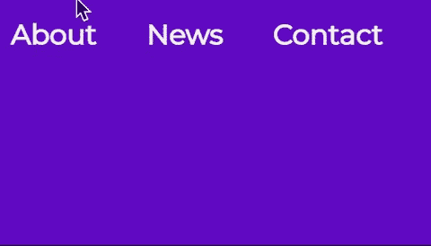](https://i.giphy.com/media/2zowLUY2M9lEhvFc6m/giphy.gif)

在我们开始编码之前，我想分享一下我解决这个问题的方法。首先，我想解决的问题是，不仅要在悬停时打开导航，还要在聚焦时打开导航。第二，我想确保焦点上的每个子菜单都像悬停时一样“打开”。第三，我想确保当我浏览链接时，那个特定的子菜单会在我离开时关闭。现在让我们开始吧！

## 复制焦点上的悬停效果

因为我们在`li`元素上有了`:hover`伪类，所以我们也应该将注意力放在`li`元素上。但是如果你读了我关于[键盘可访问性](https://dev.to/lkopacz/3-simple-tips-to-improve-keyboard-accessibility-5hc8)的博客文章，你会认识到索引的概念。`li`元素没有索引，但是链接有。我个人喜欢做的是将 JavaScript 中的顶级链接作为目标，并在焦点事件上向它们的父链接添加一个类。让我们再深入探讨一下。

```
const topLevelLinks = document.querySelectorAll('.menu__link');
console.log(topLevelLinks); 
```

Enter fullscreen mode Exit fullscreen mode

[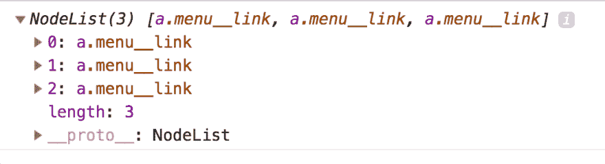](https://res.cloudinary.com/practicaldev/image/fetch/s--cqE1vpb_--/c_limit%2Cf_auto%2Cfl_progressive%2Cq_auto%2Cw_880/https://www.a11ywithlindsey.com/static/menu-link-nodelist-9475b87ce1290035b77feb9b94334b77-ba3ad.png)

当我`console.log`这个变量时，我得到了顶部菜单项的节点列表。我喜欢做的是使用一个`forEach`循环遍历那些，然后记录他们的每个`parentElement`

```
topLevelLinks.forEach(link => {
  console.log(link.parentElement);
}); 
```

Enter fullscreen mode Exit fullscreen mode

[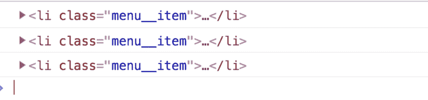](https://res.cloudinary.com/practicaldev/image/fetch/s--kFTJhHdb--/c_limit%2Cf_auto%2Cfl_progressive%2Cq_auto%2Cw_880/https://www.a11ywithlindsey.com/static/list-item-elements-cf2e973a68bd30eabf6b6fbff2e6b997-2e0f3.png)

现在我想做的是给链接添加一个`focus`事件监听器，然后添加 console.log `this`来确保我们有正确的`this`上下文。

```
topLevelLinks.forEach(link => {
  link.addEventListener('focus', function() {
    console.log(this);
  });
}); 
```

Enter fullscreen mode Exit fullscreen mode

[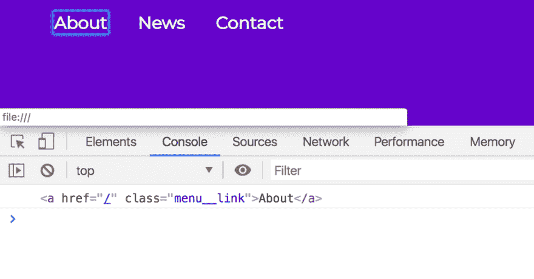](https://res.cloudinary.com/practicaldev/image/fetch/s--d3m8rXmn--/c_limit%2Cf_auto%2Cfl_progressive%2Cq_auto%2Cw_880/https://www.a11ywithlindsey.com/static/demonstrate-this-73511009e39766f86b75dbf4b1de3d22-aa987.png)

我使用了一个老派的函数(而不是 ES6+ arrow 函数),因为我想确保`this`的上下文是目标。有很多关于这个的博客帖子(哈哈，看看我在那里做了什么)，如果你想阅读更多关于它的内容。不管怎样，现在我想让它成为我们的目标，这就是`li`。

```
topLevelLinks.forEach(link => {
  link.addEventListener('focus', function() {
    console.log(this.parentElement);
  });
}); 
```

Enter fullscreen mode Exit fullscreen mode

[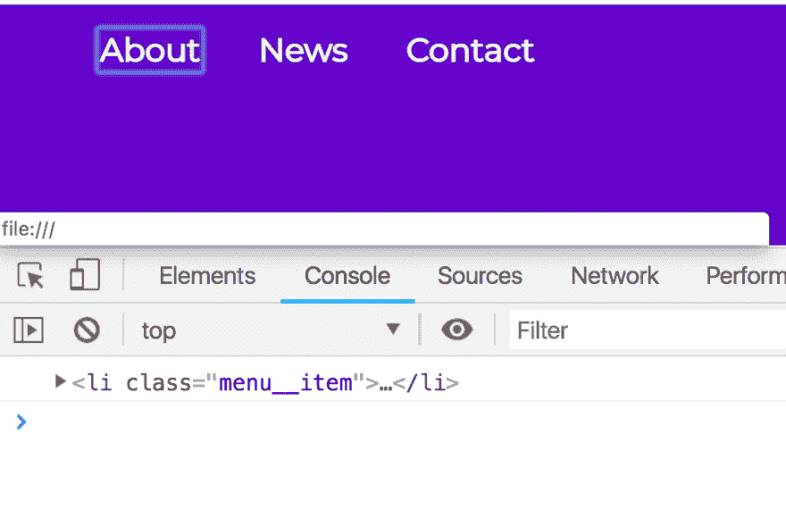](https://res.cloudinary.com/practicaldev/image/fetch/s--UuPLXWtC--/c_limit%2Cf_auto%2Cfl_progressive%2Cq_auto%2Cw_880/https://www.a11ywithlindsey.com/static/demonstrate-this-parent-49c176d66244eed85cf321fe9683d921-31020.png)

这个父元素是我们需要的目标。我要做的是向我们登录到控制台的 li 添加一个类。然后我将使用一个 CSS 类来复制我们在`:hover`上的样式。

```
topLevelLinks.forEach(link => {
  link.addEventListener('focus', function() {
    this.parentElement.classList.add('focus');
  });
}); 
```

Enter fullscreen mode Exit fullscreen mode

[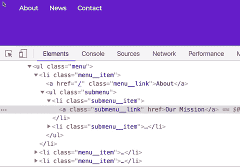](https://i.giphy.com/media/8vLkeYAqm3AeRoWGTP/giphy.gif)T3】

```
.menu__item:hover .submenu,
.menu__item.focus .submenu {
  padding: 0.5rem 0;
  width: 9rem;
  height: auto;
  background: #eedbff;
  clip: auto;
} 
```

Enter fullscreen mode Exit fullscreen mode

[](https://res.cloudinary.com/practicaldev/image/fetch/s---HDkURnt--/c_limit%2Cf_auto%2Cfl_progressive%2Cq_auto%2Cw_880/Gif%20displaying%20what%20adding%20the%20styling%20to%20the%20focus%20class%20does%2C%20similar%20to%20the%20hover%20pseudo-class.)

如您所见，菜单在我们离开后不会关闭，这是我列出的行动项目之一。在此之前，让我们花点时间了解一下`blur`事件及其含义。

## 模糊事件

根据 Mozilla 文档，当一个元素**失去**焦点时，就会触发[模糊事件](https://developer.mozilla.org/en-US/docs/Web/Events/blur)。我们希望子菜单保持打开，直到最后一个子菜单项失去焦点。所以我们需要做的是去除模糊的焦点类。

我想做的第一件事是在我们的 forEach 循环中，检查是否有一个`nextElementSibling`。

```
topLevelLinks.forEach(link => {
  link.addEventListener('focus', function() {
    this.parentElement.classList.add('focus');
  });

  console.log(link.nextElementSibling);
}); 
```

Enter fullscreen mode Exit fullscreen mode

[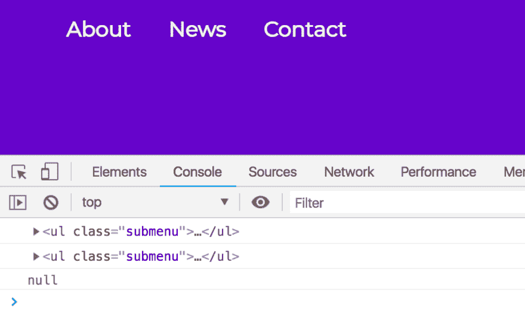](https://res.cloudinary.com/practicaldev/image/fetch/s--V-ouLX1H--/c_limit%2Cf_auto%2Cfl_progressive%2Cq_auto%2Cw_880/https://www.a11ywithlindsey.com/static/check-next-element-0f50d34f5a98267237ef8c330a4b0219-71b3b.png)

接下来我要做的是创建一个条件。如果有子菜单，我们只想运行下面的代码。下面是我所做的:

```
topLevelLinks.forEach(link => {
  link.addEventListener('focus', function() {
    this.parentElement.classList.add('focus');
  });

  if (link.nextElementSibling) {
    const subMenu = link.nextElementSibling;
    console.log(subMenu);
    console.log(subMenu.querySelectorAll('a'));
  }
}); 
```

Enter fullscreen mode Exit fullscreen mode

[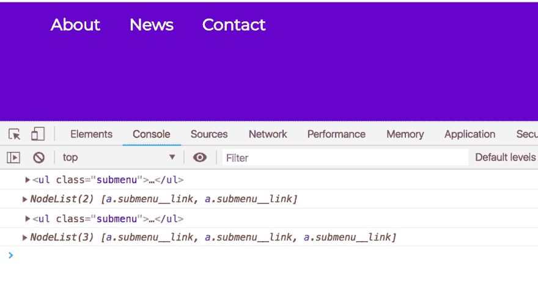](https://res.cloudinary.com/practicaldev/image/fetch/s--HFzATIne--/c_limit%2Cf_auto%2Cfl_progressive%2Cq_auto%2Cw_880/https://www.a11ywithlindsey.com/static/submenu-and-submenu-nodelist-84193582bf83d9e4fb4d09a396099c75-aa987.png)

我记录`subMenu`和`querySelectorAll`的原因是为了视觉学习。看到两个子菜单元素都被正确定位，以及其中链接的节点列表，对我来说很好。所以我在这里想做的是瞄准那个`querySelectorAll`中的最后一个环节。让我们把它放入一个变量中，使它更具可读性。

```
topLevelLinks.forEach(link => {
  link.addEventListener('focus', function() {
    this.parentElement.classList.add('focus');
  });

  if (link.nextElementSibling) {
    const subMenu = link.nextElementSibling;
    const subMenuLinks = subMenu.querySelectorAll('a');
    const lastLinkIndex = subMenuLinks.length - 1;
    console.log(lastLinkIndex);
    const lastLink = subMenuLinks[lastLinkIndex];
    console.log(lastLink);
  }
}); 
```

Enter fullscreen mode Exit fullscreen mode

[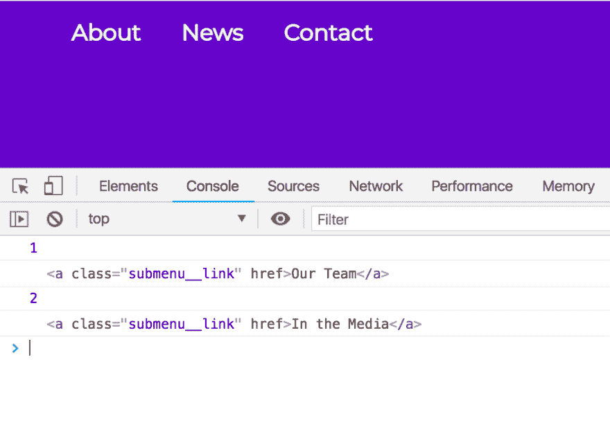](https://res.cloudinary.com/practicaldev/image/fetch/s--ALhL_nML--/c_limit%2Cf_auto%2Cfl_progressive%2Cq_auto%2Cw_880/https://www.a11ywithlindsey.com/static/last-item-index-and-link-0f17b420d1142a5249a9a1e1e373e400-be35c.png)

在最后的每一个链接上，我们想要添加一个模糊事件，从那个`li`中移除这个类。首先，让我们检查一下`link.parentElement`以确保我们得到了我们所期望的。

```
topLevelLinks.forEach(link => {
  link.addEventListener('focus', function() {
    this.parentElement.classList.add('focus');
  });

  if (link.nextElementSibling) {
    const subMenu = link.nextElementSibling;
    const subMenuLinks = subMenu.querySelectorAll('a');
    const lastLinkIndex = subMenuLinks.length - 1;
    const lastLink = subMenuLinks[lastLinkIndex];

    lastLink.addEventListener('blur', function() {
      console.log(link.parentElement);
    });
  }
}); 
```

Enter fullscreen mode Exit fullscreen mode

[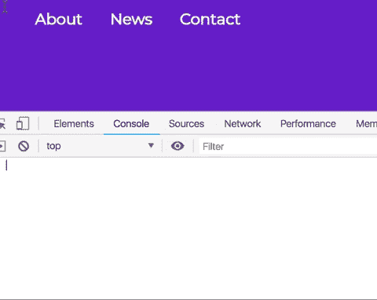](https://i.giphy.com/media/jUgOxI3K1QIPLgx8l3/giphy.gif)

现在我们已经得到了我们所期望的，我将做与焦点事件侦听器相反的事情。

```
topLevelLinks.forEach(link => {
  link.addEventListener('focus', function() {
    this.parentElement.classList.add('focus');
  });

  if (link.nextElementSibling) {
    const subMenu = link.nextElementSibling;
    const subMenuLinks = subMenu.querySelectorAll('a');
    const lastLinkIndex = subMenuLinks.length - 1;
    const lastLink = subMenuLinks[lastLinkIndex];

    lastLink.addEventListener('blur', function() {
      link.parentElement.classList.remove('focus');
    });
  }
}); 
```

Enter fullscreen mode Exit fullscreen mode

[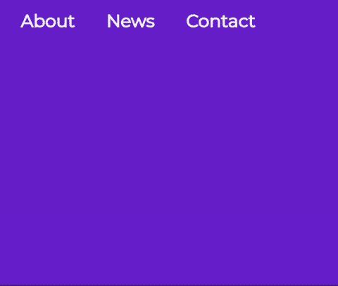](https://i.giphy.com/media/1xVfHck3wmbrBtwEWt/giphy.gif)

我要做的最后一件事是将焦点事件监听器放在条件语句中。事实是，我们不需要向没有子菜单的项目添加焦点类。

```
topLevelLinks.forEach(link => {
  if (link.nextElementSibling) {
    link.addEventListener('focus', function() {
      this.parentElement.classList.add('focus');
    });

    const subMenu = link.nextElementSibling;
    const subMenuLinks = subMenu.querySelectorAll('a');
    const lastLinkIndex = subMenuLinks.length - 1;
    const lastLink = subMenuLinks[lastLinkIndex];

    lastLink.addEventListener('blur', function() {
      link.parentElement.classList.remove('focus');
    });
  }
}); 
```

Enter fullscreen mode Exit fullscreen mode

## 附加挑战

这篇博文越来越长了，所以也许下周我会再发一篇。有一件事我还没有解决，我想在我的后续文章中解决，那就是如何在菜单中后退。如果同时使用`tab`和`shift`键，返回菜单时不起作用。如果你想要一个额外的挑战，自己试试吧！

所以现在就这样吧！如果你的解决方案与我的不同，我很想看看你是如何想出这个解决方案的。请在推特上告诉我你的想法！