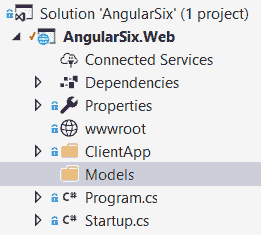
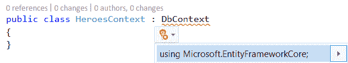
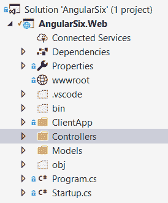
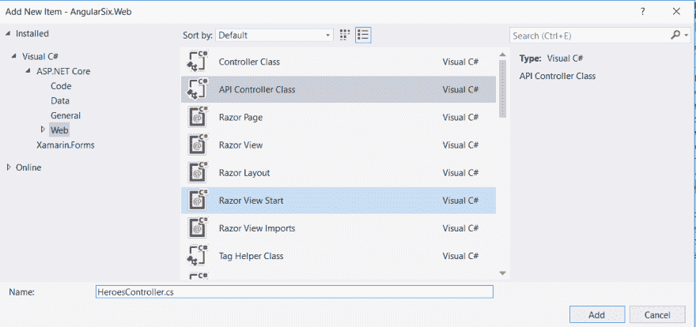
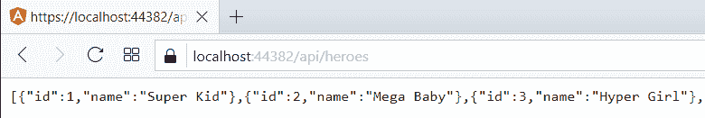
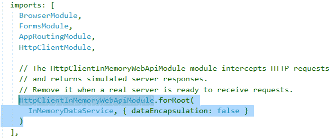
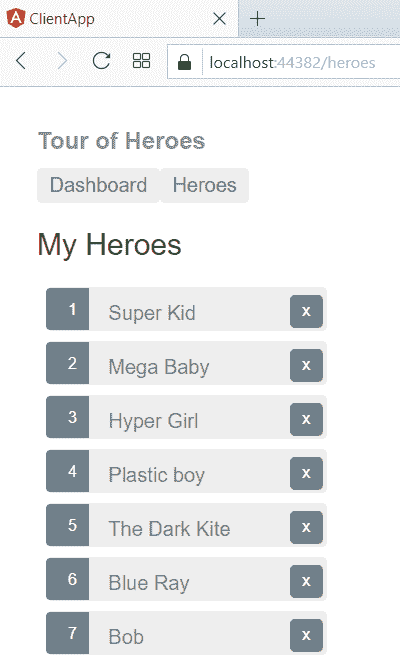
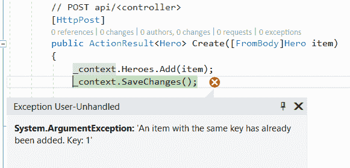
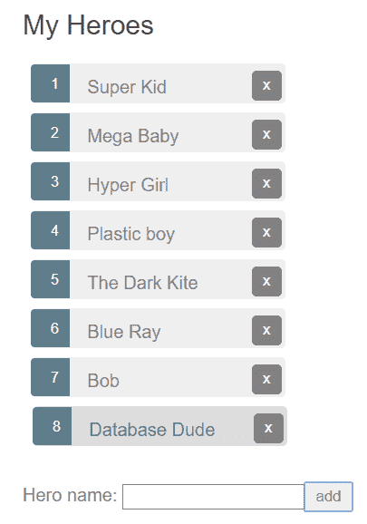

# 在中创建一个角度为 6 的站点。网络核心部分 2

> 原文：<https://dev.to/cstuartedwards/create-an-angular-6-site-in-net-core-part-2-3g05>

上接[第 1 部分](https://dev.to/cstuartedwards/create-an-angular-6-site-in-net-core-part-1-198c)

在英雄之旅教程中，您将使用内存中的 Web API 模块模拟数据服务器。我们将删除它，并编写一个. Net 核心 API 服务来处理来自 angular 应用程序的请求。我们将使用实体框架创建一个内存数据库，并做一些数据播种，将一个初始的英雄列表放入数据库。

1.  在**启动**类中添加**服务。将 Mvc()** 添加到**配置服务**方法中:

    ```
    public void ConfigureServices(IServiceCollection services)
    {
        services.AddSpaStaticFiles(configuration =>
        {
            configuration.RootPath = "ClientApp/dist";
        });
        services.AddMvc();
    } 
    ```

2.  在**配置**方法中，在 app 上面添加以下代码。使用 Spa:

    ```
    app.UseMvc(routes =>
    {
        routes.MapRoute(
        name: "default",
        template: "{controller}/{action=Index}/{id?}");
    }); 
    ```

    该方法应该如下所示:

    ```
    public void Configure(IApplicationBuilder app, IHostingEnvironment env)
    {
        if (env.IsDevelopment())
        {
            app.UseDeveloperExceptionPage();
        }

        app.UseStaticFiles();
        app.UseSpaStaticFiles();

        app.UseMvc(routes =>
        {
            routes.MapRoute(
                name: "default",
                template: "{controller}/{action=Index}/{id?}");
        });

        app.UseSpa(spa =>
        {
            // To learn more about options for serving an Angular SPA from ASP.NET Core, 
            // see https://go.microsoft.com/fwlink/?linkid=864501
            spa.Options.SourcePath = "ClientApp";

            if (env.IsDevelopment())
            {
                spa.UseAngularCliServer(npmScript: "start");
            }
        });
    } 
    ```

3.  添加一个**型号**文件夹到项目:
    [](https://res.cloudinary.com/practicaldev/image/fetch/s--CsjPcjMr--/c_limit%2Cf_auto%2Cfl_progressive%2Cq_auto%2Cw_880/http://charles.stuartedwards.me.uk/media/Blog%2520Images/Post%25203/3-14.png)

4.  添加一个**英雄**类到模型文件夹:选择**模型**文件夹。按下 **Shift + Alt + C** 打开**添加新项目**对话框。选择类物品，命名为 **Hero.cs** 。
    [](https://res.cloudinary.com/practicaldev/image/fetch/s--a8d-6KGs--/c_limit%2Cf_auto%2Cfl_progressive%2Cq_auto%2Cw_880/http://charles.stuartedwards.me.uk/media/Blog%2520Images/Post%25203/3-15.png)

5.  为 **Id** 和**名称**添加一个公共属性:

    ```
    public class Hero
    {
        public int Id { get; set; }
        public string Name { get; set; }
    } 
    ```

6.  添加名为 **HeroesContext** 的数据库上下文类:选择**模型**文件夹。按下 **Shift + Alt + C** 。选择类项目并将其命名为 **HeroesContext.cs** :

7.  该类需要从 **DbContext** an 继承，需要添加适当的使用引用:
    [](https://res.cloudinary.com/practicaldev/image/fetch/s--ZvGo0_TM--/c_limit%2Cf_auto%2Cfl_progressive%2Cq_auto%2Cw_880/http://charles.stuartedwards.me.uk/media/Blog%2520Images/Post%25203/3-17.png)

8.  添加一个构造函数和属性，如下所示:

    ```
    public class HeroesContext : DbContext
    {
        public HeroesContext(DbContextOptions<HeroesContext> options)
            : base (options)
        {

        }

        public DbSet<Hero> Heroes { get; set; } 
    } 
    ```

9.  我们将使用数据播种，用一些虚拟数据初始化该数据库以进行测试。在 **HeroesContext** 类中覆盖 **OnModelingCreating** 方法，将种子数据添加到数据库中:

    ```
    public class HeroesContext : DbContext
    {
        public HeroesContext(DbContextOptions<HeroesContext> options)
            : base(options)
        {

        }

        public DbSet<Hero> Heroes { get; set; }

        protected override void OnModelCreating(ModelBuilder builder)
        {
            base.OnModelCreating(builder);

            // Seed data for testing
            builder.Entity<Hero>().HasData(
                new Hero { Id = 1, Name = "Super Kid" },
                new Hero { Id = 2, Name = "Mega Baby" },
                new Hero { Id = 3, Name = "Hyper Girl" },
                new Hero { Id = 4, Name = "Plastic boy" },
                new Hero { Id = 5, Name = "The Dark Kite" },
                new Hero { Id = 6, Name = "Blue Ray" },
                new Hero { Id = 7, Name = "Bob" }
            );
        }
    } 
    ```

10.  对于测试，我们将使用一个内存数据库，您需要将它连接到一个用于生产的真实数据库。

    通过添加到 **Startup** 类中的 **ConfigureServices** 方法，向依赖注入容器注册数据库上下文，如下所示:

    ```
    public void ConfigureServices(IServiceCollection services)
    {
        services.AddDbContext&lt;HeroesContext>(opt =>
            opt.UseInMemoryDatabase("HeroesDatabase"));

        services.AddSpaStaticFiles(configuration =>
        {
            configuration.RootPath = "ClientApp/dist";
        });

        services.AddMvc();
    } 
    ```

    添加以下 using 语句来引用数据模型和实体框架:

    ```
    using Microsoft.EntityFrameworkCore;
    using AngularSix.Web.Models; 
    ```

11.  为了强制数据播种，将以下内容添加到**启动**类中的**配置**方法中:

    ```
    using (var serviceScope = app.ApplicationServices.CreateScope())
    {
        var context = serviceScope.ServiceProvider.GetService<HeroesContext>();
        // This will force the data seeding
        context.Database.EnsureCreated();
    } 
    ```

    **配置**方法应该如下所示:

    ```
    public void Configure(IApplicationBuilder app, IHostingEnvironment env)
    {
        if (env.IsDevelopment())
        {
            app.UseDeveloperExceptionPage();
        }

        using (var serviceScope = app.ApplicationServices.CreateScope())
        {
            var context = serviceScope.ServiceProvider.GetService<HeroesContext>();
            // This will force the data seeding
            context.Database.EnsureCreated();
        }

        app.UseStaticFiles();
        app.UseSpaStaticFiles();

        app.UseMvc(routes =>
        {
            routes.MapRoute(
                name: "default",
                template: "{controller}/{action=Index}/{id?}");
        });

        app.UseSpa(spa =>
        {
            // To learn more about options for serving an Angular SPA from ASP.NET Core, see https://go.microsoft.com/fwlink/?linkid=864501
            spa.Options.SourcePath = "ClientApp";

            if (env.IsDevelopment())
            {
                spa.UseAngularCliServer(npmScript: "start");
            }
        });
    } 
    ```

12.  添加一个**控制器**文件夹:
    [](https://res.cloudinary.com/practicaldev/image/fetch/s--jhWlI6rf--/c_limit%2Cf_auto%2Cfl_progressive%2Cq_auto%2Cw_880/http://charles.stuartedwards.me.uk/media/Blog%2520Images/Post%25203/3-18.png)

13.  添加一个 API 控制器:选择**控制器**文件夹。按下 **Shift + Alt + C** 。选择 **Web** 类别并选择 **API 控制器类**。将该类命名为 **HeroesController** 并点击**添加**
    [](https://res.cloudinary.com/practicaldev/image/fetch/s--0naJVA-N--/c_limit%2Cf_auto%2Cfl_progressive%2Cq_auto%2Cw_880/http://charles.stuartedwards.me.uk/media/Blog%2520Images/Post%25203/3-19.png)

14.  向控制器类添加一个**构造函数**和一个 **HeroContext** 属性。将 HeroContext 对象作为参数注入构造函数，并将其赋给 HeroesContext 属性:

    ```
    private readonly HeroesContext _context;

    public HeroesController(HeroesContext context)
    {
        _context = context;
    } 
    ```

15.  用以下内容替换 **Get** 方法:

    ```
    // GET: api/<controller>
    [HttpGet]
    public ActionResult<IEnumerable<Hero>> GetAll()
    {
        return _context.Heroes;
    } 
    ```

    请注意:直接从数据库中取出一个对象并将其交给表示层是一个非常非常糟糕的主意。随着时间的推移，附加信息可能会添加到对象中，并且没有适当的措施来限制 api 响应中的信息。

    通过运行应用程序并导航到**/api/heroes**
    [](https://res.cloudinary.com/practicaldev/image/fetch/s--ouxEE-rQ--/c_limit%2Cf_auto%2Cfl_progressive%2Cq_auto%2Cw_880/http://charles.stuartedwards.me.uk/media/Blog%2520Images/Post%25203/3-20.png)，检查 API 调用是否有效

    如果您想测试 Angular 应用程序是否与新的 api 一起工作，那么在 app.module.ts 文件中注释掉导入数组中的**httpclientmemorywebapimodule**声明:
    [](https://res.cloudinary.com/practicaldev/image/fetch/s--xxlYXQ9j--/c_limit%2Cf_auto%2Cfl_progressive%2Cq_auto%2Cw_880/http://charles.stuartedwards.me.uk/media/Blog%2520Images/Post%25203/3-21.png)

    导航到 **/heroes** ，您应该会看到 GetAll 方法中声明的英雄。
    T3T5】

    尼斯（法国城市名）

    现在让我们完成剩余的 api 调用

16.  用下面的**更新**方法替换**上传**方法:

    ```
    // PUT api/<controller>/5
    [HttpPut("{id}")]
    public IActionResult Update(int Id, [FromBody]Hero item)
    {
        var hero = _context.Heroes.Find(item.Id);
        if (hero == null)
        {
            return NotFound();
        }

        hero.Name = item.Name;

        _context.Heroes.Update(hero);
        _context.SaveChanges();
        return NoContent();
    } 
    ```

17.  您需要更新 **hero.service.ts** 中的 **updateHero** 方法，以便在路线中包含英雄 id:

    ```
    /** PUT: update the hero on the server */
    updateHero(hero: Hero): Observable<any> {
        return this.http.put(`${this.heroesUrl}/${hero.id}`, hero, httpOptions).pipe(
            tap(_ => this.log(`updated hero id=${hero.id}`)),
            catchError(this.handleError<any>('updateHero'))
        );
    } 
    ```

18.  用下面的**创建**方法替换 **Post** 方法:

    ```
    // POST api/<controller>
    [HttpPost]
    public ActionResult<Hero> Create([FromBody]Hero item)
    {
        _context.Heroes.Add(item);
        _context.SaveChanges();

        return item;
    } 
    ```

    如果你通过添加一个新英雄来测试，你可能会收到一个错误
    [](https://res.cloudinary.com/practicaldev/image/fetch/s--W-semJvm--/c_limit%2Cf_auto%2Cfl_progressive%2Cq_auto%2Cw_880/http://charles.stuartedwards.me.uk/media/Blog%2520Images/Post%25203/3-23.png)

    这是因为 Add(item)调用为 hero 对象分配了一个 Id 1。也许我错过了一些东西，但我认为通过 HasData 方法添加种子数据时有一个 bug。这是我如何绕过它。

    在启动类中创建一个名为 **AddSeedData** 的方法，并使用 **HeroesContext** 将数据添加到 db:

    ```
    private void AddSeedData(HeroesContext context)
    {
        if (context.Heroes.Count() == 0)
        {
            // Create a new TodoItem if collection is empty,
            // which means you can't delete all TodoItems.
            context.Heroes.Add(new Hero { Name = "Super Kid" });
            context.Heroes.Add(new Hero { Name = "Mega Baby" });
            context.Heroes.Add(new Hero { Name = "Hyper Girl" });
            context.Heroes.Add(new Hero { Name = "Plastic boy" });
            context.Heroes.Add(new Hero { Name = "The Dark Kite" });
            context.Heroes.Add(new Hero { Name = "Blue Ray" });
            context.Heroes.Add(new Hero { Name = "Bob" });
            context.SaveChanges();
        }
    } 
    ```

    在**配置**方法中，移除或注释掉**上下文。database . ensure created()；**并添加对 **AddSeedData** 的调用，将上下文作为参数传递:

    ```
    using (var serviceScope = app.ApplicationServices.CreateScope())
    {
        var context = serviceScope.ServiceProvider.GetService&lt;HeroesContext>();
        // This will force the data seeding
        //context.Database.EnsureCreated();
        AddSeedData(context);
    } 
    ```

    移除或注释掉 **HeroesContext** 类中的 **OnModelCreating** 方法。

    现在如果你现在添加一个新英雄，那么这个对象应该被分配一个还没有被使用的 id。
    [](https://res.cloudinary.com/practicaldev/image/fetch/s--hbfrzxuh--/c_limit%2Cf_auto%2Cfl_progressive%2Cq_auto%2Cw_880/http://charles.stuartedwards.me.uk/media/Blog%2520Images/Post%25203/3-24.png)

19.  将**删除**方法替换为:

    ```
    // DELETE api/<controller>/5
    [HttpDelete("{id}")]
    public IActionResult Delete(int id)
    {
        var hero = _context.Heroes.Find(id);
        if (hero == null)
        {
            return NotFound();
        }

        _context.Heroes.Remove(hero);
        _context.SaveChanges();
        return NoContent();
    } 
    ```

20.  最后，修改 **GetAll** 方法，以包含一个按名称的基本搜索:

    ```
    // GET: api/&lt;controller>
    [HttpGet]
    public ActionResult<IEnumerable<Hero>> GetAll(string name)
    {
        if (name == null)
        {
            return _context.Heroes;
        }
        else
        {
        return _context.Heroes
            .Where(r => r.Name.ToLowerInvariant().Contains(name))
            .ToList();
        }
    } 
    ```

**结尾**

> 最初发表于我的个人博客:[在。网芯 2.1 从零开始第二部](http://charles.stuartedwards.me.uk/blog/create-an-angular-6-site-in-net-core-2-1-from-scratch-pt2)

#### 附加资源:

*   [使用 ASP.NET 核心构建 web APIs】](https://docs.microsoft.com/en-us/aspnet/core/web-api/?view=aspnetcore-2.1)
*   [教程:用 ASP.NET 核心 MVC 创建 web API](https://docs.microsoft.com/en-us/aspnet/core/tutorials/first-web-api?view=aspnetcore-2.1)
*   [实体框架核心 2.1:数据播种](https://elanderson.net/2018/09/entity-framework-core-2-1-data-seeding/)
*   [https://docs . Microsoft . com/en-us/ef/core/modeling/data-seeding](https://docs.microsoft.com/en-us/ef/core/modeling/data-seeding)
*   [无法在 ASP.NET 核心 2.0 中解析 db context](https://stackoverflow.com/questions/46063945/cannot-resolve-dbcontext-in-asp-net-core-2-0/46064116)
*   [教程:使用实体框架核心作为 ASP.NET 核心的内存数据库](https://stormpath.com/blog/tutorial-entity-framework-core-in-memory-database-asp-net-core)
*   [用内存测试](https://docs.microsoft.com/en-us/ef/core/miscellaneous/testing/in-memory)