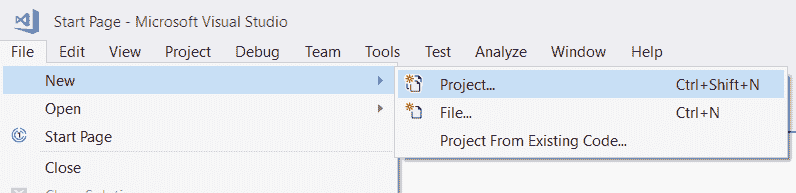
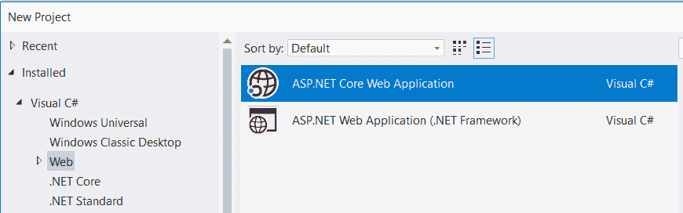
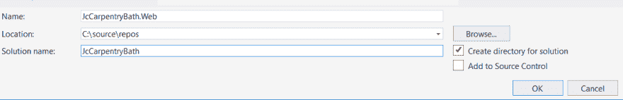
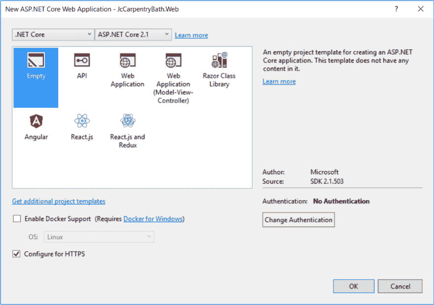
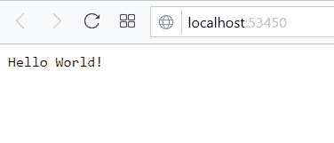
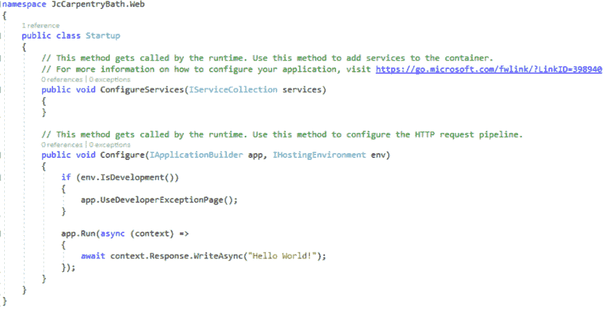

# 在 Visual Studio 2017 中创建 ASP.NET 核心网站

> 原文：<https://dev.to/cstuartedwards/create-an-aspnet-core-website-in-visual-studio-2017-nfd>

> 这篇文章是[创建一个果园核心站点并使用 Azure DevOps](http://charles.stuartedwards.me.uk/blog/create-an-orchard-core-site-and-deploy-using-azure-devops) 系列部署的一部分。

我们将在 visual studio 2017 中从头开始创建一个. net 核心网站。

1.  在 visual studio 中创建新项目。
    [T3】](https://res.cloudinary.com/practicaldev/image/fetch/s--a5kg9YwL--/c_limit%2Cf_auto%2Cfl_progressive%2Cq_auto%2Cw_880/http://charles.stuartedwards.me.uk/media/Blog%2520Images/Post%25201/1-1.png)

2.  在 **Web** 部分下选择【ASP.NET T2】核心 Web 应用模板。
    

3.  设置**名称**、**解决方案名称**和**位置**您希望解决方案创建的位置
    

4.  确保**。选择网芯**和 ASP.NET 芯**2.1**。然后选择**空**模板，点击确定。
    

5.  一旦设置完成，你会看到下面的项目结构:
    

6.  单击播放。
    [T3】](https://res.cloudinary.com/practicaldev/image/fetch/s--_wKvYDs---/c_limit%2Cf_auto%2Cfl_progressive%2Cq_auto%2Cw_880/http://charles.stuartedwards.me.uk/media/Blog%2520Images/Post%25201/1-6.png)

7.  然后嘣！完成了。
    [T3】](https://res.cloudinary.com/practicaldev/image/fetch/s--3BBDkI29--/c_limit%2Cf_auto%2Cfl_progressive%2Cq_auto%2Cw_880/http://charles.stuartedwards.me.uk/media/Blog%2520Images/Post%25201/1-7.png)

打开 Startup.cs 文件来看看神奇之处:

厉害吧！....好的，它在做一个反应。写这不是一个伟大的方式来建立网站，但你在这里看到的是非常基础的。网芯。接下来你要做什么完全取决于你自己，例如，你可以把它变成一个 MVC 网站或者一个 Web API 网站或者一个 Orchard 核心网站。以了解更多关于您可以用做什么的信息。Net Core 查看[微软对 ASP.NET Core 的介绍](https://docs.microsoft.com/en-us/aspnet/core/?view=aspnetcore-2.1)

在我们添加 Orchard Core 之前，我们将把我们的代码添加到源代码控制中:[在 Azure DevOps (VSTS)中将项目添加到源代码控制中](http://charles.stuartedwards.me.uk/blog/add-project-to-source-control-in-azure-devops-vsts)

> 原发表于我的个人博客:[在 Visual Studio 2017 中创建一个 ASP.net 核心网站](http://charles.stuartedwards.me.uk/blog/create-an-orchard-core-site-and-deploy-using-azure-devops)