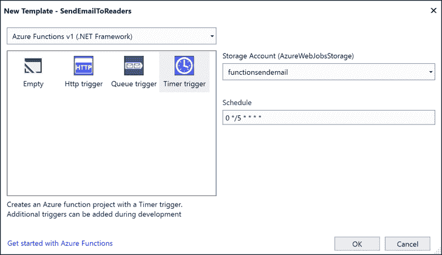
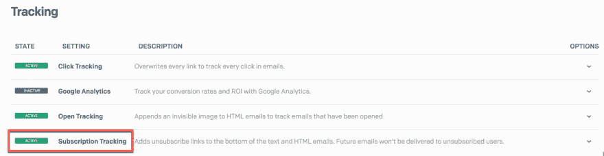
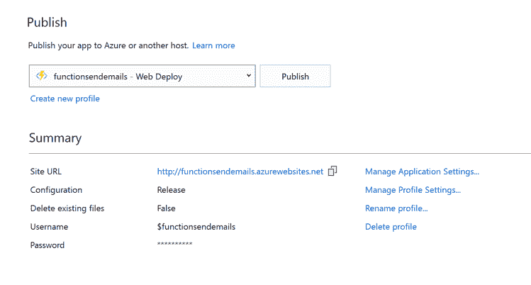
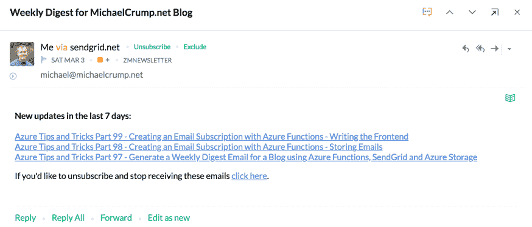

# 使用 Azure 函数创建电子邮件订阅-第 4 部分

> 原文：<https://dev.to/azure/create-an-email-subscription-with-azure-functions-part-4-2d0f>

*我们选择了由[迈克尔·克伦普](https://twitter.com/mbcrump)创造的我们最喜欢的技巧和诀窍，并在整个四月在 Azure 上提供新的技术内容！错过一天(或更多)？[赶上系列](https://dev.to/t/azureapril)。*

**没有天蓝色？** [抢免费订阅](https://azure.microsoft.com/en-us/free?&WT.mc_id=azureapril_devto-blog-cxa)。

这是关于如何用 Azure 功能构建无服务器电子邮件订阅服务的 4 篇系列文章的最后一篇。

完整源代码该应用的源代码可以在 [GitHub](https://github.com/mbcrump/EmailSubscription) 上找到

[第 1 部分——我们要构建什么以及如何构建](http://www.michaelcrump.net/azure-tips-and-tricks97/)
[第 2 部分——使用 Azure Table Storage](http://www.michaelcrump.net/azure-tips-and-tricks98/)
[存储电子邮件第 3 部分——使用 HTML5 和 jQuery 编写前端](https://dev.toPart%203%20-%20Writing%20the%20Frontend%20with%20HTML5%20and%20jQuery)
[第 4 部分——使用 Sendgrid 和 Azure 函数发送电子邮件](http://www.michaelcrump.net/azure-tips-and-tricks100/)

我们正在尝试建立一个类似下面的电子邮件订阅。

[](https://res.cloudinary.com/practicaldev/image/fetch/s--kj3ft86a--/c_limit%2Cf_auto%2Cfl_progressive%2Cq_auto%2Cw_880/https://thepracticaldev.s3.amazonaws.com/i/1i1bl0nqnic47xjf5bxd.png)

## 从我们停止的地方继续

在上一篇文章中，我们创建了一个使用 HTML5、jQuery 和一些轻量级 CSS 工作的前端。当用户填写表单并点击提交时，它会检查以确保电子邮件有效，然后使用 AJAX 调用将数据发送到我们在第 2 部分中编写的 Azure 函数。今天，我们将通过使用 SendGrid、C#和 Azure 函数在每周日上午 9:30 发送电子邮件来总结事情。

## 在 Visual Studio 内部使用 Azure Functions 模板

返回到我们之前创建的项目，右键单击该项目并选择添加项目，然后选择 Azure Functions。现在给它起一个名字，比如 SendEmail，选择 Timer Trigger，并提供下面的 schedule 0 30 9 * * SUN。

[](https://res.cloudinary.com/practicaldev/image/fetch/s--Z4zKtYl5--/c_limit%2Cf_auto%2Cfl_progressive%2Cq_auto%2Cw_880/https://thepracticaldev.s3.amazonaws.com/i/97kfv6s5psdlmwlhfkvw.png)

我们首先声明 feedurl，并遍历 feed 来收集最近 7 天的博客文章，并将它们附加到一个字符串中。在这里，我们使用 SyndicationClient 来简化一切工作。我们也可以使用 StringBuilder，但是现在这样就可以了。

```
string feedurl = "https://www.michaelcrump.net/feed.xml";
string last7days = "";

XmlReader reader = XmlReader.Create(feedurl);
SyndicationFeed feed = SyndicationFeed.Load(reader);
reader.Close();

last7days = last7days + "<b>New updates in the last 7 days:</b><br><br>";
foreach (SyndicationItem item in feed.Items)
{
    if ((DateTime.Now - item.PublishDate).TotalDays < 7)
    {
        last7days = last7days + "<a href=\"" + item.Links[0].Uri + "\')">" + item.Title.Text + "</a><br>";
    }       
} 
```

我们现在将获取 Azure 存储表中的电子邮件订阅者列表。

```
CloudStorageAccount storageAccount = CloudStorageAccount.Parse(ConfigurationManager.AppSettings["TableStorageConnString"]);
CloudTableClient tableClient = storageAccount.CreateCloudTableClient();
CloudTable table = tableClient.GetTableReference("MCBlogSubscribers");
table.CreateIfNotExists(); 
```

我们需要将这个助手方法添加到我们当前所在的 Run 方法之外。它将搜索与我们在 post #2 中发送的 POST 请求相匹配的分区键。

```
public static List<string> GetAllEmailAddresses(CloudTable table)
{
    var retList = new List<string>();

    TableQuery<EmailEntity> query = new TableQuery<EmailEntity>()
            .Where(TableQuery.GenerateFilterCondition("PartitionKey", QueryComparisons.Equal, "SendEmailToReaders"));

    foreach (EmailEntity emailname in table.ExecuteQuery(query))
    {
        retList.Add(emailname.EmailAddress);
    }

    return retList;
} 
```

现在我们需要发送电子邮件。这是有点棘手的地方，因为我们需要使用 X-SMTPAPI 头来隐藏所有用户的电子邮件地址。搜索 NuGet 并添加 Sendgrid。SmtpApi 到您的引用。我们需要获得我们的 SendGrid 用户名和密码，并在凭证中传递它们。

```
var header = new Header();

SmtpClient client = new SmtpClient();
client.Port = 587;
client.Host = "smtp.sendgrid.net";
client.Timeout = 10000;
client.DeliveryMethod = SmtpDeliveryMethod.Network;
client.UseDefaultCredentials = false;
client.Credentials = new System.Net.NetworkCredential(ConfigurationManager.AppSettings["SendGridUserName"], ConfigurationManager.AppSettings["SendGridSecret"]); 
```

现在我们需要形成我们的电子邮件信息。我们将从我们的 Azure 存储表中提取电子邮件地址列表，并强制 HTML 视图确保我们的链接是可点击的，并告诉那些没有启用 HTML 的人启用它。😃

最后，我们将异步发送电子邮件并处理我们的客户端。

```
MailMessage mail = new MailMessage();
List<string> recipientlist = GetAllEmailAddresses(table);
header.SetTo(recipientlist);
mail.From = new MailAddress("michael@michaelcrump.net", "Azure Tips and Tricks");
mail.To.Add("no-reply@michaelcrump.net");
mail.Subject = "Weekly Digest for MichaelCrump.net Blog";
mail.BodyEncoding = Encoding.UTF8;
mail.SubjectEncoding = Encoding.UTF8;

AlternateView htmlView = AlternateView.CreateAlternateViewFromString(last7days);
htmlView.ContentType = new System.Net.Mime.ContentType("text/html");
mail.AlternateViews.Add(htmlView);
mail.Body = "Please enable HTML in order to view the message";

mail.Headers.Add("X-SMTPAPI", header.JsonString());

await client.SendMailAsync(mail);

mail.Dispose(); 
```

在我们发布 Azure 功能的更新之前，我们需要确保用户可以轻松退订。我原本打算自己处理这个问题，但是使用 SendGrid 非常简单。

登录您的 [SendGrid](https://app.sendgrid.com/) 帐户，进入“设置”,然后选择“跟踪”,您将看到订阅跟踪。如果你打开它，它会为你添加退订链接并管理那些用户。整洁！

[](https://res.cloudinary.com/practicaldev/image/fetch/s--L85TyseL--/c_limit%2Cf_auto%2Cfl_progressive%2Cq_auto%2Cw_880/https://thepracticaldev.s3.amazonaws.com/i/gsn87bx1pw2w9lpwnd0d.png)

现在是发布我们的 Azure 函数的好时机。只需右键单击项目名称并选择发布，然后再次发布，如下所示。

[](https://res.cloudinary.com/practicaldev/image/fetch/s--tOymeZtT--/c_limit%2Cf_auto%2Cfl_progressive%2Cq_auto%2Cw_880/https://thepracticaldev.s3.amazonaws.com/i/7hvgachqm8srza4vtpxd.png)

一旦它部署完毕，如果您单击 SendEmail 函数，那么您就可以运行它(注意，您也可以在 Visual Studio 内部运行它)。

它应该说它成功完成，现在去检查你的电子邮件，它应该工作。

[](https://res.cloudinary.com/practicaldev/image/fetch/s--mSZNTQV---/c_limit%2Cf_auto%2Cfl_progressive%2Cq_auto%2Cw_880/https://thepracticaldev.s3.amazonaws.com/i/o3vnf0066uk42ebkhzzj.png)

我们完事了。如果有什么不工作，那么在 [GitHub](https://github.com/mbcrump/EmailSubscription) 上检查应用程序的源代码，如果你有任何问题，那么在 [twitter](http://twitter.com/mbcrump) 上 ping 我。顺便说一句，你应该跟着我，我可能有另一个技巧和诀窍分享！

想要更多 Azure 功能？查看我们的[快速入门和教程](https://docs.microsoft.com/azure/azure-functions/?WT.mc_id=azureapril_devto-blog-cxa)！

* * *

我们将在 4 月份每天发布文章，所以请继续关注或提前查看更多提示和技巧[现在](http://azuredev.tips)。