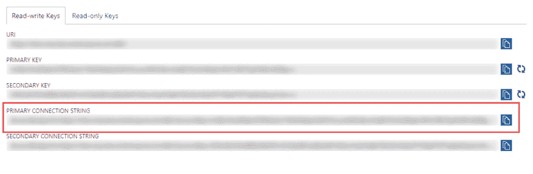
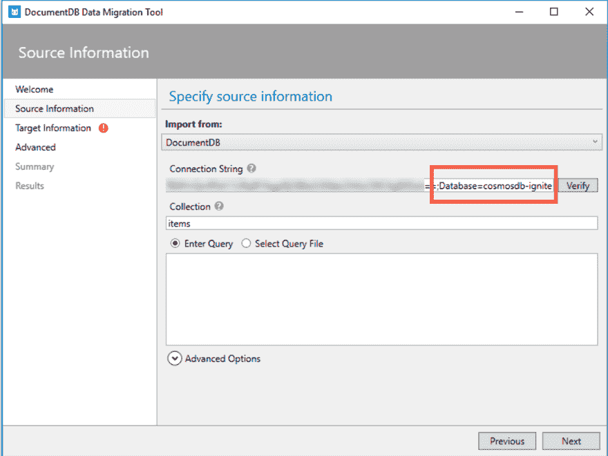
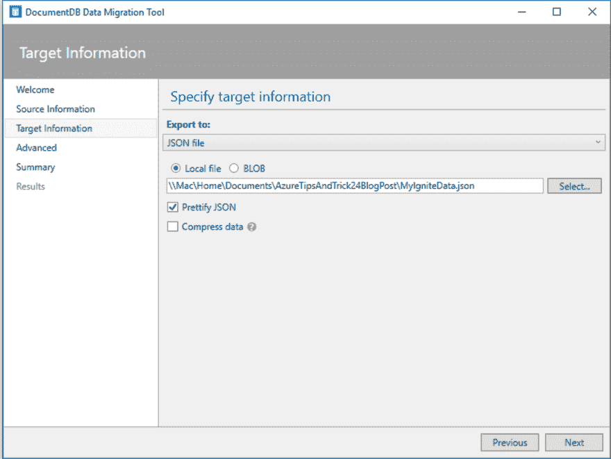
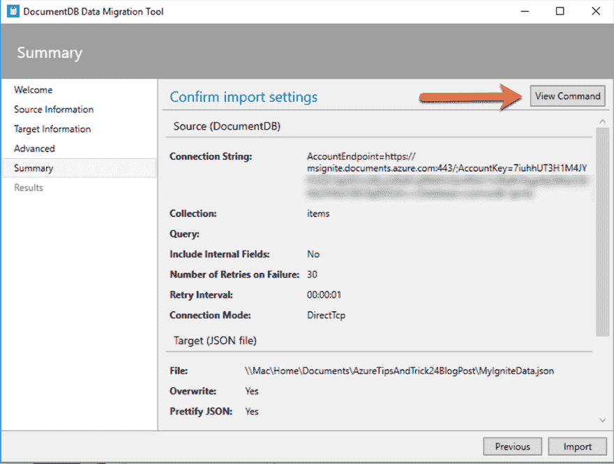

# 将数据从 Cosmos DB 迁移到本地 JSON 文件

> 原文：<https://dev.to/azure/create-an-email-subscription-with-azure-functions-part-4-c72>

*我们选择了由[迈克尔·克伦普](https://twitter.com/mbcrump)创造的我们最喜欢的技巧和诀窍，并在整个四月在 Azure 上提供新的技术内容！错过一天(或更多)？[赶上系列](https://dev.to/t/azureapril)。*

**没有天蓝色？** [抢免费订阅](https://azure.microsoft.com/en-us/free?&WT.mc_id=azureapril_devto-blog-cxa)。

## 使用 Cosmos DB 的数据迁移工具

似乎反复出现的一项任务是将数据从一种数据库/格式迁移到另一种数据库/格式。我最近用 Cosmos DB 作为我的数据库来存储 Ignite 发出的每条推文。一旦我有了数据，并且不再使用 Cosmos DB 来做这个练习，我需要将数据转储到一个本地文件来保存数据并节省资金。我是这样做的。

### 工具

下载并安装 [Azure DocumentDB 数据迁移工具](https://www.microsoft.com/en-us/download/confirmation.aspx?id=46436)

### 开始工作

确保您已经创建了想要迁移的 Cosmos DB 数据库和集合。

转到**键**(在门户中你的 Cosmos DB 刀片内)复制**8 主连接字符串**。

您需要将数据库名称附加到字符串的末尾。例如，`Database=cosmosdb-ignite`将被追加到早先复制的`AccountEndpoint=https://mbcrump.documents.azure.com:443/;AccountKey=VxDEcJblah==;Database=cosmosdb-ignite`的**键**上。这个留着以后用。

打开**数据迁移工具**，在**源信息**下，选择**文档数据库**，如下图所示。

您需要添加 **ConnectionString** (我们刚刚创建的)以及**集合**，在我的例子中是`items`。我们将采用其余的默认值，并按下**验证**，如果成功，则按下**下一步**。

在我的例子中，我将导出到一个本地 JSON 文件并选择**美化 JSON** 并按下**下一步**。

在下一个屏幕上，您将看到一个**查看命令**来查看将用于迁移您的数据的命令。这有助于学习语法。

您将最终看到导入已经完成，在不到 2 分钟的时间内传输了超过 10 万个项目。

我们现在有了本地 JSON 文件，可以随心所欲地使用它了！厉害！

想要更多的 Cosmos DB？查看我们的[快速入门和教程](https://docs.microsoft.com/en-us/azure/cosmos-db/introduction?WT.mc_id=azureapril_devto-blog-cxa)！

还可以看看 Jay Gordon 周一的文章:[使用 MongoDB API 将 JSON 数据上传到 Cosmos DB](https://dev.to/azure/uploading-your-json-data-to-azure-cosmos-db-for-mongodb-api-1mh9)。

* * *

我们将在 4 月份每天发布文章，所以请继续关注或提前查看更多提示和技巧[现在](http://azuredev.tips)。